# Technical Specification

# 1. Introduction

## 1.1 Executive Summary

### 1.1.1 Project Overview

**HERM-MAPPER-APP** is an experimental, open-source .NET web application designed for mapping an organization's technology product catalog against a hierarchical **Technology Reference Model (TRM)** taxonomy. Developed by Michael Tsiortos and released under the MIT License (Copyright © 2026), the application provides enterprise technology portfolio managers with a centralized tool to understand, govern, and report on how their technology products align with defined architectural capabilities and business domains.

The application is built on ASP.NET Core MVC targeting .NET 10 — a Long-Term Support (LTS) release — and leverages Entity Framework Core 10 for data persistence with dual database provider support (SQLite for development and SQL Server for production workloads). The server-side rendered UI is powered by Bootstrap 5.3.3 and jQuery 3.7.1, delivering a responsive browser-based experience without requiring a separate single-page application framework.

> ⚠️ **Experimental Status**: As stated in the project's `README.md`: *"This project is an experiment. Use at your own risk."* This classification is critical context for all stakeholders evaluating the system for adoption.

### 1.1.2 Core Business Problem

Organizations managing diverse technology portfolios face a persistent challenge: understanding how individual software products map to a structured Technology Reference Model. A Technical Reference Model (TRM) is defined as "a technical framework categorizing the standards and technologies to support and enable the delivery of service components and capabilities." Technology reference models provide a standardized framework to categorize and manage the technologies an organization uses, helping to establish consistent architectures, manage risks, reduce duplication, and align technology investments with business goals.

Without a dedicated mapping tool, organizations encounter the following difficulties:

| Challenge | Impact |
|---|---|
| **Fragmented portfolio visibility** | Products are tracked in siloed spreadsheets with no relationship to architectural taxonomy |
| **No capability alignment** | Technology investments cannot be traced to defined business domains and capabilities |
| **Inconsistent lifecycle governance** | Product lifecycle statuses (from proposal through sunset) lack centralized tracking |
| **Manual reporting burden** | Generating mapping completeness reports by owner, domain, or lifecycle requires ad-hoc effort |
| **Lack of visual analysis** | Stakeholders cannot visualize product-to-capability relationships through interactive diagrams |

HERM-MAPPER-APP directly addresses these challenges by providing a unified web-based platform that connects products to a three-level TRM hierarchy (Domains → Capabilities → Components), enforces structured lifecycle management, and generates visual reports including Sankey-style diagrams.

### 1.1.3 Key Stakeholders and Users

Based on the application's controllers, view models, and feature set as defined in the codebase, the following stakeholder groups are identified:

| Stakeholder Group | Role Description | Primary System Interactions |
|---|---|---|
| **Technology Portfolio Managers** | Map products to TRM capabilities; manage product-to-capability relationships | Mapping Board, Reports, CSV Export |
| **Product Owners** | Create and manage product catalog entries, assign owners, track lifecycle | Product Catalog CRUD, Bulk Edit |
| **Service Managers** | Manage service catalog items and their product connections | Service Catalog, Product Linking |
| **Administrators** | Configure system options, import TRM reference data, manage field options | Configuration, Reference Import |
| **Report Consumers** | View dashboards, Sankey visualizations, and mapping completeness reports | Dashboard, Reports |

These roles are inferred from the system's functional architecture as implemented in `ProductsController.cs`, `MappingsController.cs`, `ServicesController.cs`, `ConfigurationController.cs`, `ReportsController.cs`, and `HomeController.cs`. Formal role-based access control (RBAC) is planned but not yet implemented.

### 1.1.4 Expected Business Impact and Value Proposition

HERM-MAPPER-APP delivers the following value to organizations adopting it for technology portfolio governance:

- **Centralized Product-to-Capability Mapping**: A single authoritative source linking technology products to the TRM taxonomy, replacing fragmented spreadsheets and manual tracking
- **Enterprise Architecture Alignment**: Direct traceability from individual products through capabilities and domains, supporting TOGAF-aligned and custom TRM taxonomies
- **Lifecycle Governance**: Standardized lifecycle status tracking across eight defined stages — Propose, Development, Trial, Production, Under Review, Appointed, Deprecate, and Sunset — as seeded in `ConfigurableFieldOption.cs`
- **Structured Reporting**: Automated dashboard KPIs and Sankey-style visualizations providing at-a-glance portfolio health assessment
- **Bulk Operations and Import/Export**: XLSX workbook import for TRM reference data and CSV import/export for product relationships, enabling integration with existing data sources
- **Audit Trail Accountability**: Comprehensive change logging via `AuditLogService.cs` for all create, update, and delete operations

---

## 1.2 System Overview

### 1.2.1 Project Context

#### Business Context and Market Positioning

HERM-MAPPER-APP operates within the **Enterprise Architecture Management (EAM)** and **Technology Portfolio Management** domain. The Technical Reference Model provides a reference of generic platform services and technology elements and acts as a substrate upon which technology architectures can be built, providing a set of architectural and solution building blocks that deliver the platform for business and infrastructure applications.

The application addresses a niche requirement for organizations that maintain a formal TRM with a Domain → Capability → Component hierarchy and need to systematically map their technology products against this structure. While enterprise-grade commercial tools (such as LeanIX, Ardoq, or The Essential Project) exist in this space, HERM-MAPPER-APP provides a lightweight, open-source, self-hosted alternative focused specifically on product-to-TRM mapping and lifecycle tracking.

#### Current System Context

HERM-MAPPER-APP is a **greenfield application** — there is no evidence in the codebase of it replacing or upgrading an existing system. It is designed as a standalone deployment with no required integration dependencies on external services.

#### Integration with Enterprise Landscape

The application supports integration through structured data exchange mechanisms rather than programmatic APIs:

- **TRM Reference Import**: XLSX workbook import via `TrmWorkbookImportService.cs` for bulk loading of the Domain/Capability/Component hierarchy
- **Product Relationship Import**: CSV import via `SampleRelationshipImportService.cs` for ingesting product relationship data
- **Mapping Export**: Semicolon-delimited CSV export via `CsvExportService.cs` for downstream consumption by reporting or analytics tools
- **Configuration Overrides**: Environment variable support with `HERM_`-prefixed overrides (configured in `Program.cs`) enabling integration with cloud platform configuration systems

> **Note**: REST API endpoints, Swagger/OpenAPI documentation, and programmatic integration points are listed as planned features in `todo.md` but are not yet implemented.

### 1.2.2 High-Level Description

#### Primary System Capabilities

The application provides ten core functional capabilities, each implemented through dedicated controllers, services, and views:

```mermaid
flowchart TD
    subgraph UserInterface["User Interface Layer"]
        Dashboard["Dashboard<br/>(HomeController)"]
        Products["Product Catalog<br/>(ProductsController)"]
        Services["Service Catalog<br/>(ServicesController)"]
        Mappings["Mapping Board<br/>(MappingsController)"]
        Reports["Reports & Viz<br/>(ReportsController)"]
        Reference["TRM Reference<br/>(ReferenceController)"]
        Config["Configuration<br/>(ConfigurationController)"]
        ChangeLog["Audit Log<br/>(ChangeLogController)"]
    end

    subgraph BusinessLogic["Business Logic Layer"]
        AuditSvc["AuditLogService"]
        CsvExport["CsvExportService"]
        TrmImport["TrmWorkbookImportService"]
        RelImport["SampleRelationshipImportService"]
        VersionSvc["ComponentVersioningService"]
        MappingSvc["MappingService"]
        ReportSvc["ReportService"]
    end

    subgraph DataLayer["Data Persistence Layer"]
        DbContext["AppDbContext<br/>(EF Core 10)"]
        SQLite["SQLite<br/>(Development)"]
        SQLServer["SQL Server<br/>(Production)"]
    end

    Dashboard --> AuditSvc
    Products --> AuditSvc
    Mappings --> MappingSvc
    Mappings --> CsvExport
    Reports --> ReportSvc
    Reference --> TrmImport
    Reference --> VersionSvc
    Config --> RelImport
    ChangeLog --> AuditSvc

    AuditSvc --> DbContext
    CsvExport --> DbContext
    TrmImport --> DbContext
    RelImport --> DbContext
    VersionSvc --> DbContext
    MappingSvc --> DbContext
    ReportSvc --> DbContext

    DbContext --> SQLite
    DbContext --> SQLServer
end
```

| # | Capability | Controller | Key Services |
|---|---|---|---|
| 1 | Dashboard with aggregate KPIs | `HomeController.cs` | Direct DbContext queries |
| 2 | Product Catalog CRUD | `ProductsController.cs` | `AuditLogService` |
| 3 | TRM Reference Management | `ReferenceController.cs` | `TrmWorkbookImportService`, `ComponentVersioningService` |
| 4 | Product-to-TRM Mapping Board | `MappingsController.cs` | `MappingService`, `CsvExportService` |
| 5 | Service Catalog Management | `ServicesController.cs` | `AuditLogService` |
| 6 | Reports and Visualization | `ReportsController.cs` | `ReportService` |
| 7 | Administrative Configuration | `ConfigurationController.cs` | `SampleRelationshipImportService` |
| 8 | Audit Change Log | `ChangeLogController.cs` | `AuditLogService` |
| 9 | Component Version History | (via Reference) | `ComponentVersioningService` |
| 10 | Import/Export Operations | (via Config/Mappings) | Multiple services |

#### Major System Components

The application follows a monolithic ASP.NET Core MVC architecture organized into well-defined layers within a single project:

| Component | Location | File Count | Purpose |
|---|---|---|---|
| Controllers | `src/HERM-MAPPER-APP/Controllers/` | 8 | HTTP request orchestration and routing |
| Domain Models | `src/HERM-MAPPER-APP/Models/` | 14 | Data entities, enums, and domain types |
| Services | `src/HERM-MAPPER-APP/Services/` | 7 | Encapsulated business logic |
| Data Context | `src/HERM-MAPPER-APP/Data/` | 1 | EF Core DbContext for persistence |
| View Models | `src/HERM-MAPPER-APP/ViewModels/` | 18 | Presentation layer contracts |
| Razor Views | `src/HERM-MAPPER-APP/Views/` | 11 folders | Server-rendered HTML templates |
| Configuration | `src/HERM-MAPPER-APP/Configuration/` | — | Database provider resolution |
| Infrastructure | `src/HERM-MAPPER-APP/Infrastructure/` | 1 | Utility helpers |
| Static Assets | `src/HERM-MAPPER-APP/wwwroot/` | — | CSS, JS, vendor libraries |
| Test Suite | `tests/HERM-MAPPER-APP.Tests/` | — | xUnit integration tests |
| Deployment | `scripts/` | 1 | Azure App Service deployment script |

#### Core Technical Approach

HERM-MAPPER-APP employs a **traditional server-side rendered MVC architecture** with the following key design decisions:

- **No SPA Framework**: The UI is rendered server-side using Razor views with jQuery for client-side interactivity, reducing frontend complexity
- **Dual Database Provider**: The `Configuration/` layer resolves the database provider at startup, supporting SQLite for lightweight development and SQL Server for production, both via EF Core 10.0.0
- **Hierarchical Configuration**: `Program.cs` establishes a configuration chain (`appsettings.json` → environment-specific overrides → `HERM_`-prefixed environment variables) enabling flexible deployment across environments
- **Custom Visualization**: Sankey-style diagrams are generated using custom SVG rendering in the frontend (`wwwroot/`) rather than relying on a third-party charting library
- **Soft-Delete Pattern**: TRM reference components support soft-delete and restore operations, preserving referential integrity while enabling logical removal
- **Configurable Field Options**: Dropdown values for Owner and LifecycleStatus fields are stored as `ConfigurableFieldOption` entities, enabling runtime customization without code changes

### 1.2.3 Technology Stack

. NET 10 is a Long Term Support (LTS) release and will be supported on multiple operating systems for three years from November 11, 2025 to November 14, 2028. HERM-MAPPER-APP targets this LTS release for long-term platform stability.

| Layer | Technology | Version | Evidence |
|---|---|---|---|
| Runtime | .NET | 10.0 | `HERM-MAPPER-APP.csproj` (`net10.0`) |
| Web Framework | ASP.NET Core MVC | Bundled with .NET 10 | `Program.cs` |
| ORM | Entity Framework Core | 10.0.0 | `HERM-MAPPER-APP.csproj` |
| DB (Development) | SQLite | via EF Core SQLite 10.0.0 | `HERM-MAPPER-APP.csproj` |
| DB (Production) | SQL Server | via EF Core SqlServer 10.0.0 | `HERM-MAPPER-APP.csproj` |
| CSS Framework | Bootstrap | 5.3.3 | `wwwroot/` |
| JavaScript | jQuery | 3.7.1 | `wwwroot/` |
| Form Validation | jQuery Validation | 1.21.0 | `wwwroot/` |
| Unobtrusive Val. | MS jQuery Unobtrusive | 4.0.0 | `wwwroot/` |
| Testing | xUnit | 2.9.3 | `HERM-MAPPER-APP.Tests.csproj` |
| Test SDK | Microsoft.NET.Test.Sdk | 17.14.1 | `HERM-MAPPER-APP.Tests.csproj` |
| Code Coverage | coverlet.collector | 6.0.4 | `HERM-MAPPER-APP.Tests.csproj` |
| Deployment | Azure App Service (Linux) | — | `scripts/deploy-appservice-azcli.ps1` |
| CI Platform | GitHub Actions | Placeholder only | `.github/workflows/` |

### 1.2.4 Domain Model Overview

The core domain model, as defined in `Models/` and registered in `AppDbContext.cs`, is structured around three interconnected domains:

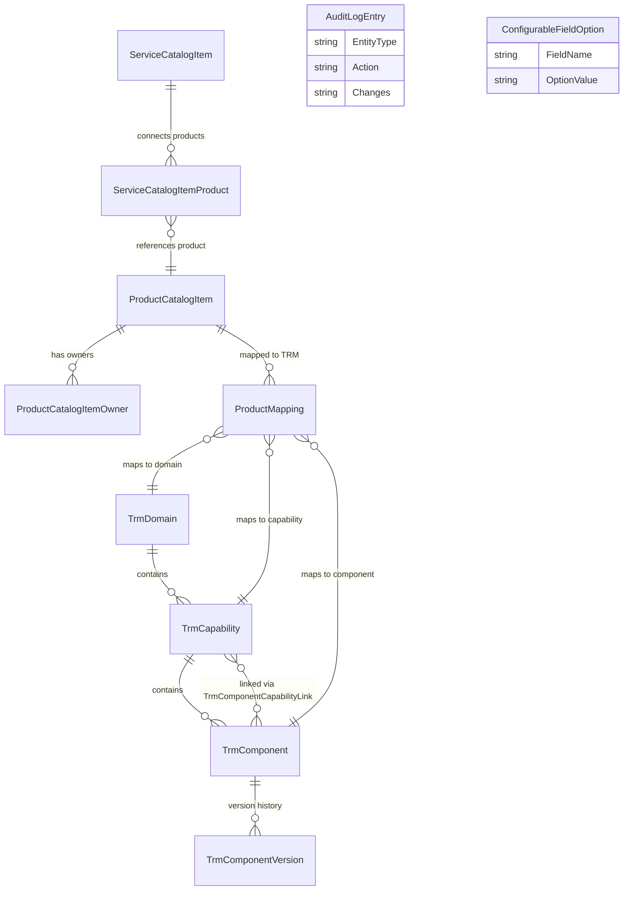

**Key domain concepts:**

- **TRM Taxonomy Hierarchy**: `TrmDomain` → `TrmCapability` → `TrmComponent` forms the three-level reference model with an additional many-to-many bridge (`TrmComponentCapabilityLink`) and component version history (`TrmComponentVersion`)
- **Product Domain**: `ProductCatalogItem` serves as the central entity with multi-owner support (`ProductCatalogItemOwner`) and lifecycle status tracking
- **Mapping Domain**: `ProductMapping` links products to TRM elements with a four-stage status workflow: Draft (0) → InReview (1) → Complete (2) → OutOfScope (3), as defined in `MappingStatus.cs`
- **Service Domain**: `ServiceCatalogItem` connects to products through ordered links (`ServiceCatalogItemProduct`)
- **Cross-cutting Entities**: `AuditLogEntry` for change tracking and `ConfigurableFieldOption` for runtime-configurable dropdown values

### 1.2.5 Success Criteria

Given the experimental nature of the project, success criteria are inferred from the implemented feature set and the planned backlog in `todo.md`:

| Category | Criterion | Measurement Approach |
|---|---|---|
| **Mapping Completeness** | Products mapped to TRM components | Dashboard KPI: completed mapping count vs. total product count |
| **Reference Coverage** | TRM hierarchy loaded and active | Dashboard KPI: domain count, capability count, active component count |
| **Portfolio Visibility** | Stakeholders can view product-to-TRM relationships | Sankey diagram generation, hierarchy reports |
| **Lifecycle Governance** | All products assigned lifecycle status | Lifecycle reporting via `ReportsController.cs` |
| **Data Quality** | Mapping statuses progressed through workflow | Mapping status distribution (Draft → Complete) |
| **Audit Compliance** | All changes tracked with attribution | Audit log completeness via `ChangeLogController.cs` |

**Dashboard KPIs** (as implemented in `HomeController.cs`):
- Total product count in the catalog
- Number of completed product-to-TRM mappings
- Count of active (non-deleted) TRM reference components
- Total TRM domain count
- Total TRM capability count
- Presence of a loaded reference model (boolean indicator)
- Six most recently updated products

---

## 1.3 Scope

### 1.3.1 In-Scope: Core Features and Functionalities

The following capabilities are confirmed as implemented and functional based on verified examination of controllers, services, models, and views within the codebase:

#### Must-Have Capabilities

| # | Feature | Key Files | Description |
|---|---|---|---|
| 1 | Product Catalog CRUD | `ProductsController.cs`, `ProductCatalogItem.cs` | Create, read, update, delete products with search, filtering, and bulk edit |
| 2 | TRM Reference Management | `ReferenceController.cs`, TRM model files | Domain/Capability/Component hierarchy with XLSX import, soft-delete/restore |
| 3 | Product-to-TRM Mapping | `MappingsController.cs`, `MappingStatus.cs` | Mapping board with Draft → InReview → Complete → OutOfScope workflow |
| 4 | Service Catalog | `ServicesController.cs`, `ServiceCatalogItem.cs` | Service CRUD with ordered product connections and visualization |
| 5 | Reporting & Visualization | `ReportsController.cs`, `ReportsViewModel.cs` | Sankey diagrams, hierarchy views, lifecycle reporting |
| 6 | Administrative Config | `ConfigurationController.cs` | Configurable field options (Owner, LifecycleStatus), import workflows |
| 7 | Audit Logging | `AuditLogService.cs`, `ChangeLogController.cs` | Create/Update/Delete tracking with searchable change log |
| 8 | Component Versioning | `ComponentVersioningService.cs`, `TrmComponentVersion.cs` | Snapshot tracking of component changes |
| 9 | Dashboard | `HomeController.cs` | Aggregate KPI display with recent product activity |
| 10 | Import/Export | `TrmWorkbookImportService.cs`, `CsvExportService.cs` | XLSX workbook import, CSV relationship import, mapping CSV export |

#### Primary User Workflows

The following end-to-end workflows are supported by the application:

```mermaid
flowchart LR
    subgraph PortfolioSetup["Portfolio Setup"]
        A1[Import TRM Workbook] --> A2[Browse Reference Catalogue]
        A2 --> A3[Manage Components]
    end

    subgraph ProductManagement["Product Management"]
        B1[Create/Edit Products] --> B2[Assign Owners]
        B2 --> B3[Set Lifecycle Status]
    end

    subgraph MappingWorkflow["Mapping Workflow"]
        C1[Create Mappings] --> C2[Review & Approve]
        C2 --> C3[Export CSV]
    end

    subgraph ServiceManagement["Service Management"]
        D1[Create Services] --> D2[Link Products]
        D2 --> D3[Visualize Connections]
    end

    subgraph ReportingAnalysis["Reporting & Analysis"]
        E1[View Dashboard] --> E2[Filter Reports]
        E2 --> E3[Examine Sankey Diagrams]
    end

    PortfolioSetup --> ProductManagement
    ProductManagement --> MappingWorkflow
    MappingWorkflow --> ReportingAnalysis
    ServiceManagement --> ReportingAnalysis
end
```

1. **Portfolio Setup**: Import TRM reference workbook → Browse reference catalogue → Manage domain/capability/component hierarchy
2. **Product Management**: Create/edit products → Assign owners and lifecycle statuses → Bulk edit operations
3. **Mapping Workflow**: Create product-to-TRM mappings → Manage mapping status through workflow stages → Export mapping data as CSV
4. **Service Management**: Create/manage service catalog items → Link products to services with ordering → Visualize service-product connections
5. **Reporting & Analysis**: View dashboard KPIs → Filter by owner/lifecycle/domain → Examine Sankey-style diagrams

#### Essential Integrations

| Integration Type | Mechanism | Direction | Format |
|---|---|---|---|
| TRM Reference Data | `TrmWorkbookImportService.cs` | Inbound | XLSX workbook |
| Product Relationships | `SampleRelationshipImportService.cs` | Inbound | CSV |
| Mapping Data | `CsvExportService.cs` | Outbound | Semicolon-delimited CSV |
| Configuration | `Program.cs` environment overrides | Inbound | `HERM_`-prefixed env vars |

### 1.3.2 In-Scope: Implementation Boundaries

| Boundary Dimension | Scope Definition |
|---|---|
| **System Architecture** | Single monolithic ASP.NET Core MVC application (single solution, single project) |
| **Database Support** | SQLite (development/lightweight) and SQL Server (enterprise/production) via EF Core dual-provider |
| **Deployment Target** | Azure App Service (Linux) via PowerShell + Azure CLI ZIP deployment (`scripts/deploy-appservice-azcli.ps1`) |
| **Client Platform** | Browser-based server-rendered UI; no native, mobile, or desktop clients |
| **User Groups** | Technology portfolio managers, product owners, service managers, administrators, report consumers |
| **Data Domains** | TRM taxonomy (Domains, Capabilities, Components), Product catalog, Service catalog, Mappings, Audit logs |
| **Lifecycle Statuses** | Eight stages: Propose → Development → Trial → Production → Under Review → Appointed → Deprecate → Sunset |
| **Mapping Statuses** | Four workflow stages: Draft → InReview → Complete → OutOfScope |
| **Licensing** | MIT License — open-source, permissive |

### 1.3.3 Out-of-Scope

The following features and capabilities are explicitly **not implemented** in the current version. Items marked as "Planned" are documented in the project backlog (`todo.md`):

#### Planned for Future Implementation

| Feature | Category | Status |
|---|---|---|
| OpenID Connect authentication and login | Security | Planned |
| Token-to-role mapping (groups → roles) | Security | Planned |
| Role-based access control (View, Admin, Add/Modify Product) | Security | Planned |
| User management (disable users, manage API keys) | Security | Planned |
| REST API endpoints | Integration | Planned |
| Swagger/OpenAPI documentation | Integration | Planned |
| API rate limiting | Integration | Planned |
| Personal API key generation | Integration | Planned |
| Timezone handling (UTC storage, configurable display) | Infrastructure | Planned |
| Domain/capability description import and hover visualization | UI Enhancement | Planned |
| Comprehensive operation auditing (who made changes) | Audit | Planned |
| Version history for Products, HERM model, Services | Data Management | Planned |
| Document database evaluation | Long-term Architecture | Consideration |

#### Unsupported Capabilities

The following capabilities are not present in the codebase and have no planned implementation:

- **Authentication and Authorization**: While `app.UseAuthorization()` is invoked in the middleware pipeline (`Program.cs`, line 129), no authentication scheme is registered. The application currently operates without access control.
- **Programmatic API Layer**: All user interactions occur through MVC controllers serving HTML views. No REST, GraphQL, or other API endpoints exist.
- **Production CI/CD Pipeline**: The GitHub Actions workflow in `.github/workflows/` is a placeholder "hello world" configuration. No automated build, test, or deployment pipeline is operational.
- **Multi-Tenancy**: No tenant isolation, partitioning, or multi-organization support is implemented.
- **Internationalization/Localization (i18n/l10n)**: The application operates exclusively in English with no localization framework.
- **Caching Layer**: No in-memory, distributed, or output caching is implemented.
- **Real-Time Features**: No WebSocket, SignalR, or server-sent events capabilities exist.
- **Mobile or Desktop Clients**: Only the browser-based server-rendered interface is provided.
- **Containerization**: No Dockerfile or container orchestration configuration (e.g., Docker Compose, Kubernetes manifests) is present in the repository.

---

## 1.4 Document Conventions and Terminology

### 1.4.1 Key Terms

| Term | Definition |
|---|---|
| **TRM** | Technology Reference Model — a hierarchical taxonomy of Domains, Capabilities, and Components |
| **Domain** | The top level of the TRM hierarchy, representing a broad technology area |
| **Capability** | The middle level of the TRM hierarchy, representing a specific technology capability within a Domain |
| **Component** | The lowest level of the TRM hierarchy, representing a concrete technology component within a Capability |
| **Product Mapping** | A relationship linking a `ProductCatalogItem` to a TRM Domain/Capability/Component with a status |
| **Mapping Status** | The workflow state of a mapping: Draft, InReview, Complete, or OutOfScope |
| **Lifecycle Status** | The governance stage of a product: Propose, Development, Trial, Production, Under Review, Appointed, Deprecate, or Sunset |
| **HERM** | The project naming prefix — appears throughout the application as the system identifier |
| **Sankey Diagram** | A flow visualization showing proportional relationships between products and TRM elements |

### 1.4.2 Document Structure

This Technical Specification is organized to provide a complete architectural reference for HERM-MAPPER-APP. The Introduction section establishes the project context, scope, and boundaries. Subsequent sections provide progressively deeper technical detail covering architecture, data models, components, deployment, and operational considerations.

---

#### References

#### Repository Files Examined

- `README.md` — Project overview, features, installation guide, configuration reference, deployment instructions
- `LICENSE` — MIT License, copyright Michael Tsiortos 2026
- `todo.md` — Planned features backlog defining out-of-scope boundaries
- `src/HERM-MAPPER-APP/HERM-MAPPER-APP.csproj` — Target framework (.NET 10), NuGet package dependencies, technology stack versions
- `src/HERM-MAPPER-APP/Program.cs` — Application bootstrap, dependency injection, middleware pipeline, environment configuration
- `src/HERM-MAPPER-APP/appsettings.Development.json` — Development configuration defaults (SQLite, diagnostics)
- `src/HERM-MAPPER-APP/Controllers/HomeController.cs` — Dashboard KPIs and aggregate metrics implementation
- `tests/HERM-MAPPER-APP.Tests/HERM-MAPPER-APP.Tests.csproj` — Test framework versions and project references

#### Repository Folders Examined

- `src/HERM-MAPPER-APP/Controllers/` — 8 MVC controllers defining all HTTP endpoints
- `src/HERM-MAPPER-APP/Models/` — 14 domain model files including entities and enumerations
- `src/HERM-MAPPER-APP/Services/` — 7 service implementations encapsulating business logic
- `src/HERM-MAPPER-APP/Data/` — EF Core `AppDbContext` defining entity registrations
- `src/HERM-MAPPER-APP/Configuration/` — Database provider resolution logic
- `src/HERM-MAPPER-APP/ViewModels/` — 18 view model files for presentation layer contracts
- `src/HERM-MAPPER-APP/Views/` — 11 view folders with Razor templates
- `src/HERM-MAPPER-APP/Infrastructure/` — Utility helper implementations
- `src/HERM-MAPPER-APP/wwwroot/` — Static assets (CSS, JS, vendor libraries: Bootstrap 5.3.3, jQuery 3.7.1)
- `tests/HERM-MAPPER-APP.Tests/` — xUnit test suite structure
- `scripts/` — Azure App Service deployment script (`deploy-appservice-azcli.ps1`)
- `.github/workflows/` — GitHub Actions CI workflow (placeholder)

#### External References

- .NET 10 Release Notes — https://github.com/dotnet/core/blob/main/release-notes/10.0/README.md
- TOGAF Technical Reference Model — https://pubs.opengroup.org/architecture/togaf8-doc/arch/chap19.html
- Technology Reference Model (Enterprise Architecture) — https://sparxsystems.com/enterprise_architect_user_guide/17.1/guide_books/ea_infrastructure_technical_reference_model.html

# 2. Product Requirements

HERM-MAPPER-APP delivers a suite of ten integrated features that enable organizations to map their technology product portfolios against a hierarchical Technology Reference Model (TRM) taxonomy. This section catalogs each feature with formal metadata, decomposes them into testable functional requirements with acceptance criteria, documents inter-feature relationships, and identifies implementation considerations.

All features documented below are verified as implemented in the codebase and grounded in evidence from controllers, models, services, and view models within `src/HERM-MAPPER-APP/`.

## 2.1 FEATURE CATALOG

### 2.1.1 Feature Summary

The application's ten core features are organized into five functional categories that collectively address the enterprise architecture management domain:

| Feature ID | Feature Name | Category |
|---|---|---|
| F-001 | Dashboard with Aggregate KPIs | Visualization & Analytics |
| F-002 | Product Catalog CRUD | Core Data Management |
| F-003 | TRM Reference Management | Core Data Management |
| F-004 | Product-to-TRM Mapping Board | Mapping & Workflow |
| F-005 | Service Catalog Management | Core Data Management |
| F-006 | Reports and Visualization | Visualization & Analytics |
| F-007 | Administrative Configuration | System Administration |
| F-008 | Audit Change Log | System Administration |
| F-009 | Component Version History | Data Lifecycle |
| F-010 | Import/Export Operations | Data Lifecycle |

| Feature ID | Priority | Status | Controller |
|---|---|---|---|
| F-001 | Critical | Completed | `HomeController.cs` |
| F-002 | Critical | Completed | `ProductsController.cs` |
| F-003 | Critical | Completed | `ReferenceController.cs` |
| F-004 | Critical | Completed | `MappingsController.cs` |
| F-005 | High | Completed | `ServicesController.cs` |
| F-006 | High | Completed | `ReportsController.cs` |
| F-007 | High | Completed | `ConfigurationController.cs` |
| F-008 | Medium | Completed | `ChangeLogController.cs` |
| F-009 | Medium | Completed | Via `ReferenceController.cs` |
| F-010 | High | Completed | Via Controllers/Services |

### 2.1.2 Feature Definitions

#### F-001: Dashboard with Aggregate KPIs

| Attribute | Detail |
|---|---|
| **Feature ID** | F-001 |
| **Category** | Visualization & Analytics |
| **Priority** | Critical |
| **Status** | Completed |

**Overview**: The Dashboard serves as the application entry point, providing a single-screen summary of the organization's technology portfolio health. It is implemented in `HomeController.cs` (lines 9–32) and renders data through `HomeDashboardViewModel.cs`.

**Business Value**: Offers technology portfolio managers an at-a-glance view of mapping completeness, TRM reference model coverage, and recent product activity — eliminating the need to navigate multiple views for basic portfolio health assessment.

**User Benefits**: Immediate visibility into total product count, completed mappings, active reference components, and domain/capability coverage. The six most recently updated products with mapping context enable quick identification of recent portfolio changes.

**Technical Context**: The controller aggregates KPI data through direct `AppDbContext` queries, computing `ProductCount`, `CompletedMappings` (where `MappingStatus == Complete`), `ReferenceComponentCount` (where `!IsDeleted`), `DomainCount`, `CapabilityCount`, and a boolean `HasReferenceModel` indicator. `RecentProducts` retrieves the six most recently updated products with associated mapping and component context.

**Dependencies**:

| Dependency Type | Detail |
|---|---|
| Prerequisite Features | F-002 (Product Catalog), F-003 (TRM Reference), F-004 (Mapping Board) |
| System Dependencies | `AppDbContext` for direct entity queries |
| External Dependencies | None |
| Integration Requirements | None — read-only aggregation |

---

#### F-002: Product Catalog CRUD

| Attribute | Detail |
|---|---|
| **Feature ID** | F-002 |
| **Category** | Core Data Management |
| **Priority** | Critical |
| **Status** | Completed |

**Overview**: Full lifecycle management for technology product catalog items, including creation, search, filtering, editing, deletion, and bulk operations. Implemented in `ProductsController.cs` with the `ProductCatalogItem.cs` entity as the central model and multi-owner support via `ProductCatalogItemOwner.cs`.

**Business Value**: Establishes the foundational product inventory from which all TRM mappings, service connections, and portfolio reports are derived. Without a well-maintained product catalog, no downstream mapping or analysis is possible.

**User Benefits**: Product owners can create and maintain product records with structured metadata (Name, Vendor, Version, LifecycleStatus, Description, Notes), assign multiple owners, and perform bulk edits across selected products with Replace or Append owner modes.

**Technical Context**: The entity defines `Name` (Required, max 200), `Vendor` (max 120), `Version` (max 80), `LifecycleStatus` (max 80), `Description` (max 2000), and `Notes` (max 4000). Search uses `SearchPattern.CreateContainsPattern` with `EF.Functions.Like` for pattern matching. All create, update, and delete operations invoke `AuditLogService.WriteAsync()`. `ConfigurableFieldService` provides Owner and LifecycleStatus dropdown values. View models include `ProductsIndexViewModel`, `ProductEditViewModel`, `ProductBulkEditViewModel`, and `ProductVisualizationViewModel`.

**Dependencies**:

| Dependency Type | Detail |
|---|---|
| Prerequisite Features | F-007 (Configuration — for Owner/LifecycleStatus options) |
| System Dependencies | `AuditLogService`, `ConfigurableFieldService`, `AppDbContext` |
| External Dependencies | None |
| Integration Requirements | Consumed by F-004, F-005, F-006, F-010 |

---

#### F-003: TRM Reference Management

| Attribute | Detail |
|---|---|
| **Feature ID** | F-003 |
| **Category** | Core Data Management |
| **Priority** | Critical |
| **Status** | Completed |

**Overview**: Management of the three-level Technology Reference Model hierarchy — Domains, Capabilities, and Components — including import from XLSX workbooks, browsing, searching, soft-delete/restore, and version history tracking. Implemented in `ReferenceController.cs` with services `TrmWorkbookImportService` and `ComponentVersioningService`.

**Business Value**: The TRM provides the standardized architectural taxonomy against which all products are mapped. A complete and well-maintained reference model is the foundation for meaningful portfolio analysis and capability alignment.

**User Benefits**: Administrators can bulk-load the TRM hierarchy from structured XLSX workbooks, browse the reference catalogue with domain/capability filters, search across all hierarchy levels, and manage component lifecycle through soft-delete/restore with reason tracking.

**Technical Context**: The hierarchy comprises `TrmDomain` (Code max 32, Name max 200), `TrmCapability` (Code, Name, parent Domain), and `TrmComponent` (Code max 32, Name max 200, with fields for Description, Comments, ProductExamples each max 4000). `TrmComponentCapabilityLink` provides a many-to-many bridge between components and capabilities. `TrmComponentVersion` captures version history snapshots. Components support soft-delete via `IsDeleted`, `DeletedUtc`, and `DeletedReason` (max 400) fields. View models include `ReferenceCatalogueViewModel`, `ComponentHistoryViewModel`, `WorkbookImportReviewViewModel`, `TrmWorkbookVerificationResult`, and `TrmWorkbookImportSummary`.

**Dependencies**:

| Dependency Type | Detail |
|---|---|
| Prerequisite Features | F-010 (Import/Export — for XLSX import), F-009 (Component Versioning) |
| System Dependencies | `TrmWorkbookImportService`, `ComponentVersioningService`, `AppDbContext` |
| External Dependencies | XLSX workbook files conforming to required worksheet structure |
| Integration Requirements | Consumed by F-001, F-004, F-006, F-010 |

---

#### F-004: Product-to-TRM Mapping Board

| Attribute | Detail |
|---|---|
| **Feature ID** | F-004 |
| **Category** | Mapping & Workflow |
| **Priority** | Critical |
| **Status** | Completed |

**Overview**: The core mapping feature that links products to TRM hierarchy elements through a structured four-stage workflow. Implemented in `MappingsController.cs` (the largest controller), with `MappingService`, `CsvExportService`, and `AuditLogService` as key services.

**Business Value**: Directly addresses the central business problem of connecting technology products to a standardized reference model, enabling organizations to understand capability coverage, identify gaps, and govern technology investments.

**User Benefits**: Users manage product-to-TRM mappings through a board interface with search, status, domain, and capability filters. Dependent dropdowns cascade from Domain → Capability → Component. The mapping status workflow progresses through Draft → InReview → Complete → OutOfScope, with CSV export for downstream analysis.

**Technical Context**: `ProductMapping.cs` defines `ProductCatalogItemId` (Required FK), nullable FKs `TrmDomainId`, `TrmCapabilityId`, and `TrmComponentId`, `MappingStatus` (enum defaulting to Draft), `MappingRationale` (max 4000), `LastReviewedUtc`, `CreatedUtc`, and `UpdatedUtc`. The `MappingStatus` enum (in `MappingStatus.cs`) defines Draft (0), InReview (1), Complete (2), and OutOfScope (3). The controller enforces hierarchy consistency (domain → capability → component) and requires a TRM component assignment for completed mappings. Support exists for both existing and custom TRM component definitions. View models: `MappingBoardViewModel`, `MappingEditViewModel`.


**Dependencies**:

| Dependency Type | Detail |
|---|---|
| Prerequisite Features | F-002 (Product Catalog), F-003 (TRM Reference) |
| System Dependencies | `MappingService`, `CsvExportService`, `AuditLogService`, `ComponentVersioningService`, `AppDbContext` |
| External Dependencies | None |
| Integration Requirements | Consumed by F-001 (Dashboard KPIs), F-006 (Reports), F-010 (CSV Export) |

---

#### F-005: Service Catalog Management

| Attribute | Detail |
|---|---|
| **Feature ID** | F-005 |
| **Category** | Core Data Management |
| **Priority** | High |
| **Status** | Completed |

**Overview**: CRUD management for service catalog items, which represent organizational services composed of linked technology products. Implemented in `ServicesController.cs` with the `ServiceCatalogItem.cs` and `ServiceCatalogItemProduct.cs` entities.

**Business Value**: Enables organizations to model services as compositions of products, providing visibility into which products support which business services and revealing cross-product dependencies.

**User Benefits**: Service managers create and maintain service records, link two or more products to each service with explicit sort ordering, and visualize sequential product connections within a service.

**Technical Context**: `ServiceCatalogItem.cs` defines `Name` (Required, max 200), `Description` (max 2000), `Owner` (Required, max 120), `LifecycleStatus` (Required, max 80), `CreatedUtc`, and `UpdatedUtc`. Product links are managed through `ServiceCatalogItemProduct` with `SortOrder` for explicit ordering. Computed properties include `OrderedProductLinks` (sorted by SortOrder, then Id) and `ConnectionCount`. `ServiceEditViewModel` implements custom validation enforcing at least two unique products per service. View models: `ServicesIndexViewModel`, `ServiceEditViewModel`, `ServiceVisualizationViewModel`.

**Dependencies**:

| Dependency Type | Detail |
|---|---|
| Prerequisite Features | F-002 (Product Catalog — products to link) |
| System Dependencies | `AuditLogService`, `ConfigurableFieldService`, `AppDbContext` |
| External Dependencies | None |
| Integration Requirements | None — standalone service-product composition |

---

#### F-006: Reports and Visualization

| Attribute | Detail |
|---|---|
| **Feature ID** | F-006 |
| **Category** | Visualization & Analytics |
| **Priority** | High |
| **Status** | Completed |

**Overview**: Read-only reporting and Sankey-style visualization of completed product-to-TRM mappings, organized by owner, domain, capability, and lifecycle status. Implemented in `ReportsController.cs` (read-only) with the `ReportService` and custom SVG rendering via `owner-visualization.js`.

**Business Value**: Transforms raw mapping data into actionable visual intelligence, enabling portfolio managers to identify capability coverage patterns, ownership distribution, and lifecycle concentrations across the technology landscape.

**User Benefits**: Interactive Sankey diagrams show proportional relationships between owners, TRM domains, capabilities, components, and products. Hierarchy views support cascading filters. Lifecycle summaries aggregate product statuses.

**Technical Context**: The controller queries completed mappings with `AsNoTracking` and `AsSplitQuery` for optimized read performance. `ReportsViewModel` is the largest aggregate view model, containing subordinate types: `LifecycleStatusReportRowViewModel`, `LifecycleStatusProductViewModel`, `ReportsPathViewModel`, `ReportsHierarchyNodeViewModel`, `ReportsSankeyNodeViewModel`, and `ReportsSankeyLinkViewModel`. The logic resolves effective domain/capability/component paths, expands mappings by owner (including an "Unassigned owner" bucket), and constructs owner → domain → capability → component → product hierarchies. Sankey-style diagrams are rendered using native DOM/SVG rendering in `wwwroot/js/owner-visualization.js` without any third-party charting library.

**Dependencies**:

| Dependency Type | Detail |
|---|---|
| Prerequisite Features | F-004 (Completed mappings), F-002 (Products), F-003 (TRM Reference) |
| System Dependencies | `ReportService`, `AppDbContext`, custom SVG rendering engine |
| External Dependencies | None |
| Integration Requirements | None — read-only output |

---

#### F-007: Administrative Configuration

| Attribute | Detail |
|---|---|
| **Feature ID** | F-007 |
| **Category** | System Administration |
| **Priority** | High |
| **Status** | Completed |

**Overview**: Runtime management of configurable dropdown field options and staged import workflows for TRM workbooks and product relationship CSV files. Implemented in `ConfigurationController.cs` with `ConfigurableFieldService`, `SampleRelationshipImportService`, and `TrmWorkbookImportService`.

**Business Value**: Allows administrators to customize the application's taxonomy and lifecycle vocabulary to match organizational conventions without code changes, and to execute controlled data imports with verification gates.

**User Benefits**: Administrators manage grouped configurable options (Owner and LifecycleStatus fields), reorder options with sort-order normalization, and execute staged verification → import → abort flows for both XLSX TRM workbooks and product relationship CSV files.

**Technical Context**: `ConfigurableFieldOption.cs` defines `FieldName` (Required, max 80), `Value` (Required, max 120), `SortOrder`, and `CreatedUtc`. Supported fields are `Owner` and `LifecycleStatus`. Default lifecycle values are seeded as: Propose, Development, Trial, Production, Under Review, Appointed, Deprecate, Sunset. Pending import files are staged under `App_Data/PendingImports/` with GUID tokens. View models: `ConfigurationIndexViewModel`, `AddConfigurationOptionInputModel`, `UpdateConfigurationOptionOrderInputModel`. Re-verification occurs before import, with cleanup on failure, abort, or success. All operations generate audit entries.

**Dependencies**:

| Dependency Type | Detail |
|---|---|
| Prerequisite Features | F-010 (Import/Export — for import services) |
| System Dependencies | `ConfigurableFieldService`, `SampleRelationshipImportService`, `TrmWorkbookImportService`, `AuditLogService` |
| External Dependencies | XLSX and CSV files for import workflows |
| Integration Requirements | Consumed by F-002, F-004, F-005 (for dropdown options) |

---

#### F-008: Audit Change Log

| Attribute | Detail |
|---|---|
| **Feature ID** | F-008 |
| **Category** | System Administration |
| **Priority** | Medium |
| **Status** | Completed |

**Overview**: Searchable, read-only view of all create, update, and delete operations recorded across the application. Implemented in `ChangeLogController.cs` with `AuditLogService.cs` writing entries and `AuditLogEntry.cs` defining the log schema.

**Business Value**: Provides an accountability trail for all data modifications, supporting governance requirements and enabling administrators to trace the history of portfolio changes.

**User Benefits**: Administrators search audit entries across Category, Action, EntityType, Summary, and Details fields, with results ordered by occurrence time (newest first) and capped at 250 records.

**Technical Context**: `AuditLogEntry` fields include Id, Category, Action, EntityType, Summary, Details, and OccurredUtc. The controller performs no-tracking queries with `AsNoTracking()`. All CUD operations across `ProductsController`, `MappingsController`, `ServicesController`, `ReferenceController`, and `ConfigurationController` invoke `AuditLogService.WriteAsync()` to record entries. The OccurredUtc field is indexed for efficient chronological retrieval. View model: `ChangeLogIndexViewModel`.

**Dependencies**:

| Dependency Type | Detail |
|---|---|
| Prerequisite Features | None (receives entries passively from all CUD features) |
| System Dependencies | `AuditLogService`, `AppDbContext` |
| External Dependencies | None |
| Integration Requirements | F-002, F-003, F-004, F-005, F-007, F-010 write entries |

---

#### F-009: Component Version History

| Attribute | Detail |
|---|---|
| **Feature ID** | F-009 |
| **Category** | Data Lifecycle |
| **Priority** | Medium |
| **Status** | Completed |

**Overview**: Snapshot-based version tracking for TRM reference components, capturing the state of each component at each change point. Implemented in `ComponentVersioningService.cs` with the `TrmComponentVersion.cs` entity, surfaced through `ReferenceController.cs`.

**Business Value**: Preserves the history of reference model evolution, enabling administrators to understand how components have changed over time and to review changes introduced through imports or manual edits.

**User Benefits**: Administrators view paginated component version history, showing version numbers, change types, naming and code changes, capability associations, and timestamps.

**Technical Context**: `TrmComponentVersion` captures `VersionNumber`, `ChangeType`, naming/code fields, capability text (comma-separated from flattened capability codes/names), details/comments/product examples, deleted/custom flags, and `ChangedUtc`. The `RecordVersionAsync` method loads the component with `CapabilityLinks` and `TrmCapability` via `AsNoTracking`, computes the next `VersionNumber` from existing versions, flattens capability data, and creates a new snapshot. Missing component IDs are treated as a no-op. View model: `ComponentHistoryViewModel`.

**Dependencies**:

| Dependency Type | Detail |
|---|---|
| Prerequisite Features | F-003 (TRM Reference data to version) |
| System Dependencies | `ComponentVersioningService`, `AppDbContext` |
| External Dependencies | None |
| Integration Requirements | Invoked by F-003 (Reference Management) and F-010 (TRM Import) |

---

#### F-010: Import/Export Operations

| Attribute | Detail |
|---|---|
| **Feature ID** | F-010 |
| **Category** | Data Lifecycle |
| **Priority** | High |
| **Status** | Completed |

**Overview**: Structured data exchange capabilities encompassing XLSX TRM workbook import, semicolon-delimited product relationship CSV import, and CSV mapping export. Implemented across `TrmWorkbookImportService.cs`, `SampleRelationshipImportService.cs`, and `CsvExportService.cs`.

**Business Value**: Enables integration with existing data sources and external systems through standardized file-based exchange, supporting both initial portfolio setup and ongoing data synchronization.

**User Benefits**: Administrators can bulk-load TRM hierarchies from XLSX workbooks, import product relationship data from CSV files, and export mapping data as semicolon-delimited CSV for downstream analysis.

**Technical Context**: The TRM workbook import opens `.xlsx` files as ZIP archives, reads workbook/relationship/shared-string XML parts, and parses required worksheets (`TRM Domain`, `TRM Capability`, `TRM Component`). It builds an in-memory snapshot, validates for duplicates and referential integrity, computes add/update counts against the current database, and performs upserts with many-to-many capability link management. CSV import uses semicolon delimiters with the header `MODEL;DOMAIN;CAPABILITY;COMPONENT;PRODUCT`, supports path- and stream-based overloads, and resolves TRM/product/mapping references using code/name/title matching with normalization and regex. CSV export writes semicolon-delimited data with the same header structure, resolves hierarchical domain/capability paths, uses the model literal `HERM`, and quotes/escapes all fields.

**Dependencies**:

| Dependency Type | Detail |
|---|---|
| Prerequisite Features | F-003 (TRM Reference — for import targets), F-004 (Mappings — for CSV export) |
| System Dependencies | `TrmWorkbookImportService`, `SampleRelationshipImportService`, `CsvExportService`, `ComponentVersioningService`, `AuditLogService`, `AppDbContext` |
| External Dependencies | XLSX workbook files, CSV relationship files |
| Integration Requirements | Consumed by F-003, F-007; export serves external analytics tools |

---

### 2.1.3 Feature Priority Classification

The following matrix summarizes the priority rationale for each feature based on its role in the system:

| Priority | Features | Rationale |
|---|---|---|
| **Critical** | F-001, F-002, F-003, F-004 | Foundation layer: product inventory, reference taxonomy, mapping engine, and portfolio overview are required for any meaningful system use |
| **High** | F-005, F-006, F-007, F-010 | Enablement layer: service composition, reporting, system configuration, and data exchange extend the core with essential operational and analytical capabilities |
| **Medium** | F-008, F-009 | Governance layer: audit trail and version history provide accountability and change tracking that support long-term portfolio management |

## 2.2 FUNCTIONAL REQUIREMENTS

### 2.2.1 Dashboard Requirements (F-001)

| Requirement ID | Description | Priority | Complexity |
|---|---|---|---|
| F-001-RQ-001 | Display total count of `ProductCatalogItem` records as `ProductCount` | Must-Have | Low |
| F-001-RQ-002 | Display count of `ProductMapping` records where `MappingStatus == Complete` as `CompletedMappings` | Must-Have | Low |
| F-001-RQ-003 | Display count of active TRM components (where `!IsDeleted`) as `ReferenceComponentCount`, plus `DomainCount` and `CapabilityCount` | Must-Have | Low |
| F-001-RQ-004 | Display boolean `HasReferenceModel` indicating whether any TRM domain exists in the database | Must-Have | Low |
| F-001-RQ-005 | Display the six most recently updated products with associated mapping and component context as `RecentProducts` | Should-Have | Medium |

#### Acceptance Criteria

- **F-001-RQ-001**: ProductCount displays a non-negative integer matching the total row count in the ProductCatalogItem table.
- **F-001-RQ-002**: CompletedMappings count matches the count of ProductMapping rows filtered to `MappingStatus == Complete`.
- **F-001-RQ-003**: ReferenceComponentCount excludes soft-deleted components (`IsDeleted == true`). DomainCount and CapabilityCount reflect total active records.
- **F-001-RQ-004**: HasReferenceModel returns `true` when at least one TrmDomain record exists; `false` when the table is empty.
- **F-001-RQ-005**: RecentProducts list contains at most six entries, ordered by `UpdatedUtc` descending, each including product name, mapping status, and associated TRM component details.

#### Technical Specifications

| Aspect | Detail |
|---|---|
| Input Parameters | None (automatic on page load) |
| Output/Response | `HomeDashboardViewModel` with KPI values |
| Performance Criteria | Single page render; queries should execute within standard EF Core overhead |
| Data Requirements | Reads from ProductCatalogItem, ProductMapping, TrmComponent, TrmDomain, TrmCapability tables |

---

### 2.2.2 Product Catalog Requirements (F-002)

| Requirement ID | Description | Priority | Complexity |
|---|---|---|---|
| F-002-RQ-001 | Support creation of product catalog items with Name (required), Vendor, Version, LifecycleStatus, Description, and Notes fields | Must-Have | Medium |
| F-002-RQ-002 | Support multi-owner assignment per product via `ProductCatalogItemOwner` with owner synchronization on edit | Must-Have | Medium |
| F-002-RQ-003 | Provide searchable product listing using `EF.Functions.Like` with filtering by Owner and LifecycleStatus | Must-Have | Medium |
| F-002-RQ-004 | Support product editing with full field updates, owner synchronization, and automatic `UpdatedUtc` timestamp management | Must-Have | Medium |
| F-002-RQ-005 | Support product deletion with confirmation and audit logging | Must-Have | Low |
| F-002-RQ-006 | Provide bulk edit capability with Replace and Append owner modes across multiple selected products | Should-Have | High |
| F-002-RQ-007 | Support product dependency visualization view | Could-Have | Medium |

#### Acceptance Criteria

- **F-002-RQ-001**: A product record is persisted with all provided fields and `CreatedUtc`/`UpdatedUtc` set to the current UTC time. Name is required; saving with an empty Name fails validation.
- **F-002-RQ-002**: Multiple owners are stored as separate `ProductCatalogItemOwner` rows. On edit, the owner collection is synchronized to match the submitted values. `OwnerDisplay` returns a comma-joined, sorted list.
- **F-002-RQ-003**: Search matches products where Name, Vendor, or Description contains the search pattern. Filter by Owner returns only products with the matching owner value. Filter by LifecycleStatus returns products with the specified status.
- **F-002-RQ-004**: On successful edit, `UpdatedUtc` is updated to the current UTC time. All fields reflect the submitted values. An audit log entry is created.
- **F-002-RQ-005**: Deletion removes the product record and associated owners/mappings. An audit log entry is written.
- **F-002-RQ-006**: Bulk edit form validates that at least one product is selected and at least one update operation is enabled (via `IValidatableObject` on `ProductBulkEditViewModel`). Replace mode overwrites all owner values; Append mode adds new owners without removing existing ones.
- **F-002-RQ-007**: Visualization view renders product dependency information through `ProductVisualizationViewModel`.

#### Validation Rules

| Rule Type | Rule |
|---|---|
| Business Rule | Each product must have a unique identity; Name is required |
| Data Validation | Name max 200, Vendor max 120, Version max 80, LifecycleStatus max 80, Description max 2000, Notes max 4000 |
| Data Validation | Bulk edit: at least one product and one update required |
| Security | No authentication enforced; all users have full access |

---

### 2.2.3 TRM Reference Management Requirements (F-003)

| Requirement ID | Description | Priority | Complexity |
|---|---|---|---|
| F-003-RQ-001 | Display reference catalogue with hierarchical Domain → Capability → Component browsing, domain/capability filters, and search | Must-Have | Medium |
| F-003-RQ-002 | Support XLSX workbook verification and staged import for TRM Domain, TRM Capability, and TRM Component worksheets | Must-Have | High |
| F-003-RQ-003 | Enforce unique Code constraints on TrmDomain, TrmCapability, and TrmComponent entities | Must-Have | Low |
| F-003-RQ-004 | Support component soft-delete with `IsDeleted` flag, `DeletedUtc` timestamp, and `DeletedReason` tracking | Must-Have | Medium |
| F-003-RQ-005 | Support component restore from soft-deleted state | Should-Have | Low |
| F-003-RQ-006 | Provide separate active and trashed component views within the reference catalogue | Should-Have | Low |
| F-003-RQ-007 | Display component version history pages via `ComponentHistoryViewModel` | Should-Have | Medium |

#### Acceptance Criteria

- **F-003-RQ-001**: Catalogue page renders domains, capabilities, and components in their hierarchical structure. Domain and capability dropdown filters restrict the displayed components. Search returns results matching across component, capability, and domain name/code fields.
- **F-003-RQ-002**: Upload of an XLSX file triggers verification that checks worksheet presence (`TRM Domain`, `TRM Capability`, `TRM Component`), validates duplicate codes, and checks referential integrity. Verification results are displayed before import confirmation. Import performs upserts and records component versions via `ComponentVersioningService`.
- **F-003-RQ-003**: Attempting to create or import a domain, capability, or component with a duplicate Code results in a validation error or duplicate detection in the import summary.
- **F-003-RQ-004**: Soft-deleting a component sets `IsDeleted = true`, records `DeletedUtc`, and stores the `DeletedReason` (max 400 characters). The component remains in the database but is excluded from active component counts and dropdown selections.
- **F-003-RQ-005**: Restoring a soft-deleted component clears `IsDeleted`, `DeletedUtc`, and `DeletedReason`.
- **F-003-RQ-006**: Active view displays components where `IsDeleted == false`; trashed view displays components where `IsDeleted == true`.
- **F-003-RQ-007**: Component history page displays `TrmComponentVersion` records with version number, change type, field snapshots, and timestamps.

#### Validation Rules

| Rule Type | Rule |
|---|---|
| Business Rule | TRM hierarchy requires Domain → Capability → Component parent relationships |
| Data Validation | Domain/Capability Code max 32, Name max 200; Component Code max 32, TechnologyComponentCode max 32, Name max 200 |
| Data Validation | Component Description, Comments, ProductExamples each max 4000; DeletedReason max 400 |
| Database Constraint | Unique indexes on TrmDomain.Code, TrmCapability.Code, TrmComponent.Code |

---

### 2.2.4 Product-to-TRM Mapping Board Requirements (F-004)

| Requirement ID | Description | Priority | Complexity |
|---|---|---|---|
| F-004-RQ-001 | Display mapping board with search, status, domain, and capability filters, plus status counts per filter | Must-Have | High |
| F-004-RQ-002 | Support mapping creation linking a product to TRM domain, capability, and/or component with `MappingRationale` | Must-Have | Medium |
| F-004-RQ-003 | Enforce hierarchy consistency: selected capability must belong to the selected domain; selected component must belong to the selected capability | Must-Have | Medium |
| F-004-RQ-004 | Implement dependent dropdown JSON endpoints for cascading Capability and Component selection | Must-Have | Medium |
| F-004-RQ-005 | Enforce that completed mappings (status = Complete) require a TRM component assignment | Must-Have | Low |
| F-004-RQ-006 | Support mapping status workflow: Draft (0) → InReview (1) → Complete (2) → OutOfScope (3) | Must-Have | Medium |
| F-004-RQ-007 | Support CSV export of filtered mappings via `CsvExportService` | Should-Have | Medium |
| F-004-RQ-008 | Support definition of custom TRM components during mapping creation/edit | Should-Have | High |

#### Acceptance Criteria

- **F-004-RQ-001**: Mapping board displays all mappings by default. Applying a status filter shows only mappings with the selected status. Status count badges reflect the number of mappings in each status, scoped to the current filter set.
- **F-004-RQ-002**: A new mapping record is persisted with `ProductCatalogItemId` (required), nullable `TrmDomainId`, `TrmCapabilityId`, `TrmComponentId`, `MappingStatus` (defaults to Draft), and optional `MappingRationale`. `CreatedUtc` and `UpdatedUtc` are set.
- **F-004-RQ-003**: Submitting a mapping where the selected capability's parent domain does not match the selected domain fails validation. Similarly, the selected component's parent capability must match.
- **F-004-RQ-004**: Selecting a domain populates the capability dropdown via a JSON endpoint. Selecting a capability populates the component dropdown. Empty parent selection clears child dropdowns.
- **F-004-RQ-005**: Changing mapping status to Complete when `TrmComponentId` is null fails validation or prevents the status change.
- **F-004-RQ-006**: `MappingStatus` values are stored as integers: Draft=0, InReview=1, Complete=2, OutOfScope=3. Status transitions are recorded with `UpdatedUtc` updates and audit logging.
- **F-004-RQ-007**: CSV export generates a semicolon-delimited file with header `MODEL;DOMAIN;CAPABILITY;COMPONENT;PRODUCT`. Exported records respect the current board filter selection.
- **F-004-RQ-008**: During mapping edit, users can specify a custom TRM component (marked with `IsCustom = true`) if the desired component does not exist in the reference model. Custom component creation triggers version history via `ComponentVersioningService`.

#### Validation Rules

| Rule Type | Rule |
|---|---|
| Business Rule | Completed mappings require component assignment |
| Business Rule | Hierarchy consistency between domain, capability, and component |
| Data Validation | ProductCatalogItemId is required; MappingRationale max 4000 |
| Database Constraint | ProductMapping FK to TRM entities uses `DeleteBehavior.SetNull` |

---

### 2.2.5 Service Catalog Requirements (F-005)

| Requirement ID | Description | Priority | Complexity |
|---|---|---|---|
| F-005-RQ-001 | Support creation of service catalog items with Name, Description, Owner, and LifecycleStatus | Must-Have | Medium |
| F-005-RQ-002 | Support ordered product link management with explicit `SortOrder` for each linked product | Must-Have | Medium |
| F-005-RQ-003 | Enforce minimum of two unique products per service | Must-Have | Low |
| F-005-RQ-004 | Provide searchable and sortable service listing | Must-Have | Low |
| F-005-RQ-005 | Support sequential product connection visualization | Should-Have | Medium |
| F-005-RQ-006 | Support service deletion with confirmation and audit logging | Must-Have | Low |

#### Acceptance Criteria

- **F-005-RQ-001**: A service record is persisted with Name (required), Description, Owner (required), and LifecycleStatus (required). `CreatedUtc` and `UpdatedUtc` are set.
- **F-005-RQ-002**: Product links are stored as `ServiceCatalogItemProduct` rows with `SortOrder` values. `OrderedProductLinks` returns links sorted by SortOrder, then Id.
- **F-005-RQ-003**: `ServiceEditViewModel` custom validation rejects submissions with fewer than two unique product links. Duplicate product links within the same service are not permitted.
- **F-005-RQ-004**: Service listing supports text search and column-based sorting. Results display service name, owner, lifecycle status, and `ConnectionCount`.
- **F-005-RQ-005**: Visualization view renders the sequential product chain within a service through `ServiceVisualizationViewModel`.
- **F-005-RQ-006**: Deletion removes the service and its associated product links. Confirmation is required. An audit log entry is written.

#### Validation Rules

| Rule Type | Rule |
|---|---|
| Business Rule | Minimum two unique products per service |
| Data Validation | Name max 200, Description max 2000, Owner max 120, LifecycleStatus max 80 |
| Data Validation | All of Name, Owner, LifecycleStatus are required |

---

### 2.2.6 Reports and Visualization Requirements (F-006)

| Requirement ID | Description | Priority | Complexity |
|---|---|---|---|
| F-006-RQ-001 | Query and aggregate completed product-to-TRM mappings for reporting, resolving effective domain/capability/component paths | Must-Have | High |
| F-006-RQ-002 | Expand mappings by owner, including an "Unassigned owner" bucket for products without owners | Must-Have | Medium |
| F-006-RQ-003 | Generate Sankey-style diagram data (node/link collections) for SVG visualization | Must-Have | High |
| F-006-RQ-004 | Build lifecycle summary reports aggregating product lifecycle statuses | Should-Have | Medium |
| F-006-RQ-005 | Support cascading hierarchy filters with dynamic filter rebuilding in the visualization engine | Should-Have | High |

#### Acceptance Criteria

- **F-006-RQ-001**: Report data includes only mappings with `MappingStatus == Complete`. Queries use `AsNoTracking` and `AsSplitQuery` for read optimization. Each mapping resolves its full TRM path (domain → capability → component).
- **F-006-RQ-002**: Mappings are duplicated per owner for multi-owner products. Products with no owners are grouped under an "Unassigned owner" label.
- **F-006-RQ-003**: `ReportsSankeyNodeViewModel` and `ReportsSankeyLinkViewModel` collections are generated for rendering. The frontend `owner-visualization.js` renders SVG Sankey-like diagrams using native DOM/SVG operations without third-party charting libraries.
- **F-006-RQ-004**: Lifecycle summary rows (`LifecycleStatusReportRowViewModel`) aggregate product counts by lifecycle status from completed mappings.
- **F-006-RQ-005**: The visualization engine in `owner-visualization.js` supports cascading filters that dynamically rebuild when parent filter selections change.

---

### 2.2.7 Administrative Configuration Requirements (F-007)

| Requirement ID | Description | Priority | Complexity |
|---|---|---|---|
| F-007-RQ-001 | Manage grouped configurable field options for `Owner` and `LifecycleStatus` fields | Must-Have | Medium |
| F-007-RQ-002 | Support creation of new configurable option values with field name and value | Must-Have | Low |
| F-007-RQ-003 | Support reordering of options with sort-order normalization | Should-Have | Medium |
| F-007-RQ-004 | Support deletion of configurable options | Must-Have | Low |
| F-007-RQ-005 | Provide staged verification → import → abort workflow for TRM workbook XLSX files | Must-Have | High |
| F-007-RQ-006 | Provide staged verification → import → abort workflow for product relationship CSV files | Must-Have | High |

#### Acceptance Criteria

- **F-007-RQ-001**: Configuration page displays options grouped by `FieldName` (Owner, LifecycleStatus). Each group shows ordered option values.
- **F-007-RQ-002**: A new option is persisted with `FieldName`, `Value`, and `SortOrder`. The unique constraint on `(FieldName, Value)` prevents duplicates.
- **F-007-RQ-003**: Reordering updates `SortOrder` values for all options within the affected group, normalizing the sequence.
- **F-007-RQ-004**: Deleting an option removes it from the database. An audit entry is recorded.
- **F-007-RQ-005**: XLSX upload is staged to `App_Data/PendingImports/` with a GUID token. Verification displays add/update counts and validation results. Re-verification runs before final import. File cleanup occurs on success, failure, or abort.
- **F-007-RQ-006**: CSV upload follows the same staged workflow as XLSX. Semicolon-delimited with header `MODEL;DOMAIN;CAPABILITY;COMPONENT;PRODUCT`. Verification validates headers, resolves TRM/product references, and reports per-row statuses. Import optionally creates missing `ProductCatalogItem` and `ProductMapping` rows.

#### Validation Rules

| Rule Type | Rule |
|---|---|
| Business Rule | Only `Owner` and `LifecycleStatus` are supported configurable fields |
| Data Validation | FieldName max 80, Value max 120 |
| Database Constraint | Unique index on `(FieldName, Value)` |

---

### 2.2.8 Audit Change Log Requirements (F-008)

| Requirement ID | Description | Priority | Complexity |
|---|---|---|---|
| F-008-RQ-001 | Display searchable audit log with results ordered by `OccurredUtc` descending | Must-Have | Low |
| F-008-RQ-002 | Support search across Category, Action, EntityType, Summary, and Details fields | Must-Have | Low |
| F-008-RQ-003 | Cap results at 250 records per query | Must-Have | Low |

#### Acceptance Criteria

- **F-008-RQ-001**: Audit log page displays entries in reverse chronological order. Each entry shows Category, Action, EntityType, Summary, Details, and OccurredUtc. Queries use `AsNoTracking()`.
- **F-008-RQ-002**: A search term matches against any of the five searchable fields. An empty search returns all entries (up to the cap).
- **F-008-RQ-003**: No more than 250 entries are returned per query, regardless of the total number of audit records in the database.

#### Validation Rules

| Rule Type | Rule |
|---|---|
| Business Rule | All CUD operations across controllers must generate audit entries |
| Data Validation | All AuditLogEntry string fields are required with length limits |
| Database Constraint | Index on `OccurredUtc` for chronological retrieval |

---

### 2.2.9 Component Version History Requirements (F-009)

| Requirement ID | Description | Priority | Complexity |
|---|---|---|---|
| F-009-RQ-001 | Record a version snapshot when a TRM component is created, modified, or imported | Must-Have | Medium |
| F-009-RQ-002 | Compute sequential `VersionNumber` from existing version records for the component | Must-Have | Low |
| F-009-RQ-003 | Flatten capability codes and names into comma-separated strings in each version snapshot | Should-Have | Low |

#### Acceptance Criteria

- **F-009-RQ-001**: `RecordVersionAsync` loads the component with `CapabilityLinks` and `TrmCapability` via `AsNoTracking`, creates a `TrmComponentVersion` record capturing all component fields, and persists it. Missing component IDs (null or not found) result in a no-op with no error.
- **F-009-RQ-002**: Each new version's `VersionNumber` equals the maximum existing version number plus one for that component. The first version is numbered 1.
- **F-009-RQ-003**: Capability associations are recorded as comma-separated strings of codes and names in the version snapshot, providing a human-readable capability context for each version.

#### Validation Rules

| Rule Type | Rule |
|---|---|
| Database Constraint | Unique composite index on `(TrmComponentId, VersionNumber)` |

---

### 2.2.10 Import/Export Operations Requirements (F-010)

| Requirement ID | Description | Priority | Complexity |
|---|---|---|---|
| F-010-RQ-001 | Parse XLSX workbook as ZIP archive, extracting workbook, relationship, and shared-string XML parts | Must-Have | High |
| F-010-RQ-002 | Validate XLSX against required worksheets (`TRM Domain`, `TRM Capability`, `TRM Component`) with duplicate and referential integrity checks | Must-Have | High |
| F-010-RQ-003 | Perform upsert operations for domains, capabilities, and components including many-to-many capability link management | Must-Have | High |
| F-010-RQ-004 | Parse semicolon-delimited CSV with header validation, TRM/product reference resolution using code/name/title matching and normalization | Must-Have | High |
| F-010-RQ-005 | Generate semicolon-delimited CSV export with header `MODEL;DOMAIN;CAPABILITY;COMPONENT;PRODUCT`, resolving hierarchical paths | Must-Have | Medium |

#### Acceptance Criteria

- **F-010-RQ-001**: Valid XLSX files are parsed successfully. Invalid or corrupted files produce a clear error message during verification.
- **F-010-RQ-002**: Verification report identifies duplicate codes within the workbook, missing parent references (capability without domain, component without capability), and conflicts with existing database records. Add and update counts are computed and displayed.
- **F-010-RQ-003**: New entities are inserted; existing entities (matched by Code) are updated. `TrmComponentCapabilityLink` rows are managed for many-to-many relationships. `ComponentVersioningService.RecordVersionAsync` is invoked for each imported or updated component. `AuditLogService` records an import summary.
- **F-010-RQ-004**: CSV parsing rejects files with incorrect headers. Each row is resolved against TRM and product entities using code, name, and title matching with normalization and regex. Duplicate rows are detected. Verification results include per-row status indicators. Import optionally creates missing `ProductCatalogItem` and `ProductMapping` records.
- **F-010-RQ-005**: Export produces a valid semicolon-delimited CSV file. All fields are quoted and escaped. The `MODEL` column contains the literal value `HERM`. Domain and capability columns are resolved from component parent-chain relationships.

#### Validation Rules

| Rule Type | Rule |
|---|---|
| Business Rule | XLSX must contain exactly the three required worksheets |
| Business Rule | CSV header must match `MODEL;DOMAIN;CAPABILITY;COMPONENT;PRODUCT` |
| Data Validation | All imported codes must be unique within their entity type |
| Data Validation | Referential integrity: capabilities must reference existing domains; components must reference existing capabilities |

---

### 2.2.11 Cross-Cutting Data Validation Requirements

The following validation constraints are enforced across entity models through data annotations and fluent API configuration in `AppDbContext.cs`:

| Entity | Field | Constraint |
|---|---|---|
| ProductCatalogItem | Name | Required, max 200 |
| ProductCatalogItem | Vendor | Max 120 |
| ProductCatalogItem | Version | Max 80 |
| ProductCatalogItem | Description | Max 2000 |
| ProductCatalogItem | Notes | Max 4000 |
| ServiceCatalogItem | Name | Required, max 200 |
| ServiceCatalogItem | Owner | Required, max 120 |
| ServiceCatalogItem | LifecycleStatus | Required, max 80 |
| ServiceCatalogItem | Description | Max 2000 |

| Entity | Field | Constraint |
|---|---|---|
| TrmDomain | Code | Required, max 32 |
| TrmDomain | Name | Required, max 200 |
| TrmCapability | Code | Required, max 32 |
| TrmCapability | Name | Required, max 200 |
| TrmComponent | Code | Required, max 32 |
| TrmComponent | Name | Required, max 200 |
| TrmComponent | Description / Comments / ProductExamples | Max 4000 each |
| TrmComponent | DeletedReason | Max 400 |
| ProductMapping | MappingRationale | Max 4000 |
| ConfigurableFieldOption | FieldName | Required, max 80 |
| ConfigurableFieldOption | Value | Required, max 120 |

Custom validation logic beyond data annotations:

| View Model | Validation Rule |
|---|---|
| `ProductBulkEditViewModel` | Implements `IValidatableObject` — requires at least one product selected and at least one enabled update |
| `ServiceEditViewModel` | Custom validation enforcing at least two unique products linked to the service |

### 2.2.12 Database Integrity Constraints

Schema-level constraints configured in `AppDbContext.cs` via EF Core fluent API:

| Entity | Constraint Type | Detail |
|---|---|---|
| TrmDomain | Unique Index | On `Code` |
| TrmCapability | Unique Index | On `Code` |
| TrmComponent | Unique Index | On `Code` |
| TrmComponentCapabilityLink | Unique Composite Index | On `(ComponentId, CapabilityId)` |
| TrmComponentVersion | Unique Composite Index | On `(TrmComponentId, VersionNumber)` |
| ConfigurableFieldOption | Unique Composite Index | On `(FieldName, Value)` |
| ProductCatalogItemOwner | Unique Composite Index | On `(ProductCatalogItemId, OwnerValue)` |

| Entity | Constraint Type | Detail |
|---|---|---|
| ProductCatalogItemOwner | Index | On `OwnerValue` |
| AuditLogEntry | Index | On `OccurredUtc` |
| ProductMapping → TRM entities | Delete Behavior | `SetNull` (preserves mappings when taxonomy removed) |
| TrmDomain → TrmCapability | Delete Behavior | Cascade |
| TrmCapability → TrmComponent | Delete Behavior | Cascade |

The `SetNull` delete behavior on ProductMapping foreign keys to TRM entities is a deliberate design decision: when a TRM component, capability, or domain is removed, existing mappings are preserved with null references rather than being cascade-deleted, protecting historical mapping data.

## 2.3 FEATURE RELATIONSHIPS

### 2.3.1 Feature Dependency Map

The following diagram illustrates the dependency relationships between all ten features. An arrow from Feature A to Feature B indicates that Feature A depends on Feature B for its operation:

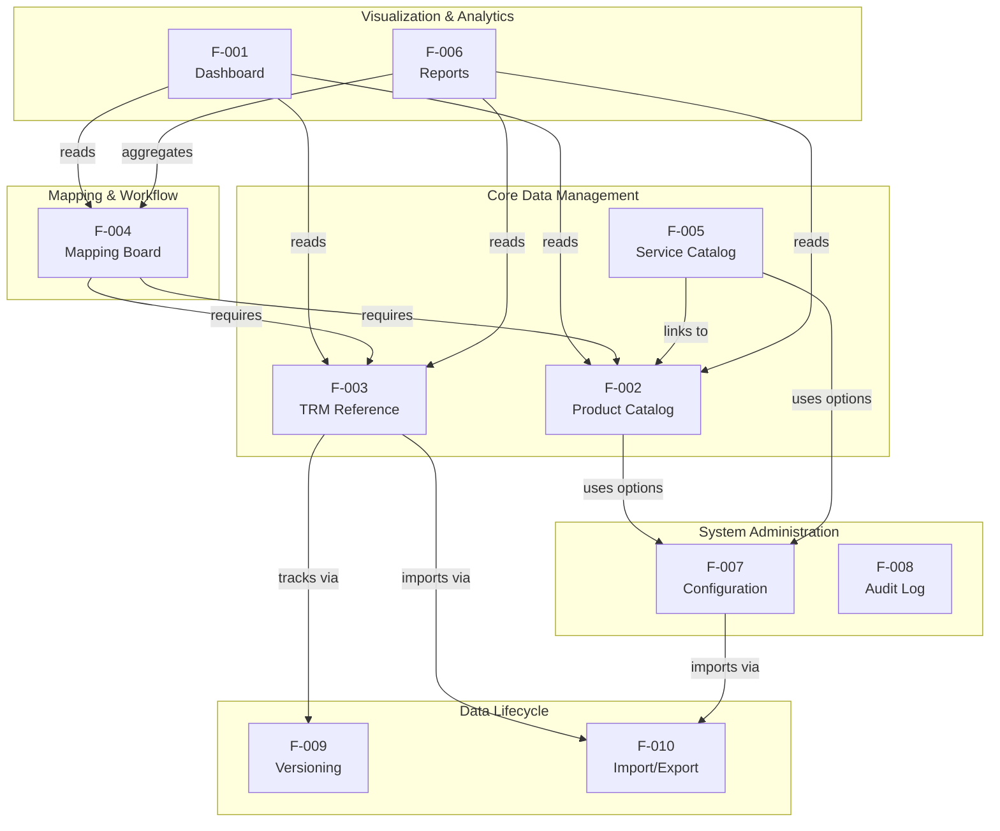

> **Note on F-008 (Audit Log)**: The Audit Change Log does not have explicit feature dependencies. Instead, it passively receives entries from all features that perform create, update, or delete operations: F-002, F-003, F-004, F-005, F-007, and F-010 — all of which invoke `AuditLogService.WriteAsync()`.

### 2.3.2 Integration Points

The following integration points connect features through shared data flows and service invocations:

| Source Feature | Target Feature | Integration Mechanism |
|---|---|---|
| F-002 (Products) → F-004 (Mappings) | Product selection in mapping creation | `ProductCatalogItemId` foreign key |
| F-003 (TRM Reference) → F-004 (Mappings) | TRM hierarchy selection in mapping | `TrmDomainId`, `TrmCapabilityId`, `TrmComponentId` FKs |
| F-002 (Products) → F-005 (Services) | Product links in service composition | `ServiceCatalogItemProduct` bridge entity |
| F-004 (Mappings) → F-006 (Reports) | Completed mapping data for visualization | `ReportService` queries completed mappings |
| F-007 (Config) → F-002 (Products) | Owner/LifecycleStatus dropdown values | `ConfigurableFieldService` |
| F-010 (Import) → F-003 (TRM Reference) | Bulk TRM hierarchy loading | `TrmWorkbookImportService` upserts |
| F-010 (Import) → F-004 (Mappings) | CSV relationship import creates mappings | `SampleRelationshipImportService` |
| F-004 (Mappings) → F-010 (Export) | CSV export of filtered mapping data | `CsvExportService` |

### 2.3.3 Shared Components and Common Services

The following services and infrastructure components are shared across multiple features:

| Shared Component | Used By Features | Role |
|---|---|---|
| `AppDbContext` | All features (F-001 through F-010) | Central EF Core data persistence context |
| `AuditLogService` | F-002, F-003, F-004, F-005, F-007, F-008, F-010 | Records audit entries for CUD operations |
| `ConfigurableFieldService` | F-002, F-004, F-005, F-007 | Provides runtime-configurable dropdown values |
| `ComponentVersioningService` | F-003, F-004, F-009, F-010 | Records TRM component version snapshots |

| Shared Component | Used By Features | Role |
|---|---|---|
| `MappingService` | F-004 | Mapping board business logic |
| `ReportService` | F-006 | Report aggregation and Sankey data construction |
| `TrmWorkbookImportService` | F-003, F-007, F-010 | XLSX workbook parsing and TRM import |
| `SampleRelationshipImportService` | F-007, F-010 | CSV relationship parsing and import |
| `CsvExportService` | F-004, F-010 | Semicolon-delimited CSV mapping export |
| `SearchPattern.CreateContainsPattern` | F-002, F-003, F-004, F-005, F-008 | Standardized search pattern construction |

## 2.4 IMPLEMENTATION CONSIDERATIONS

### 2.4.1 Technical Constraints

The following technical constraints apply across the feature set, as evidenced by the codebase architecture:

| Constraint | Impact | Evidence |
|---|---|---|
| Monolithic single-project architecture | All features are deployed as a single unit; no independent scaling of individual features | `src/HERM-MAPPER-APP/` single project structure |
| Server-side rendering only | All UI is rendered via Razor views; no SPA framework or client-side routing | `Views/` folder with Razor templates; jQuery for interactivity |
| Dual database provider | SQLite for development and SQL Server for production require careful SQL dialect compatibility | `Configuration/` database provider resolution, `HERM-MAPPER-APP.csproj` |
| No authentication scheme | All features are accessible without login; no user identity context for audit attribution | `Program.cs` registers `app.UseAuthorization()` but no authentication scheme |

### 2.4.2 Performance Requirements

| Feature | Performance Consideration | Implementation |
|---|---|---|
| F-001 (Dashboard) | KPI queries execute on every page load | Direct `AppDbContext` queries; no caching layer |
| F-006 (Reports) | Complex aggregation over completed mappings | `AsNoTracking()` and `AsSplitQuery()` to reduce EF Core overhead |
| F-008 (Audit Log) | Query result volume control | Results capped at 250 records per query |
| F-003 (TRM Reference) | Efficient catalogue browsing | Unique indexes on Code columns for rapid lookups |

| Feature | Performance Consideration | Implementation |
|---|---|---|
| F-010 (Import) | Bulk data processing during XLSX/CSV import | In-memory snapshot construction before database upsert batch |
| F-004 (Mapping Board) | Dependent dropdown responsiveness | JSON endpoints return filtered capability/component lists |
| F-008 (Audit Log) | Chronological retrieval efficiency | Index on `OccurredUtc` column |

### 2.4.3 Scalability Considerations

| Consideration | Current State | Implication |
|---|---|---|
| No caching layer | All data reads go directly to the database | Performance degrades linearly with dataset growth |
| No real-time features | No WebSocket or SignalR | Multi-user concurrent edits may lead to stale data views |
| SQLite development mode | Single-writer limitation of SQLite | Not suitable for concurrent production workloads; SQL Server required |
| Audit log cap at 250 | Fixed query limit in `ChangeLogController` | Older audit entries become inaccessible through the UI as volume grows |
| Single-tenant design | No data partitioning or tenant isolation | Application serves a single organization per deployment |

### 2.4.4 Security Implications

| Concern | Current State | Mitigation |
|---|---|---|
| Authentication | Not implemented; `app.UseAuthorization()` is invoked but no scheme registered | Planned: OpenID Connect authentication per `todo.md` |
| Authorization (RBAC) | Not implemented; all users have full access to all features | Planned: View, Admin, Add/Modify Product roles per `todo.md` |
| Audit attribution | Audit log records what changed but not who changed it | Planned: Comprehensive operation auditing per `todo.md` |
| API rate limiting | Not applicable (no API endpoints) | Planned: API rate limiting concurrent with REST API per `todo.md` |
| File upload security | XLSX and CSV files staged under `App_Data/PendingImports/` | GUID-based token isolation; cleanup on completion or abort |
| Data input validation | Model-level data annotations enforce field length limits | ASP.NET Core model binding and jQuery Unobtrusive Validation |

### 2.4.5 Maintenance Requirements

| Area | Requirement | Evidence |
|---|---|---|
| Database Migrations | EF Core migrations manage schema evolution for both SQLite and SQL Server providers | `AppDbContext.cs` with dual provider configuration |
| Configurable Field Management | Owner and LifecycleStatus values are runtime-configurable, avoiding code deployments for vocabulary changes | `ConfigurableFieldOption.cs` with default lifecycle seeds |
| TRM Reference Updates | Reference model updates are handled through staged XLSX import workflows with verification gates | `TrmWorkbookImportService.cs`, `ConfigurationController.cs` |
| Audit Log Growth | No automated pruning or archival mechanism exists for audit log entries | `AuditLogEntry` table grows unbounded |
| Component Version History | Version snapshots accumulate without pruning | `TrmComponentVersion` records persist indefinitely |
| Deployment | Azure App Service (Linux) via PowerShell + Azure CLI ZIP deployment | `scripts/deploy-appservice-azcli.ps1` |

## 2.5 REQUIREMENTS TRACEABILITY

### 2.5.1 Feature-to-Requirement Traceability

| Feature ID | Feature Name | Requirement IDs |
|---|---|---|
| F-001 | Dashboard with Aggregate KPIs | F-001-RQ-001 through F-001-RQ-005 |
| F-002 | Product Catalog CRUD | F-002-RQ-001 through F-002-RQ-007 |
| F-003 | TRM Reference Management | F-003-RQ-001 through F-003-RQ-007 |
| F-004 | Product-to-TRM Mapping Board | F-004-RQ-001 through F-004-RQ-008 |
| F-005 | Service Catalog Management | F-005-RQ-001 through F-005-RQ-006 |
| F-006 | Reports and Visualization | F-006-RQ-001 through F-006-RQ-005 |
| F-007 | Administrative Configuration | F-007-RQ-001 through F-007-RQ-006 |
| F-008 | Audit Change Log | F-008-RQ-001 through F-008-RQ-003 |
| F-009 | Component Version History | F-009-RQ-001 through F-009-RQ-003 |
| F-010 | Import/Export Operations | F-010-RQ-001 through F-010-RQ-005 |

**Total Requirements**: 55 functional requirements across 10 features.

### 2.5.2 Feature-to-Implementation Traceability

| Feature ID | Controller | Primary Service(s) |
|---|---|---|
| F-001 | `HomeController.cs` | Direct `AppDbContext` queries |
| F-002 | `ProductsController.cs` | `AuditLogService`, `ConfigurableFieldService` |
| F-003 | `ReferenceController.cs` | `TrmWorkbookImportService`, `ComponentVersioningService` |
| F-004 | `MappingsController.cs` | `MappingService`, `CsvExportService`, `AuditLogService` |
| F-005 | `ServicesController.cs` | `AuditLogService`, `ConfigurableFieldService` |
| F-006 | `ReportsController.cs` | `ReportService` |
| F-007 | `ConfigurationController.cs` | `ConfigurableFieldService`, `SampleRelationshipImportService`, `TrmWorkbookImportService` |
| F-008 | `ChangeLogController.cs` | `AuditLogService` |
| F-009 | Via `ReferenceController.cs` | `ComponentVersioningService` |
| F-010 | Via Controllers / Services | `TrmWorkbookImportService`, `SampleRelationshipImportService`, `CsvExportService` |

| Feature ID | Primary Entity Model(s) | View Model(s) |
|---|---|---|
| F-001 | All entities (read-only aggregation) | `HomeDashboardViewModel` |
| F-002 | `ProductCatalogItem`, `ProductCatalogItemOwner` | `ProductsIndexViewModel`, `ProductEditViewModel`, `ProductBulkEditViewModel`, `ProductVisualizationViewModel` |
| F-003 | `TrmDomain`, `TrmCapability`, `TrmComponent`, `TrmComponentCapabilityLink`, `TrmComponentVersion` | `ReferenceCatalogueViewModel`, `ComponentHistoryViewModel`, `WorkbookImportReviewViewModel` |
| F-004 | `ProductMapping`, `MappingStatus` | `MappingBoardViewModel`, `MappingEditViewModel` |
| F-005 | `ServiceCatalogItem`, `ServiceCatalogItemProduct` | `ServicesIndexViewModel`, `ServiceEditViewModel`, `ServiceVisualizationViewModel` |
| F-006 | All mapping and TRM entities (read-only) | `ReportsViewModel` and subordinate types |
| F-007 | `ConfigurableFieldOption` | `ConfigurationIndexViewModel`, `AddConfigurationOptionInputModel`, `UpdateConfigurationOptionOrderInputModel` |
| F-008 | `AuditLogEntry` | `ChangeLogIndexViewModel` |
| F-009 | `TrmComponentVersion` | `ComponentHistoryViewModel` |
| F-010 | All TRM entities, `ProductCatalogItem`, `ProductMapping` | `TrmWorkbookVerificationResult`, `TrmWorkbookImportSummary` |

## 2.6 ASSUMPTIONS AND CONSTRAINTS

### 2.6.1 Assumptions

| ID | Assumption |
|---|---|
| A-001 | The application is deployed as a single-tenant instance serving one organization per deployment |
| A-002 | Users access the system through modern web browsers supporting Bootstrap 5.3.3 and jQuery 3.7.1 |
| A-003 | TRM reference data is maintained externally in XLSX workbooks conforming to the required three-worksheet structure |
| A-004 | All users currently have unrestricted access; access control will be added in a future release |
| A-005 | SQLite is used only for development and lightweight evaluation; SQL Server is required for production workloads |
| A-006 | The eight default lifecycle statuses (Propose through Sunset) represent a standard lifecycle; administrators may customize these at runtime |

### 2.6.2 Constraints

| ID | Constraint |
|---|---|
| C-001 | No authentication or authorization — all endpoints are publicly accessible within the network |
| C-002 | No REST API — all interactions are through server-rendered MVC views |
| C-003 | No caching — all reads query the database directly |
| C-004 | No multi-tenancy — single-organization scope per deployment |
| C-005 | No containerization — no Dockerfile or orchestration manifests exist |
| C-006 | CI/CD pipeline is placeholder only — no automated build, test, or deployment |
| C-007 | Application operates in English only — no internationalization or localization support |

#### References

#### Repository Files Examined

- `src/HERM-MAPPER-APP/Controllers/HomeController.cs` — Dashboard KPI computation logic (lines 9–32)
- `src/HERM-MAPPER-APP/Controllers/ProductsController.cs` — Product CRUD, search, bulk edit, visualization
- `src/HERM-MAPPER-APP/Controllers/ReferenceController.cs` — TRM reference catalogue browsing, import, soft-delete
- `src/HERM-MAPPER-APP/Controllers/MappingsController.cs` — Mapping board, dependent dropdowns, CSV export
- `src/HERM-MAPPER-APP/Controllers/ServicesController.cs` — Service catalog CRUD, product linking
- `src/HERM-MAPPER-APP/Controllers/ReportsController.cs` — Reports and Sankey visualization
- `src/HERM-MAPPER-APP/Controllers/ConfigurationController.cs` — Configuration management, import workflows
- `src/HERM-MAPPER-APP/Controllers/ChangeLogController.cs` — Audit log browsing and search
- `src/HERM-MAPPER-APP/Models/ProductCatalogItem.cs` — Product entity with field constraints (lines 1–44)
- `src/HERM-MAPPER-APP/Models/ProductCatalogItemOwner.cs` — Multi-owner bridge entity
- `src/HERM-MAPPER-APP/Models/ProductMapping.cs` — Mapping entity with TRM foreign keys (lines 1–33)
- `src/HERM-MAPPER-APP/Models/MappingStatus.cs` — Mapping status enum (lines 1–18)
- `src/HERM-MAPPER-APP/Models/ServiceCatalogItem.cs` — Service entity with product links (lines 1–37)
- `src/HERM-MAPPER-APP/Models/ServiceCatalogItemProduct.cs` — Service-product bridge entity
- `src/HERM-MAPPER-APP/Models/TrmComponent.cs` — TRM component entity with soft-delete fields
- `src/HERM-MAPPER-APP/Models/TrmComponentVersion.cs` — Version history snapshot entity
- `src/HERM-MAPPER-APP/Models/TrmComponentCapabilityLink.cs` — Many-to-many bridge entity
- `src/HERM-MAPPER-APP/Models/ConfigurableFieldOption.cs` — Configurable field options with defaults (lines 1–55)
- `src/HERM-MAPPER-APP/Models/AuditLogEntry.cs` — Audit log entry schema
- `src/HERM-MAPPER-APP/Services/AuditLogService.cs` — Audit entry writing service
- `src/HERM-MAPPER-APP/Services/ComponentVersioningService.cs` — Component version snapshot logic
- `src/HERM-MAPPER-APP/Services/TrmWorkbookImportService.cs` — XLSX parsing and TRM import
- `src/HERM-MAPPER-APP/Services/SampleRelationshipImportService.cs` — CSV parsing and relationship import
- `src/HERM-MAPPER-APP/Services/CsvExportService.cs` — CSV mapping export
- `src/HERM-MAPPER-APP/Data/AppDbContext.cs` — EF Core fluent API configuration and entity registration
- `src/HERM-MAPPER-APP/ViewModels/HomeDashboardViewModel.cs` — Dashboard KPI view model
- `src/HERM-MAPPER-APP/HERM-MAPPER-APP.csproj` — Target framework and NuGet dependencies
- `src/HERM-MAPPER-APP/wwwroot/js/owner-visualization.js` — Custom SVG Sankey rendering engine
- `todo.md` — Planned features backlog (security, API, versioning)

#### Repository Folders Examined

- `src/HERM-MAPPER-APP/Controllers/` — 8 MVC controllers defining all HTTP endpoints
- `src/HERM-MAPPER-APP/Models/` — 14 domain model files including entities and enumerations
- `src/HERM-MAPPER-APP/Services/` — 7 service implementations encapsulating business logic
- `src/HERM-MAPPER-APP/ViewModels/` — 18 view model files for presentation layer contracts
- `src/HERM-MAPPER-APP/Data/` — EF Core `AppDbContext` with dual provider support
- `src/HERM-MAPPER-APP/Configuration/` — Database provider resolution logic
- `src/HERM-MAPPER-APP/Infrastructure/` — Utility helpers including `SearchPattern`
- `src/HERM-MAPPER-APP/wwwroot/` — Static assets (CSS, JS, vendor libraries)

#### Cross-Referenced Technical Specification Sections

- Section 1.1 Executive Summary — Business problem, stakeholders, value proposition
- Section 1.2 System Overview — Architecture, technology stack, domain model, success criteria
- Section 1.3 Scope — In-scope features, implementation boundaries, out-of-scope items
- Section 1.4 Document Conventions and Terminology — Key terms, document structure

# 3. Technology Stack

HERM-MAPPER-APP is built on a focused, cohesive technology stack centered on the Microsoft .NET ecosystem. The application follows a traditional server-side rendered MVC architecture, leveraging ASP.NET Core MVC with Razor Views for the presentation layer, Entity Framework Core for data access, and a dual-database strategy (SQLite for development, SQL Server for production). The client-side layer is deliberately lightweight, using jQuery and Bootstrap without any SPA framework. This section documents every technology choice, version, justification, and integration requirement across the entire system.

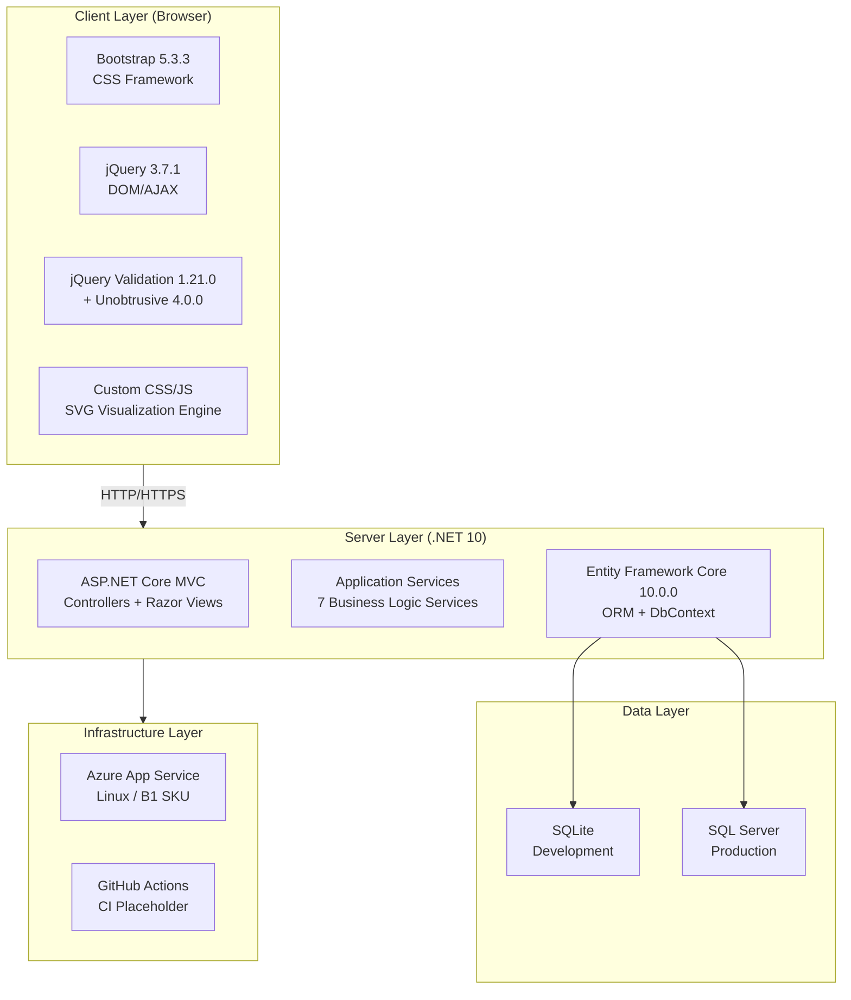

## 3.1 PROGRAMMING LANGUAGES

### 3.1.1 Language Overview

HERM-MAPPER-APP employs five distinct languages, each serving a clearly delineated purpose within the monolithic architecture. The language selection emphasizes server-side processing with minimal client-side complexity.

| Language | Platform/Component | Primary Role | Evidence |
|---|---|---|---|
| **C#** | Server-side application | Controllers, services, models, data access, configuration | `HERM-MAPPER-APP.csproj` (`net10.0`) |
| **Razor** | Server-side templating | HTML view generation with embedded C# expressions | `Views/` folder (11 subfolders) |
| **JavaScript** | Client-side interactivity | DOM manipulation, AJAX, SVG visualization rendering | `wwwroot/js/site.js`, `wwwroot/js/owner-visualization.js` |
| **CSS** | Client-side styling | Layout, theming, domain-specific visual classes | `wwwroot/css/site.css` |
| **PowerShell** | Automation and scripting | Azure deployment, local development launcher | `scripts/deploy-appservice-azcli.ps1`, `start.ps1` |

### 3.1.2 C# (.NET 10)

C# serves as the primary development language for all server-side logic. The project targets **.NET 10.0** (`net10.0`), as declared in `HERM-MAPPER-APP.csproj` via `<TargetFramework>net10.0</TargetFramework>`. The SDK type is `Microsoft.NET.Sdk.Web`, confirming this is a web application project.

**.NET 10 Platform Justification:**
- .NET 10 is a **Long-Term Support (LTS)** release, supported from November 11, 2025 through November 10, 2028 — providing a three-year support window with critical updates and security patches. This aligns with the project's need for long-term platform stability as documented in the System Overview (Section 1.2.3).
- The root namespace is configured as `HERM_MAPPER_APP`, with modern C# features enabled including **nullable reference types** (`<Nullable>enable</Nullable>`) and **implicit usings** (`<ImplicitUsings>enable</ImplicitUsings>`), reducing boilerplate and improving null safety.

**C# Code Coverage:**
C# is used across all eight MVC controllers, fourteen domain models, seven business services, eighteen view models, the `AppDbContext` data access layer, the configuration resolution system, and the application bootstrap/DI orchestration in `Program.cs`.

### 3.1.3 JavaScript (ES5/ES6)

The client-side JavaScript layer uses **framework-free vanilla JavaScript** supplemented by jQuery 3.7.1 for DOM manipulation. No SPA framework (React, Angular, Vue) is employed — this is a deliberate architectural decision favoring server-side rendering simplicity.

Two principal JavaScript files exist in `wwwroot/js/`:
- **`site.js`** — Implements interaction patterns including bulk edit operations, dynamic service editor behavior, and AJAX-driven dependent dropdown filtering for the mapping board.
- **`owner-visualization.js`** — A custom SVG rendering engine that generates Sankey-style hierarchy diagrams using native DOM and SVG APIs, without reliance on any third-party charting library.

### 3.1.4 Razor (Server-Side Templating)

Razor is used as the server-side templating engine for all HTML generation. Views are organized in feature-specific subfolders under `Views/` (Home, Products, Mappings, Reference, Configuration, Services, Reports, ChangeLog, Shared). Global configuration is managed through `_ViewImports.cshtml` (tag helper imports, namespace declarations) and `_ViewStart.cshtml` (default layout binding).

### 3.1.5 PowerShell (Automation)

PowerShell scripts handle operational automation:
- **`scripts/deploy-appservice-azcli.ps1`** — Comprehensive Azure App Service deployment script using `Set-StrictMode -Version Latest` for strict error handling.
- **`start.ps1`** — Local development launcher that configures environment variables (`DOTNET_CLI_HOME`, `DOTNET_SKIP_FIRST_TIME_EXPERIENCE`) and invokes `dotnet run` with configurable log levels.

### 3.1.6 CSS

Custom styles in `wwwroot/css/site.css` extend Bootstrap's base styling with CSS custom properties, responsive layouts, and domain-specific class families for mapping flow visualizations, Sankey surface rendering, and lifecycle status displays.

## 3.2 FRAMEWORKS & LIBRARIES

### 3.2.1 Core Server Framework — ASP.NET Core MVC

| Attribute | Detail |
|---|---|
| **Framework** | ASP.NET Core MVC |
| **Version** | Bundled with .NET 10 SDK |
| **SDK** | `Microsoft.NET.Sdk.Web` |
| **Evidence** | `HERM-MAPPER-APP.csproj`, `Program.cs` line 107: `services.AddControllersWithViews()` |

**Justification:** ASP.NET Core MVC provides a mature, server-rendered web framework with built-in support for model binding, validation, dependency injection, and the Razor view engine. As the standard web framework in the .NET ecosystem, it aligns with the C# language choice and receives direct LTS support through the .NET 10 platform.

**Middleware Pipeline Configuration** (as defined in `Program.cs`, lines 117–136):

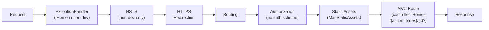

The middleware pipeline follows the standard ASP.NET Core ordering. Notably, `UseAuthorization()` is invoked at line 128 but no authentication scheme is registered — this is a documented constraint (C-001) with OpenID Connect authentication planned for a future release.

**Dependency Injection Registrations** (from `Program.cs`, lines 100–107):

| Service | Lifetime | Purpose |
|---|---|---|
| `TrmWorkbookImportService` | Scoped | XLSX TRM workbook import processing |
| `SampleRelationshipImportService` | Scoped | CSV relationship data import |
| `DatabaseInitializer` | Scoped | Startup database schema creation and seed data |
| `CsvExportService` | Scoped | Mapping data CSV export generation |
| `AuditLogService` | Scoped | Change audit trail logging |
| `ConfigurableFieldService` | Scoped | Runtime-configurable dropdown option management |
| `ComponentVersioningService` | Scoped | TRM component version snapshot tracking |
| `ResolvedDatabaseConfiguration` | Singleton | Resolved database provider and connection settings |
| `IConfiguration` | Singleton | Application configuration (built-in) |

### 3.2.2 ORM Framework — Entity Framework Core 10.0.0

| Attribute | Detail |
|---|---|
| **Framework** | Entity Framework Core |
| **Version** | 10.0.0 |
| **Providers** | `Microsoft.EntityFrameworkCore.SqlServer` 10.0.0, `Microsoft.EntityFrameworkCore.Sqlite` 10.0.0 |
| **Evidence** | `HERM-MAPPER-APP.csproj` lines 11–12 |

**Justification:** Entity Framework Core 10.0.0 is the LTS-aligned ORM release, supported until November 10, 2028 in lockstep with .NET 10. It provides LINQ-based query composition, change tracking, fluent API model configuration, and dual-provider support — enabling the project's SQLite/SQL Server dual-database strategy through a single `AppDbContext` defined in `Data/AppDbContext.cs`.

**Key EF Core Patterns Used:**
- Fluent API configuration for indexes, uniqueness constraints, delete behaviors, and schema rules
- `AsNoTracking()` and `AsSplitQuery()` for read-optimized report queries (per Section 2.4.2)
- `DbSet` registrations covering: audit logs, configurable field options, product catalog items, product owners, mappings, service catalog items, service-product links, TRM domains, TRM capabilities, TRM components, TRM component links, and TRM component versions
- Database initialization via `EnsureCreated` pattern (no migrations folder detected in the repository)

### 3.2.3 Client-Side Libraries

All client-side libraries are **vendored as static files** directly committed into `wwwroot/lib/`. No client-side package manager manifest (`libman.json`, `package.json`, `bower.json`) exists in the repository — libraries are managed through direct file inclusion.

| Library | Version | License | Location | Purpose |
|---|---|---|---|---|
| **Bootstrap** | 5.3.3 | MIT | `wwwroot/lib/bootstrap/` | CSS framework providing responsive grid, UI components (modals, dropdowns, tabs, cards, navigation), and cross-browser normalization |
| **jQuery** | 3.7.1 | MIT | `wwwroot/lib/jquery/` | DOM manipulation, event handling, AJAX requests, and plugin API for validation integration |
| **jQuery Validation** | 1.21.0 | MIT | `wwwroot/lib/jquery-validation/` | Client-side form validation rule engine |
| **jQuery Validation Unobtrusive** | 4.0.0 | MIT | `wwwroot/lib/jquery-validation-unobtrusive/` | Bridges ASP.NET Core `data-val-*` HTML data attributes to jQuery Validation rules for declarative client-side validation |

**Library Dependency Chain:**

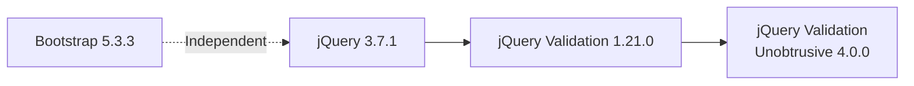

jQuery is the foundational dependency required by both the validation chain and the application's custom JavaScript. Bootstrap operates independently for styling and component behavior but coexists alongside jQuery for interactive UI elements. The jQuery Validation Unobtrusive library is specifically designed to integrate ASP.NET Core's server-generated `data-val-*` attributes with jQuery Validation, enabling seamless client-side model validation without manual JavaScript rule definitions.

**Version Currency Note:** Bootstrap 5.3.3 was released on February 20, 2024. While newer patch versions exist in the 5.3.x line (up to 5.3.8 as of August 2025), the vendored version remains at 5.3.3. As a statically committed dependency with no package manager, version updates require manual file replacement.

### 3.2.4 Testing Frameworks

| Library | Version | License | Evidence | Purpose |
|---|---|---|---|---|
| **xUnit** | 2.9.3 | Apache-2.0 | `HERM-MAPPER-APP.Tests.csproj` line 12 | Test authoring framework — assertions, test discovery, traits |
| **Microsoft.NET.Test.Sdk** | 17.14.1 | MIT | `HERM-MAPPER-APP.Tests.csproj` line 11 | Test platform host — bridges xUnit to `dotnet test` and IDE runners |
| **xunit.runner.visualstudio** | 2.8.2 | Apache-2.0 | `HERM-MAPPER-APP.Tests.csproj` line 13 | IDE/CI runner integration adapter (PrivateAssets=all) |
| **coverlet.collector** | 6.0.4 | MIT | `HERM-MAPPER-APP.Tests.csproj` line 17 | Code coverage data collection (PrivateAssets=all) |

The test project (`tests/HERM-MAPPER-APP.Tests/`) targets `net10.0` and directly references the production project via `<ProjectReference>`, enabling integration-style testing with real application services and SQLite-backed persistence.

## 3.3 OPEN SOURCE DEPENDENCIES

### 3.3.1 NuGet Package Dependencies (Server-Side)

All server-side packages are sourced from **nuget.org**, the official .NET package registry. The project maintains an intentionally minimal dependency footprint.

#### Production Application (`src/HERM-MAPPER-APP/HERM-MAPPER-APP.csproj`)

| Package | Version | License | Registry | Purpose |
|---|---|---|---|---|
| `Microsoft.EntityFrameworkCore.SqlServer` | 10.0.0 | MIT | nuget.org | SQL Server database provider for EF Core |
| `Microsoft.EntityFrameworkCore.Sqlite` | 10.0.0 | MIT | nuget.org | SQLite database provider for EF Core |

> **Minimal Dependency Design:** These are the **only two explicit NuGet package references** in the production project. All other server capabilities — ASP.NET Core MVC, logging, configuration, HTTPS enforcement, static asset serving, model binding, and dependency injection — are provided by the `Microsoft.NET.Sdk.Web` SDK bundled with .NET 10. This minimizes supply-chain surface area and simplifies version management.

#### Test Project (`tests/HERM-MAPPER-APP.Tests/HERM-MAPPER-APP.Tests.csproj`)

| Package | Version | License | Registry | Purpose |
|---|---|---|---|---|
| `Microsoft.NET.Test.Sdk` | 17.14.1 | MIT | nuget.org | Test execution host |
| `xunit` | 2.9.3 | Apache-2.0 | nuget.org | Test framework |
| `xunit.runner.visualstudio` | 2.8.2 | Apache-2.0 | nuget.org | IDE/CI runner adapter |
| `coverlet.collector` | 6.0.4 | MIT | nuget.org | Code coverage collector |

### 3.3.2 Client-Side Vendored Dependencies

| Library | Version | License | Distribution Method |
|---|---|---|---|
| Bootstrap | 5.3.3 | MIT | Static files in `wwwroot/lib/bootstrap/` |
| jQuery | 3.7.1 | MIT | Static files in `wwwroot/lib/jquery/` |
| jQuery Validation | 1.21.0 | MIT | Static files in `wwwroot/lib/jquery-validation/` |
| jQuery Validation Unobtrusive | 4.0.0 | MIT | Static files in `wwwroot/lib/jquery-validation-unobtrusive/` |

Client-side dependencies are vendored directly into the repository as committed static files. No package manager configuration exists for these libraries, meaning updates must be performed manually by replacing files in the `wwwroot/lib/` directory.

### 3.3.3 Licensing Summary

The repository itself is released under the **MIT License** (Copyright © 2026, Michael Tsiortos) per the `LICENSE` file. All declared dependencies — both NuGet packages and vendored client libraries — use permissive open-source licenses (MIT or Apache-2.0), ensuring full license compatibility with the project's MIT distribution terms.

## 3.4 THIRD-PARTY SERVICES

### 3.4.1 Cloud Platform — Azure App Service

| Attribute | Detail |
|---|---|
| **Service** | Azure App Service (Linux) |
| **Runtime** | `DOTNETCORE:10.0` |
| **Default SKU** | B1 (Basic tier) |
| **Evidence** | `scripts/deploy-appservice-azcli.ps1` |

The Azure App Service deployment is defined entirely through the PowerShell deployment script, which configures the following platform security defaults:

- **Always On**: Enabled — prevents application idle unloading
- **HTTP/2**: Enabled — modern protocol support
- **Minimum TLS**: 1.2 — enforces transport encryption standards
- **FTPS**: Disabled — eliminates insecure file transfer exposure

The deployment model uses **ZIP deployment** via `az webapp deploy` with writable local storage. The script explicitly avoids the `WEBSITE_RUN_FROM_PACKAGE=1` mode to preserve filesystem write access required for SQLite database operations and the `App_Data/PendingImports/` staging directory.

**Configuration injection** flattens nested JSON settings into `Section__Key` format for ASP.NET Core's environment variable configuration provider, with `ASPNETCORE_ENVIRONMENT` and `DOTNET_ENVIRONMENT` injected automatically.

### 3.4.2 CI/CD Platform — GitHub Actions

| Attribute | Detail |
|---|---|
| **Platform** | GitHub Actions |
| **Status** | Placeholder only (Constraint C-006) |
| **Trigger** | Push to `main` branch |
| **Runner** | `ubuntu-latest` |
| **Evidence** | `.github/workflows/main.yml` |

The CI/CD configuration is a **placeholder workflow** containing only a single "hello world" echo step. No automated build, test, or deployment pipeline is operational. This is acknowledged as constraint C-006 in the project's assumptions and constraints (Section 2.6.2).

### 3.4.3 Authentication Services

**Current State:** No external authentication service is integrated. The middleware pipeline calls `app.UseAuthorization()` in `Program.cs` (line 128), but no authentication scheme is registered, leaving all endpoints publicly accessible within the network (Constraint C-001).

**Planned Integration:** Per the project backlog in `todo.md`, OpenID Connect authentication is planned with token-to-role mapping, user management, and API key management. This will require registering an authentication middleware and integrating with an external identity provider.

### 3.4.4 Monitoring and Observability

No external monitoring, APM, or observability services are integrated. The application relies on ASP.NET Core's built-in logging framework with console output, configurable through:
- `Diagnostics:Console:*` settings for console logging verbosity
- `Diagnostics:Sql:*` settings for EF Core SQL statement logging
- Optional EF Core detailed errors and sensitive data logging via `appsettings.Development.json`

### 3.4.5 External Tool Dependencies

| Tool | Purpose | Required For |
|---|---|---|
| **Azure CLI (`az`)** | Azure resource provisioning and deployment | Production deployment via `deploy-appservice-azcli.ps1` |
| **.NET SDK (`dotnet`)** | Build, publish, and local execution | All development and deployment workflows |

No other external APIs, SaaS integrations, or third-party service dependencies exist in the codebase.

## 3.5 DATABASES & STORAGE

### 3.5.1 Database Architecture Overview

HERM-MAPPER-APP implements a **dual-database provider strategy**, resolved at application startup, enabling SQLite for lightweight development and SQL Server for production workloads. Both providers share a single `AppDbContext` defined in `Data/AppDbContext.cs`, ensuring schema parity across environments.

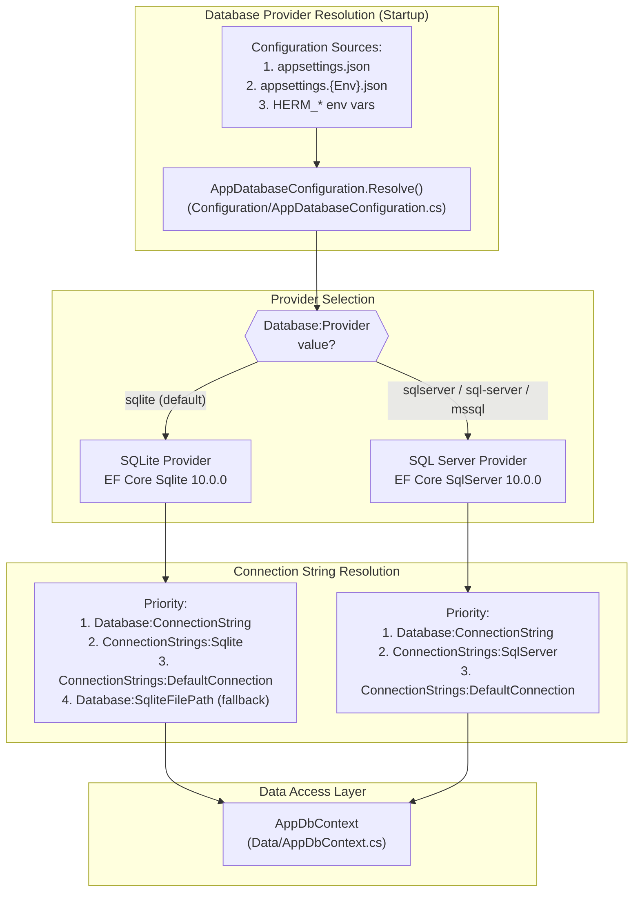

### 3.5.2 Primary Database — SQL Server (Production)

| Attribute | Detail |
|---|---|
| **ORM Provider** | `Microsoft.EntityFrameworkCore.SqlServer` 10.0.0 |
| **Configuration Key** | `Database:Provider` = `SqlServer` (aliases: `sql-server`, `mssql`) |
| **Evidence** | `HERM-MAPPER-APP.csproj`, `Configuration/AppDatabaseConfiguration.cs` |

**Connection String Resolution** (in order of precedence):
1. `Database:ConnectionString` — explicit connection string
2. `ConnectionStrings:SqlServer` — named provider-specific connection string
3. `ConnectionStrings:DefaultConnection` — generic default connection string

If no connection string resolves when SQL Server is the configured provider, the application throws an `InvalidOperationException` at startup, preventing silent misconfiguration.

**Environment Variable Override:** Connection settings can be overridden via `HERM_Database__Provider` and `HERM_Database__ConnectionString` environment variables, following the ASP.NET Core `__` (double underscore) hierarchical key convention.

### 3.5.3 Development Database — SQLite

| Attribute | Detail |
|---|---|
| **ORM Provider** | `Microsoft.EntityFrameworkCore.Sqlite` 10.0.0 |
| **Default File Path** | `\|DataDirectory\|/herm-mapper.db` |
| **Configuration** | `appsettings.Development.json` line 4 |
| **Evidence** | `HERM-MAPPER-APP.csproj`, `appsettings.Development.json` |

SQLite is the **default provider** when no explicit `Database:Provider` is configured. The path token `|DataDirectory|` resolves to the `App_Data/` directory under the application content root. Additional path tokens include `|HomeDirectory|` (user home directory) and environment variable expansion via `%VAR%` and `${VAR}` formats.

**Operational Constraint:** SQLite operates with a single-writer limitation, making it unsuitable for concurrent production workloads. Assumption A-005 (Section 2.6.1) explicitly states that SQLite is designated only for development and lightweight evaluation, with SQL Server required for production deployments.

### 3.5.4 Data Persistence Strategy

**Schema Management:**
- The `DatabaseInitializer` service runs at application startup (`Program.cs` line 17), responsible for creating the database schema and seeding default data (including the eight lifecycle status values: Propose, Development, Trial, Production, Under Review, Appointed, Deprecate, Sunset).
- No EF Core migrations folder was found in the repository, indicating the application uses an `EnsureCreated` pattern rather than incremental migration-based schema management.

**Entity Registration:**
The `AppDbContext` (in `Data/AppDbContext.cs`) registers `DbSet` properties for all fourteen domain entities, configured with fluent API rules for indexes, uniqueness constraints, cascading delete behaviors, and schema validation.

### 3.5.5 File Storage

| Storage Location | Purpose | Lifecycle |
|---|---|---|
| `App_Data/` | SQLite database file (`herm-mapper.db`) storage | Created automatically at startup |
| `App_Data/PendingImports/` | Staging area for XLSX/CSV import files | GUID-based token isolation; files cleaned up on import completion or abort |

File storage is local to the application deployment — no external blob storage, CDN, or distributed file system is used. The Azure App Service deployment explicitly enables writable filesystem access to support these storage requirements.

### 3.5.6 Caching

**No caching layer is implemented** (Constraint C-003, Section 2.6.2). All data reads query the database directly through EF Core. Performance mitigations include:
- `AsNoTracking()` for read-only report queries, avoiding EF Core change tracking overhead
- `AsSplitQuery()` for complex multi-join report queries, reducing Cartesian explosion
- Audit log query results capped at 250 records per request

## 3.6 DEVELOPMENT & DEPLOYMENT

### 3.6.1 Development Tools

| Tool | Version/Requirement | Purpose | Evidence |
|---|---|---|---|
| **Visual Studio** | 2026 (17+) | Primary IDE; solution targeting VS 17 | `HERM-MAPPER-APP.sln` |
| **Visual Studio Code** | Any current version | Alternative lightweight IDE | `README.md` line 69 |
| **.NET SDK** | 10.0+ | Build toolchain, runtime, and CLI | `README.md` line 37 |
| **PowerShell** | 5.1+ or PowerShell Core | Script execution for deployment and local launch | `start.ps1`, `scripts/deploy-appservice-azcli.ps1` |

### 3.6.2 Build System

The solution file `HERM-MAPPER-APP.sln` serves as the build entry point, binding the production application project and the test project into a single buildable unit.

**Build Configurations:** `Debug|Any CPU` and `Release|Any CPU`

**Build Commands** (cross-platform — Windows, macOS, Linux):
1. **Restore** — `dotnet restore ./HERM-MAPPER-APP.sln`
2. **Build** — `dotnet build ./HERM-MAPPER-APP.sln`
3. **Run** — `dotnet run --project ./src/HERM-MAPPER-APP/HERM-MAPPER-APP.csproj`
4. **Test** — `dotnet test ./tests/HERM-MAPPER-APP.Tests/HERM-MAPPER-APP.Tests.csproj`

**Local Development Launch** (`start.ps1`):
The PowerShell launcher script configures environment variables (`DOTNET_CLI_HOME`, `DOTNET_SKIP_FIRST_TIME_EXPERIENCE`), sets configurable log levels, and invokes `dotnet run`. Launch profiles in `Properties/launchSettings.json` provide `http` and `https` profiles with localhost ports and auto-browser launch configuration.

**Configuration Hierarchy** (from `Program.cs` line 8):
1. `appsettings.json` — Base configuration
2. `appsettings.{Environment}.json` — Environment-specific overrides (e.g., `appsettings.Development.json`)
3. `HERM_`-prefixed environment variables — Highest precedence, suitable for cloud platform injection

### 3.6.3 Containerization

**No containerization support exists** in the repository (Constraint C-005, Section 2.6.2). No Dockerfile, Docker Compose, or Kubernetes manifests are present. The application is deployed directly to Azure App Service as a published .NET artifact rather than as a container image.

### 3.6.4 CI/CD Pipeline

**Current State:** The GitHub Actions workflow (`.github/workflows/main.yml`) is a **placeholder** containing only a single echo step. No automated build, test, code analysis, or deployment stages are configured (Constraint C-006).

**Workflow Configuration:**
- **Trigger:** Push to `main` branch
- **Runner:** `ubuntu-latest`
- **Steps:** Single "hello world" echo (no `dotnet build`, `dotnet test`, or deployment steps)

### 3.6.5 Production Deployment Process

The Azure App Service deployment is orchestrated by `scripts/deploy-appservice-azcli.ps1`, a comprehensive PowerShell script that manages the full deployment lifecycle:

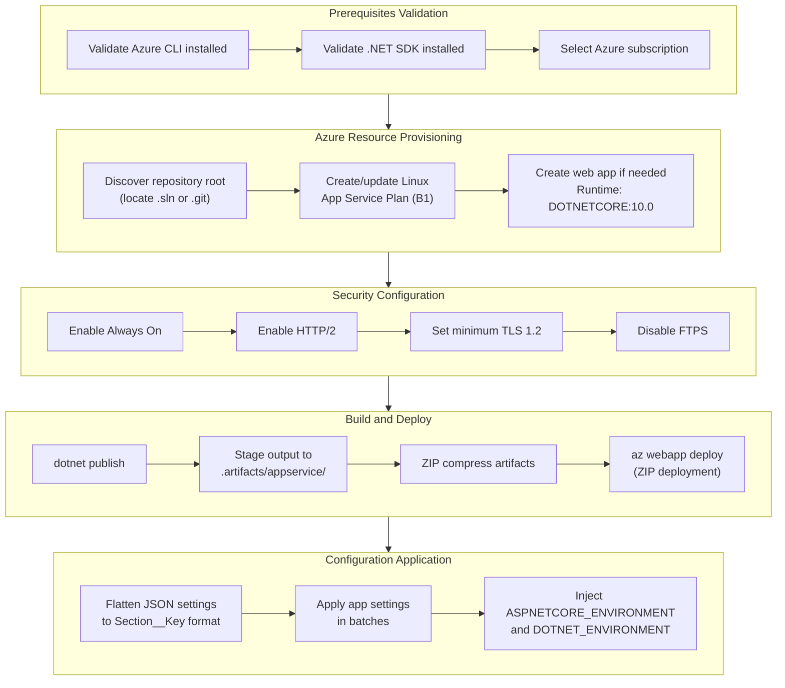

## 3.7 TECHNOLOGY STACK SUMMARY

### 3.7.1 Complete Version Matrix

| Layer | Technology | Version | Support End Date | License |
|---|---|---|---|---|
| **Runtime** | .NET | 10.0 (LTS) | November 10, 2028 | MIT |
| **Language** | C# | 14 (bundled with .NET 10) | — | — |
| **Web Framework** | ASP.NET Core MVC | Bundled with .NET 10 | November 10, 2028 | MIT |
| **ORM** | Entity Framework Core | 10.0.0 (LTS) | November 10, 2028 | MIT |
| **DB Provider (Prod)** | EF Core SqlServer | 10.0.0 | November 10, 2028 | MIT |
| **DB Provider (Dev)** | EF Core Sqlite | 10.0.0 | November 10, 2028 | MIT |
| **CSS Framework** | Bootstrap | 5.3.3 | — | MIT |
| **JavaScript Library** | jQuery | 3.7.1 | — | MIT |
| **Form Validation** | jQuery Validation | 1.21.0 | — | MIT |
| **Unobtrusive Validation** | jQuery Validation Unobtrusive | 4.0.0 | — | MIT |
| **Test Framework** | xUnit | 2.9.3 | — | Apache-2.0 |
| **Test SDK** | Microsoft.NET.Test.Sdk | 17.14.1 | — | MIT |
| **Test Runner** | xunit.runner.visualstudio | 2.8.2 | — | Apache-2.0 |
| **Coverage** | coverlet.collector | 6.0.4 | — | MIT |
| **Deployment Target** | Azure App Service (Linux) | B1 SKU | — | Commercial |
| **CI Platform** | GitHub Actions | Placeholder only | — | Commercial |

### 3.7.2 Architectural Constraints Summary

The following constraints from Section 2.6.2 directly influence technology stack decisions and boundaries:

| Constraint ID | Description | Stack Impact |
|---|---|---|
| C-001 | No authentication or authorization | No identity provider integration; all endpoints publicly accessible |
| C-002 | No REST API | All interactions through MVC controllers serving HTML views |
| C-003 | No caching | All reads query the database directly; no Redis, Memcached, or in-memory cache |
| C-004 | No multi-tenancy | Single-organization scope; no data partitioning |
| C-005 | No containerization | No Docker, Compose, or Kubernetes; direct App Service deployment |
| C-006 | CI/CD placeholder only | No automated build, test, or deployment pipeline |
| C-007 | English only | No i18n/l10n framework or resource files |

### 3.7.3 Planned Technology Additions

The following technology additions are documented in `todo.md` as planned for future releases. These will impact the stack when implemented:

| Planned Feature | Technology Impact | Priority |
|---|---|---|
| OpenID Connect authentication | Requires authentication middleware, external identity provider integration | Security |
| Role-based access control | View, Admin, Add/Modify Product roles; authorization policy configuration | Security |
| REST API endpoints | New API controller layer alongside existing MVC controllers | Integration |
| Swagger/OpenAPI documentation | Swashbuckle or equivalent OpenAPI generation library | Integration |
| API rate limiting | Rate limiting middleware or library | Integration |
| User and API key management | Database schema extension for user/key entities | Security |
| Document database evaluation | Long-term architectural consideration for alternative data storage | Architecture |

#### References

#### Repository Files Examined

- `src/HERM-MAPPER-APP/HERM-MAPPER-APP.csproj` — Target framework (.NET 10), NuGet package dependencies, SDK type
- `src/HERM-MAPPER-APP/Program.cs` — Application bootstrap, DI registrations, middleware pipeline, configuration chain
- `src/HERM-MAPPER-APP/appsettings.Development.json` — Development database configuration, diagnostics settings
- `tests/HERM-MAPPER-APP.Tests/HERM-MAPPER-APP.Tests.csproj` — Test framework packages and versions
- `.github/workflows/main.yml` — GitHub Actions CI/CD placeholder workflow
- `scripts/deploy-appservice-azcli.ps1` — Azure App Service deployment script
- `start.ps1` — Local development launcher script
- `README.md` — Installation instructions, build commands, configuration reference
- `todo.md` — Planned features backlog defining future technology additions
- `LICENSE` — MIT License, Copyright © 2026 Michael Tsiortos
- `HERM-MAPPER-APP.sln` — Solution file binding production and test projects
- `Properties/launchSettings.json` — Local launch profiles (http/https)

#### Repository Folders Examined

- `src/HERM-MAPPER-APP/` — Full application structure (controllers, models, services, views, configuration)
- `src/HERM-MAPPER-APP/wwwroot/lib/` — Vendored client-side libraries (Bootstrap, jQuery, validation)
- `src/HERM-MAPPER-APP/wwwroot/js/` — Custom JavaScript (site.js, owner-visualization.js)
- `src/HERM-MAPPER-APP/wwwroot/css/` — Custom CSS (site.css)
- `src/HERM-MAPPER-APP/Configuration/` — Database provider resolution logic
- `src/HERM-MAPPER-APP/Data/` — EF Core AppDbContext
- `tests/HERM-MAPPER-APP.Tests/` — xUnit test project structure
- `.github/workflows/` — GitHub Actions workflow definitions
- `scripts/` — Deployment automation scripts

#### Cross-Referenced Technical Specification Sections

- Section 1.1 Executive Summary — Project overview, technology summary, experimental status
- Section 1.2 System Overview — Architecture patterns, technology stack table, domain model
- Section 1.3 Scope — In-scope features, implementation boundaries, out-of-scope items
- Section 1.4 Document Conventions and Terminology — Key terms and document structure
- Section 2.4 Implementation Considerations — Technical constraints, performance, scalability, security
- Section 2.6 Assumptions and Constraints — Six assumptions and seven constraints

#### External References

- .NET 10 Release Notes — https://github.com/dotnet/core/blob/main/release-notes/10.0/README.md
- .NET Support Policy — https://dotnet.microsoft.com/en-us/platform/support/policy/dotnet-core
- EF Core 10 What's New — https://learn.microsoft.com/en-us/ef/core/what-is-new/ef-core-10.0/whatsnew
- Bootstrap 5.3.3 Release — https://blog.getbootstrap.com/2024/02/20/bootstrap-5-3-3/
- Announcing .NET 10 — https://devblogs.microsoft.com/dotnet/announcing-dotnet-10/

# 4. Process Flowchart

This section provides comprehensive process flowcharts documenting all major workflows, state transitions, integration sequences, and error handling paths within the HERM-MAPPER-APP system. Each diagram is grounded in the implemented controller actions, service methods, and domain model behaviors documented across the codebase.

## 4.1 HIGH-LEVEL SYSTEM WORKFLOW

### 4.1.1 End-to-End System Process Overview

The following diagram illustrates the high-level process flow across all ten system features (F-001 through F-010), showing how users interact with the system from initial setup through ongoing portfolio management and reporting. The workflow reflects the monolithic ASP.NET Core MVC architecture implemented in `src/HERM-MAPPER-APP/`, where all interactions are through server-rendered Razor views with jQuery-based client-side interactivity.

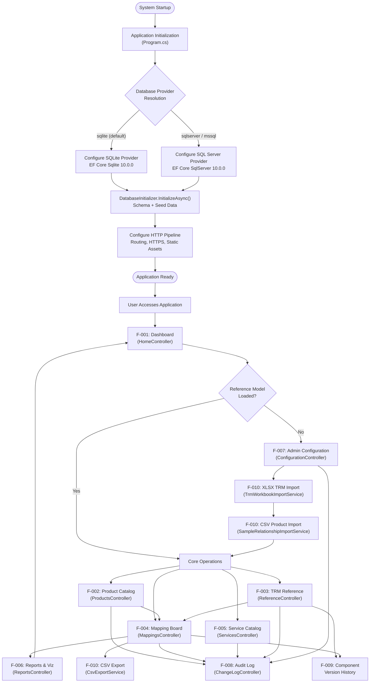

### 4.1.2 Actor-System Interaction Boundaries

The system serves five identified stakeholder groups, each interacting with specific feature subsets. Since HERM-MAPPER-APP currently operates without authentication or RBAC (Constraint C-001), all actors access the same endpoints; roles are distinguished by functional usage patterns inferred from the controller and view model architecture.

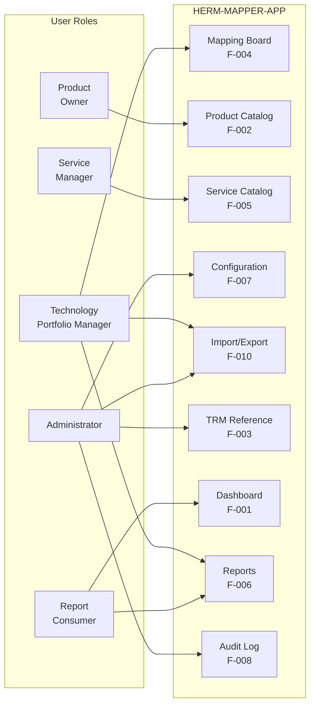

## 4.2 APPLICATION STARTUP FLOW

### 4.2.1 Startup Initialization Sequence

The application follows a strictly sequential startup flow defined in `Program.cs` (lines 1–142). This process encompasses builder creation, configuration binding, service registration, database initialization, and HTTP pipeline configuration.

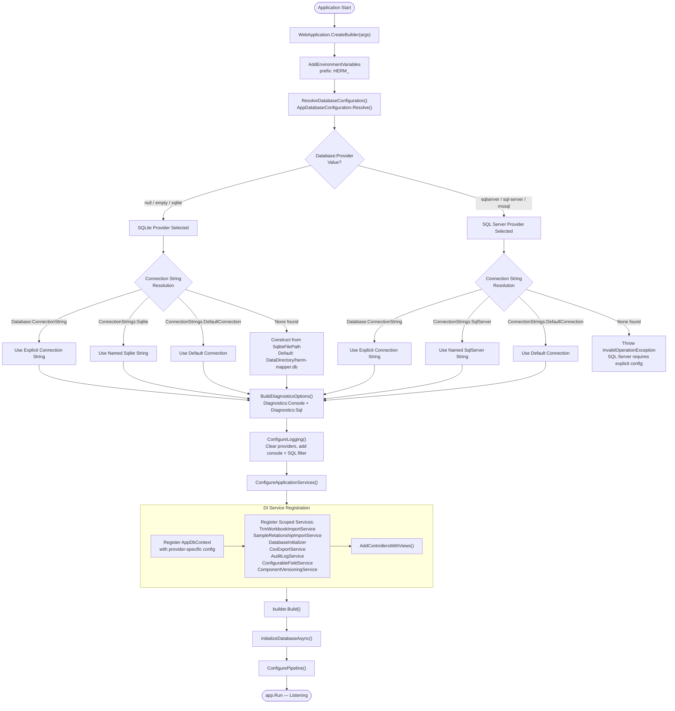

### 4.2.2 Database Initialization Workflow

The `DatabaseInitializer` service (registered as scoped in `Program.cs`) executes a multi-step initialization sequence at startup. This process ensures schema readiness, applies provider-specific repairs, migrates legacy data, seeds default values, and conditionally triggers first-run imports.

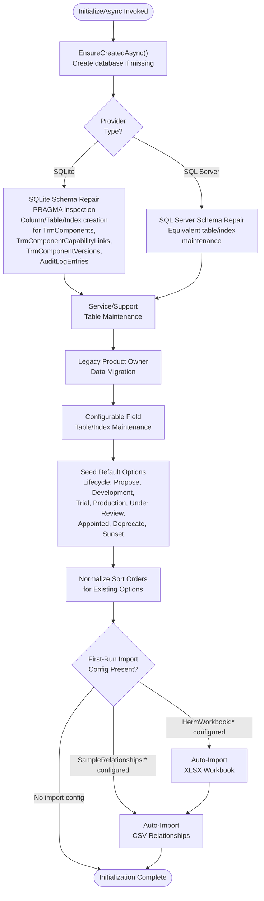

## 4.3 CORE BUSINESS PROCESS FLOWS

### 4.3.1 Product Catalog CRUD Workflow

The Product Catalog (F-002), implemented in `ProductsController.cs` (lines 1–593), provides full lifecycle management for technology products. Each operation follows a consistent pattern of model validation, entity persistence, owner synchronization, and audit logging via `AuditLogService`.

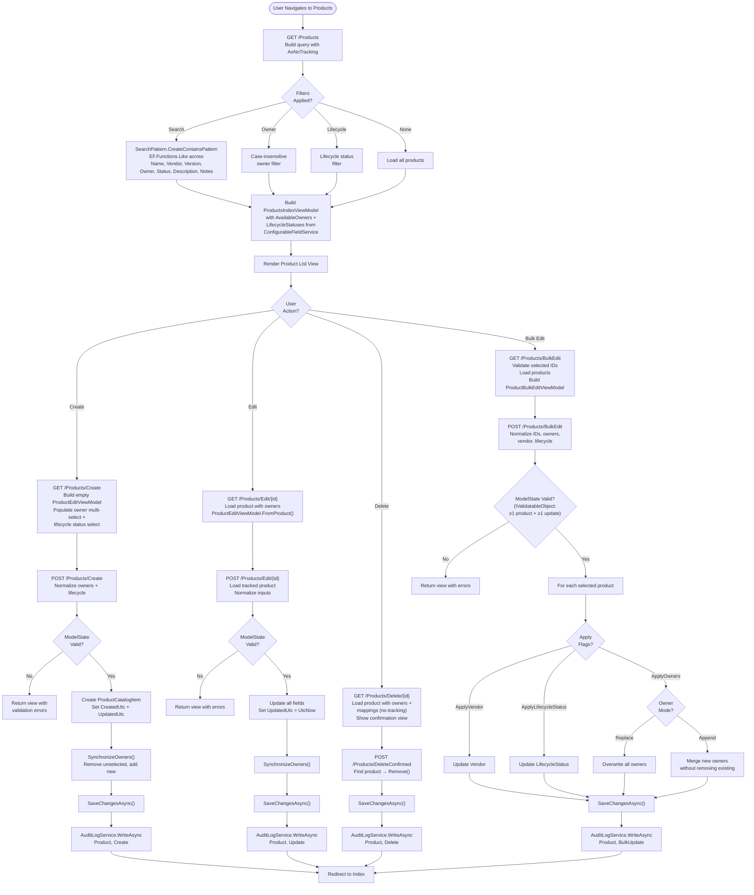

### 4.3.2 TRM Reference Management Workflow

The TRM Reference feature (F-003), implemented in `ReferenceController.cs` (lines 1–322), manages the three-level Domain → Capability → Component hierarchy. It supports catalogue browsing, XLSX workbook import with staged verification, soft-delete/restore of components, and version history tracking via `ComponentVersioningService`.

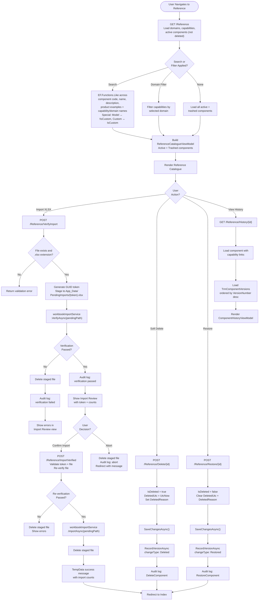

### 4.3.3 Product-to-TRM Mapping Workflow

The Mapping Board (F-004), implemented in `MappingsController.cs` (lines 1–730), represents the application's core feature — linking technology products to TRM hierarchy elements through a structured four-stage status workflow. This controller contains the most complex validation logic in the system, including hierarchy consistency checks, custom component resolution, and dependent dropdown cascading.

#### Mapping Board and Create/Edit Flow

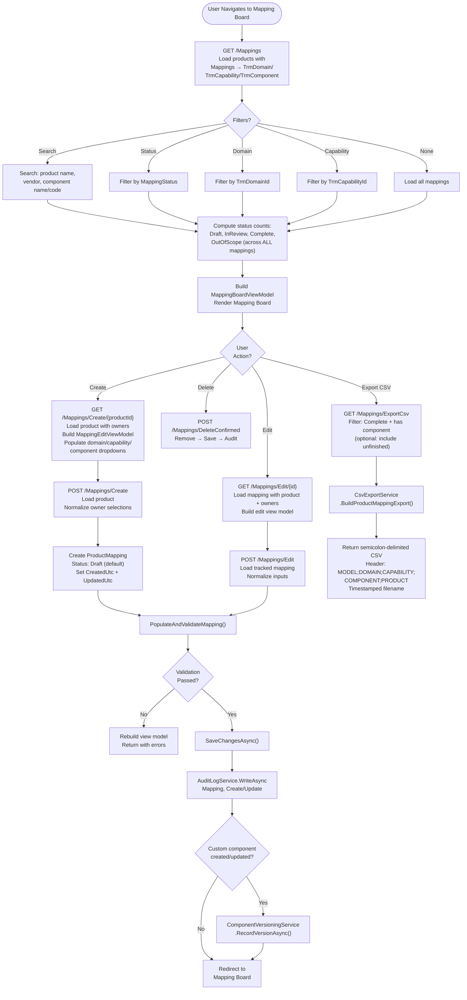

#### PopulateAndValidateMapping Decision Tree

This is the critical validation logic (lines 313–450 of `MappingsController.cs`) that enforces hierarchy consistency, handles custom component resolution, and validates mapping completeness rules.

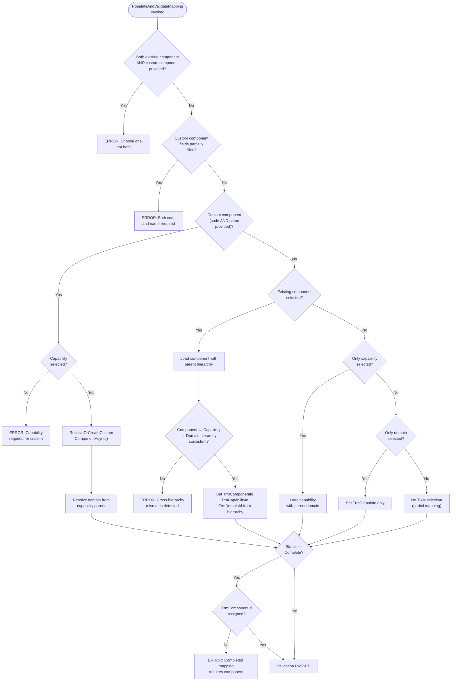

#### Custom Component Resolution Logic

The `ResolveOrCreateCustomComponentAsync` method (lines 581–646 of `MappingsController.cs`) resolves or creates custom TRM components during mapping operations.

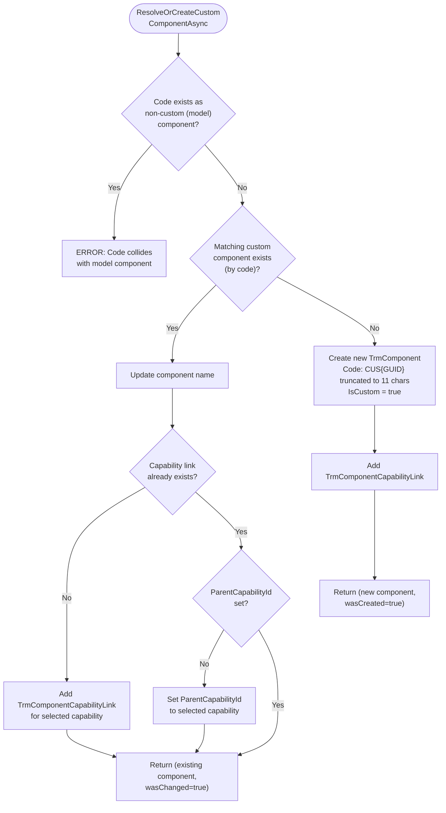

#### Dependent Dropdown Cascade

The mapping form implements cascading dropdown selection via JSON endpoints in `MappingsController.cs`, enabling domain → capability → component hierarchical selection.

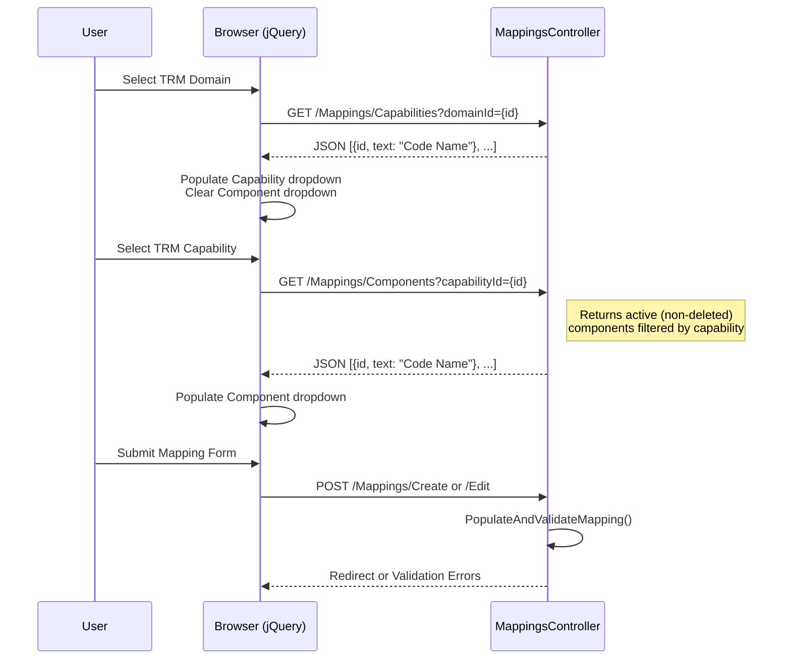

### 4.3.4 Service Catalog Workflow

The Service Catalog (F-005), implemented in `ServicesController.cs` (lines 1–449), manages organizational services composed of linked technology products. Each service requires a minimum of two unique products, enforced through custom validation on `ServiceEditViewModel`.

```mermaid
flowchart TD
    Entry([User Navigates to Services]) --> IndexLoad["GET /Services<br/>Search, filter, sort services"]
    IndexLoad --> SortOptions{"Sort<br/>Option?"}
    SortOptions -->|Name/NameDesc| SortName["Sort by Name"]
    SortOptions -->|Owner| SortOwner["Sort by Owner"]
    SortOptions -->|Lifecycle| SortLC["Sort by LifecycleStatus"]
    SortOptions -->|ProductCountDesc| SortPC["Sort by linked product count"]
    SortOptions -->|UpdatedAsc/UpdatedDesc| SortDate["Sort by UpdatedUtc<br/>(default: desc)"]

    SortName --> RenderList["Render ServicesIndexViewModel"]
    SortOwner --> RenderList
    SortLC --> RenderList
    SortPC --> RenderList
    SortDate --> RenderList

    RenderList --> SvcAction{"User<br/>Action?"}

    SvcAction -->|Create| SvcCreateGET["GET /Services/Create<br/>Ensure ≥ 2 editable product rows<br/>Populate owner/lifecycle options"]
    SvcAction -->|Edit| SvcEditGET["GET /Services/Edit/{id}<br/>Load service with product links<br/>Ensure ≥ 2 editable rows"]
    SvcAction -->|Visualize| SvcViz["GET /Services/Visualize/{id}<br/>Load ordered product links<br/>Build sequential connections"]
    SvcAction -->|Delete| SvcDeleteGET["GET /Services/Delete/{id}<br/>Show confirmation view"]

    SvcCreateGET --> SvcPOST["POST /Services/Create or Edit"]
    SvcEditGET --> SvcPOST

    SvcPOST --> ValidateProducts["ValidateSelectedProductsAsync()<br/>Verify product IDs exist in DB"]
    ValidateProducts --> CustomValidate{"ServiceEditViewModel<br/>Validation:<br/>≥ 2 unique products?"}
    CustomValidate -->|No| SvcErrors["Return view<br/>with errors"]
    CustomValidate -->|Yes| SyncLinks["SynchronizeProductLinks()<br/>Update existing, add new,<br/>remove excess links<br/>Maintain SortOrder"]
    SyncLinks --> SaveSvc["SaveChangesAsync()"]
    SaveSvc --> AuditSvc["AuditLogService.WriteAsync<br/>Service, Create/Update"]
    AuditSvc --> RedirectSvcIndex["Redirect to Index"]

    SvcDeleteGET --> SvcDeletePOST["POST /Services/DeleteConfirmed"]
    SvcDeletePOST --> RemoveSvc["Remove service + links"]
    RemoveSvc --> SaveSvcDel["SaveChangesAsync()"]
    SaveSvcDel --> AuditSvcDel["AuditLogService.WriteAsync<br/>Service, Delete"]
    AuditSvcDel --> RedirectSvcIndex
```

## 4.4 IMPORT/EXPORT WORKFLOWS

### 4.4.1 XLSX TRM Workbook Import

The XLSX TRM Workbook Import is the primary mechanism for loading TRM reference data, implemented in `TrmWorkbookImportService.cs` (lines 1–624). The process involves ZIP archive parsing, XML worksheet extraction, snapshot construction, verification, and upsert operations with many-to-many capability link management.

```mermaid
flowchart TD
    Start([XLSX Import Initiated]) --> OpenZIP["Open XLSX as ZIP archive"]
    OpenZIP --> LoadShared["Parse shared strings XML"]
    LoadShared --> LoadSheets["Parse workbook.xml + relationships<br/>Build sheet lookup"]
    LoadSheets --> ParseWS["Parse three required worksheets"]

    subgraph WorksheetParsing["Worksheet Extraction"]
        WS1["TRM Domain<br/>worksheet"]
        WS2["TRM Capability<br/>worksheet"]
        WS3["TRM Component<br/>worksheet"]
    end

    ParseWS --> WorksheetParsing
    WorksheetParsing --> BuildSnapshot["Build in-memory snapshot"]
    BuildSnapshot --> ValidateSnapshot["ValidateSnapshot()"]

    subgraph SnapshotValidation["Validation Checks"]
        ChkDupCodes["Check duplicate codes<br/>within each entity type"]
        ChkMissNames["Check missing names"]
        ChkParentRefs["Check parent references:<br/>capabilities → domains<br/>components → capabilities"]
        ChkDupCodes --> ChkMissNames --> ChkParentRefs
    end

    ValidateSnapshot --> SnapshotValidation

    SnapshotValidation --> CompareDB["Compare against existing<br/>database entities"]
    CompareDB --> ComputeCounts["Compute add/update<br/>counts per entity type"]
    ComputeCounts --> ReturnVerify["Return TrmWorkbook<br/>VerificationResult"]

    ReturnVerify --> VerifyOK{"Verification<br/>passed?"}
    VerifyOK -->|No| ReportErrors["Report errors to user"]
    VerifyOK -->|Yes| ConfirmImport["User confirms import"]

    ConfirmImport --> ReVerify["Re-open and re-verify<br/>XLSX file"]
    ReVerify --> ReVerifyOK{"Re-verification<br/>passed?"}
    ReVerifyOK -->|No| FailImport["Abort: delete file<br/>show errors"]
    ReVerifyOK -->|Yes| UpsertStart["Begin UpsertSnapshotAsync()"]

    subgraph UpsertProcess["Upsert Sequence"]
        UpsertDomains["Upsert Domains<br/>Match by Code (case-insensitive)<br/>Update existing or create new<br/>SaveChangesAsync()"]
        UpsertCaps["Upsert Capabilities<br/>Match by Code<br/>Resolve parent domain by code<br/>Update or create<br/>SaveChangesAsync()"]
        UpsertComps["Upsert Components<br/>Match by Code<br/>Resolve parent capability IDs<br/>Update fields, sync capability links<br/>Reset IsCustom=false for existing<br/>Create new with capability links<br/>SaveChangesAsync()"]
        UpsertDomains --> UpsertCaps --> UpsertComps
    end

    UpsertStart --> UpsertProcess
    UpsertProcess --> RecordVersions["Record version history for all<br/>added/changed components via<br/>ComponentVersioningService"]
    RecordVersions --> AuditSummary["Write audit log summary"]
    AuditSummary --> ImportDone([Import Complete])
```

### 4.4.2 CSV Product Relationship Import

The CSV Product Relationship Import, implemented in `SampleRelationshipImportService.cs` (lines 1–646), ingests product-to-TRM mapping data from semicolon-delimited CSV files. The service uses a sophisticated entity resolution strategy combining code, name, and title matching with regex-based normalization.

```mermaid
flowchart TD
    Start([CSV Import Initiated]) --> ValidateFile["Validate file exists"]
    ValidateFile --> ReadHeader["Read header line"]
    ReadHeader --> ValidateHeader{"Header matches<br/>MODEL;DOMAIN;CAPABILITY;<br/>COMPONENT;PRODUCT?"}
    ValidateHeader -->|No| HeaderError["Return header<br/>validation error"]
    ValidateHeader -->|Yes| LoadEntities["Load all TRM entities +<br/>existing products/mappings<br/>for reference resolution"]
    LoadEntities --> ProcessRows["Process each data row"]

    subgraph RowProcessing["Per-Row Processing"]
        CheckColumns{"≥ 5 columns and<br/>non-empty product?"}
        CheckColumns -->|No| SkipRow["Skip row"]
        CheckColumns -->|Yes| TrackProduct{"Product<br/>exists?"}
        TrackProduct -->|New| MarkNewProduct["Track as new product"]
        TrackProduct -->|Existing| MarkExisting["Track as existing"]
        MarkNewProduct --> ResolveMapping
        MarkExisting --> ResolveMapping

        ResolveMapping["TryResolveValidatedMapping()"]
        ResolveMapping --> ResolveDomain["Resolve domain using<br/>ResolveByCodeNameOrTitle()<br/>code/name/title + regex"]
        ResolveDomain --> ResolveCap["Resolve capability<br/>under resolved domain"]
        ResolveCap --> ResolveComp["Resolve component<br/>under resolved capability"]
        ResolveComp --> DupCheck{"Duplicate mapping<br/>detected via<br/>composite key?"}
        DupCheck -->|Yes| MarkDuplicate["Mark: Skip Duplicate"]
        DupCheck -->|No| Categorize{"Categorize row"}
    end

    ProcessRows --> RowProcessing

    Categorize -->|Product + Mapping resolved| CatAdd["Add Product + Mapping"]
    Categorize -->|Mapping only resolved| CatMapping["Add Mapping"]
    Categorize -->|Product only| CatProduct["Add Product Only"]
    Categorize -->|Existing, no new mapping| CatKeep["Keep Product Only"]
    Categorize -->|Resolution failed| CatSkip["Skipped"]

    CatAdd --> BuildResult
    CatMapping --> BuildResult
    CatProduct --> BuildResult
    CatKeep --> BuildResult
    CatSkip --> BuildResult
    MarkDuplicate --> BuildResult
    SkipRow --> BuildResult

    BuildResult["Build ProductRelationship<br/>VerificationResult with<br/>per-row status indicators"] --> VerifyDone([Verification Complete])

    VerifyDone --> UserConfirm["User confirms import"]
    UserConfirm --> ImportExec["Import Execution"]

    subgraph ImportExecution["Import Phase"]
        ImpValidate["Re-validate header"]
        ImpLoad["Load all TRM/product entities"]
        ImpRows["For each row:<br/>Resolve or create product<br/>Resolve mapping<br/>Skip duplicates"]
        ImpCreate["Create ProductMapping<br/>Status: Complete"]
        ImpSave["SaveChangesAsync()"]
        ImpValidate --> ImpLoad --> ImpRows --> ImpCreate --> ImpSave
    end

    ImportExec --> ImportExecution
    ImportExecution --> ImportComplete([Import Complete])
```

### 4.4.3 CSV Mapping Export

The CSV Mapping Export, implemented through `CsvExportService.cs` and triggered from `MappingsController.cs`, generates a semicolon-delimited file of filtered product-to-TRM mapping data for downstream consumption by external analytics tools.

```mermaid
flowchart TD
    Start([User Requests CSV Export]) --> BuildQuery["Build filtered mapping query<br/>Default: Complete + has component"]
    BuildQuery --> IncludeUnfinished{"Include<br/>unfinished?"}
    IncludeUnfinished -->|Yes| AllMappings["Include all status mappings"]
    IncludeUnfinished -->|No| CompletedOnly["Filter: Complete only"]

    AllMappings --> Delegate
    CompletedOnly --> Delegate

    Delegate["Delegate to CsvExportService<br/>.BuildProductMappingExport()"]
    Delegate --> WriteHeader["Write header:<br/>MODEL;DOMAIN;CAPABILITY;<br/>COMPONENT;PRODUCT"]
    WriteHeader --> ForEachMapping["For each mapping record"]
    ForEachMapping --> ResolveHierarchy["Resolve domain/capability<br/>paths from component<br/>parent chain"]
    ResolveHierarchy --> FormatFields["MODEL = HERM literal<br/>Quote and escape all fields"]
    FormatFields --> WriteRow["Write semicolon-delimited row"]
    WriteRow --> ForEachMapping
    WriteRow --> ReturnFile["Return as file download<br/>Timestamped filename"]
    ReturnFile --> Done([Export Complete])
```

## 4.5 STATE TRANSITION DIAGRAMS

### 4.5.1 Mapping Status State Machine

The mapping status workflow is the primary state machine in the system, defined in `Models/MappingStatus.cs` with four sequential integer states. The transition from any non-Complete state to Complete requires a TRM component to be assigned, as enforced by `PopulateAndValidateMapping()` in `MappingsController.cs`.

```mermaid
stateDiagram-v2
    [*] --> Draft : Mapping Created (default)

    Draft --> InReview : Status changed to InReview
    Draft --> Complete : Status changed to Complete\n[Requires TrmComponentId]
    Draft --> OutOfScope : Status changed to OutOfScope

    InReview --> Draft : Status reverted to Draft
    InReview --> Complete : Status changed to Complete\n[Requires TrmComponentId]
    InReview --> OutOfScope : Status changed to OutOfScope

    Complete --> Draft : Status reverted to Draft
    Complete --> InReview : Status changed to InReview
    Complete --> OutOfScope : Status changed to OutOfScope

    OutOfScope --> Draft : Status reverted to Draft
    OutOfScope --> InReview : Status changed to InReview
    OutOfScope --> Complete : Status changed to Complete\n[Requires TrmComponentId]

    note right of Draft
        Integer value: 0
        Default for new mappings
    end note

    note right of InReview
        Integer value: 1
        Under review by stakeholders
    end note

    note right of Complete
        Integer value: 2
        GUARD: TrmComponentId must not be null
        Included in Reports (F-006) and CSV Export
    end note

    note right of OutOfScope
        Integer value: 3
        Excluded from active reporting
    end note
```

### 4.5.2 TRM Component Lifecycle

TRM Components follow a soft-delete lifecycle pattern, preserving referential integrity with existing mappings. The `SetNull` delete behavior on `ProductMapping` foreign keys ensures that when a component is hard-deleted from the taxonomy, existing mappings are preserved with null references rather than being cascade-deleted.

```mermaid
stateDiagram-v2
    [*] --> Active : Component created\n(via import or custom)

    Active --> SoftDeleted : Soft-delete\nIsDeleted=true\nDeletedUtc set\nDeletedReason recorded
    SoftDeleted --> Active : Restore\nIsDeleted=false\nDeletedUtc cleared\nDeletedReason cleared

    Active --> Active : Updated via\nXLSX re-import\nor manual edit

    state Active {
        [*] --> ModelComponent : IsCustom=false\n(from XLSX import)
        [*] --> CustomComponent : IsCustom=true\n(from mapping form)
        CustomComponent --> ModelComponent : XLSX import resets\nIsCustom=false
    }

    note right of SoftDeleted
        Excluded from:
        - Active component counts
        - Dropdown selections
        - Dashboard KPIs
        Visible in trashed view
        Ordered by DeletedUtc desc
    end note

    note right of Active
        Every state change triggers:
        - ComponentVersioningService.RecordVersionAsync()
        - AuditLogService.WriteAsync()
    end note
```

### 4.5.3 Import File Staging Lifecycle

Both XLSX and CSV import workflows follow an identical three-phase staging lifecycle. Files are isolated using GUID-based tokens under `App_Data/PendingImports/` and cleaned up deterministically on every terminal path.

```mermaid
stateDiagram-v2
    [*] --> Uploaded : User uploads file

    Uploaded --> Staged : Generate GUID token\nStage to App_Data/PendingImports/\n{type}/{token}.{ext}

    Staged --> Verified : VerifyAsync() passes\nCounts computed\nReview shown to user
    Staged --> Cleaned : VerifyAsync() fails\nFile deleted immediately

    Verified --> ReVerified : Re-verification passes\nbefore import execution
    Verified --> Cleaned : User aborts\nFile deleted

    ReVerified --> Imported : ImportAsync() succeeds\nFile deleted after import
    ReVerified --> Cleaned : Re-verification fails\nFile deleted

    Imported --> [*] : Success message\nRedirect to index

    Cleaned --> [*] : Error/abort message\nAudit log recorded
```

## 4.6 ERROR HANDLING FLOWCHARTS

### 4.6.1 Comprehensive Error Handling Flow

The application implements a multi-layered error handling strategy spanning model validation, entity existence checks, import processing, anti-forgery protection, and exception handling. The following diagram documents all error handling paths observed across the controller and service layers.

```mermaid
flowchart TD
    Request([Incoming HTTP Request]) --> AntiForge{"Anti-Forgery<br/>Token Valid?<br/>(All POST actions)"}
    AntiForge -->|No| ForgeReject["400 Bad Request<br/>Anti-forgery rejection"]
    AntiForge -->|Yes| ModelBind["ASP.NET Core<br/>Model Binding"]

    ModelBind --> DataAnnotations{"Data Annotation<br/>Validation Passed?<br/>(Required, MaxLength, etc.)"}
    DataAnnotations -->|No| ValidationErrors["ModelState errors<br/>Return view with errors"]
    DataAnnotations -->|Yes| CustomValidation{"Custom Validation<br/>(IValidatableObject)?"}
    CustomValidation -->|Fails| CustomErrors["ModelState errors<br/>ProductBulkEditViewModel:<br/>≥1 product + ≥1 update<br/>ServiceEditViewModel:<br/>≥2 unique products"]
    CustomValidation -->|Passes| ControllerAction["Execute Controller Action"]

    ControllerAction --> EntityLookup{"Entity Found<br/>in Database?"}
    EntityLookup -->|No| NotFound["Return NotFound()<br/>HTTP 404"]
    EntityLookup -->|Yes| BusinessLogic["Execute Business Logic"]

    BusinessLogic --> MappingValidation{"Mapping-Specific<br/>Validation?"}
    MappingValidation -->|Both custom + existing| ErrorDual["Error: Choose one, not both"]
    MappingValidation -->|Partial custom fields| ErrorPartialCustom["Error: Both code<br/>and name required"]
    MappingValidation -->|Hierarchy mismatch| ErrorHierarchy["Error: Domain/capability/<br/>component inconsistency"]
    MappingValidation -->|Complete without component| ErrorComplete["Error: Component required<br/>for Complete status"]
    MappingValidation -->|Custom code collision| ErrorCollision["Error: Code matches<br/>model component"]
    MappingValidation -->|Valid| Persist["Persist to database"]

    Persist --> SaveSuccess{"SaveChangesAsync()<br/>Succeeded?"}
    SaveSuccess -->|Yes| AuditWrite["Write audit log entry"]
    SaveSuccess -->|No| DBError["Database error<br/>Exception propagated"]
    AuditWrite --> SuccessResponse["Success: Redirect<br/>or TempData message"]
```

### 4.6.2 Import Error Handling and Recovery

The import services implement defensive error handling with specific exception types caught during XLSX verification. Recovery is deterministic — staged files are always cleaned up regardless of the failure point.

```mermaid
flowchart TD
    ImportStart([Import Process Begins]) --> FileValidation{"File exists and<br/>correct extension?"}
    FileValidation -->|No| FileError["Return file<br/>validation error"]

    FileValidation -->|Yes| StageFile["Stage file with<br/>GUID token"]
    StageFile --> TryVerify["Try verification"]

    TryVerify --> ExceptionCheck{"Exception<br/>thrown?"}
    ExceptionCheck -->|InvalidOperationException| OpError["XLSX structure error<br/>Delete staged file<br/>Show error message"]
    ExceptionCheck -->|IOException| IOError["File I/O error<br/>Delete staged file<br/>Show error message"]
    ExceptionCheck -->|InvalidDataException| DataError["Corrupted XLSX data<br/>Delete staged file<br/>Show error message"]
    ExceptionCheck -->|None| VerifyResult{"Verification<br/>errors found?"}
    VerifyResult -->|Yes| LogicError["Validation errors<br/>(duplicates, missing refs)<br/>Delete staged file<br/>Show detailed errors"]
    VerifyResult -->|No| ShowReview["Show review page<br/>File remains staged"]

    ShowReview --> UserChoice{"User<br/>choice?"}
    UserChoice -->|Import| ReVerify["Re-verify file"]
    UserChoice -->|Abort| AbortClean["Delete staged file<br/>Audit log: abort"]

    ReVerify --> ReVerifyOK{"Re-verify<br/>passed?"}
    ReVerifyOK -->|No| ReVerifyFail["Delete staged file<br/>Show new errors"]
    ReVerifyOK -->|Yes| RunImport["Execute import"]
    RunImport --> ImportResult{"Import<br/>successful?"}
    ImportResult -->|Yes| SuccessClean["Delete staged file<br/>Success message"]
    ImportResult -->|No| FailClean["Delete staged file<br/>Error message"]

    SuccessClean --> Done([Complete])
    FailClean --> Done
    AbortClean --> Done
    OpError --> Done
    IOError --> Done
    DataError --> Done
    LogicError --> Done
    ReVerifyFail --> Done
    FileError --> Done
```

## 4.7 CROSS-CUTTING PROCESS FLOWS

### 4.7.1 Audit Trail Process

Every create, update, and delete operation across the system's controllers invokes `AuditLogService.WriteAsync()` to record a persistent audit entry. The audit trail is a passive, append-only system with no pruning or archival mechanism — entries accumulate indefinitely in the `AuditLogEntries` table.

```mermaid
flowchart TD
    subgraph SourceControllers["Audit Event Sources"]
        ProductCtrl["ProductsController<br/>Create, Update,<br/>BulkUpdate, Delete"]
        MappingCtrl["MappingsController<br/>Create, Update, Delete<br/>+ Custom Component<br/>Create/Update"]
        ServiceCtrl["ServicesController<br/>Create, Update, Delete"]
        RefCtrl["ReferenceController<br/>VerifyImport,<br/>DeleteComponent,<br/>RestoreComponent"]
        ConfigCtrl["ConfigurationController<br/>VerifyCatalogue/Import/Abort,<br/>VerifyProduct/Import/Abort,<br/>Create/Reorder/Delete Option"]
    end

    ProductCtrl --> WriteAudit
    MappingCtrl --> WriteAudit
    ServiceCtrl --> WriteAudit
    RefCtrl --> WriteAudit
    ConfigCtrl --> WriteAudit

    WriteAudit["AuditLogService.WriteAsync()<br/>Parameters: category, action,<br/>entityType, entityId,<br/>summary, details"]
    WriteAudit --> CreateEntry["Create AuditLogEntry<br/>OccurredUtc = DateTime.UtcNow"]
    CreateEntry --> SaveEntry["SaveChangesAsync()<br/>(immediate persist)"]
    SaveEntry --> EntryStored["Entry stored in<br/>AuditLogEntries table<br/>(indexed on OccurredUtc)"]

    EntryStored --> ViewLog["ChangeLogController<br/>GET /ChangeLog"]
    ViewLog --> SearchLog{"Search<br/>applied?"}
    SearchLog -->|Yes| FilterLog["Filter: Contains() across<br/>Category, Action, EntityType,<br/>Summary, Details"]
    SearchLog -->|No| AllEntries["All entries"]
    FilterLog --> OrderCap["Order by OccurredUtc desc<br/>Take(250) cap"]
    AllEntries --> OrderCap
    OrderCap --> RenderLog["Render ChangeLogIndexViewModel<br/>(AsNoTracking for performance)"]
```

### 4.7.2 Component Versioning Process

The `ComponentVersioningService` captures snapshot-based version records whenever a TRM component is created, modified, imported, soft-deleted, or restored. Versioning is triggered from `ReferenceController`, `MappingsController` (for custom components), and `TrmWorkbookImportService`.

```mermaid
flowchart TD
    subgraph Triggers["Version Recording Triggers"]
        XLSXImport["XLSX Import<br/>(component added/changed)"]
        CustomComp["Custom Component<br/>Created/Updated<br/>via Mapping form"]
        SoftDel["Component<br/>Soft-Deleted"]
        Restore["Component<br/>Restored"]
    end

    XLSXImport --> RecordVersion
    CustomComp --> RecordVersion
    SoftDel --> RecordVersion
    Restore --> RecordVersion

    RecordVersion["RecordVersionAsync<br/>(componentId, changeType, details)"]
    RecordVersion --> LoadComp["Load component with<br/>CapabilityLinks → TrmCapability<br/>via AsNoTracking"]
    LoadComp --> CompExists{"Component<br/>found?"}
    CompExists -->|No| NoOp["No-op: silent return<br/>(no error thrown)"]
    CompExists -->|Yes| ComputeVersion["Compute next VersionNumber<br/>= max existing + 1<br/>(first version = 1)"]
    ComputeVersion --> FlattenCaps["Flatten capability codes/names<br/>into comma-separated strings"]
    FlattenCaps --> CreateSnapshot["Create TrmComponentVersion<br/>snapshot with all fields:<br/>Code, Name, Description,<br/>Comments, ProductExamples,<br/>IsDeleted, IsCustom,<br/>CapabilityCodes, CapabilityNames,<br/>ChangedUtc = UtcNow"]
    CreateSnapshot --> SaveVersion["SaveChangesAsync()"]
    SaveVersion --> Done([Version Recorded])
```

### 4.7.3 Reports and Visualization Data Pipeline

The Reports feature (F-006), implemented in `ReportsController.cs` (lines 1–365), executes a multi-stage data transformation pipeline that converts raw mapping data into hierarchical structures and Sankey diagram data. This is a read-only flow using `AsNoTracking` and `AsSplitQuery` for optimized performance.

```mermaid
flowchart TD
    Start([Report Generation]) --> QueryMappings["Query completed mappings<br/>MappingStatus == Complete<br/>TrmComponentId != null<br/>AsNoTracking + AsSplitQuery"]
    QueryMappings --> JoinHierarchy["Join full hierarchy:<br/>Product → Mapping →<br/>TrmComponent → TrmCapability<br/>→ TrmDomain"]

    JoinHierarchy --> BuildPaths["BuildPathsForMapping()<br/>For each mapping:"]

    subgraph PathExpansion["Path Expansion Logic"]
        CheckOwners{"Product has<br/>owners?"}
        CheckOwners -->|Yes| DupByOwner["Duplicate mapping<br/>per owner name"]
        CheckOwners -->|No| UnassignedOwner["Use label:<br/>Unassigned owner"]
        DupByOwner --> ResolveHierarchy["Resolve effective hierarchy:<br/>component → capability → domain<br/>with fallback paths"]
        UnassignedOwner --> ResolveHierarchy
    end

    BuildPaths --> PathExpansion
    PathExpansion --> SortPaths["Sort paths by:<br/>owner → domain →<br/>capability → component → product"]

    SortPaths --> LoadProducts["Load all products<br/>with owners"]
    LoadProducts --> LifecycleReport["Build lifecycle status report<br/>Group by status<br/>Calculate percentages"]

    LifecycleReport --> BuildHierarchy["BuildReportsHierarchy()<br/>5-level nested structure:<br/>Owner → Domain →<br/>Capability → Component →<br/>Product"]
    BuildHierarchy --> BuildSankeyNodes["BuildReportsSankeyNodes()<br/>Flat list with depth values:<br/>0=Owner, 1=Domain,<br/>2=Capability, 3=Component,<br/>4=Product"]
    BuildSankeyNodes --> BuildSankeyLinks["BuildReportsSankeyLinks()<br/>Link pairs with values:<br/>owner→domain, domain→capability,<br/>capability→component,<br/>component→product"]
    BuildSankeyLinks --> AssembleVM["Assemble ReportsViewModel<br/>Hierarchy + Sankey nodes/links<br/>+ Lifecycle rows + Paths"]
    AssembleVM --> RenderReport["Render report view<br/>owner-visualization.js renders<br/>SVG Sankey diagrams"]
    RenderReport --> Done([Report Displayed])
```

## 4.8 INTEGRATION SEQUENCE DIAGRAMS

### 4.8.1 External Data Exchange Flows

HERM-MAPPER-APP supports integration exclusively through file-based exchange mechanisms — no programmatic REST APIs are currently implemented (Constraint C-002). The following sequence diagram documents the complete data exchange lifecycle between external systems and the application.

```mermaid
sequenceDiagram
    participant ExtSystem as External System<br/>(XLSX/CSV Source)
    participant Admin as Administrator
    participant ConfigCtrl as ConfigurationController
    participant RefCtrl as ReferenceController
    participant ImportSvc as Import Services
    participant DB as AppDbContext<br/>(SQLite / SQL Server)
    participant MapCtrl as MappingsController
    participant ExportSvc as CsvExportService
    participant ExtAnalytics as External Analytics<br/>(CSV Consumer)

    Note over ExtSystem, DB: ── INBOUND: XLSX TRM Workbook Import ──
    ExtSystem->>Admin: Provide XLSX workbook<br/>(TRM Domain/Capability/Component sheets)
    Admin->>RefCtrl: POST /Reference/VerifyImport (file upload)
    RefCtrl->>RefCtrl: Validate .xlsx extension
    RefCtrl->>RefCtrl: Stage file: App_Data/PendingImports/{GUID}.xlsx
    RefCtrl->>ImportSvc: TrmWorkbookImportService.VerifyAsync()
    ImportSvc->>ImportSvc: Parse ZIP → XML → Snapshot
    ImportSvc->>DB: Compare snapshot vs existing entities
    ImportSvc-->>RefCtrl: VerificationResult (counts + errors)
    RefCtrl-->>Admin: Show Import Review page

    Admin->>RefCtrl: POST /Reference/ImportVerified (confirm)
    RefCtrl->>ImportSvc: Re-verify + ImportAsync()
    ImportSvc->>DB: Upsert Domains → Capabilities → Components
    ImportSvc->>DB: Sync capability links
    ImportSvc->>DB: Record component versions
    ImportSvc->>DB: Write audit log
    ImportSvc-->>RefCtrl: Import summary
    RefCtrl->>RefCtrl: Delete staged file
    RefCtrl-->>Admin: Success message with counts

    Note over ExtSystem, DB: ── INBOUND: CSV Product Relationship Import ──
    ExtSystem->>Admin: Provide CSV file<br/>(MODEL;DOMAIN;CAPABILITY;COMPONENT;PRODUCT)
    Admin->>ConfigCtrl: POST /Configuration/VerifyProductImport
    ConfigCtrl->>ImportSvc: SampleRelationshipImportService.VerifyAsync()
    ImportSvc->>DB: Resolve TRM/product references
    ImportSvc-->>ConfigCtrl: VerificationResult (per-row statuses)
    ConfigCtrl-->>Admin: Show Import Review

    Admin->>ConfigCtrl: POST /Configuration/ImportProducts
    ConfigCtrl->>ImportSvc: Re-verify + ImportAsync()
    ImportSvc->>DB: Create products + mappings (Status: Complete)
    ImportSvc-->>ConfigCtrl: Import summary
    ConfigCtrl-->>Admin: Success message

    Note over MapCtrl, ExtAnalytics: ── OUTBOUND: CSV Mapping Export ──
    Admin->>MapCtrl: GET /Mappings/ExportCsv
    MapCtrl->>ExportSvc: BuildProductMappingExport()
    ExportSvc->>DB: Query filtered mappings
    ExportSvc->>ExportSvc: Resolve hierarchy paths<br/>MODEL=HERM, quote/escape fields
    ExportSvc-->>MapCtrl: CSV byte stream
    MapCtrl-->>Admin: File download (timestamped)
    Admin->>ExtAnalytics: Forward CSV for analysis
```

### 4.8.2 Internal Data Flow Integration

The following diagram documents internal data flow chains between system components, illustrating how data moves through the application's service layer and how features depend on each other's outputs.

```mermaid
flowchart TD
    subgraph DataSources["Data Input Sources"]
        XLSXFile["XLSX Workbook<br/>(External)"]
        CSVFile["CSV Relationship File<br/>(External)"]
        UserInput["User Form Input<br/>(Browser)"]
        EnvConfig["Environment Variables<br/>(HERM_ prefix)"]
    end

    subgraph CoreEntities["Core Data Entities (AppDbContext)"]
        TrmData["TRM Hierarchy<br/>Domains → Capabilities<br/>→ Components"]
        ProductData["Product Catalog<br/>Items + Owners"]
        MappingData["Product Mappings<br/>(Status Workflow)"]
        ServiceData["Service Catalog<br/>+ Product Links"]
        ConfigData["Configurable Options<br/>(Owner, LifecycleStatus)"]
    end

    subgraph Outputs["Data Outputs"]
        DashKPIs["Dashboard KPIs<br/>(F-001)"]
        ReportsViz["Reports + Sankey<br/>(F-006)"]
        CSVExportOut["CSV Export File<br/>(F-010)"]
        AuditTrail["Audit Log Entries<br/>(F-008)"]
        VersionHist["Component Versions<br/>(F-009)"]
    end

    XLSXFile -->|"TrmWorkbookImportService"| TrmData
    CSVFile -->|"SampleRelationshipImportService"| ProductData
    CSVFile -->|"SampleRelationshipImportService"| MappingData
    UserInput -->|"ProductsController"| ProductData
    UserInput -->|"MappingsController"| MappingData
    UserInput -->|"ServicesController"| ServiceData
    UserInput -->|"ConfigurationController"| ConfigData
    EnvConfig -->|"Program.cs startup"| CoreEntities

    ConfigData -->|"ConfigurableFieldService<br/>dropdown population"| ProductData
    ConfigData -->|"ConfigurableFieldService"| MappingData
    ConfigData -->|"ConfigurableFieldService"| ServiceData
    TrmData -->|"Hierarchy selection"| MappingData
    ProductData -->|"Product references"| MappingData
    ProductData -->|"Product links"| ServiceData

    ProductData --> DashKPIs
    TrmData --> DashKPIs
    MappingData --> DashKPIs
    MappingData -->|"Complete mappings only"| ReportsViz
    ProductData --> ReportsViz
    TrmData --> ReportsViz
    MappingData -->|"CsvExportService"| CSVExportOut

    ProductData -->|"All CUD ops"| AuditTrail
    MappingData -->|"All CUD ops"| AuditTrail
    ServiceData -->|"All CUD ops"| AuditTrail
    TrmData -->|"Import/Delete/Restore"| AuditTrail
    ConfigData -->|"All CUD ops"| AuditTrail

    TrmData -->|"ComponentVersioningService"| VersionHist
```

## 4.9 DASHBOARD AND REPORTING WORKFLOW

### 4.9.1 Dashboard KPI Computation

The Dashboard (F-001), implemented in `HomeController.cs` (lines 1–32), serves as the application entry point. It computes aggregate KPIs through direct `AppDbContext` queries with no caching layer, meaning all values reflect current database state on every page load.

```mermaid
flowchart TD
    Load([User Accesses Dashboard]) --> QueryProducts["Count ProductCatalogItem<br/>→ ProductCount"]
    QueryProducts --> QueryMappings["Count ProductMapping<br/>where Status == Complete<br/>→ CompletedMappings"]
    QueryMappings --> QueryComponents["Count TrmComponent<br/>where !IsDeleted<br/>→ ReferenceComponentCount"]
    QueryComponents --> QueryDomains["Count TrmDomain → DomainCount<br/>Count TrmCapability → CapabilityCount"]
    QueryDomains --> QueryRefModel["TrmDomains.AnyAsync()<br/>→ HasReferenceModel"]
    QueryRefModel --> QueryRecent["Load 6 most recently<br/>updated products<br/>with mappings + component context<br/>→ RecentProducts"]
    QueryRecent --> BuildDashVM["Build HomeDashboardViewModel"]
    BuildDashVM --> RenderDash["Render Dashboard View"]
    RenderDash --> CheckRef{"HasReferenceModel<br/>== true?"}
    CheckRef -->|No| PromptSetup["Prompt admin to<br/>import TRM reference data"]
    CheckRef -->|Yes| ShowKPIs["Display full<br/>KPI dashboard"]
```

## 4.10 CONFIGURABLE OPTIONS MANAGEMENT

### 4.10.1 Administrative Options CRUD Flow

The Administrative Configuration (F-007), implemented in `ConfigurationController.cs` (lines 1–458), provides runtime management of dropdown field options for `Owner` and `LifecycleStatus` fields. These options propagate to product, mapping, and service forms through `ConfigurableFieldService`.

```mermaid
flowchart TD
    Entry([Admin Navigates to Configuration]) --> LoadConfig["Load ConfigurableFieldOptions<br/>grouped by FieldName"]
    LoadConfig --> RenderConfig["Render ConfigurationIndexViewModel<br/>Owner options + LifecycleStatus options"]

    RenderConfig --> ConfigAction{"Admin<br/>Action?"}

    ConfigAction -->|Add Option| AddOpt["POST /Configuration/AddOption"]
    ConfigAction -->|Reorder| ReorderOpt["POST /Configuration/UpdateOptionOrder"]
    ConfigAction -->|Delete| DeleteOpt["POST /Configuration/DeleteOption"]

    AddOpt --> TrimFields["Trim field name<br/>and value"]
    TrimFields --> ValidateField{"Supported field?<br/>(Owner or<br/>LifecycleStatus)"}
    ValidateField -->|No| FieldError["Return error:<br/>unsupported field"]
    ValidateField -->|Yes| CheckUnique{"Value unique<br/>for field?"}
    CheckUnique -->|No| DupError["Return error:<br/>duplicate value"]
    CheckUnique -->|Yes| CreateOption["Create ConfigurableFieldOption<br/>SortOrder = next in sequence"]
    CreateOption --> SaveOpt["SaveChangesAsync()"]
    SaveOpt --> AuditOpt["Audit log: Create option"]
    AuditOpt --> RefreshConfig["Redirect to Configuration"]

    ReorderOpt --> LoadOption["Load target option"]
    LoadOption --> LoadAllField["Load all options<br/>for same field"]
    LoadAllField --> Reposition["Remove from current position<br/>Re-insert at target position"]
    Reposition --> Normalize["Normalize sequential<br/>sort orders (0, 1, 2...)"]
    Normalize --> SaveReorder["SaveChangesAsync()"]
    SaveReorder --> AuditReorder["Audit log: Reorder"]
    AuditReorder --> RefreshConfig

    DeleteOpt --> FindOption["Find option by ID"]
    FindOption --> RemoveOption["Remove from DbContext"]
    RemoveOption --> SaveDel["SaveChangesAsync()"]
    SaveDel --> NormalizeDel["Normalize remaining<br/>sort orders"]
    NormalizeDel --> AuditDel["Audit log: Delete option"]
    AuditDel --> RefreshConfig
```

## 4.11 KEY DECISION POINTS SUMMARY

### 4.11.1 Decision Point Catalog

The following table consolidates all significant decision points identified across the system's process flows, documenting the decision context, available paths, and the validation or business rules that govern each branch.

| Decision Point | Location | Options | Governing Rule |
|---|---|---|---|
| Database Provider Selection | `Program.cs` startup via `AppDatabaseConfiguration.Resolve()` | SQLite (default) or SQL Server | `Database:Provider` config value; null/empty defaults to SQLite |
| Existing vs. Custom Component | `MappingsController.PopulateAndValidateMapping()` | Existing component or custom component (mutually exclusive) | Cannot provide both; custom requires capability selection |
| Mapping Completion Guard | `MappingsController.PopulateAndValidateMapping()` | Allow or reject status=Complete | `TrmComponentId` must not be null for Complete status |
| Import Re-verification | `ReferenceController` / `ConfigurationController` | Proceed with import or abort | Staged file must re-pass verification before import execution |
| CSV Row Resolution | `SampleRelationshipImportService` | Add product+mapping, add mapping, add product only, keep, skip duplicate, skip | Entity resolution via code/name/title matching with regex normalization |
| XLSX Entity Upsert | `TrmWorkbookImportService` | Insert new or update existing | Match by Code (case-insensitive); existing entities updated, new entities created |
| Bulk Edit Owner Mode | `ProductsController.BulkEdit()` | Replace (overwrite all) or Append (merge new) | `ApplyOwners` flag + owner mode selection |
| Owner Expansion in Reports | `ReportsController.BuildPathsForMapping()` | Duplicate by owner or use "Unassigned owner" | Products with owners get duplicated per owner; no owners → fallback label |
| Connection String Fallback | `AppDatabaseConfiguration.Resolve()` | Explicit string, named string, default, or constructed path | Priority chain with SQLite-specific file path construction fallback |
| Service Product Minimum | `ServicesController` via `ServiceEditViewModel` | Accept or reject service | `IValidatableObject` enforces minimum 2 unique products per service |

#### References

- `src/HERM-MAPPER-APP/Program.cs` — Application startup flow, DI registration, HTTP pipeline configuration
- `src/HERM-MAPPER-APP/Configuration/AppDatabaseConfiguration.cs` — Database provider resolution and connection string precedence
- `src/HERM-MAPPER-APP/Controllers/ProductsController.cs` — Product CRUD, bulk edit, owner synchronization workflows
- `src/HERM-MAPPER-APP/Controllers/MappingsController.cs` — Core mapping workflow, PopulateAndValidateMapping logic, custom component resolution, dependent dropdown endpoints, CSV export
- `src/HERM-MAPPER-APP/Controllers/ReferenceController.cs` — TRM reference catalogue, XLSX import staging, soft-delete/restore, version history
- `src/HERM-MAPPER-APP/Controllers/ServicesController.cs` — Service catalog CRUD, product link synchronization, visualization
- `src/HERM-MAPPER-APP/Controllers/ConfigurationController.cs` — Configuration management, staged import workflows for XLSX and CSV
- `src/HERM-MAPPER-APP/Controllers/ReportsController.cs` — Report generation, path expansion, Sankey node/link construction, lifecycle reporting
- `src/HERM-MAPPER-APP/Controllers/HomeController.cs` — Dashboard KPI aggregation
- `src/HERM-MAPPER-APP/Controllers/ChangeLogController.cs` — Audit log search, ordering, and result capping
- `src/HERM-MAPPER-APP/Services/TrmWorkbookImportService.cs` — XLSX ZIP parsing, worksheet extraction, snapshot validation, upsert logic, capability link sync
- `src/HERM-MAPPER-APP/Services/SampleRelationshipImportService.cs` — CSV verification, entity resolution, per-row categorization, import execution
- `src/HERM-MAPPER-APP/Services/CsvExportService.cs` — Semicolon-delimited CSV generation with hierarchy path resolution
- `src/HERM-MAPPER-APP/Services/AuditLogService.cs` — Audit entry creation and immediate persistence
- `src/HERM-MAPPER-APP/Services/ComponentVersioningService.cs` — Snapshot-based version recording with capability flattening
- `src/HERM-MAPPER-APP/Services/DatabaseInitializer.cs` — Schema repair, data migration, default seeding, first-run imports
- `src/HERM-MAPPER-APP/Services/ConfigurableFieldService.cs` — Runtime-configurable dropdown value provisioning
- `src/HERM-MAPPER-APP/Models/MappingStatus.cs` — Mapping status enum (Draft=0, InReview=1, Complete=2, OutOfScope=3)
- `src/HERM-MAPPER-APP/Models/ProductCatalogItem.cs` — Product entity with field constraints
- `src/HERM-MAPPER-APP/Models/TrmComponent.cs` — TRM component entity with soft-delete fields
- `src/HERM-MAPPER-APP/Models/ConfigurableFieldOption.cs` — Configurable field options with default lifecycle seeds
- `src/HERM-MAPPER-APP/Data/AppDbContext.cs` — EF Core entity registration, fluent API constraints, dual-provider support
- `src/HERM-MAPPER-APP/ViewModels/` — Presentation layer contracts including ProductBulkEditViewModel, ServiceEditViewModel with IValidatableObject

# 5. System Architecture

## 5.1 HIGH-LEVEL ARCHITECTURE

### 5.1.1 System Overview

HERM-MAPPER-APP is a **monolithic ASP.NET Core MVC web application** built on .NET 10 (LTS), designed for Technology Reference Model (TRM) mapping within the Enterprise Architecture Management domain. The application follows a traditional server-side rendered architecture with clearly defined layers organized within a single deployable project located at `src/HERM-MAPPER-APP/`.

#### Architecture Style and Rationale

The system adopts a **layered monolithic architecture** — all features are deployed as a single unit with no independent scaling of individual capabilities. This decision reflects the application's greenfield nature, single-tenant scope (Assumption A-001), and experimental status. The monolith minimizes operational complexity by eliminating inter-service communication, distributed tracing, and orchestration overhead that would be premature for a system of this scope.

The server-side rendering approach using Razor Views with jQuery for client-side interactivity (rather than a Single-Page Application framework) further reduces frontend complexity. All UI is rendered server-side, avoiding the need for a dedicated SPA build pipeline, client-side routing, or a separate API surface — a decision consistent with Constraint C-002, which states that no REST API is currently implemented.

#### Key Architectural Principles

The following principles, as evidenced across the codebase, govern the system's architectural design:

| Principle | Implementation Evidence |
|---|---|
| Convention-over-Configuration | ASP.NET Core defaults with `HERM_`-prefixed environment variable overrides (`Program.cs` line 8) |
| Dual-Database Provider Abstraction | `AppDatabaseConfiguration.Resolve()` in `Configuration/AppDatabaseConfiguration.cs` resolves SQLite or SQL Server at startup |
| Dependency Injection Throughout | All 7 services registered as Scoped in `Program.cs` lines 100–107 |
| Append-Only Audit Trail | `AuditLogService.WriteAsync()` invoked from all write-path controllers |
| Soft-Delete Pattern | TRM components support logical deletion with `IsDeleted`, `DeletedUtc`, and `DeletedReason` fields |
| Configurable Runtime Options | `ConfigurableFieldOption` entities enable runtime vocabulary changes without code deployments |
| Staged Import Workflows | XLSX/CSV imports follow a verify → review → import → cleanup lifecycle with GUID-based file isolation |

#### System Boundaries

The application defines clear boundaries between its internal layers and external interfaces. There are no programmatic API endpoints (Constraint C-002); all external integration occurs through file-based exchange mechanisms. The HTTP pipeline, configured in `Program.cs` lines 117–136, establishes the following middleware chain for request processing: exception handling and HSTS (non-development only), HTTPS redirection, routing, authorization middleware (invoked but with no authentication scheme registered per Constraint C-001), static asset serving, and the default MVC controller route pattern `{controller=Home}/{action=Index}/{id?}`.

### 5.1.2 Core Components

The application is organized into well-defined architectural layers, each with distinct responsibilities and dependency relationships. The table below summarizes each core component, its primary responsibility, and its integration points within the system.

| Component | Primary Responsibility | Key Dependencies |
|---|---|---|
| Controllers (8 files) | HTTP request orchestration, model binding, validation, and view rendering | `AppDbContext`, Services, ViewModels |
| Services (7 files) | Encapsulated business logic including audit logging, import/export, versioning, and field management | `AppDbContext` |
| AppDbContext (1 file) | EF Core data access layer with 12 `DbSet` properties, fluent API configuration for relationships, indexes, and delete behaviors | EF Core 10.0.0, SQLite or SQL Server provider |
| AppDatabaseConfiguration | Database provider resolution and connection string precedence logic | ASP.NET Core Configuration system |
| Domain Models (14 files) | Entity definitions for TRM hierarchy, products, mappings, services, audit log, and configurable options | None (POCOs) |
| ViewModels (18 files) | Presentation-layer contracts with data annotations and custom validation (`IValidatableObject`) | Domain Models |
| Razor Views (11 folders) | Server-rendered HTML templates with Bootstrap 5.3.3 layout and jQuery-powered interactivity | ViewModels, `_Layout.cshtml` |
| Static Assets (`wwwroot/`) | CSS, JavaScript (including custom SVG Sankey engine in `owner-visualization.js`), and vendored libraries | Bootstrap 5.3.3, jQuery 3.7.1 |
| Infrastructure (1 file) | `SearchPattern.CreateContainsPattern()` utility for SQL `LIKE` pattern generation | None |
| DatabaseInitializer | Startup database preparation: `EnsureCreatedAsync()`, provider-specific schema repair, seed defaults, conditional first-run import | `AppDbContext`, Provider detection |
| Deployment Script | Azure App Service provisioning, security configuration, build, ZIP deployment, and settings application | Azure CLI, .NET SDK, PowerShell |

```mermaid
flowchart TD
    subgraph Presentation["Presentation Layer"]
        Controllers["Controllers<br/>(8 MVC Controllers)"]
        Views["Razor Views<br/>(11 Folders)"]
        ViewModels["ViewModels<br/>(18 Files)"]
        StaticAssets["Static Assets<br/>(wwwroot/)"]
    end

    subgraph Business["Business Logic Layer"]
        AuditSvc["AuditLogService"]
        TrmImport["TrmWorkbookImportService"]
        CsvImport["SampleRelationshipImportService"]
        CsvExport["CsvExportService"]
        VersionSvc["ComponentVersioningService"]
        FieldSvc["ConfigurableFieldService"]
        DbInit["DatabaseInitializer"]
    end

    subgraph Data["Data Access Layer"]
        DbContext["AppDbContext<br/>(12 DbSets, Sealed)"]
    end

    subgraph Config["Configuration Layer"]
        AppDbConfig["AppDatabaseConfiguration<br/>(Provider Resolution)"]
    end

    subgraph Persistence["Persistence Layer"]
        SQLite["SQLite<br/>(Development)"]
        SQLServer["SQL Server<br/>(Production)"]
        FileStore["App_Data/<br/>PendingImports/"]
    end

    Controllers --> ViewModels
    Controllers --> Business
    Views --> ViewModels
    Views --> StaticAssets
    Business --> DbContext
    TrmImport --> FileStore
    CsvImport --> FileStore
    AppDbConfig --> DbContext
    DbContext --> SQLite
    DbContext --> SQLServer
```

### 5.1.3 Data Flow Description

Data flows through the system along well-defined paths, each governed by a specific controller and service combination. The following describes the primary data flows observed in the codebase.

#### Inbound Data Flows

**XLSX TRM Reference Import** — External XLSX workbooks containing the three-level TRM taxonomy (Domains, Capabilities, Components) enter the system through `ReferenceController`. The file is staged to `App_Data/PendingImports/{GUID}.xlsx`, verified by `TrmWorkbookImportService.VerifyAsync()` (which parses the ZIP → XML structure), presented to the user for review, and upon confirmation, imported via `ImportAsync()`. The import operation upserts domains, capabilities, and components; synchronizes capability links; records version history through `ComponentVersioningService`; writes audit log entries; and finally deletes the staged file.

**CSV Product Relationship Import** — Semicolon-delimited CSV files containing product-to-TRM relationship data enter through `ConfigurationController`. The same staged verification workflow applies: the file is staged with a GUID token, verified by `SampleRelationshipImportService.VerifyAsync()` (which resolves TRM and product references), reviewed by the user, and imported upon confirmation. The import creates missing product entities and product mappings with a status of Complete.

**User Form Input** — All CRUD operations for products, mappings, services, and configurable options flow through their respective controllers, undergo model binding, data annotation validation, and custom validation before persisting through `AppDbContext.SaveChangesAsync()`. Every write operation triggers an `AuditLogService.WriteAsync()` call.

#### Outbound Data Flows

**CSV Mapping Export** — The `MappingsController` delegates to `CsvExportService.BuildProductMappingExport()`, which queries filtered mappings, resolves the full TRM hierarchy path for each mapping, and produces a semicolon-delimited CSV with the header `MODEL;DOMAIN;CAPABILITY;COMPONENT;PRODUCT`. All field values are quoted and escaped.

**Dashboard KPIs** — `HomeController` performs direct `AppDbContext` count queries to compute aggregate metrics: total product count, completed mapping count, active component count, domain count, capability count, and the six most recently updated products.

**Reports and Visualization** — `ReportsController` executes a multi-stage read-only pipeline: querying completed mappings using `AsNoTracking()` and `AsSplitQuery()`, resolving hierarchy paths, expanding mappings by product owner, building lifecycle summaries, and constructing Sankey node/link collections rendered via `owner-visualization.js` in the browser.

#### Data Transformation Points

| Transformation | Location | Input → Output |
|---|---|---|
| XLSX ZIP → XML parsing | `TrmWorkbookImportService` | Binary .xlsx → worksheet XML → in-memory snapshots |
| Hierarchy path resolution | `CsvExportService`, `ReportsController` | Flat mapping entities → domain/capability/component path strings |
| Sankey node/link assembly | `ReportsController` | Hierarchical paths → flat node list with depth + link pairs with values |
| Owner expansion | `ReportsController` | Single mapping → one record per product owner |
| Search pattern generation | `SearchPattern.CreateContainsPattern()` | User search term → `%trimmed_term%` SQL LIKE pattern |

### 5.1.4 External Integration Points

HERM-MAPPER-APP supports integration exclusively through file-based and configuration-based mechanisms. No programmatic REST APIs exist (Constraint C-002).

| System | Integration Type | Data Exchange Pattern |
|---|---|---|
| External XLSX Source | File-based inbound | Staged upload → verify → review → import |
| External CSV Source | File-based inbound | Staged upload → verify → review → import |
| External Analytics Tools | File-based outbound | On-demand CSV download |
| Azure App Service | Deployment target | ZIP deployment via PowerShell + Azure CLI |
| Environment Config Systems | Configuration overlay | `HERM_`-prefixed env vars using `__` hierarchy convention |

---

## 5.2 COMPONENT DETAILS

### 5.2.1 Controllers — Presentation Orchestration

#### Purpose and Responsibilities

The eight controllers in `src/HERM-MAPPER-APP/Controllers/` serve as the HTTP request orchestration layer. Each controller handles model binding, input validation (data annotations and custom `IValidatableObject` logic), entity persistence coordination, audit log invocation, and view rendering. Controllers do not contain business logic directly; they delegate to services for complex operations.

#### Controller Inventory

| Controller | Primary Responsibility | Key Service Dependencies |
|---|---|---|
| `HomeController` | Dashboard aggregate KPIs and recent products | Direct `AppDbContext` queries |
| `ProductsController` | Product catalog CRUD, search, bulk edit, visualization | `AuditLogService`, `ConfigurableFieldService` |
| `MappingsController` | Mapping board, create/edit/delete, dependent dropdowns, CSV export | `CsvExportService`, `AuditLogService`, `ConfigurableFieldService`, `ComponentVersioningService` |
| `ReportsController` | Read-only reporting and Sankey visualization data construction | Direct `AppDbContext` queries (`AsNoTracking`, `AsSplitQuery`) |
| `ReferenceController` | TRM reference catalogue browsing, XLSX import staging, soft-delete/restore, version history | `TrmWorkbookImportService`, `AuditLogService`, `ComponentVersioningService` |
| `ConfigurationController` | Admin configuration, CSV import staging, configurable field CRUD | `SampleRelationshipImportService`, `AuditLogService`, `ConfigurableFieldService` |
| `ServicesController` | Service catalog CRUD, product linking, visualization | `AuditLogService`, `ConfigurableFieldService` |
| `ChangeLogController` | Audit log browsing and search (capped at 250 results) | Direct `AppDbContext` queries (`AsNoTracking`) |

#### Dependent Dropdown Cascade

The `MappingsController` provides three JSON endpoints to support hierarchical TRM selection in the mapping form. These endpoints enable domain → capability → component cascading without full page reloads:

```mermaid
sequenceDiagram
    participant Browser as Browser (jQuery)
    participant Server as MappingsController
    participant DB as AppDbContext

    Browser->>Server: GET /Mappings/Capabilities?domainId={id}
    Server->>DB: Query capabilities by domain
    DB-->>Server: Capability list
    Server-->>Browser: JSON [{id, text}, ...]
    Browser->>Browser: Populate Capability dropdown<br/>Clear Component dropdown

    Browser->>Server: GET /Mappings/Components?capabilityId={id}
    Server->>DB: Query active components by capability
    DB-->>Server: Component list (non-deleted)
    Server-->>Browser: JSON [{id, text}, ...]
    Browser->>Browser: Populate Component dropdown
```

### 5.2.2 Services — Business Logic Layer

#### Purpose and Responsibilities

The seven services in `src/HERM-MAPPER-APP/Services/` encapsulate all business logic, ensuring controllers remain thin orchestrators. All services are registered as **Scoped** in the DI container (`Program.cs` lines 100–107), meaning each HTTP request receives a fresh service instance sharing the same `AppDbContext` within that request scope.

#### Service Details

**AuditLogService** — Provides a single entry point, `WriteAsync(category, action, entityType, entityId, summary, details)`, for recording append-only audit entries. Each call stamps `OccurredUtc` with `DateTime.UtcNow` and immediately calls `SaveChangesAsync()`. This service is consumed by five of the eight controllers: `ProductsController`, `MappingsController`, `ServicesController`, `ReferenceController`, and `ConfigurationController`.

**ComponentVersioningService** — Captures snapshot-based version records for TRM components. When invoked via `RecordVersionAsync(componentId, changeType, details)`, it loads the component with its `CapabilityLinks`, computes the next version number (max existing + 1, starting at 1), flattens capability codes and names into comma-separated strings, and creates a `TrmComponentVersion` entity. Version triggers include XLSX import, custom component creation/update, soft-delete, and restore operations.

**ConfigurableFieldService** — Generates MVC `SelectList` items for configurable dropdown fields (Owner, LifecycleStatus). It queries `ConfigurableFieldOption` entities, performs case-insensitive deduplication, and preserves legacy values that may no longer appear in the current option configuration.

**CsvExportService** — Builds semicolon-delimited CSV content for mapping exports. The output format uses the fixed header `MODEL;DOMAIN;CAPABILITY;COMPONENT;PRODUCT`, with all field values quoted and escaped. The model identifier is always `HERM`.

**DatabaseInitializer** — Executes at application startup to prepare the database. Its responsibilities include calling `EnsureCreatedAsync()`, performing provider-specific schema repair (PRAGMA inspection and manual column/table/index creation for SQLite; equivalent maintenance for SQL Server), executing legacy data migration, seeding eight default lifecycle status values (Propose, Development, Trial, Production, Under Review, Appointed, Deprecate, Sunset), normalizing sort orders, and conditionally triggering first-run XLSX/CSV imports when `HermWorkbook` or `SampleRelationships` configuration sections are present.

**SampleRelationshipImportService** — Handles CSV relationship import with a two-phase verify/import workflow. During verification, it parses semicolon-delimited rows and resolves TRM and product references. During import, it creates missing product entities and product mappings with Complete status.

**TrmWorkbookImportService** — Parses XLSX workbooks by reading the ZIP archive's XML structure. It validates three required worksheets (TRM Domain, TRM Capability, TRM Component), performs upsert operations against the existing taxonomy, synchronizes capability links, records version history through `ComponentVersioningService`, and writes audit log entries.

### 5.2.3 Data Access Layer — AppDbContext

#### Purpose and Responsibilities

The `AppDbContext` class, defined as `public sealed class` in `src/HERM-MAPPER-APP/Data/AppDbContext.cs` (164 lines), serves as the single EF Core `DbContext` for the entire application. It registers 12 `DbSet` properties exposing all domain entities and configures the complete relational schema through fluent API rules in `OnModelCreating`.

#### Entity Registration and Schema Configuration

The fluent API configuration in `OnModelCreating` establishes the following schema rules:

- **Unique indexes** on `TrmDomain.Code`, `TrmCapability.Code`, and `TrmComponent.Code` for rapid taxonomy lookups
- **Composite unique constraints**: `(TrmComponentId, TrmCapabilityId)` on capability links and `(TrmComponentId, VersionNumber)` on component versions
- **Cascade delete** for parent-child hierarchies: Domain → Capability → Component, Component → Versions, Product → Owners, Product → Mappings, Service → ProductLinks
- **SetNull delete behavior** for `ProductMapping` → `TrmDomain` / `TrmCapability` / `TrmComponent` foreign keys, preserving mappings when taxonomy elements are removed
- **MaxLength constraints** on all string fields for storage optimization
- **Performance index** on `AuditLogEntry.OccurredUtc` for chronological query efficiency
- **Unique composite** `(FieldName, Value)` on `ConfigurableFieldOption` to prevent duplicate option entries

```mermaid
erDiagram
    TrmDomain ||--o{ TrmCapability : "contains"
    TrmCapability ||--o{ TrmComponent : "contains"
    TrmComponent }o--o{ TrmCapability : "linked via TrmComponentCapabilityLink"
    TrmComponent ||--o{ TrmComponentVersion : "version history"

    ProductCatalogItem ||--o{ ProductCatalogItemOwner : "has owners"
    ProductCatalogItem ||--o{ ProductMapping : "mapped to TRM"

    ProductMapping }o--|| TrmDomain : "maps to domain (SetNull)"
    ProductMapping }o--|| TrmCapability : "maps to capability (SetNull)"
    ProductMapping }o--|| TrmComponent : "maps to component (SetNull)"

    ServiceCatalogItem ||--o{ ServiceCatalogItemProduct : "connects products"
    ServiceCatalogItemProduct }o--|| ProductCatalogItem : "references product"
```

### 5.2.4 Configuration Layer — Database Provider Resolution

#### Purpose and Responsibilities

The `AppDatabaseConfiguration` class in `src/HERM-MAPPER-APP/Configuration/AppDatabaseConfiguration.cs` implements the dual-database provider strategy. It resolves which database provider and connection string to use at application startup, abstracting the provider choice from the rest of the application.

#### Provider Selection Logic

The provider is determined from the `Database:Provider` configuration value using case-insensitive alias matching:

- `null`, empty, or `"sqlite"` → SQLite provider
- `"sqlserver"`, `"sql-server"`, or `"mssql"` → SQL Server provider
- Any other value → `InvalidOperationException` (fail-fast)

#### Connection String Resolution Precedence

Both providers follow a prioritized connection string resolution chain:

| Priority | Configuration Key | SQLite Behavior | SQL Server Behavior |
|---|---|---|---|
| 1 | `Database:ConnectionString` | Use if present | Use if present |
| 2 | `ConnectionStrings:{Provider}` | `ConnectionStrings:Sqlite` | `ConnectionStrings:SqlServer` |
| 3 | `ConnectionStrings:DefaultConnection` | Use if present | Use if present |
| 4 | Fallback | Construct from `SqliteFilePath` (default: `\|DataDirectory\|/herm-mapper.db`) | **Throws `InvalidOperationException`** |

Path tokens `|DataDirectory|` (resolves to `App_Data/`), `|HomeDirectory|` (user home), `%VAR%`, and `${VAR}` are expanded during connection string construction.

### 5.2.5 Domain Model — Entity Architecture

#### Purpose and Responsibilities

The 14 entity files in `src/HERM-MAPPER-APP/Models/` define the complete domain model, organized into four interconnected domains.

**TRM Taxonomy Domain** — `TrmDomain` → `TrmCapability` → `TrmComponent` forms the three-level reference model hierarchy. `TrmComponentCapabilityLink` provides a many-to-many bridge between components and capabilities. `TrmComponentVersion` stores snapshot-based version history for each component.

**Product Domain** — `ProductCatalogItem` serves as the central product entity with `ProductCatalogItemOwner` providing multi-owner support. Products carry lifecycle status values, vendor information, version identifiers, and description/notes fields.

**Mapping Domain** — `ProductMapping` links products to TRM elements and follows a four-stage status workflow defined in `MappingStatus.cs`: Draft (0) → InReview (1) → Complete (2) → OutOfScope (3). The transition to Complete status requires a `TrmComponentId` to be assigned.

**Service Domain** — `ServiceCatalogItem` represents organizational services connected to products through ordered links via `ServiceCatalogItemProduct`.

**Cross-Cutting Entities** — `AuditLogEntry` records persistent audit entries with category, action, entity type, entity ID, summary, details, and `OccurredUtc`. `ConfigurableFieldOption` stores runtime-configurable dropdown values for Owner and LifecycleStatus fields. `MappingStatus` is an integer enum, and `ErrorViewModel` supports the global error handler.

### 5.2.6 Mapping Status State Machine

The mapping status workflow represents the primary state machine in the system. All four states are reachable from any other state, with one critical guard: transitioning to Complete requires `TrmComponentId` to be assigned, enforced by `PopulateAndValidateMapping()` in `MappingsController.cs`.

```mermaid
stateDiagram-v2
    [*] --> Draft : Mapping Created (default)

    Draft --> InReview : Status changed
    Draft --> Complete : Requires TrmComponentId
    Draft --> OutOfScope : Status changed

    InReview --> Draft : Status reverted
    InReview --> Complete : Requires TrmComponentId
    InReview --> OutOfScope : Status changed

    Complete --> Draft : Status reverted
    Complete --> InReview : Status changed
    Complete --> OutOfScope : Status changed

    OutOfScope --> Draft : Status reverted
    OutOfScope --> InReview : Status changed
    OutOfScope --> Complete : Requires TrmComponentId
```

### 5.2.7 Import File Staging Lifecycle

Both XLSX and CSV import workflows follow an identical three-phase staging lifecycle. Files are isolated under `App_Data/PendingImports/` using GUID-based tokens, and cleanup is deterministic on every terminal path — success, failure, or user abort.

```mermaid
stateDiagram-v2
    [*] --> Uploaded : User uploads file

    Uploaded --> Staged : Generate GUID token and stage file

    Staged --> Verified : VerifyAsync() passes
    Staged --> Cleaned : VerifyAsync() fails and file deleted

    Verified --> Imported : Re-verify + ImportAsync() succeeds
    Verified --> Cleaned : User aborts or re-verify fails

    Imported --> [*] : Success redirect
    Cleaned --> [*] : Error or abort message
```

---

## 5.3 TECHNICAL DECISIONS

### 5.3.1 Architecture Style Decisions

The following table documents the key architectural decisions, their rationale, and the tradeoffs accepted. Each decision is evidenced by specific files and configuration patterns in the codebase.

| Decision | Choice Made | Rationale |
|---|---|---|
| Architecture Style | Monolithic single-project | Greenfield application, single-tenant, small scope — minimizes operational complexity |
| UI Rendering | Server-side Razor Views + jQuery | Avoids SPA build pipeline; reduces frontend complexity |
| Database Strategy | Dual-provider (SQLite dev / SQL Server prod) | Lightweight development without SQL Server dependency; production-grade for concurrency |
| Schema Management | `EnsureCreatedAsync()` + manual repair | No EF Core migrations folder found; imperative repair allows handling both providers |
| Service Lifetime | Scoped DI registration | Each HTTP request gets fresh service instances sharing `AppDbContext` within scope |

#### Monolithic Architecture Tradeoffs

The single-project monolith at `src/HERM-MAPPER-APP/` packages all layers into one deployable artifact. This means no independent feature scaling, no separate deployment cadences for individual components, and the entire system must be redeployed for any change. However, for an experimental application with a single-tenant scope (Assumption A-001) and no concurrent development teams, this simplicity is appropriate. The layered internal organization (Controllers → Services → Data) provides clear separation of concerns without the operational overhead of a distributed architecture.

#### Server-Side Rendering Tradeoffs

The decision to use Razor Views with jQuery (vendored in `wwwroot/lib/`) instead of a SPA framework means full page reloads for most navigation operations and limited real-time interactivity. The JSON endpoints for dependent dropdown cascading in `MappingsController` represent the most dynamic client-side interaction pattern. Custom SVG rendering via `owner-visualization.js` provides Sankey-style diagrams without relying on a third-party charting library.

### 5.3.2 Data Storage Decisions

#### Dual Database Provider Strategy

The dual-provider approach, implemented in `Configuration/AppDatabaseConfiguration.cs`, allows developers to use SQLite (the default provider) for lightweight local development while production deployments target SQL Server for concurrent workload support. Both providers share the single `AppDbContext`, ensuring schema parity.

This design requires careful SQL dialect compatibility management. The `DatabaseInitializer` service performs provider-specific schema repair at startup, using SQLite PRAGMA inspection for column discovery and manual table/index creation. For SQL Server, equivalent schema maintenance is performed. This imperative approach to schema management (instead of declarative EF Core migrations) was chosen because no `Migrations/` folder exists in the repository, and manual repair allows handling both providers' idiosyncrasies.

#### File Storage Architecture

Local filesystem storage under `App_Data/` serves two purposes: SQLite database file persistence and import file staging. The Azure App Service deployment explicitly avoids `WEBSITE_RUN_FROM_PACKAGE=1` to maintain writable filesystem access for these storage requirements. No external blob storage, CDN, or distributed file system is used.

### 5.3.3 Communication Pattern Choices

All user interactions occur through synchronous HTTP request-response cycles using ASP.NET Core MVC routing. There are no asynchronous messaging patterns (no message queues, no event bus), no WebSocket connections (no SignalR), and no background job processing. The only asynchronous operations are EF Core database calls (`async`/`await` pattern) and file I/O during import processing.

The absence of real-time features means that multi-user concurrent edits may lead to stale data views, as noted in Section 2.4.3. EF Core's optimistic concurrency model provides the only protection against concurrent modification conflicts.

### 5.3.4 Security Mechanism Decisions

| Security Aspect | Current State | Evidence |
|---|---|---|
| Authentication | Not implemented (C-001) | `app.UseAuthorization()` invoked without authentication scheme in `Program.cs` |
| HTTPS Enforcement | Enabled | `app.UseHttpsRedirection()` and `app.UseHsts()` (non-development) |
| Anti-Forgery Protection | Active on all POST actions | `[ValidateAntiForgeryToken]` attribute on all POST controller actions |
| File Upload Security | GUID-based isolation | Staged files at `App_Data/PendingImports/{GUID}.{ext}` with deterministic cleanup |
| Input Validation | Multi-layer | Data annotations + `IValidatableObject` + custom controller validation |
| SQL Injection Prevention | EF Core parameterized queries | `SearchPattern` for LIKE patterns; no raw SQL construction |
| TLS Configuration | Minimum TLS 1.2 | `deploy-appservice-azcli.ps1` security configuration |

The absence of authentication (Constraint C-001) means all endpoints are publicly accessible within the network. Audit logs record what changed but not who changed it. OpenID Connect authentication and role-based access control (View, Admin, Add/Modify Product roles) are planned per `todo.md` but not yet implemented.

```mermaid
flowchart TD
    subgraph SecurityLayers["Current Security Layers"]
        HTTPS["HTTPS Enforcement<br/>(UseHttpsRedirection + UseHsts)"]
        HSTS["HTTP Strict Transport<br/>Security (Non-Dev)"]
        AntiForgery["Anti-Forgery Token<br/>Validation (All POSTs)"]
        ModelVal["Model Validation<br/>(Data Annotations +<br/>IValidatableObject)"]
        EntityCheck["Entity Existence<br/>Checks (404 on miss)"]
        EFParam["EF Core Parameterized<br/>Queries"]
        FileIsolation["GUID-Based File<br/>Staging Isolation"]
    end

    subgraph NotImplemented["Not Yet Implemented"]
        AuthN["Authentication<br/>(Planned: OpenID Connect)"]
        RBAC["Role-Based Access<br/>(Planned: View/Admin/Modify)"]
        RateLimit["API Rate Limiting<br/>(Planned with REST API)"]
    end

    HTTPS --> HSTS
    HSTS --> AntiForgery
    AntiForgery --> ModelVal
    ModelVal --> EntityCheck
    EntityCheck --> EFParam
    EFParam --> FileIsolation
```

---

## 5.4 CROSS-CUTTING CONCERNS

### 5.4.1 Logging and Diagnostics

#### Logging Architecture

The application's logging infrastructure is configured in `Program.cs` lines 21–64 through a `StartupDiagnosticsOptions` record that exposes toggles for both console and SQL logging. The configuration is bound from two distinct sections of the application settings hierarchy.

**Console Logging** — Configurable via `Diagnostics:Console:Enabled` (default: enabled) and `Diagnostics:Console:LogLevel` (default: Information). The console provider uses `SimpleConsole` format with single-line output and `yyyy-MM-dd HH:mm:ss` timestamp format.

**SQL Logging** — Configurable via `Diagnostics:Sql:Enabled` (default: disabled), `Diagnostics:Sql:LogLevel`, `Diagnostics:Sql:IncludeSensitiveData`, and `Diagnostics:Sql:EnableDetailedErrors`. When enabled, EF Core diagnostics activate `EnableDetailedErrors()` and optionally `EnableSensitiveDataLogging()`.

**Configuration Chain** — The standard ASP.NET Core configuration precedence applies: `appsettings.json` → `appsettings.{Environment}.json` → `HERM_`-prefixed environment variables (highest priority). This chain, established in `Program.cs` line 8, enables cloud platform configuration injection without modifying deployment artifacts.

#### Observability Limitations

The current architecture does not implement structured observability patterns such as distributed tracing, metrics collection, health check endpoints, or integration with monitoring platforms. There is no application performance monitoring (APM) integration. Observability is limited to console log output and the internal audit trail.

### 5.4.2 Audit Trail Architecture

The audit trail system, implemented in `AuditLogService.cs`, provides a persistent, append-only record of all data modification operations across the system.

#### Audit Event Sources

Five controllers invoke `AuditLogService.WriteAsync()` across all create, update, and delete operations:

- **ProductsController** — Product create, update, bulk update, delete
- **MappingsController** — Mapping create, update, delete; custom component create/update
- **ServicesController** — Service create, update, delete
- **ReferenceController** — XLSX import verification, component soft-delete, component restore
- **ConfigurationController** — CSV import verification/import/abort, configurable option create/reorder/delete

#### Audit Entry Schema

Each audit entry contains: Category, Action, EntityType, EntityId, Summary, Details, and `OccurredUtc` (timestamped with `DateTime.UtcNow`). Entries are immediately persisted via `SaveChangesAsync()` and indexed on `OccurredUtc` for chronological query performance.

#### Audit Trail Limitations

- **No user identity attribution** — Because no authentication is implemented (C-001), audit entries record what changed but not who initiated the change
- **No pruning or archival** — Entries accumulate indefinitely in the `AuditLogEntries` table with no automated cleanup mechanism
- **UI query cap** — The `ChangeLogController` limits display results to 250 entries per request, meaning older entries become inaccessible through the UI as volume grows
- **No structured event format** — Audit entries use free-text summary and details fields rather than a structured event schema

### 5.4.3 Error Handling Patterns

The application implements a multi-layered error handling strategy spanning the full request lifecycle, from anti-forgery validation through business logic checks to global exception handling.

#### Error Handling Layers

1. **Anti-Forgery Validation** — All POST controller actions are decorated with `[ValidateAntiForgeryToken]`, returning HTTP 400 Bad Request on token mismatch
2. **Data Annotation Validation** — `[Required]`, `[StringLength]`, `[Display]` attributes on ViewModels trigger `ModelState` errors, returning the view with inline validation messages
3. **Custom Validation** — `IValidatableObject` implementations on ViewModels enforce complex business rules (e.g., `ProductBulkEditViewModel` requires at least one product and one update field; `ServiceEditViewModel` requires at least two unique products)
4. **Entity Existence Checks** — Controllers return `NotFound()` (HTTP 404) when referenced entities do not exist in the database
5. **Business Rule Validation** — `MappingsController.PopulateAndValidateMapping()` enforces hierarchy consistency, prevents dual custom/existing component selection, validates partial custom fields, and ensures Complete status requires a component assignment
6. **Import Error Handling** — Import services catch `InvalidOperationException`, `IOException`, and `InvalidDataException`; staged files are always cleaned up regardless of failure path
7. **Global Exception Handler** — `app.UseExceptionHandler("/Home")` in non-Development environments provides a catch-all error page
8. **Startup Fail-Fast** — `InvalidOperationException` is thrown for unsupported database providers or missing SQL Server connection strings, preventing the application from starting in an invalid configuration

```mermaid
flowchart TD
    Request([Incoming HTTP Request]) --> AntiForgery{{"Anti-Forgery<br/>Token Valid?"}}
    AntiForgery -->|No| Reject400["400 Bad Request"]
    AntiForgery -->|Yes| ModelBinding["ASP.NET Core<br/>Model Binding"]

    ModelBinding --> DataAnnotation{{"Data Annotation<br/>Validation?"}}
    DataAnnotation -->|Fails| ValidationErr["Return View<br/>with ModelState Errors"]
    DataAnnotation -->|Passes| CustomVal{{"Custom IValidatableObject<br/>Validation?"}}

    CustomVal -->|Fails| CustomErr["Return View<br/>with Custom Errors"]
    CustomVal -->|Passes| EntityLookup{{"Entity Found<br/>in Database?"}}

    EntityLookup -->|No| NotFound404["HTTP 404 NotFound"]
    EntityLookup -->|Yes| BusinessLogic{{"Business Rule<br/>Validation?"}}

    BusinessLogic -->|Fails| BusinessErr["Return View with<br/>Business Rule Errors"]
    BusinessLogic -->|Passes| Persist["Persist + Audit Log"]

    Persist --> Success["Redirect with<br/>Success Message"]
```

### 5.4.4 Performance Architecture

The application operates without a caching layer (Constraint C-003), meaning all data reads query the database directly through EF Core. The following mitigation strategies are employed to manage performance within this constraint.

| Strategy | Applied By | Purpose |
|---|---|---|
| `AsNoTracking()` | `ReportsController`, `ChangeLogController` | Avoid EF Core change tracking overhead for read-only queries |
| `AsSplitQuery()` | `ReportsController` | Prevent Cartesian explosion on complex multi-join report queries |
| Audit log cap (250 records) | `ChangeLogController` | Bound result set size for UI responsiveness |
| Unique indexes on Code columns | `AppDbContext` fluent API | Enable rapid TRM taxonomy lookups |
| Index on `OccurredUtc` | `AppDbContext` fluent API | Optimize chronological audit log retrieval |
| In-memory snapshot construction | `TrmWorkbookImportService` | Build complete import snapshot before issuing batch database upserts |
| JSON endpoints for dropdowns | `MappingsController` | Lightweight AJAX responses for dependent dropdown responsiveness |

#### Scalability Considerations

Performance degrades linearly with dataset growth due to the absence of caching. SQLite's single-writer limitation (Assumption A-005) makes it unsuitable for concurrent production workloads. The single-tenant design (Constraint C-004) means the application serves one organization per deployment with no data partitioning. There are no real-time features (no WebSocket or SignalR), so multi-user concurrent edits may present stale data views.

### 5.4.5 Deployment Architecture

The production deployment target is **Azure App Service on Linux (B1 SKU)**, orchestrated by `scripts/deploy-appservice-azcli.ps1`. The deployment script manages the full lifecycle from Azure resource provisioning through security configuration, build, and deployment.

#### Deployment Pipeline

The deployment process follows a sequential flow: prerequisite validation (Azure CLI + .NET SDK installed, Azure subscription selected) → resource provisioning (App Service Plan on Linux B1 SKU, web app creation with DOTNETCORE:10.0 runtime) → security configuration (Always On enabled, HTTP/2 enabled, minimum TLS 1.2, FTPS disabled) → build and deploy (`dotnet publish` → artifact staging to `.artifacts/appservice/` → ZIP compression → `az webapp deploy`) → configuration application (JSON settings flattened to `Section__Key` format, `ASPNETCORE_ENVIRONMENT` and `DOTNET_ENVIRONMENT` injection).

The deployment explicitly avoids `WEBSITE_RUN_FROM_PACKAGE=1` because the application requires writable filesystem access for SQLite database files and import file staging under `App_Data/`.

#### CI/CD Status

The GitHub Actions workflow at `.github/workflows/main.yml` is a placeholder containing only a single echo step (Constraint C-006). No automated build, test, code analysis, or deployment stages are configured. The local development launcher `start.ps1` configures environment variables and invokes `dotnet run`.

---

## 5.5 ARCHITECTURAL CONSTRAINTS AND ASSUMPTIONS

### 5.5.1 Active Constraints

The following constraints directly shape the system's architectural boundaries and capabilities:

| ID | Constraint | Architecture Impact |
|---|---|---|
| C-001 | No authentication or authorization | All endpoints publicly accessible; no identity context for audit attribution |
| C-002 | No REST API | MVC-only interactions; no programmatic integration surface |
| C-003 | No caching | All reads query database directly; linear performance degradation with growth |
| C-004 | No multi-tenancy | Single organization per deployment; no data partitioning |
| C-005 | No containerization | No Docker or Kubernetes; direct App Service deployment only |
| C-006 | CI/CD placeholder only | No automated build, test, or deployment pipeline |
| C-007 | English only | No internationalization or localization framework |

### 5.5.2 Governing Assumptions

| ID | Assumption | Architecture Impact |
|---|---|---|
| A-001 | Single-tenant, single-organization deployment | No data partitioning or tenant isolation required |
| A-002 | Modern web browsers | Bootstrap 5.3.3 and jQuery 3.7.1 compatibility required |
| A-003 | External XLSX workbook maintenance | Three-worksheet structure required for TRM import |
| A-004 | Unrestricted user access (current phase) | No authentication middleware overhead |
| A-005 | SQLite for development only, SQL Server for production | Dual-provider abstraction with provider-specific schema repair |
| A-006 | Eight default lifecycle statuses | Seeded at startup by `DatabaseInitializer`, runtime-configurable thereafter |

---

#### References

#### Repository Files Examined

- `src/HERM-MAPPER-APP/Program.cs` — Application bootstrap, DI registration, HTTP pipeline configuration, diagnostics setup (lines 1–142)
- `src/HERM-MAPPER-APP/Data/AppDbContext.cs` — Sealed EF Core DbContext with 12 DbSets, fluent API schema configuration (164 lines)
- `src/HERM-MAPPER-APP/HERM-MAPPER-APP.csproj` — Target framework (.NET 10), NuGet dependencies (EF Core SqlServer/Sqlite 10.0.0)
- `src/HERM-MAPPER-APP/Configuration/AppDatabaseConfiguration.cs` — Provider enum, settings model, resolved configuration record, static resolver with provider parsing and connection string precedence
- `src/HERM-MAPPER-APP/appsettings.Development.json` — Development configuration (SQLite provider, diagnostics, logging levels)
- `src/HERM-MAPPER-APP/Infrastructure/SearchPattern.cs` — Internal static utility for SQL LIKE pattern generation
- `scripts/deploy-appservice-azcli.ps1` — Azure App Service deployment script with full lifecycle management
- `start.ps1` — Local development PowerShell launcher

#### Repository Folders Examined

- `src/HERM-MAPPER-APP/Controllers/` — 8 MVC controllers defining all HTTP endpoints
- `src/HERM-MAPPER-APP/Services/` — 7 service implementations encapsulating business logic
- `src/HERM-MAPPER-APP/Models/` — 14 domain model files including entities and enumerations
- `src/HERM-MAPPER-APP/ViewModels/` — 18 view model files for presentation layer contracts
- `src/HERM-MAPPER-APP/Data/` — EF Core AppDbContext with dual provider support
- `src/HERM-MAPPER-APP/Configuration/` — Database provider resolution logic
- `src/HERM-MAPPER-APP/Infrastructure/` — SearchPattern utility helper
- `src/HERM-MAPPER-APP/Views/` — 11 folders of Razor view templates
- `src/HERM-MAPPER-APP/wwwroot/` — Static assets (CSS, JS, vendor libraries)
- `scripts/` — Azure App Service deployment script
- `.github/workflows/` — GitHub Actions CI/CD placeholder workflow

#### Cross-Referenced Technical Specification Sections

- Section 1.1 Executive Summary — Project overview, experimental status, stakeholders
- Section 1.2 System Overview — Architecture style, capabilities, technology stack, domain model
- Section 2.4 Implementation Considerations — Technical constraints, performance, scalability, security
- Section 2.6 Assumptions and Constraints — Six assumptions (A-001 to A-006), seven constraints (C-001 to C-007)
- Section 3.5 Databases & Storage — Dual-database architecture, connection string resolution, file storage, caching absence
- Section 3.6 Development & Deployment — Build system, containerization status, CI/CD, production deployment
- Section 3.7 Technology Stack Summary — Complete version matrix, architectural constraints, planned additions
- Section 4.2 Application Startup Flow — Startup initialization sequence, database initialization workflow
- Section 4.3 Core Business Process Flows — Product CRUD, TRM reference management, mapping workflow, service catalog
- Section 4.5 State Transition Diagrams — Mapping status state machine, TRM component lifecycle, import staging lifecycle
- Section 4.6 Error Handling Flowcharts — Multi-layered error handling, import error recovery
- Section 4.7 Cross-Cutting Process Flows — Audit trail process, component versioning, reports pipeline
- Section 4.8 Integration Sequence Diagrams — External data exchange flows, internal data flow integration

# 6. SYSTEM COMPONENTS DESIGN

## 6.1 Core Services Architecture

# 6. SYSTEM COMPONENTS DESIGN

## 6.1 Core Services Architecture

### 6.1.1 Applicability Statement

**Core Services Architecture is not applicable for this system.** HERM-MAPPER-APP is a layered monolithic ASP.NET Core MVC web application built on .NET 10 (LTS), deployed as a single unit with no microservices, distributed architecture, or distinct independently deployable service components. The entirety of the application — presentation, business logic, data access, and configuration — resides within a single project at `src/HERM-MAPPER-APP/` and is compiled into one deployable artifact.

This section documents the architectural evidence supporting this determination, explains the rationale behind the monolithic design decision, describes the internal layered structure that the system employs in lieu of a distributed services architecture, and identifies the architectural constraints and future considerations relevant to service decomposition.

### 6.1.2 Architectural Evidence for Non-Applicability

The determination that a core services architecture does not apply to HERM-MAPPER-APP is grounded in six categories of evidence drawn from the codebase, project configuration, deployment artifacts, and explicitly documented architectural decisions.

#### 6.1.2.1 Monolithic Single-Project Structure

The repository contains exactly **one application project**: `src/HERM-MAPPER-APP/HERM-MAPPER-APP.csproj`, targeting `net10.0` with the `Microsoft.NET.Sdk.Web` SDK. The solution file `HERM-MAPPER-APP.sln` binds only two projects: the production web application and a test project (`tests/HERM-MAPPER-APP.Tests/`). No additional service projects, API gateway projects, background worker projects, or shared library projects exist anywhere in the repository.

The project declares only two NuGet dependencies — `Microsoft.EntityFrameworkCore.SqlServer` and `Microsoft.EntityFrameworkCore.Sqlite` (both version `10.0.0`) — with no references to distributed computing libraries, service mesh frameworks, messaging packages, or inter-process communication toolkits.

#### 6.1.2.2 Explicit Architectural Decision

The monolithic architecture is a deliberate, documented design choice. As stated in Section 5.3 of this specification, the architecture style decision is summarized as follows:

| Decision Attribute | Value |
|---|---|
| **Architecture Style** | Monolithic single-project |
| **Rationale** | Greenfield application, single-tenant, small scope — minimizes operational complexity |
| **Accepted Tradeoffs** | No independent feature scaling, no separate deployment cadences, full redeployment required for any change |

The monolith eliminates inter-service communication, distributed tracing, and orchestration overhead that would be premature for a system of this scope. For an experimental application with a single-tenant deployment model (Assumption A-001) and no concurrent development teams, this architectural simplicity is both appropriate and intentional.

#### 6.1.2.3 Absence of Distributed Computing Patterns

A comprehensive search across the entire `src/` directory confirms zero occurrences of any distributed computing pattern or technology. The following table summarizes the exhaustive search results:

| Pattern Category | Technologies Searched | Matches Found |
|---|---|---|
| Message Brokers | RabbitMQ, Kafka, ServiceBus, MessageQueue | Zero |
| Real-Time Communication | SignalR, WebSocket | Zero |
| RPC Frameworks | gRPC | Zero |
| Service Discovery | Consul, Eureka | Zero |
| API Gateways | Ocelot, YARP | Zero |
| Resilience Libraries | Polly, CircuitBreaker | Zero |
| Containerization | Docker, Kubernetes | Zero |
| Microservice References | "microservice" keyword | Zero |

Additionally, no infrastructure-as-code files exist: no `Dockerfile`, `docker-compose.yml`, Kubernetes manifests, Helm charts, or container orchestration configurations are present anywhere in the repository.

#### 6.1.2.4 Synchronous-Only Communication Model

All user interactions occur through synchronous HTTP request-response cycles processed by the ASP.NET Core MVC routing pipeline configured in `Program.cs` (lines 117–136). As documented in Section 5.3.3, there are no asynchronous messaging patterns (no message queues, no event bus), no WebSocket connections (no SignalR), and no background job processing. The only asynchronous operations in the system are EF Core database calls using the `async`/`await` pattern and file I/O during import processing — both of which operate within the same in-process boundary.

The HTTP middleware pipeline is strictly standard MVC:

1. Exception handler (non-development)
2. HSTS enforcement (non-development)
3. HTTPS redirection
4. Routing
5. Authorization middleware
6. Static asset serving
7. Default MVC route: `{controller=Home}/{action=Index}/{id?}`

No API controllers, SignalR hubs, gRPC service registrations, or health check endpoints are registered.

#### 6.1.2.5 Single Deployment Target

The production deployment, orchestrated by `scripts/deploy-appservice-azcli.ps1`, targets a **single Azure App Service instance on Linux (B1 SKU)**. The deployment process consists of `dotnet publish` → ZIP compression → `az webapp deploy` — producing and deploying a single artifact with no multi-service orchestration, service mesh sidecar injection, or container composition.

The CI/CD pipeline (`.github/workflows/main.yml`) is a placeholder containing only a single echo step, with no build, test, or deployment stages configured (Constraint C-006).

#### 6.1.2.6 Active Architectural Constraints

Seven documented constraints (Section 5.5) collectively preclude the need for a distributed services architecture:

| Constraint | Relevance to Services Architecture |
|---|---|
| C-001: No authentication | No identity propagation between services required |
| C-002: No REST API | No programmatic integration surface; MVC-only |
| C-003: No caching | No distributed cache layer (Redis, Memcached) |
| C-004: No multi-tenancy | No data partitioning or tenant routing |
| C-005: No containerization | No Docker/Kubernetes infrastructure |
| C-006: CI/CD placeholder | No automated multi-service deployment |
| C-007: English only | No localization service required |

### 6.1.3 Internal Layered Architecture

While HERM-MAPPER-APP does not implement a distributed services architecture, it maintains a well-organized internal layered structure with clear separation of concerns. All layers operate within a single process, communicating through direct method invocations facilitated by the ASP.NET Core dependency injection container.

#### 6.1.3.1 Layer Overview

The following diagram illustrates the internal architecture that replaces a traditional core services design:

```mermaid
flowchart TD
    subgraph PresentationLayer["Presentation Layer"]
        C1["HomeController"]
        C2["ProductsController"]
        C3["MappingsController"]
        C4["ReportsController"]
        C5["ReferenceController"]
        C6["ConfigurationController"]
        C7["ServicesController"]
        C8["ChangeLogController"]
        VW["Razor Views<br/>(11 Folders)"]
        VM["ViewModels<br/>(18 Files)"]
        SA["Static Assets<br/>(wwwroot/)"]
    end

    subgraph BusinessLayer["Business Logic Layer (7 Scoped Services)"]
        S1["AuditLogService"]
        S2["ComponentVersioningService"]
        S3["ConfigurableFieldService"]
        S4["CsvExportService"]
        S5["DatabaseInitializer"]
        S6["SampleRelationshipImportService"]
        S7["TrmWorkbookImportService"]
    end

    subgraph DataLayer["Data Access Layer"]
        DB["AppDbContext<br/>(sealed, 12 DbSets)"]
    end

    subgraph ConfigLayer["Configuration Layer"]
        CFG["AppDatabaseConfiguration<br/>(Provider Resolution)"]
    end

    subgraph PersistenceLayer["Persistence Layer"]
        SQLite["SQLite<br/>(Development)"]
        SQLServer["SQL Server<br/>(Production)"]
        FS["App_Data/<br/>PendingImports/"]
    end

    PresentationLayer -->|"Direct method calls via DI"| BusinessLayer
    BusinessLayer -->|"EF Core async queries"| DataLayer
    CFG -->|"Startup-time resolution"| DB
    DB --> SQLite
    DB --> SQLServer
    S6 --> FS
    S7 --> FS
```

#### 6.1.3.2 Layer Responsibilities

Each layer serves a distinct purpose within the monolithic boundary, ensuring maintainability without the overhead of distributed deployment:

| Layer | Location | Responsibility |
|---|---|---|
| **Presentation** | `Controllers/`, `Views/`, `ViewModels/`, `wwwroot/` | HTTP request orchestration, model binding, validation, and server-rendered HTML via Razor Views |
| **Business Logic** | `Services/` (7 files) | Encapsulated domain operations including audit logging, import/export processing, versioning, and field management |
| **Data Access** | `Data/AppDbContext.cs` | Single sealed EF Core DbContext with 12 DbSets, fluent API schema configuration, relationship mapping, and index definitions |
| **Configuration** | `Configuration/AppDatabaseConfiguration.cs` | Startup-time database provider resolution (SQLite or SQL Server) with connection string precedence logic |
| **Persistence** | Database files + `App_Data/` | SQLite files (development), SQL Server databases (production), and local filesystem for import staging |

#### 6.1.3.3 In-Process Service Registrations

All seven business logic services are registered as **Scoped** in the dependency injection container (`Program.cs` lines 100–106), meaning each HTTP request receives fresh service instances that share the same `AppDbContext` within that request scope. These are in-process classes instantiated by the DI container — not independent processes, containers, or network-addressable endpoints.

| Service | Responsibility | Consumers |
|---|---|---|
| `AuditLogService` | Append-only audit entry persistence via `WriteAsync()` | 5 controllers: Products, Mappings, Services, Reference, Configuration |
| `ComponentVersioningService` | Snapshot-based TRM component version history | `ReferenceController`, `TrmWorkbookImportService` |
| `ConfigurableFieldService` | MVC `SelectList` generation for configurable dropdown fields | `ProductsController`, `MappingsController`, `ConfigurationController`, `ServicesController` |
| `CsvExportService` | Semicolon-delimited CSV mapping export generation | `MappingsController` |
| `DatabaseInitializer` | Startup DB preparation, schema repair, seed data, conditional first-run import | `Program.cs` (application startup) |
| `SampleRelationshipImportService` | CSV product relationship verify/import workflow | `ConfigurationController` |
| `TrmWorkbookImportService` | XLSX TRM workbook parsing, verification, and import | `ReferenceController` |

#### 6.1.3.4 Internal Communication Pattern

All inter-layer communication follows a single, uniform pattern — synchronous, in-process method calls through constructor-injected dependencies:

```mermaid
sequenceDiagram
    participant Browser as Browser
    participant Controller as MVC Controller
    participant Service as Scoped Service
    participant DbContext as AppDbContext
    participant Database as Database

    Browser->>Controller: HTTP Request
    activate Controller
    Controller->>Service: Direct method call (DI-injected)
    activate Service
    Service->>DbContext: EF Core async query
    activate DbContext
    DbContext->>Database: SQL command
    Database-->>DbContext: Result set
    deactivate DbContext
    DbContext-->>Service: Entity objects
    Service-->>Controller: Business result
    deactivate Service
    Controller-->>Browser: Razor View (HTML)
    deactivate Controller
```

This communication model has the following characteristics:

- **No network serialization**: All calls are in-process CLR method invocations with zero serialization overhead
- **Shared transaction scope**: Services sharing the same `AppDbContext` instance within a request scope participate in implicit transaction coordination via `SaveChangesAsync()`
- **No service discovery required**: Dependencies are resolved at compile time through the DI container; no runtime service registry or DNS resolution is needed
- **No inter-service resilience patterns**: Circuit breakers, retries, and fallback mechanisms are unnecessary because there are no remote calls to fail

### 6.1.4 Service Architecture Patterns — Non-Applicability Details

The following subsections explicitly address each standard service architecture concern enumerated in the section prompt, documenting why each is not applicable to HERM-MAPPER-APP.

#### 6.1.4.1 Service Components Assessment

| Service Architecture Concern | Status | Justification |
|---|---|---|
| Service boundaries and responsibilities | **Not applicable** | All logic resides in a single process with internal layer separation via DI |
| Inter-service communication patterns | **Not applicable** | No remote calls; all communication is in-process method invocation |
| Service discovery mechanisms | **Not applicable** | No independently deployable services to discover |
| Load balancing strategy | **Not applicable** | Single App Service instance (B1 SKU); no multi-instance deployment |
| Circuit breaker patterns | **Not applicable** | No remote service dependencies that could fail independently |
| Retry and fallback mechanisms | **Not applicable** | No network boundaries between components; no Polly or equivalent library present |

#### 6.1.4.2 Scalability Design Assessment

| Scalability Concern | Status | Justification |
|---|---|---|
| Horizontal scaling | **Not implemented** | Single-instance deployment; no load balancer or sticky session configuration |
| Vertical scaling | **Manual only** | Azure App Service SKU change (currently B1) would be a manual operation |
| Auto-scaling triggers | **Not configured** | No Azure Autoscale rules, metrics-based scaling, or scaling policies defined |
| Resource allocation | **Fixed** | Single B1 SKU instance with default resource allocation |
| Performance optimization | **Query-level only** | `AsNoTracking()`, `AsSplitQuery()`, database indexes, result caps (250 records) |
| Capacity planning | **Not formalized** | No caching layer (C-003); performance degrades linearly with dataset growth |

#### 6.1.4.3 Resilience Patterns Assessment

| Resilience Concern | Status | Justification |
|---|---|---|
| Fault tolerance | **Basic only** | Global exception handler (`UseExceptionHandler`), startup fail-fast for invalid configuration |
| Disaster recovery | **Not implemented** | No backup automation, geo-replication, or recovery point objectives defined |
| Data redundancy | **None** | Single database instance per deployment; no replication configured |
| Failover configuration | **None** | Single App Service instance; no secondary or standby deployment |
| Service degradation | **Not applicable** | No independent services that could degrade; the application is either fully operational or fully unavailable |

### 6.1.5 Current Resilience and Fault Handling

Although the system lacks distributed resilience patterns, it does implement several in-process fault handling mechanisms documented here for completeness.

#### 6.1.5.1 Error Handling Layers

The application implements an eight-layer error handling strategy within the monolithic boundary, as detailed in Section 5.4.3:

```mermaid
flowchart TD
    subgraph FaultHandling["In-Process Fault Handling Layers"]
        L1["Layer 1: Anti-Forgery Token Validation<br/>(400 Bad Request on failure)"]
        L2["Layer 2: Data Annotation Validation<br/>(ModelState errors → view re-render)"]
        L3["Layer 3: Custom IValidatableObject<br/>(Complex business rule enforcement)"]
        L4["Layer 4: Entity Existence Checks<br/>(404 NotFound on missing entity)"]
        L5["Layer 5: Business Rule Validation<br/>(PopulateAndValidateMapping guard)"]
        L6["Layer 6: Import Error Handling<br/>(Exception catch + deterministic file cleanup)"]
        L7["Layer 7: Global Exception Handler<br/>(UseExceptionHandler redirect)"]
        L8["Layer 8: Startup Fail-Fast<br/>(InvalidOperationException for bad config)"]
    end

    L1 --> L2
    L2 --> L3
    L3 --> L4
    L4 --> L5
    L5 --> L6
    L6 --> L7
    L7 --> L8
```

#### 6.1.5.2 Import Workflow Resilience

The XLSX and CSV import workflows represent the most complex fault-handling paths in the application. Both follow a staged lifecycle with deterministic file cleanup on every terminal path — success, failure, or user abort. Files are isolated under `App_Data/PendingImports/` using GUID-based tokens, ensuring that failed imports do not leave orphaned artifacts. Import services catch `InvalidOperationException`, `IOException`, and `InvalidDataException` to provide graceful error reporting.

#### 6.1.5.3 Database Provider Resilience

The `AppDatabaseConfiguration.Resolve()` method implements fail-fast behavior at startup: unrecognized provider strings throw `InvalidOperationException`, and missing SQL Server connection strings (which have no safe default fallback, unlike SQLite) also trigger immediate startup failure. This prevents the application from entering a partially functional state with an invalid database configuration.

### 6.1.6 Future Considerations

While a distributed services architecture is not warranted for the current scope of HERM-MAPPER-APP, several planned features documented in `todo.md` could eventually necessitate revisiting this architectural decision:

| Planned Feature | Potential Architectural Impact |
|---|---|
| REST API endpoints with Swagger/OpenAPI | Would create a programmatic integration surface, potentially requiring API gateway considerations |
| OpenID Connect authentication | Could introduce dependency on an external identity provider, warranting circuit breaker patterns |
| Role-based access control (View, Admin, Add/Modify) | May require authorization service extraction if complexity grows |
| Multi-tenant deployment | Would necessitate data partitioning, tenant routing, and potentially independent scaling |

Until these features are implemented, the monolithic architecture remains the appropriate choice, providing development velocity and operational simplicity without the distributed systems overhead that the current single-tenant, single-organization, experimental application does not require.

### 6.1.7 Summary

HERM-MAPPER-APP intentionally employs a monolithic, single-project architecture where all application layers — presentation, business logic, data access, and configuration — coexist within a single deployable unit. The seven business logic services registered in the DI container are in-process, scoped instances sharing the same `AppDbContext` per HTTP request, communicating exclusively through direct method calls with no network boundaries, serialization overhead, or distributed coordination.

Standard service architecture concerns — service discovery, load balancing, circuit breakers, horizontal scaling, failover, and disaster recovery — are not applicable to this system. The architectural decision to remain monolithic is documented, deliberate, and grounded in the application's greenfield nature, single-tenant scope, experimental status, and small operational footprint. The internal layered organization provides clear separation of concerns and testability without introducing the operational complexity of a distributed architecture.

#### References

#### Repository Files Examined

- `src/HERM-MAPPER-APP/Program.cs` — Application bootstrap, DI service registrations (lines 100–106), HTTP middleware pipeline (lines 117–136), configuration chain (line 8)
- `src/HERM-MAPPER-APP/HERM-MAPPER-APP.csproj` — Project SDK (`Microsoft.NET.Sdk.Web`), target framework (`net10.0`), NuGet dependencies (EF Core SqlServer/Sqlite 10.0.0)
- `src/HERM-MAPPER-APP/Configuration/AppDatabaseConfiguration.cs` — Dual-provider resolution and connection string precedence logic
- `src/HERM-MAPPER-APP/Data/AppDbContext.cs` — Sealed EF Core DbContext with 12 DbSets and fluent API configuration
- `scripts/deploy-appservice-azcli.ps1` — Azure App Service deployment script (single B1 SKU target)
- `.github/workflows/main.yml` — Placeholder CI/CD workflow (single echo step)
- `HERM-MAPPER-APP.sln` — Solution file binding production and test projects

#### Repository Folders Examined

- `src/` — Single application project directory
- `src/HERM-MAPPER-APP/Controllers/` — 8 MVC controllers
- `src/HERM-MAPPER-APP/Services/` — 7 in-process business logic services
- `src/HERM-MAPPER-APP/Models/` — 14 domain entity files
- `src/HERM-MAPPER-APP/ViewModels/` — 18 presentation layer contracts
- `src/HERM-MAPPER-APP/Views/` — 11 Razor view template folders
- `src/HERM-MAPPER-APP/Data/` — EF Core DbContext
- `src/HERM-MAPPER-APP/Configuration/` — Database provider resolution
- `src/HERM-MAPPER-APP/Infrastructure/` — Utility helper (SearchPattern)
- `scripts/` — Deployment script directory

#### Cross-Referenced Technical Specification Sections

- Section 1.2 System Overview — Architecture style, technology stack, domain model
- Section 2.6 Assumptions and Constraints — Assumptions A-001 through A-006, Constraints C-001 through C-007
- Section 3.6 Development & Deployment — Build system, containerization status, CI/CD placeholder, production deployment
- Section 5.1 High-Level Architecture — Monolithic architecture confirmation, system boundaries, data flows
- Section 5.2 Component Details — Controller inventory, service details, data access layer, domain model
- Section 5.3 Technical Decisions — Architecture style decision, monolith tradeoffs, communication patterns
- Section 5.4 Cross-Cutting Concerns — Observability limitations, performance architecture, deployment architecture
- Section 5.5 Architectural Constraints and Assumptions — Active constraints and governing assumptions

## 6.2 Database Design

HERM-MAPPER-APP employs a **dual-database provider strategy** powered by Entity Framework Core 10.0.0, enabling SQLite for lightweight development and SQL Server for production workloads. The data access layer is centered on a single sealed `AppDbContext` (`src/HERM-MAPPER-APP/Data/AppDbContext.cs`) that exposes 12 `DbSet` properties spanning four interconnected domains — TRM Taxonomy, Product Catalog, Service Catalog, and Cross-Cutting — with all relational schema rules defined through Fluent API configuration. This section provides the definitive reference for the complete database design including schema layout, entity relationships, indexing strategy, data management practices, compliance posture, and performance optimizations.

### 6.2.1 Schema Design

#### 6.2.1.1 Database Provider Architecture

The application resolves its database provider at startup through `AppDatabaseConfiguration.Resolve()` in `Configuration/AppDatabaseConfiguration.cs`. This dual-provider approach allows the entire data layer to operate against either SQLite or SQL Server while sharing a single `AppDbContext`, ensuring complete schema parity across environments.

| Attribute | SQLite (Development) | SQL Server (Production) |
|---|---|---|
| **EF Core Package** | `Microsoft.EntityFrameworkCore.Sqlite` 10.0.0 | `Microsoft.EntityFrameworkCore.SqlServer` 10.0.0 |
| **Provider Aliases** | `null`, `""`, `"sqlite"` | `"sqlserver"`, `"sql-server"`, `"mssql"` |
| **Default File Path** | `|DataDirectory|/herm-mapper.db` | N/A (requires explicit connection string) |
| **Concurrency Model** | Single-writer (Assumption A-005) | Full concurrent access |
| **Failure Mode** | Falls back to constructed file path | Throws `InvalidOperationException` if unconfigured |

**Connection String Resolution Precedence** (both providers follow this chain, defined in `AppDatabaseConfiguration.cs` lines 49–105):

1. `Database:ConnectionString` — explicit, highest priority
2. `ConnectionStrings:{Provider}` — provider-specific named string (e.g., `ConnectionStrings:Sqlite` or `ConnectionStrings:SqlServer`)
3. `ConnectionStrings:DefaultConnection` — generic fallback
4. **SQLite only**: constructs from `Database:SqliteFilePath` (default `|DataDirectory|/herm-mapper.db`); **SQL Server**: throws `InvalidOperationException`

**Path Token Expansion** (`AppDatabaseConfiguration.cs` lines 98–105):

| Token | Resolves To |
|---|---|
| `\|DataDirectory\|` | `App_Data/` under application content root |
| `\|HomeDirectory\|` | `$HOME` or user profile directory |
| `%VAR%` | Environment variable expansion (Windows-style) |
| `${VAR}` | Environment variable expansion (Unix-style) |

**DbContext Registration** (`Program.cs` lines 73–99): The `AppDbContext` is registered via `services.AddDbContext<AppDbContext>()` with a provider switch selecting `UseSqlServer()` or `UseSqlite()`. Optional EF Core diagnostics (`EnableDetailedErrors()`, `EnableSensitiveDataLogging()`) are toggled through the `Diagnostics:Sql` configuration section. The `ResolvedDatabaseConfiguration` object is registered as a singleton for runtime inspection.

#### 6.2.1.2 Entity-Relationship Model

The complete data model encompasses 12 entities registered as `DbSet` properties in `AppDbContext`, organized into four logical domains. All entity classes reside in `src/HERM-MAPPER-APP/Models/`.

```mermaid
erDiagram
    TrmDomain {
        int Id PK
        string Code UK
        string Name
        string SourceTitle
        string Description
        string Comments
    }

    TrmCapability {
        int Id PK
        string Code UK
        string Name
        string SourceTitle
        string ParentDomainCode
        int ParentDomainId FK
        string Description
        string Comments
    }

    TrmComponent {
        int Id PK
        string Code UK
        string TechnologyComponentCode
        string Name
        bool IsCustom
        bool IsDeleted
        datetime DeletedUtc
        string DeletedReason
        string SourceTitle
        string ParentCapabilityCode
        int ParentCapabilityId FK
        string Description
        string Comments
        string ProductExamples
    }

    TrmComponentCapabilityLink {
        int Id PK
        int TrmComponentId FK
        int TrmCapabilityId FK
        datetime CreatedUtc
    }

    TrmComponentVersion {
        int Id PK
        int TrmComponentId FK
        int VersionNumber
        string ChangeType
        string ModelCode
        string TechnologyComponentCode
        string Name
        bool IsCustom
        bool IsDeleted
        string CapabilityCodes
        string CapabilityNames
        string Description
        string Comments
        string ProductExamples
        string Details
        datetime ChangedUtc
    }

    ProductCatalogItem {
        int Id PK
        string Name
        string Vendor
        string Version
        string LifecycleStatus
        string Description
        string Notes
        datetime CreatedUtc
        datetime UpdatedUtc
    }

    ProductCatalogItemOwner {
        int Id PK
        int ProductCatalogItemId FK
        string OwnerValue
    }

    ProductMapping {
        int Id PK
        int ProductCatalogItemId FK
        int TrmDomainId FK
        int TrmCapabilityId FK
        int TrmComponentId FK
        int MappingStatus
        string MappingRationale
        datetime LastReviewedUtc
        datetime CreatedUtc
        datetime UpdatedUtc
    }

    ServiceCatalogItem {
        int Id PK
        string Name
        string Description
        string Owner
        string LifecycleStatus
        datetime CreatedUtc
        datetime UpdatedUtc
    }

    ServiceCatalogItemProduct {
        int Id PK
        int ServiceCatalogItemId FK
        int ProductCatalogItemId FK
        int SortOrder
    }

    AuditLogEntry {
        int Id PK
        string Category
        string Action
        string EntityType
        int EntityId
        string Summary
        string Details
        datetime OccurredUtc
    }

    ConfigurableFieldOption {
        int Id PK
        string FieldName
        string Value
        int SortOrder
        datetime CreatedUtc
    }

    TrmDomain ||--o{ TrmCapability : "contains (cascade)"
    TrmCapability ||--o{ TrmComponent : "contains (cascade)"
    TrmComponent }o--o{ TrmCapability : "linked via bridge"
    TrmComponent ||--o{ TrmComponentCapabilityLink : "cascade"
    TrmCapability ||--o{ TrmComponentCapabilityLink : "cascade"
    TrmComponent ||--o{ TrmComponentVersion : "version history (cascade)"
    ProductCatalogItem ||--o{ ProductCatalogItemOwner : "has owners (cascade)"
    ProductCatalogItem ||--o{ ProductMapping : "mapped to TRM (cascade)"
    ProductMapping }o--o| TrmDomain : "maps to domain (SetNull)"
    ProductMapping }o--o| TrmCapability : "maps to capability (SetNull)"
    ProductMapping }o--o| TrmComponent : "maps to component (SetNull)"
    ServiceCatalogItem ||--o{ ServiceCatalogItemProduct : "connects products (cascade)"
    ServiceCatalogItemProduct }o--|| ProductCatalogItem : "references product (cascade)"
```

#### 6.2.1.3 Domain Entity Details

The following subsections document every entity, field, constraint, and navigation property as defined in the Fluent API configuration within `AppDbContext.OnModelCreating()` (lines 21–163).

#### TRM Taxonomy Domain

The TRM taxonomy domain implements a three-level reference model hierarchy: Domain → Capability → Component, with an additional many-to-many bridge and a snapshot-based version history.

| Entity | File | Key Fields | Constraints |
|---|---|---|---|
| `TrmDomain` | `Models/TrmDomain.cs` | `Id` (PK), `Code` (max 16), `Name` (max 200) | Unique index on `Code` |
| `TrmCapability` | `Models/TrmCapability.cs` | `Id` (PK), `Code` (max 16), `ParentDomainId` (FK) | Unique index on `Code`; cascade delete from `TrmDomain` |
| `TrmComponent` | `Models/TrmComponent.cs` | `Id` (PK), `Code` (max 32), `ParentCapabilityId` (FK), `IsDeleted`, `DeletedUtc` | Unique index on `Code`; cascade delete from `TrmCapability`; soft-delete support |
| `TrmComponentCapabilityLink` | `Models/TrmComponentCapabilityLink.cs` | `Id` (PK), `TrmComponentId` (FK), `TrmCapabilityId` (FK) | Composite unique on `(TrmComponentId, TrmCapabilityId)`; cascade delete from both parents |
| `TrmComponentVersion` | `Models/TrmComponentVersion.cs` | `Id` (PK), `TrmComponentId` (FK), `VersionNumber`, `ChangeType` (max 40) | Composite unique on `(TrmComponentId, VersionNumber)`; cascade delete from `TrmComponent` |

**String Length Constraints (TRM Entities)**:

| Field Category | Max Length | Applied To |
|---|---|---|
| Code fields | 16–32 chars | `Code`, `ParentDomainCode`, `ParentCapabilityCode`, `ModelCode`, `TechnologyComponentCode` |
| Name / Title fields | 200 chars | `Name`, `SourceTitle` |
| Change metadata | 40–400 chars | `ChangeType`, `DeletedReason` |
| Multi-value text | 2000 chars | `CapabilityCodes`, `CapabilityNames`, `Details` |
| Long text fields | 4000 chars | `Description`, `Comments`, `ProductExamples` |

#### Product and Mapping Domain

| Entity | File | Key Fields | Constraints |
|---|---|---|---|
| `ProductCatalogItem` | `Models/ProductCatalogItem.cs` | `Id` (PK), `Name` (max 200), `Vendor` (max 120), `Version` (max 80) | Timestamps: `CreatedUtc`, `UpdatedUtc` |
| `ProductCatalogItemOwner` | `Models/ProductCatalogItemOwner.cs` | `Id` (PK), `ProductCatalogItemId` (FK), `OwnerValue` (max 120) | Composite unique on `(ProductCatalogItemId, OwnerValue)`; index on `OwnerValue`; cascade delete |
| `ProductMapping` | `Models/ProductMapping.cs` | `Id` (PK), `ProductCatalogItemId` (FK), `MappingStatus` (enum, default `Draft`) | SetNull delete on TRM FKs; cascade delete from `ProductCatalogItem` |

**MappingStatus Enum** (`Models/MappingStatus.cs`): `Draft = 0`, `InReview = 1`, `Complete = 2`, `OutOfScope = 3`. All four states are reachable from any other state; transition to `Complete` requires `TrmComponentId` to be assigned, enforced by `PopulateAndValidateMapping()` in `MappingsController`.

#### Service Domain

| Entity | File | Key Fields | Constraints |
|---|---|---|---|
| `ServiceCatalogItem` | `Models/ServiceCatalogItem.cs` | `Id` (PK), `Name` (max 200), `Owner` (max 120, required), `LifecycleStatus` (max 80, required) | Timestamps: `CreatedUtc`, `UpdatedUtc`; indexes on `Owner` and `LifecycleStatus` |
| `ServiceCatalogItemProduct` | `Models/ServiceCatalogItemProduct.cs` | `Id` (PK), `ServiceCatalogItemId` (FK), `ProductCatalogItemId` (FK), `SortOrder` | Composite unique on `(ServiceCatalogItemId, SortOrder)`; index on `ProductCatalogItemId`; cascade delete from both parents |

#### Cross-Cutting Entities

| Entity | File | Key Fields | Constraints |
|---|---|---|---|
| `AuditLogEntry` | `Models/AuditLogEntry.cs` | `Id` (PK), `Category` (max 80), `Action` (max 80), `Summary` (max 400) | Index on `OccurredUtc` for chronological queries |
| `ConfigurableFieldOption` | `Models/ConfigurableFieldOption.cs` | `Id` (PK), `FieldName` (max 80), `Value` (max 120), `SortOrder` | Composite unique on `(FieldName, Value)` |

#### 6.2.1.4 Relationship and Delete Behavior Configuration

The Fluent API in `AppDbContext.OnModelCreating()` defines two distinct delete behavior patterns that balance data integrity with mapping preservation.

```mermaid
flowchart TD
    subgraph CascadeDeleteChain["Cascade Delete Chains"]
        D1[TrmDomain] -->|"Cascade"| C1[TrmCapability]
        C1 -->|"Cascade"| CO1[TrmComponent]
        CO1 -->|"Cascade"| CV1[TrmComponentVersion]
        CO1 -->|"Cascade"| CL1[TrmComponentCapabilityLink]
        C1 -->|"Cascade"| CL2[TrmComponentCapabilityLink]
        P1[ProductCatalogItem] -->|"Cascade"| PO1[ProductCatalogItemOwner]
        P1 -->|"Cascade"| PM1[ProductMapping]
        S1[ServiceCatalogItem] -->|"Cascade"| SP1[ServiceCatalogItemProduct]
        P1 -->|"Cascade"| SP2[ServiceCatalogItemProduct]
    end

    subgraph SetNullBehavior["SetNull on Delete (Mapping Preservation)"]
        PM2[ProductMapping] -.->|"SetNull"| D2[TrmDomain]
        PM3[ProductMapping] -.->|"SetNull"| C2[TrmCapability]
        PM4[ProductMapping] -.->|"SetNull"| CO2[TrmComponent]
    end

    subgraph SoftDelete["Soft-Delete Pattern"]
        CO3[TrmComponent] -.->|"IsDeleted = true"| SD[Logical Deletion]
        SD -.->|"IsDeleted = false"| CO3
    end
```

**Delete Behavior Summary:**

| Pattern | Relationship | Behavior |
|---|---|---|
| Cascade | `TrmDomain` → `TrmCapability` → `TrmComponent` → `TrmComponentVersion` | Parent deletion removes all descendants |
| Cascade | `TrmComponent` / `TrmCapability` → `TrmComponentCapabilityLink` | Bridge records removed with either parent |
| Cascade | `ProductCatalogItem` → `ProductCatalogItemOwner`, `ProductMapping` | Product deletion cascades to owners and mappings |
| Cascade | `ServiceCatalogItem` → `ServiceCatalogItemProduct` | Service deletion removes product links |
| Cascade | `ProductCatalogItem` → `ServiceCatalogItemProduct` | Product deletion removes service links |
| SetNull | `ProductMapping` → `TrmDomain`, `TrmCapability`, `TrmComponent` | TRM element removal nullifies FK but preserves the mapping record |
| Soft-Delete | `TrmComponent` fields: `IsDeleted`, `DeletedUtc`, `DeletedReason` | Logical deletion with restore capability |

#### 6.2.1.5 Indexing Strategy

The indexing strategy combines unique constraint indexes for data integrity, composite indexes for relationship deduplication, and non-unique indexes for query performance. All indexes are defined in `AppDbContext.OnModelCreating()` and supplemented by `DatabaseInitializer` for tables created outside the initial EF Core schema.

| Entity | Index Name | Columns | Type | Purpose |
|---|---|---|---|---|
| `TrmDomain` | `IX_TrmDomains_Code` | `Code` | Unique | Taxonomy code lookup |
| `TrmCapability` | `IX_TrmCapabilities_Code` | `Code` | Unique | Taxonomy code lookup |
| `TrmComponent` | `IX_TrmComponents_Code` | `Code` | Unique | Taxonomy code lookup |
| `TrmComponentCapabilityLink` | `IX_...TrmComponentId_TrmCapabilityId` | `TrmComponentId`, `TrmCapabilityId` | Unique composite | Prevent duplicate links |
| `TrmComponentVersion` | `IX_...TrmComponentId_VersionNumber` | `TrmComponentId`, `VersionNumber` | Unique composite | Version ordering integrity |
| `AuditLogEntry` | `IX_AuditLogEntries_OccurredUtc` | `OccurredUtc` | Non-unique | Chronological query optimization |
| `ConfigurableFieldOption` | `IX_...FieldName_Value` | `FieldName`, `Value` | Unique composite | Prevent duplicate options |
| `ProductCatalogItemOwner` | `IX_...OwnerValue` | `OwnerValue` | Non-unique | Owner search filtering |
| `ProductCatalogItemOwner` | `IX_...ProductCatalogItemId_OwnerValue` | `ProductCatalogItemId`, `OwnerValue` | Unique composite | Prevent duplicate owners per product |
| `ServiceCatalogItemProduct` | `IX_...ServiceCatalogItemId_SortOrder` | `ServiceCatalogItemId`, `SortOrder` | Unique composite | Sort order integrity |
| `ServiceCatalogItemProduct` | `IX_...ProductCatalogItemId` | `ProductCatalogItemId` | Non-unique | Foreign key lookup |
| `ServiceCatalogItem` | `IX_ServiceCatalogItems_Owner` | `Owner` | Non-unique | Owner filtering (created by `DatabaseInitializer`) |
| `ServiceCatalogItem` | `IX_ServiceCatalogItems_LifecycleStatus` | `LifecycleStatus` | Non-unique | Status filtering (created by `DatabaseInitializer`) |

#### 6.2.1.6 Partitioning, Replication, and Backup Architecture

The current system operates as a single-tenant, single-instance deployment (Assumptions A-001, A-005; Constraints C-004, C-005) with no distributed data architecture.

| Concern | Status | Justification |
|---|---|---|
| **Data Partitioning** | Not implemented | Single-tenant scope (C-004); no horizontal sharding or table partitioning |
| **Replication** | Not implemented | Single database instance per deployment; no read replicas |
| **Backup Automation** | Not implemented | No backup scripts, geo-replication, or recovery point objectives defined |
| **Failover** | Not implemented | Single Azure App Service instance (B1 SKU); full availability or full outage |
| **Data Redundancy** | None | Single database instance with no secondary or standby deployment |

These architectural gaps are consistent with the application's experimental status and greenfield nature. The planned features in `todo.md` include evaluation of alternative database technologies, which could introduce replication and backup requirements in future iterations.

### 6.2.2 Data Management

#### 6.2.2.1 Schema Management and Migration Strategy

HERM-MAPPER-APP employs an **imperative schema management strategy** using `EnsureCreatedAsync()` combined with provider-specific schema repair, rather than the standard EF Core migrations workflow. No `Migrations/` folder exists in the repository. This approach is implemented in `DatabaseInitializer` (`src/HERM-MAPPER-APP/Services/DatabaseInitializer.cs`, 713 lines).

```mermaid
flowchart TD
    subgraph StartupSequence["DatabaseInitializer.InitializeAsync() — Startup Sequence"]
        Step1["1. EnsureCreatedAsync()<br/>Create DB + schema if missing"]
        Step2["2. EnsureServiceTablesAsync()<br/>ServiceCatalogItems +<br/>ServiceCatalogItemProducts"]
        Step3["3. EnsureProductOwnerTableAsync()<br/>ProductCatalogItemOwners +<br/>legacy owner migration"]
        Step4["4. EnsureConfigurableFieldOptionsTableAsync()<br/>ConfigurableFieldOptions table"]
        Step5["5. NormalizeConfigurableFieldOptionSortOrdersAsync()<br/>Sequential 1-based sort order normalization"]
        Step6["6. EnsureDefaultConfigurableFieldOptionsAsync()<br/>Seed 8 default lifecycle statuses"]
        Step7{"Provider<br/>Type?"}
        Step7a["7a. EnsureSqliteSchemaUpToDateAsync()<br/>PRAGMA inspection + column/table/index creation"]
        Step7b["7b. SQL Server schema checks<br/>OBJECT_ID + sys.indexes + COL_LENGTH"]
        Step8{"First-Run?"}
        Step8a["8a. Auto-Import XLSX Workbook"]
        Step8b["8b. Auto-Import CSV Relationships"]
        Step9["Initialization Complete"]

        Step1 --> Step2
        Step2 --> Step3
        Step3 --> Step4
        Step4 --> Step5
        Step5 --> Step6
        Step6 --> Step7
        Step7 -->|SQLite| Step7a
        Step7 -->|SQL Server| Step7b
        Step7a --> Step8
        Step7b --> Step8
        Step8 -->|Yes| Step8a
        Step8a --> Step8b
        Step8b --> Step9
        Step8 -->|No| Step9
    end
```

**SQLite Schema Repair** (`EnsureSqliteSchemaUpToDateAsync()`, lines 73–224):
- Uses `PRAGMA table_info('TrmComponents')` to inspect existing columns
- Adds missing columns incrementally: `TechnologyComponentCode`, `IsCustom`, `IsDeleted`, `DeletedUtc`, `DeletedReason`
- Creates tables if absent: `TrmComponentCapabilityLinks`, `TrmComponentVersions`, `AuditLogEntries`
- Creates all associated unique and non-unique indexes
- Migrates parent capability data into the `TrmComponentCapabilityLinks` bridge table if the table was newly created

**SQL Server Schema Repair** (within `EnsureServiceTablesAsync()`, `EnsureProductOwnerTableAsync()`, `EnsureConfigurableFieldOptionsTableAsync()`):
- Uses `OBJECT_ID()` for table existence checks
- Uses `sys.indexes` queries for index existence verification
- Uses `COL_LENGTH()` for column existence validation
- Creates tables with `NVARCHAR` types and `IDENTITY(1,1)` for auto-increment primary keys

#### 6.2.2.2 Legacy Data Migration

The `EnsureProductOwnerTableAsync()` method (lines 226–343 in `DatabaseInitializer.cs`) handles migration from the legacy single-`Owner` column on `ProductCatalogItems` to the normalized `ProductCatalogItemOwners` table:

1. Checks whether the legacy `Owner` column exists on `ProductCatalogItems`
2. If present, queries all products with non-null owner values
3. Migrates each owner value into `ProductCatalogItemOwners` with case-insensitive deduplication
4. Both SQLite and SQL Server variants are implemented with provider-appropriate SQL syntax

#### 6.2.2.3 Component Versioning Strategy

The `ComponentVersioningService` (`src/HERM-MAPPER-APP/Services/ComponentVersioningService.cs`) implements a **snapshot-based versioning model** that captures the complete component state at each version point.

**Version Creation Flow** (`RecordVersionAsync(componentId, changeType, details)`):
1. Loads the target component with `CapabilityLinks` and associated `TrmCapability` entities using `AsNoTracking()` for performance
2. Computes the next version number as `MAX(VersionNumber) + 1`, starting at 1 for the first version
3. Creates a `TrmComponentVersion` entity capturing all current field values as a point-in-time snapshot
4. Flattens capability codes and names into comma-separated strings for denormalized storage in `CapabilityCodes` and `CapabilityNames`
5. Persists the version record via `SaveChangesAsync()`

**Version Triggers**: XLSX workbook import (via `TrmWorkbookImportService`), custom component creation and update, soft-delete operations, and component restore operations.

#### 6.2.2.4 Data Seeding

The `DatabaseInitializer` seeds default configuration data on first run:

**Default Lifecycle Status Values** (8 values seeded into `ConfigurableFieldOptions` for `FieldName = "LifecycleStatus"`):

| Sort Order | Value | Lifecycle Phase |
|---|---|---|
| 1 | Propose | Planning |
| 2 | Development | Building |
| 3 | Trial | Evaluation |
| 4 | Production | Active Use |
| 5 | Under Review | Assessment |
| 6 | Appointed | Designated |
| 7 | Deprecate | Phase-Out |
| 8 | Sunset | End-of-Life |

**First-Run Auto-Import** (conditional, triggered by configuration):
- If `TrmDomains` table is empty and `HermWorkbook:AutoImportOnFirstRun` is `true`, the system auto-imports the configured XLSX workbook
- If `ProductCatalogItems` table is empty and `SampleRelationships:AutoImportOnFirstRun` is `true`, the system auto-imports the configured CSV relationships

#### 6.2.2.5 Data Storage and Retrieval Architecture

```mermaid
flowchart TD
    subgraph StorageLocations["Physical Storage Architecture"]
        SQLiteFile["App_Data/herm-mapper.db<br/>(SQLite — Development)"]
        SQLServerDB["SQL Server Database<br/>(Production)"]
        StagingDir["App_Data/PendingImports/<br/>GUID-based file staging"]
    end

    subgraph DataAccessPath["Data Retrieval Path"]
        Controller["MVC Controller"]
        Service["Scoped Service"]
        DbContext["AppDbContext<br/>(EF Core 10.0.0)"]
    end

    Controller -->|"DI-injected"| Service
    Service -->|"async EF Core queries"| DbContext
    DbContext -->|"SQLite provider"| SQLiteFile
    DbContext -->|"SqlServer provider"| SQLServerDB
    Service -->|"File I/O for imports"| StagingDir
```

All data retrieval flows through the EF Core `AppDbContext`. Controllers either query the `AppDbContext` directly (for simple queries in `HomeController`, `ReportsController`, and `ChangeLogController`) or delegate to scoped services for complex operations. Each HTTP request receives a fresh service instance sharing the same `AppDbContext` within that request scope, providing implicit transaction coordination via `SaveChangesAsync()`.

**File Storage Lifecycle**:
- `App_Data/` is created automatically at application startup for SQLite database storage
- `App_Data/PendingImports/` serves as the GUID-based staging area for XLSX and CSV imports
- Import files are cleaned up deterministically on every terminal path — success, failure, or user abort
- Local filesystem only — no external blob storage, CDN, or distributed file system is used
- Azure deployment avoids `WEBSITE_RUN_FROM_PACKAGE=1` to maintain writable filesystem access

#### 6.2.2.6 Caching Policy

**No caching layer is implemented** (Constraint C-003). All data reads query the database directly through EF Core with no in-memory caching, distributed caching (Redis, Memcached), or CDN layer. Performance mitigations applied in lieu of caching are documented in Section 6.2.4.

### 6.2.3 Compliance Considerations

#### 6.2.3.1 Current Compliance Posture

The application's compliance posture reflects its experimental, single-tenant status. Several standard compliance mechanisms are absent by design, consistent with the documented assumptions and constraints in Section 2.6.

| Compliance Area | Current Status | Governing Constraint |
|---|---|---|
| Authentication | Not implemented | C-001 |
| Authorization / RBAC | Not implemented | C-001 |
| Data Retention | No automated rules | No formal requirement |
| Backup Automation | Not implemented | No operational policy defined |
| Privacy Controls | Not implemented | No personal data handling mechanisms |
| Multi-Tenancy | Not implemented | C-004 |

#### 6.2.3.2 Audit Mechanism

The `AuditLogService` (`src/HERM-MAPPER-APP/Services/AuditLogService.cs`) provides an **append-only audit trail** for all data modification operations across the system.

**Audit Entry Schema** (`AuditLogEntry` in `Models/AuditLogEntry.cs`):

| Field | Type | Constraint | Purpose |
|---|---|---|---|
| `Id` | int | PK, auto-increment | Unique entry identifier |
| `Category` | string | Required, max 80 | Operation category (e.g., "Products", "Mappings") |
| `Action` | string | Required, max 80 | Operation type (e.g., "Create", "Update", "Delete") |
| `EntityType` | string? | Max 80 | Target entity type name |
| `EntityId` | int? | Nullable | Target entity identifier |
| `Summary` | string | Required, max 400 | Human-readable change summary |
| `Details` | string? | Max 4000 | Extended change details |
| `OccurredUtc` | DateTime | Indexed | UTC timestamp via `DateTime.UtcNow` |

**Audit Event Sources** — Five controllers invoke `AuditLogService.WriteAsync()`:

| Controller | Audited Operations |
|---|---|
| `ProductsController` | Product create, update, bulk update, delete |
| `MappingsController` | Mapping create, update, delete; custom component create/update |
| `ServicesController` | Service create, update, delete |
| `ReferenceController` | XLSX import verification, component soft-delete, component restore |
| `ConfigurationController` | CSV import verification/import/abort, configurable option create/reorder/delete |

**Audit Trail Limitations**:
- **No user identity attribution** — Because no authentication is implemented (C-001), audit entries record what changed but not who initiated the change
- **No pruning or archival** — Entries accumulate indefinitely with no automated cleanup mechanism
- **UI query cap** — `ChangeLogController` limits results to 250 entries per request; older entries become inaccessible through the UI as volume grows
- **No structured event format** — Uses free-text `Summary` and `Details` fields rather than a structured event schema
- **No retention policy** — No automated cleanup, expiration, or archival mechanism exists

#### 6.2.3.3 Access Controls

**Current State**: All endpoints are publicly accessible within the network (C-001). The `app.UseAuthorization()` middleware is invoked in `Program.cs` without an authentication scheme, meaning no request is ever rejected based on identity or role.

**Planned Access Controls** (from `todo.md`):

| Feature | Description |
|---|---|
| OpenID Connect Login | External identity provider integration |
| Token-to-Role Mapping | Map identity tokens to application roles |
| Role Definitions | View, Admin, Add/Modify Product |
| User Management | Enable/disable user accounts |
| API Key Management | Programmatic access credentials |
| Audit Attribution | "Who made the operation" tracking |

#### 6.2.3.4 Data Retention and Privacy

- **No data retention rules** — No automated data cleanup, TTL expiration, or archival policies are implemented
- **No privacy controls** — No personal data handling mechanisms, no data masking, no anonymization
- **No backup policies** — No backup scripts, geo-replication, or recovery point objectives are defined
- **No fault tolerance** — Single database instance per deployment with no redundancy; the application is either fully operational or fully unavailable

### 6.2.4 Performance Optimization

#### 6.2.4.1 Query Optimization Patterns

The application employs several EF Core query optimization techniques to manage performance within the constraint of no caching layer (C-003).

| Pattern | Location | Description |
|---|---|---|
| `AsNoTracking()` | `ReportsController`, `ChangeLogController`, `ComponentVersioningService` | Disables EF Core change tracking overhead for read-only queries |
| `AsSplitQuery()` | `ReportsController` | Splits complex multi-join queries into separate SQL commands, preventing Cartesian explosion |
| Result Set Capping | `ChangeLogController` (250 records) | Bounds query result size for UI responsiveness |
| `SearchPattern.CreateContainsPattern()` | `Infrastructure/SearchPattern.cs` | Generates SQL `LIKE` patterns (`%search%`) for parameterized search queries |
| In-memory Snapshot Construction | `TrmWorkbookImportService` | Builds complete import snapshot before issuing batch database upserts, minimizing round-trips |

#### 6.2.4.2 Indexing for Performance

The indexing strategy directly supports the most frequent query patterns in the application:

| Query Pattern | Supporting Index | Evidence |
|---|---|---|
| TRM taxonomy code lookup | Unique indexes on `TrmDomain.Code`, `TrmCapability.Code`, `TrmComponent.Code` | `AppDbContext.OnModelCreating()` |
| Chronological audit log retrieval | Index on `AuditLogEntry.OccurredUtc` | `AppDbContext.OnModelCreating()` |
| Owner-based product filtering | Index on `ProductCatalogItemOwner.OwnerValue` | `AppDbContext.OnModelCreating()` |
| Service owner and status filtering | Indexes on `ServiceCatalogItem.Owner` and `ServiceCatalogItem.LifecycleStatus` | `DatabaseInitializer` |
| Foreign key join performance | Index on `ServiceCatalogItemProduct.ProductCatalogItemId` | `AppDbContext.OnModelCreating()` |
| Deduplication enforcement | Composite unique indexes on all bridge tables | `AppDbContext.OnModelCreating()` |

#### 6.2.4.3 Connection Pooling and DbContext Lifetime

**DbContext Lifetime**: All services are registered as **Scoped** in the DI container (`Program.cs` lines 100–106), meaning each HTTP request receives a fresh `AppDbContext` instance. This prevents stale data across requests while allowing multiple services within the same request to share a single database connection for implicit transaction coordination via `SaveChangesAsync()`.

**Connection Pooling**: The application relies on EF Core's default connection pooling behavior. No explicit `DbContextPool` configuration, custom pool sizes, or external connection pooling middleware is present. For SQL Server production deployments, ADO.NET's built-in connection pooling governs connection reuse.

#### 6.2.4.4 Read/Write Splitting and Batch Processing

| Concern | Status | Details |
|---|---|---|
| **Read/Write Splitting** | Not implemented | Single database instance handles all read and write operations; no read replicas |
| **Batch Processing** | Import-only | `TrmWorkbookImportService` constructs an in-memory snapshot of the complete XLSX workbook before performing batch upsert operations, minimizing individual database round-trips |
| **Bulk Operations** | Limited | `ProductsController` supports bulk edit for multiple products in a single request, but each entity is individually tracked by EF Core's change tracker |

#### 6.2.4.5 Performance Scalability Considerations

Performance degrades linearly with dataset growth due to the absence of a caching layer (C-003). The following factors bound the system's practical capacity:

- **SQLite single-writer limitation** (A-005) constrains concurrent write throughput in development
- **No query result caching** means identical queries re-execute against the database on every request
- **250-record cap** on audit log UI queries means historical audit data becomes progressively less accessible
- **No pagination** on primary entity listings may impact UI performance with large datasets
- **Single B1 SKU App Service** provides fixed compute resources with no auto-scaling

```mermaid
flowchart LR
    subgraph PerformanceMitigations["Performance Mitigation Stack"]
        M1["AsNoTracking()<br/>Read-only queries"]
        M2["AsSplitQuery()<br/>Complex joins"]
        M3["Database Indexes<br/>13 total indexes"]
        M4["Result Set Caps<br/>250 audit records"]
        M5["Batch Upserts<br/>Import workflows"]
        M6["Parameterized Search<br/>LIKE patterns"]
    end

    subgraph Absent["Not Implemented"]
        A1["In-Memory Cache"]
        A2["Distributed Cache"]
        A3["Query Result Cache"]
        A4["CDN / Edge Cache"]
        A5["Read Replicas"]
        A6["Connection Pool Tuning"]
    end
```

### 6.2.5 Data Flow Architecture

#### 6.2.5.1 Write Path Data Flow

All data mutations follow a consistent path through the layered architecture, with audit logging integrated at the controller level.

```mermaid
sequenceDiagram
    participant Browser
    participant Controller as MVC Controller
    participant Service as Scoped Service
    participant AuditSvc as AuditLogService
    participant DbContext as AppDbContext
    participant DB as Database

    Browser->>Controller: HTTP POST (with anti-forgery token)
    Controller->>Controller: Model binding + validation
    Controller->>DbContext: Load/Create entity
    DbContext->>DB: SELECT (if update)
    DB-->>DbContext: Entity data
    Controller->>Controller: Apply changes to entity
    Controller->>DbContext: SaveChangesAsync()
    DbContext->>DB: INSERT/UPDATE
    DB-->>DbContext: Confirmation
    Controller->>AuditSvc: WriteAsync(category, action, ...)
    AuditSvc->>DbContext: Add AuditLogEntry
    AuditSvc->>DbContext: SaveChangesAsync()
    DbContext->>DB: INSERT audit record
    DB-->>DbContext: Confirmation
    Controller-->>Browser: Redirect with success message
```

#### 6.2.5.2 Import Workflow Data Flow

The XLSX and CSV import workflows represent the most complex data flow patterns, involving file staging, verification, and batch persistence.

```mermaid
sequenceDiagram
    participant Browser
    participant Controller as Reference/Config Controller
    participant ImportSvc as Import Service
    participant VersionSvc as ComponentVersioningService
    participant AuditSvc as AuditLogService
    participant DbContext as AppDbContext
    participant DB as Database
    participant FS as App_Data/PendingImports/

    Browser->>Controller: Upload file (XLSX/CSV)
    Controller->>FS: Stage file with GUID token
    Controller-->>Browser: Verification view

    Browser->>Controller: Confirm import
    Controller->>ImportSvc: VerifyAsync(token)
    ImportSvc->>FS: Read staged file
    ImportSvc->>DbContext: Resolve references
    DbContext->>DB: SELECT queries
    DB-->>DbContext: Reference data
    ImportSvc-->>Controller: Verification result

    Controller->>ImportSvc: ImportAsync(token)
    ImportSvc->>DbContext: Batch upserts
    DbContext->>DB: INSERT/UPDATE batch
    DB-->>DbContext: Confirmation
    ImportSvc->>VersionSvc: RecordVersionAsync()
    VersionSvc->>DbContext: Create TrmComponentVersion
    DbContext->>DB: INSERT version
    Controller->>AuditSvc: WriteAsync()
    AuditSvc->>DB: INSERT audit record
    Controller->>FS: Delete staged file
    Controller-->>Browser: Success redirect
```

### 6.2.6 Database Design Summary

The HERM-MAPPER-APP database design reflects a pragmatic approach appropriate for a greenfield, single-tenant, experimental application:

- **12 entities** organized across four logical domains with well-defined relationships via Fluent API
- **13 indexes** balancing data integrity (7 unique/composite unique) and query performance (6 non-unique)
- **Dual-provider architecture** enabling seamless SQLite development and SQL Server production with schema parity
- **Imperative schema management** via `DatabaseInitializer` with provider-specific repair logic replacing traditional EF Core migrations
- **Snapshot-based component versioning** capturing complete state at each change point
- **Append-only audit trail** with five controller event sources but no user attribution (pending authentication implementation)
- **No caching, replication, partitioning, or backup automation** — consistent with the system's experimental scope and documented constraints

The architectural simplicity enables rapid development velocity while the planned features in `todo.md` (authentication, RBAC, REST API, potential document database evaluation) signal a trajectory toward more robust data management capabilities in future iterations.

#### References

#### Repository Files Examined

- `src/HERM-MAPPER-APP/Data/AppDbContext.cs` — Sealed EF Core DbContext with 12 DbSets and complete Fluent API schema configuration (164 lines)
- `src/HERM-MAPPER-APP/Configuration/AppDatabaseConfiguration.cs` — Dual-provider resolution, connection string precedence, path token expansion (147 lines)
- `src/HERM-MAPPER-APP/Services/DatabaseInitializer.cs` — Schema creation, provider-specific repair, legacy migration, data seeding (713 lines)
- `src/HERM-MAPPER-APP/Services/AuditLogService.cs` — Append-only audit entry writer (30 lines)
- `src/HERM-MAPPER-APP/Services/ComponentVersioningService.cs` — Snapshot-based version recording (58 lines)
- `src/HERM-MAPPER-APP/Program.cs` — Application startup, DI service registration, DbContext configuration (142 lines)
- `src/HERM-MAPPER-APP/Models/TrmDomain.cs` — TRM domain entity definition (25 lines)
- `src/HERM-MAPPER-APP/Models/TrmCapability.cs` — TRM capability entity definition (32 lines)
- `src/HERM-MAPPER-APP/Models/TrmComponent.cs` — TRM component entity with soft-delete fields (57 lines)
- `src/HERM-MAPPER-APP/Models/TrmComponentCapabilityLink.cs` — Many-to-many bridge entity (14 lines)
- `src/HERM-MAPPER-APP/Models/TrmComponentVersion.cs` — Version history snapshot entity (48 lines)
- `src/HERM-MAPPER-APP/Models/ProductCatalogItem.cs` — Product entity with multi-owner support (44 lines)
- `src/HERM-MAPPER-APP/Models/ProductCatalogItemOwner.cs` — Product owner bridge entity (14 lines)
- `src/HERM-MAPPER-APP/Models/ProductMapping.cs` — Product-to-TRM mapping entity (33 lines)
- `src/HERM-MAPPER-APP/Models/MappingStatus.cs` — Mapping status enum: Draft, InReview, Complete, OutOfScope (18 lines)
- `src/HERM-MAPPER-APP/Models/ServiceCatalogItem.cs` — Service catalog entity (37 lines)
- `src/HERM-MAPPER-APP/Models/ServiceCatalogItemProduct.cs` — Service-product link entity (12 lines)
- `src/HERM-MAPPER-APP/Models/AuditLogEntry.cs` — Audit log entry schema (27 lines)
- `src/HERM-MAPPER-APP/Models/ConfigurableFieldOption.cs` — Configurable field option entity with static helpers (55 lines)
- `src/HERM-MAPPER-APP/Infrastructure/SearchPattern.cs` — SQL LIKE pattern utility (14 lines)
- `src/HERM-MAPPER-APP/appsettings.Development.json` — Development database configuration
- `src/HERM-MAPPER-APP/HERM-MAPPER-APP.csproj` — Project dependencies and target framework
- `todo.md` — Planned features backlog (security, API, versioning)

#### Repository Folders Examined

- `src/HERM-MAPPER-APP/Data/` — EF Core AppDbContext (1 file)
- `src/HERM-MAPPER-APP/Models/` — 14 domain entity model files
- `src/HERM-MAPPER-APP/Services/` — 7 service implementations including DatabaseInitializer
- `src/HERM-MAPPER-APP/Configuration/` — Database provider resolution logic
- `src/HERM-MAPPER-APP/Infrastructure/` — SearchPattern utility
- `src/HERM-MAPPER-APP/Controllers/` — 8 MVC controllers (audit event sources)
- `scripts/` — Azure deployment script

#### Cross-Referenced Technical Specification Sections

- Section 1.2 System Overview — Architecture, domain model, technology stack
- Section 2.6 Assumptions and Constraints — A-001 through A-006, C-001 through C-007
- Section 3.5 Databases & Storage — Dual-provider architecture, connection resolution, caching absence, file storage
- Section 4.2 Application Startup Flow — Database initialization workflow sequence
- Section 5.2 Component Details — Entity architecture, Fluent API, controller/service details
- Section 5.3 Technical Decisions — Schema management decision, dual-provider rationale
- Section 5.4 Cross-Cutting Concerns — Audit trail, performance architecture, error handling
- Section 6.1 Core Services Architecture — Monolithic architecture, internal layers, resilience assessment

## 6.3 Integration Architecture

### 6.3.1 Integration Scope and Applicability

#### 6.3.1.1 System Integration Profile

HERM-MAPPER-APP supports integration exclusively through **file-based exchange mechanisms and configuration overlays** rather than programmatic APIs or messaging infrastructure. As a monolithic ASP.NET Core MVC web application built on .NET 10 (LTS) and deployed as a single unit within `src/HERM-MAPPER-APP/`, the system maintains a deliberately narrow integration surface that reflects its greenfield, experimental, and single-tenant operational context.

Unlike a traditional integration architecture centered on REST APIs, message queues, and event-driven patterns, HERM-MAPPER-APP defines three file-based integration channels — two inbound and one outbound — supplemented by a configuration overlay mechanism that enables cloud platform integration without artifact modification. This constrained integration model is a direct consequence of seven documented architectural constraints (C-001 through C-007) that collectively preclude the need for distributed integration patterns.

#### 6.3.1.2 Architectural Constraints Governing Integration

The following active constraints, documented in Section 5.5, directly shape the integration architecture's scope and limitations:

| Constraint ID | Constraint | Integration Impact |
|---|---|---|
| C-001 | No authentication or authorization | No identity propagation; all endpoints publicly accessible within the network |
| C-002 | No REST API | No programmatic integration surface; MVC-only request handling |
| C-003 | No caching | No distributed cache layer for integration response optimization |
| C-004 | No multi-tenancy | No data partitioning or tenant-aware routing required |
| C-005 | No containerization | No Docker or Kubernetes infrastructure for service mesh integration |
| C-006 | CI/CD placeholder only | No automated deployment pipeline for integration testing |
| C-007 | English only | No localization service integration required |

A comprehensive search across the entire `src/` directory confirms **zero occurrences** of any distributed computing technology, including message brokers (RabbitMQ, Kafka, ServiceBus), real-time communication (SignalR, WebSocket), RPC frameworks (gRPC), service discovery (Consul, Eureka), API gateways (Ocelot, YARP), and resilience libraries (Polly, CircuitBreaker). The project declares only two NuGet dependencies — `Microsoft.EntityFrameworkCore.SqlServer` and `Microsoft.EntityFrameworkCore.Sqlite` (both version `10.0.0`) — with no HTTP client libraries, messaging packages, or API gateway libraries present in `src/HERM-MAPPER-APP/HERM-MAPPER-APP.csproj`.

#### 6.3.1.3 Integration Channels Summary

The following table enumerates all active integration channels in the current system:

| Integration Channel | Direction | Data Format | Service | Controller |
|---|---|---|---|---|
| XLSX TRM Workbook | Inbound | XLSX (ZIP/XML) | `TrmWorkbookImportService` | `ReferenceController` |
| CSV Product Relationships | Inbound | Semicolon-delimited CSV | `SampleRelationshipImportService` | `ConfigurationController` |
| CSV Mapping Export | Outbound | Semicolon-delimited CSV | `CsvExportService` | `MappingsController` |
| Environment Configuration | Inbound | `HERM_`-prefixed env vars | N/A | `Program.cs` (line 8) |
| Azure App Service Deployment | Outbound | ZIP deployment artifact | N/A | `deploy-appservice-azcli.ps1` |

```mermaid
flowchart TD
    subgraph ExternalSystems["External Systems"]
        XLSXSource["XLSX Workbook<br/>Source"]
        CSVSource["CSV Relationship<br/>Source"]
        Analytics["External Analytics<br/>Tools"]
        AzureAppSvc["Azure App Service<br/>(Deployment Target)"]
        EnvConfig["Environment<br/>Configuration Systems"]
    end

    subgraph IntegrationBoundary["HERM-MAPPER-APP Integration Boundary"]
        direction TB
        InboundXLSX["XLSX Import<br/>Channel"]
        InboundCSV["CSV Import<br/>Channel"]
        OutboundCSV["CSV Export<br/>Channel"]
        ConfigOverlay["Configuration<br/>Overlay"]
    end

    subgraph ApplicationCore["Application Core"]
        RefCtrl["ReferenceController"]
        CfgCtrl["ConfigurationController"]
        MapCtrl["MappingsController"]
        Startup["Program.cs<br/>Startup"]
        DB[("AppDbContext<br/>SQLite / SQL Server")]
    end

    XLSXSource -->|"File Upload<br/>(XLSX)"| InboundXLSX
    CSVSource -->|"File Upload<br/>(CSV)"| InboundCSV
    EnvConfig -->|"HERM_ prefix<br/>env vars"| ConfigOverlay

    InboundXLSX --> RefCtrl
    InboundCSV --> CfgCtrl
    ConfigOverlay --> Startup

    RefCtrl --> DB
    CfgCtrl --> DB
    MapCtrl --> DB
    Startup --> DB

    MapCtrl --> OutboundCSV
    OutboundCSV -->|"CSV Download<br/>(Timestamped)"| Analytics

    ApplicationCore -.->|"ZIP Deployment"| AzureAppSvc
```

---

### 6.3.2 File-Based Integration Architecture

All external data exchange in HERM-MAPPER-APP follows a consistent **staged lifecycle pattern**: upload → stage with GUID isolation → verify → user review → import/export → deterministic cleanup. This pattern ensures data integrity, provides user oversight before committing changes, and prevents orphaned artifacts on any terminal path. Files are staged under `App_Data/PendingImports/` using GUID-based tokens to prevent concurrent import conflicts.

#### 6.3.2.1 Inbound Integration: XLSX TRM Workbook Import

The XLSX TRM Workbook Import, implemented in `src/HERM-MAPPER-APP/Services/TrmWorkbookImportService.cs`, serves as the primary mechanism for bulk loading the three-level TRM reference taxonomy (Domains, Capabilities, Components) from external enterprise architecture tools.

#### Data Contract Specification

| Attribute | Specification |
|---|---|
| File Format | XLSX (Open XML Spreadsheet) |
| Internal Structure | ZIP archive containing XML worksheets |
| Required Worksheets | "TRM Domain", "TRM Capability", "TRM Component" |
| Entry Controller | `ReferenceController` |
| Upload Endpoint | `POST /Reference/VerifyImport` |
| Confirm Endpoint | `POST /Reference/ImportVerified` |
| Staging Path | `App_Data/PendingImports/{GUID}.xlsx` |

#### Integration Workflow

The import follows a six-phase integration lifecycle:

1. **File Reception**: The administrator uploads an XLSX file via the `ReferenceController`. The file extension is validated and the file is staged to `App_Data/PendingImports/{GUID}.xlsx` with a unique GUID token.
2. **Structural Parsing**: `TrmWorkbookImportService.VerifyAsync()` opens the XLSX as a ZIP archive, parses shared strings XML, resolves workbook relationships, and extracts data from the three required worksheets.
3. **Snapshot Validation**: An in-memory snapshot is constructed and validated for duplicate codes, missing names, and broken parent references (capabilities referencing nonexistent domains, components referencing nonexistent capabilities).
4. **Database Comparison**: The snapshot is compared against existing database entities to compute add/update counts per entity type, producing a `TrmWorkbookVerificationResult`.
5. **User Review**: The verification result is presented to the administrator for review. The staged file remains on disk pending confirmation.
6. **Import Execution**: Upon confirmation, the file is re-opened and re-verified for safety, then `UpsertSnapshotAsync()` executes in sequence: upsert domains → upsert capabilities → upsert components → synchronize capability links → record version history via `ComponentVersioningService` → write audit log summary. The staged file is deleted deterministically on all terminal paths.

#### Entity Resolution and Upsert Strategy

All entity matching during XLSX import uses **case-insensitive code comparison**. Existing entities matching by code are updated in place; new entities are created. Components additionally synchronize their many-to-many capability links and reset the `IsCustom` flag to `false` when matched against a model component. All upsert operations invoke `SaveChangesAsync()` after each entity type batch.

#### 6.3.2.2 Inbound Integration: CSV Product Relationship Import

The CSV Product Relationship Import, implemented in `src/HERM-MAPPER-APP/Services/SampleRelationshipImportService.cs`, ingests product-to-TRM mapping data from external systems using a semicolon-delimited CSV format.

#### Data Contract Specification

| Attribute | Specification |
|---|---|
| File Format | Semicolon-delimited CSV |
| Header Line | `MODEL;DOMAIN;CAPABILITY;COMPONENT;PRODUCT` |
| Minimum Columns | 5 per data row |
| Non-empty Requirement | Product field must be non-empty |
| Entry Controller | `ConfigurationController` |
| Upload Endpoint | `POST /Configuration/VerifyProductImport` |
| Confirm Endpoint | `POST /Configuration/ImportProducts` |
| Staging Path | `App_Data/PendingImports/{GUID}.csv` |

#### Integration Workflow

The CSV import follows the same staged lifecycle as the XLSX import with additional entity resolution logic:

1. **File Validation**: The file is validated for existence and correct extension, then staged with a GUID token.
2. **Header Verification**: The first line is read and compared against the expected header format.
3. **Row Processing**: Each data row undergoes entity resolution using `ResolveByCodeNameOrTitle()`, which matches TRM entities through a cascade of code, name, and title comparisons with regex-based normalization. Rows are categorized as: new product + mapping, mapping only, product only, keep existing, skipped, or duplicate.
4. **Duplicate Detection**: A composite key check prevents duplicate mapping creation.
5. **Product Auto-Creation**: Products not found in the existing catalog are automatically created as `ProductCatalogItem` entities during the import phase.
6. **Mapping Assignment**: Successfully resolved mappings are created with `Status = Complete`, reflecting that externally sourced relationships are considered verified.

#### 6.3.2.3 Outbound Integration: CSV Mapping Export

The CSV Mapping Export, implemented in `src/HERM-MAPPER-APP/Services/CsvExportService.cs` (42 lines), generates semicolon-delimited CSV files for consumption by downstream analytics tools and external reporting systems.

#### Data Contract Specification

| Attribute | Specification |
|---|---|
| File Format | Semicolon-delimited CSV |
| Header Line | `MODEL;DOMAIN;CAPABILITY;COMPONENT;PRODUCT` |
| Model Identifier | `HERM` (literal constant) |
| Field Escaping | All values quoted; double-quote escaping |
| Trigger Endpoint | `GET /Mappings/ExportCsv` |
| Default Filter | Complete status with assigned component |
| Optional Parameter | Include unfinished mappings |
| Filename Pattern | Timestamped download filename |

#### Integration Workflow

The export workflow is a single-phase, on-demand operation:

1. **Query Construction**: `MappingsController` builds a filtered mapping query. By default, only mappings with `Status = Complete` and an assigned `TrmComponentId` are included. An optional parameter enables inclusion of unfinished mappings.
2. **Hierarchy Resolution**: `CsvExportService.BuildProductMappingExport()` resolves the full Domain → Capability → Component path for each mapping record by traversing the parent chain from the assigned component.
3. **Field Formatting**: Each row is formatted with the `HERM` model identifier, and all field values are quoted and escaped using double-quote escaping conventions.
4. **File Delivery**: The resulting CSV byte stream is returned as a file download with a timestamped filename.

#### 6.3.2.4 File-Based Integration Flow

The following sequence diagram documents the complete data exchange lifecycle across all three file-based integration channels:

```mermaid
sequenceDiagram
    participant ExtSource as External System<br/>(XLSX/CSV Source)
    participant Admin as Administrator
    participant RefCtrl as ReferenceController
    participant CfgCtrl as ConfigurationController
    participant ImportSvc as Import Services
    participant DB as AppDbContext
    participant MapCtrl as MappingsController
    participant ExportSvc as CsvExportService
    participant ExtConsumer as External Analytics<br/>(CSV Consumer)

    Note over ExtSource, DB: INBOUND: XLSX TRM Workbook Import
    ExtSource->>Admin: Provide XLSX workbook
    Admin->>RefCtrl: POST /Reference/VerifyImport
    RefCtrl->>RefCtrl: Stage file (GUID token)
    RefCtrl->>ImportSvc: TrmWorkbookImportService.VerifyAsync()
    ImportSvc->>DB: Compare snapshot vs existing
    ImportSvc-->>RefCtrl: VerificationResult
    RefCtrl-->>Admin: Import Review page
    Admin->>RefCtrl: POST /Reference/ImportVerified
    RefCtrl->>ImportSvc: Re-verify + ImportAsync()
    ImportSvc->>DB: Upsert entities + audit log
    RefCtrl->>RefCtrl: Delete staged file
    RefCtrl-->>Admin: Success with counts

    Note over ExtSource, DB: INBOUND: CSV Product Relationship Import
    ExtSource->>Admin: Provide CSV file
    Admin->>CfgCtrl: POST /Configuration/VerifyProductImport
    CfgCtrl->>ImportSvc: SampleRelationshipImportService.VerifyAsync()
    ImportSvc->>DB: Resolve references
    ImportSvc-->>CfgCtrl: VerificationResult
    CfgCtrl-->>Admin: Import Review page
    Admin->>CfgCtrl: POST /Configuration/ImportProducts
    CfgCtrl->>ImportSvc: Re-verify + ImportAsync()
    ImportSvc->>DB: Create products + mappings
    CfgCtrl-->>Admin: Success message

    Note over MapCtrl, ExtConsumer: OUTBOUND: CSV Mapping Export
    Admin->>MapCtrl: GET /Mappings/ExportCsv
    MapCtrl->>ExportSvc: BuildProductMappingExport()
    ExportSvc->>DB: Query filtered mappings
    ExportSvc-->>MapCtrl: CSV byte stream
    MapCtrl-->>Admin: File download (timestamped)
    Admin->>ExtConsumer: Forward CSV for analysis
```

---

### 6.3.3 API Design — Current State and Planned Evolution

#### 6.3.3.1 Current Internal Endpoints

HERM-MAPPER-APP does not expose any programmatic REST API endpoints for external consumption (Constraint C-002). The only JSON-returning endpoints in the system are **internal UI-support endpoints** that serve the dependent dropdown cascade in the mapping form. These endpoints are consumed exclusively by jQuery AJAX calls within Razor views and are not designed, documented, or versioned as external API contracts.

| Endpoint | HTTP Method | Purpose | Response Format |
|---|---|---|---|
| `/Mappings/Capabilities?domainId={id}` | GET | Fetch capabilities by domain | JSON array `[{id, text}]` |
| `/Mappings/Components?capabilityId={id}` | GET | Fetch components by capability | JSON array `[{id, text}]` |

These endpoints are implemented within `MappingsController` and operate through the standard MVC routing pipeline (`{controller=Home}/{action=Index}/{id?}`). They do not implement versioning, authentication, rate limiting, content negotiation, or CORS headers. Their sole consumer is the client-side JavaScript within the mapping form view.

```mermaid
sequenceDiagram
    participant Browser as Browser (jQuery)
    participant MappingsCtrl as MappingsController
    participant DB as AppDbContext

    Browser->>MappingsCtrl: GET /Mappings/Capabilities?domainId=5
    MappingsCtrl->>DB: Query capabilities by domain
    DB-->>MappingsCtrl: Capability list
    MappingsCtrl-->>Browser: JSON [{id, text}, ...]
    Browser->>Browser: Populate Capability dropdown

    Browser->>MappingsCtrl: GET /Mappings/Components?capabilityId=12
    MappingsCtrl->>DB: Query active components by capability
    DB-->>MappingsCtrl: Component list (non-deleted)
    MappingsCtrl-->>Browser: JSON [{id, text}, ...]
    Browser->>Browser: Populate Component dropdown
```

#### 6.3.3.2 Planned API Surface (Not Implemented)

The project backlog in `todo.md` documents several planned integration features that would fundamentally alter the integration architecture. These features have **zero implementation in the current codebase** — no API controllers, serialization configuration, OpenAPI specifications, or rate limiting middleware exists.

| Planned Feature | Description | Required Infrastructure |
|---|---|---|
| REST API endpoints | Programmatic integration surface | API controllers, JSON serialization, routing |
| Swagger/OpenAPI | API documentation standard | `Swashbuckle` or `NSwag` NuGet package |
| API rate limiting | Throttling for API endpoints | Rate limiting middleware (`Microsoft.AspNetCore.RateLimiting`) |
| API key management | Personal API keys for users | Key generation, storage, validation pipeline |

#### 6.3.3.3 Planned Authentication and Authorization (Not Implemented)

The planned security features in `todo.md` would introduce external identity provider integration, fundamentally changing the integration architecture's authentication and authorization posture:

| Planned Feature | Description | Integration Impact |
|---|---|---|
| OpenID Connect login | External identity provider integration | Requires authentication middleware + external IdP dependency |
| Token-to-role mapping | Role-based access from IdP tokens | RBAC integration with token claims |
| User management | Admin user administration | User entity, identity storage |
| Role-based access | View, Admin, Add/Modify Product roles | Authorization policies, endpoint-level guards |

Currently, `Program.cs` invokes `app.UseAuthorization()` (line 128) without registering any authentication scheme, leaving all endpoints publicly accessible within the network.

---

### 6.3.4 Configuration Integration Architecture

#### 6.3.4.1 Configuration Chain and Precedence

HERM-MAPPER-APP implements a three-tier configuration overlay system that enables external configuration injection without modifying deployment artifacts. The configuration chain, established in `Program.cs` (line 8), follows this precedence order from lowest to highest priority:

| Priority | Source | Scope |
|---|---|---|
| 1 (Lowest) | `appsettings.json` | Base application defaults |
| 2 | `appsettings.{Environment}.json` | Environment-specific overrides |
| 3 (Highest) | `HERM_`-prefixed environment variables | Cloud platform and external configuration injection |

The `HERM_` prefix is registered via `builder.Configuration.AddEnvironmentVariables(prefix: "HERM_")`, enabling integration with cloud platform configuration systems (such as Azure App Service Application Settings) without risk of namespace collision with system-level or framework-level environment variables.

#### 6.3.4.2 Azure App Service Configuration Injection

The deployment script (`scripts/deploy-appservice-azcli.ps1`) implements configuration flattening for Azure App Service integration. Nested JSON configuration settings are translated to the `Section__Key` format required by ASP.NET Core's environment variable configuration provider. The following environment variables are injected automatically during deployment:

| Variable | Purpose |
|---|---|
| `ASPNETCORE_ENVIRONMENT` | ASP.NET Core hosting environment identifier |
| `DOTNET_ENVIRONMENT` | .NET runtime environment identifier |
| `Database__Provider` | Database provider selection (e.g., `sqlserver`) |
| `Database__ConnectionString` | Primary database connection string |

#### 6.3.4.3 Database Provider Configuration Integration

The `AppDatabaseConfiguration.Resolve()` method in `src/HERM-MAPPER-APP/Configuration/AppDatabaseConfiguration.cs` implements provider resolution at startup using case-insensitive alias matching, enabling external systems to select the database provider through configuration injection:

| Configuration Value | Resolved Provider |
|---|---|
| `null`, empty, `"sqlite"` | SQLite |
| `"sqlserver"`, `"sql-server"`, `"mssql"` | SQL Server |
| Any other value | `InvalidOperationException` (fail-fast) |

Connection strings support path token expansion (`|DataDirectory|`, `|HomeDirectory|`, `%VAR%`, `${VAR}`) to accommodate different deployment environments. SQLite falls back to `App_Data/herm-mapper.db` with automatic directory creation, while SQL Server requires an explicit connection string and throws `InvalidOperationException` if none is configured.

```mermaid
flowchart TD
    subgraph ConfigSources["Configuration Sources (Ascending Priority)"]
        Base["appsettings.json<br/>(Base Defaults)"]
        EnvSpecific["appsettings.Environment.json<br/>(Environment Overrides)"]
        EnvVars["HERM_ Prefixed<br/>Environment Variables<br/>(Highest Priority)"]
    end

    subgraph ConfigResolution["Startup Configuration Resolution"]
        Merge["Configuration Merge<br/>(Program.cs line 8)"]
        ProviderResolve["AppDatabaseConfiguration<br/>.Resolve()"]
        ProviderCheck{{"Provider<br/>Value?"}}
        SQLitePath["SQLite Provider<br/>Default: App_Data/herm-mapper.db"]
        SQLServerPath["SQL Server Provider<br/>Requires explicit connection string"]
        FailFast["InvalidOperationException<br/>(Unrecognized provider)"]
    end

    subgraph RuntimeResult["Runtime Configuration"]
        DBContext["AppDbContext<br/>(Configured Provider)"]
        AppSettings["Application Settings<br/>(Merged)"]
    end

    Base --> Merge
    EnvSpecific --> Merge
    EnvVars --> Merge
    Merge --> ProviderResolve
    ProviderResolve --> ProviderCheck
    ProviderCheck -->|"null/empty/sqlite"| SQLitePath
    ProviderCheck -->|"sqlserver/sql-server/mssql"| SQLServerPath
    ProviderCheck -->|"Other"| FailFast
    SQLitePath --> DBContext
    SQLServerPath --> DBContext
    Merge --> AppSettings
```

---

### 6.3.5 Message Processing — Non-Applicability Statement

#### 6.3.5.1 Evidence for Non-Applicability

Message processing infrastructure — including event processing patterns, message queue architectures, stream processing designs, and batch processing flows — is **not applicable** to HERM-MAPPER-APP. This determination is grounded in the following evidence:

| Message Processing Concern | Status | Evidence |
|---|---|---|
| Event processing patterns | Not implemented | No event bus, no pub/sub infrastructure, no domain event handlers |
| Message queue architecture | Not implemented | No RabbitMQ, Kafka, Azure Service Bus, or equivalent package references |
| Stream processing design | Not implemented | No real-time data streams, no SignalR, no WebSocket connections |
| Batch processing flows | Not implemented | No background job processors, no Hangfire, no hosted services for batch work |
| Asynchronous messaging | Not implemented | All operations are synchronous HTTP request-response within the MVC pipeline |

The project's NuGet dependencies (`HERM-MAPPER-APP.csproj`) contain no messaging packages, and the HTTP middleware pipeline configured in `Program.cs` (lines 117–136) registers no SignalR hubs, no gRPC service endpoints, and no health check middleware.

#### 6.3.5.2 Current Communication Model

All communication in HERM-MAPPER-APP follows a single, uniform pattern: **synchronous HTTP request-response** processed by the ASP.NET Core MVC routing pipeline. Internal component communication occurs exclusively through **in-process CLR method invocations** facilitated by constructor-injected dependencies from the DI container.

| Communication Characteristic | Implementation |
|---|---|
| External-to-Application | Synchronous HTTP via MVC routing |
| Controller-to-Service | Direct method call (DI-injected, Scoped lifetime) |
| Service-to-Database | EF Core async queries (`async`/`await` in-process) |
| Service-to-Filesystem | Standard `System.IO` file operations (in-process) |
| Real-time updates | Not supported; page reload required for fresh data |

The only `async`/`await` operations in the system are EF Core database calls and file I/O during import processing — both of which operate within the same in-process boundary and do not involve network serialization, remote service calls, or message broker interactions.

---

### 6.3.6 External Systems

#### 6.3.6.1 Azure App Service Deployment Integration

Azure App Service on Linux serves as the sole cloud platform integration point for HERM-MAPPER-APP. The deployment integration is orchestrated by `scripts/deploy-appservice-azcli.ps1` and encompasses the full application lifecycle.

| Deployment Attribute | Specification |
|---|---|
| Target Platform | Azure App Service (Linux) |
| Runtime Stack | `DOTNETCORE:10.0` |
| Default SKU | B1 (Basic tier) |
| Deployment Method | ZIP deployment via `az webapp deploy` |
| Build Pipeline | `dotnet publish` → `.artifacts/appservice/` → ZIP |
| Writable Storage | Enabled (avoids `WEBSITE_RUN_FROM_PACKAGE=1`) |

#### Platform Security Configuration

The deployment script configures the following security defaults on the Azure App Service instance:

| Security Setting | Value | Purpose |
|---|---|---|
| Always On | Enabled | Prevents application idle unloading |
| HTTP/2 | Enabled | Modern protocol support |
| Minimum TLS | 1.2 | Transport encryption enforcement |
| FTPS | Disabled | Eliminates insecure file transfer exposure |

#### Writable Filesystem Requirement

The deployment explicitly avoids Azure's `WEBSITE_RUN_FROM_PACKAGE=1` mode because the application requires writable filesystem access for two critical integration paths: SQLite database file persistence under `App_Data/` and import file staging under `App_Data/PendingImports/`. This is a significant deployment constraint that differentiates HERM-MAPPER-APP from stateless web applications.

#### 6.3.6.2 Third-Party Service Dependencies

HERM-MAPPER-APP is a **fully self-contained application** with no runtime dependencies on external third-party services, SaaS integrations, or outbound API calls. The system makes no outbound HTTP requests to external endpoints during normal operation.

| External Dependency Category | Status |
|---|---|
| External APIs | None |
| SaaS Integrations | None |
| Identity Providers | Not implemented (planned: OpenID Connect) |
| Monitoring/APM Services | None |
| CDN/Blob Storage | None |
| Email/Notification Services | None |

The only external tool dependencies are required during the **deployment phase only** — not at application runtime:

| Tool | Purpose | Required Phase |
|---|---|---|
| Azure CLI (`az`) | Resource provisioning and deployment | Deployment only |
| .NET SDK (`dotnet`) | Build, publish, and local execution | Build and deployment |

#### 6.3.6.3 External Service Contracts

Since HERM-MAPPER-APP does not integrate with external services at runtime, there are no external service contracts, SLAs, or API gateway configurations to document. The system's only "contracts" are the file format specifications for its inbound and outbound data exchange channels:

| Contract | Format | Direction | Specification |
|---|---|---|---|
| TRM Workbook | XLSX with 3 named worksheets | Inbound | "TRM Domain", "TRM Capability", "TRM Component" worksheet names |
| Product Relationships | Semicolon-delimited CSV | Inbound | Header: `MODEL;DOMAIN;CAPABILITY;COMPONENT;PRODUCT` |
| Mapping Export | Semicolon-delimited CSV | Outbound | Header: `MODEL;DOMAIN;CAPABILITY;COMPONENT;PRODUCT`, MODEL = `HERM` |

These file-based contracts serve as the external integration interface and must be respected by any systems producing input files or consuming export files.

---

### 6.3.7 Integration Security

#### 6.3.7.1 Current Security Posture

The integration security model reflects the system's experimental status and Constraint C-001 (no authentication). All integration endpoints are publicly accessible within the network, with no identity context available for audit attribution.

| Security Layer | Status | Evidence |
|---|---|---|
| Authentication | Not implemented | `UseAuthorization()` invoked without auth scheme registration |
| Authorization | Not implemented | No `[Authorize]` attributes on any controller |
| API Key Validation | Not implemented | Planned in `todo.md` |
| CORS Configuration | Not configured | No `AddCors()` or `UseCors()` in pipeline |
| Rate Limiting | Not implemented | No rate limiting middleware registered |

#### 6.3.7.2 Transport Security

Despite the absence of application-level authentication, the system enforces transport-layer security through the HTTP middleware pipeline configured in `Program.cs`:

| Transport Security Mechanism | Implementation |
|---|---|
| HTTPS Redirection | `app.UseHttpsRedirection()` — forces HTTP-to-HTTPS upgrade |
| HSTS Enforcement | `app.UseHsts()` — HTTP Strict Transport Security in non-development environments |
| Minimum TLS 1.2 | Configured via Azure App Service deployment script |
| Anti-Forgery Tokens | `[ValidateAntiForgeryToken]` on all POST controller actions |

#### 6.3.7.3 File Upload Security

The file-based integration channels implement the following security measures to mitigate file upload risks:

| Security Measure | Implementation |
|---|---|
| Extension Validation | XLSX and CSV extensions validated before staging |
| GUID-Based Isolation | Staged files use `App_Data/PendingImports/{GUID}.{ext}` paths |
| Deterministic Cleanup | Files deleted on all terminal paths (success, failure, abort) |
| Re-Verification | Files are re-verified before import execution to prevent TOCTOU attacks |
| Input Validation | Multi-layer validation: data annotations, `IValidatableObject`, custom business rules |
| SQL Injection Prevention | EF Core parameterized queries; `SearchPattern.CreateContainsPattern()` for LIKE patterns |

```mermaid
flowchart TD
    subgraph SecurityChain["Integration Security Chain"]
        TLS["Transport Layer Security<br/>(HTTPS + HSTS + TLS 1.2)"]
        AntiForgery["Anti-Forgery Token<br/>Validation (All POSTs)"]
        ExtValidation["File Extension<br/>Validation"]
        GUIDIsolation["GUID-Based File<br/>Staging Isolation"]
        StructuralValidation["Structural Validation<br/>(ZIP/XML/CSV parsing)"]
        DataValidation["Data Validation<br/>(Entity resolution,<br/>duplicate detection)"]
        EFParam["EF Core Parameterized<br/>Queries"]
        Cleanup["Deterministic<br/>File Cleanup"]
    end

    TLS --> AntiForgery
    AntiForgery --> ExtValidation
    ExtValidation --> GUIDIsolation
    GUIDIsolation --> StructuralValidation
    StructuralValidation --> DataValidation
    DataValidation --> EFParam
    EFParam --> Cleanup

    subgraph Absent["Not Yet Implemented"]
        AuthN["Authentication<br/>(Planned: OpenID Connect)"]
        AuthZ["Authorization<br/>(Planned: RBAC)"]
        RateLimit["Rate Limiting<br/>(Planned with REST API)"]
        APIKeys["API Key Management<br/>(Planned)"]
    end
```

---

### 6.3.8 Integration Error Handling

#### 6.3.8.1 Import Workflow Resilience

Both inbound integration channels (XLSX and CSV) implement a robust, defensive error handling strategy with deterministic file cleanup on every terminal path. The import services catch three specific exception types during verification:

| Exception Type | Trigger Condition | Recovery Action |
|---|---|---|
| `InvalidOperationException` | XLSX structural errors (missing worksheets, malformed XML) | Delete staged file; display error message |
| `IOException` | File I/O failures (disk full, permission denied, locked file) | Delete staged file; display error message |
| `InvalidDataException` | Corrupted XLSX data (invalid ZIP structure) | Delete staged file; display error message |

#### Staged Import Lifecycle Error Handling

The staged import lifecycle guarantees no orphaned files through deterministic cleanup:

```mermaid
flowchart TD
    Upload["File Upload<br/>Received"] --> Validate{{"Extension<br/>Valid?"}}
    Validate -->|No| RejectFile["Reject with<br/>validation error"]
    Validate -->|Yes| Stage["Stage File<br/>App_Data/PendingImports/GUID.ext"]
    
    Stage --> TryVerify["Execute VerifyAsync()"]
    TryVerify --> ExceptionCaught{{"Exception<br/>Thrown?"}}
    
    ExceptionCaught -->|Yes| CleanupError["Delete staged file<br/>Report exception type"]
    ExceptionCaught -->|No| ValidationErrors{{"Validation<br/>Errors?"}}
    
    ValidationErrors -->|Yes| CleanupValidation["Delete staged file<br/>Show detailed errors"]
    ValidationErrors -->|No| ReviewPage["Present Review Page<br/>File remains staged"]
    
    ReviewPage --> UserDecision{{"User<br/>Decision"}}
    UserDecision -->|Abort| CleanupAbort["Delete staged file<br/>Audit log: abort"]
    UserDecision -->|Confirm| ReVerify["Re-verify file"]
    
    ReVerify --> ReVerifyOK{{"Re-verification<br/>Passed?"}}
    ReVerifyOK -->|No| CleanupReVerify["Delete staged file<br/>Show new errors"]
    ReVerifyOK -->|Yes| ExecuteImport["Execute ImportAsync()"]
    
    ExecuteImport --> ImportOK{{"Import<br/>Successful?"}}
    ImportOK -->|Yes| CleanupSuccess["Delete staged file<br/>Success message"]
    ImportOK -->|No| CleanupFail["Delete staged file<br/>Error message"]
```

#### 6.3.8.2 Configuration Resilience

The configuration integration layer implements fail-fast behavior at application startup to prevent the system from entering a partially functional state:

| Failure Condition | Behavior | Impact |
|---|---|---|
| Unrecognized database provider string | `InvalidOperationException` thrown at startup | Application refuses to start |
| Missing SQL Server connection string | `InvalidOperationException` thrown at startup | Application refuses to start |
| Missing SQLite connection string | Falls back to `App_Data/herm-mapper.db` with auto-directory creation | Graceful degradation |
| Invalid environment variable format | Standard ASP.NET Core configuration binding ignores malformed values | Silent fallback to lower-priority configuration |

---

### 6.3.9 Future Integration Roadmap

The project backlog documented in `todo.md` outlines a significant evolution of the integration architecture. The following features, while having zero implementation in the current codebase, represent the planned trajectory for the system's integration capabilities:

| Planned Feature | Current State | Future Integration Impact |
|---|---|---|
| REST API endpoints | No API controllers exist | Would create a programmatic integration surface for external systems |
| Swagger/OpenAPI documentation | No documentation tooling | Would provide machine-readable API contracts for client generation |
| API rate limiting | No rate limiting middleware | Would protect API endpoints from abuse and ensure fair usage |
| OpenID Connect authentication | No auth middleware registered | Would introduce external identity provider dependency requiring resilience patterns |
| Token-to-role mapping | No RBAC implementation | Would enable fine-grained access control on integration endpoints |
| API key management | No key infrastructure | Would enable machine-to-machine authentication for API consumers |
| Enhanced auditing (identity attribution) | Audit records lack user identity | Would require authentication context propagation through integration flows |

When these features are implemented, the integration architecture will need to evolve to include: API controller registration with proper content negotiation, authentication middleware integration with an external identity provider, authorization policies governing endpoint access, rate limiting middleware with configurable throttling policies, OpenAPI specification generation and hosting, CORS configuration for cross-origin API consumers, and potentially circuit breaker patterns for the external identity provider dependency.

---

#### References

#### Repository Files Examined

- `src/HERM-MAPPER-APP/Program.cs` — Application bootstrap, DI service registrations (lines 100–106), HTTP middleware pipeline (lines 117–136), configuration chain with `HERM_` prefix (line 8)
- `src/HERM-MAPPER-APP/HERM-MAPPER-APP.csproj` — Target framework (`net10.0`), NuGet dependencies (EF Core SqlServer/Sqlite 10.0.0 only)
- `src/HERM-MAPPER-APP/Services/TrmWorkbookImportService.cs` — XLSX TRM workbook import service with ZIP/XML parsing, staged verify/import lifecycle
- `src/HERM-MAPPER-APP/Services/SampleRelationshipImportService.cs` — CSV product relationship import with entity resolution and auto-creation
- `src/HERM-MAPPER-APP/Services/CsvExportService.cs` — CSV mapping export service (42 lines), semicolon-delimited output with hierarchy resolution
- `src/HERM-MAPPER-APP/Controllers/MappingsController.cs` — JSON dropdown endpoints, CSV export trigger, mapping CRUD
- `src/HERM-MAPPER-APP/Controllers/ReferenceController.cs` — XLSX import staging and confirmation endpoints
- `src/HERM-MAPPER-APP/Controllers/ConfigurationController.cs` — CSV import staging and confirmation endpoints
- `src/HERM-MAPPER-APP/Configuration/AppDatabaseConfiguration.cs` — Dual-provider resolution with connection string precedence logic
- `src/HERM-MAPPER-APP/appsettings.Development.json` — SQLite configuration, diagnostics settings
- `scripts/deploy-appservice-azcli.ps1` — Azure App Service deployment with configuration flattening and security defaults
- `todo.md` — Planned integration features (REST API, Swagger, rate limiting, OpenID Connect, API keys)

#### Repository Folders Examined

- `src/HERM-MAPPER-APP/Controllers/` — 8 MVC controllers defining all HTTP endpoints
- `src/HERM-MAPPER-APP/Services/` — 7 business logic services including import/export operations
- `src/HERM-MAPPER-APP/Configuration/` — Database provider resolution configuration
- `src/HERM-MAPPER-APP/Data/` — EF Core AppDbContext with dual provider support

#### Cross-Referenced Technical Specification Sections

- Section 1.2 System Overview — System context, architecture style, integration description, technology stack
- Section 3.4 Third-Party Services — Azure App Service, GitHub Actions, authentication status, monitoring absence
- Section 4.4 Import/Export Workflows — XLSX import, CSV import, CSV export detailed workflows
- Section 4.6 Error Handling Flowcharts — Multi-layered error handling, import error recovery
- Section 4.8 Integration Sequence Diagrams — External data exchange flows, internal data flow integration
- Section 5.1 High-Level Architecture — Monolithic architecture, data flows, external integration points
- Section 5.2 Component Details — Controller inventory, JSON dropdown endpoints, service details
- Section 5.3 Technical Decisions — Architecture style, communication patterns, security decisions
- Section 5.4 Cross-Cutting Concerns — Logging, audit trail, error handling, deployment architecture
- Section 5.5 Architectural Constraints and Assumptions — Constraints C-001 through C-007, Assumptions A-001 through A-006
- Section 6.1 Core Services Architecture — Non-applicability of distributed patterns, internal layered architecture

## 6.4 Security Architecture

HERM-MAPPER-APP operates under an explicitly documented architectural constraint (C-001) that **no authentication or authorization is implemented** in the current release. All endpoints are publicly accessible within the network, and no user identity context exists for access control or audit attribution. This constraint, confirmed through exhaustive analysis of `src/HERM-MAPPER-APP/Program.cs`, all eight controllers, and the project dependency manifest, is a deliberate design decision for this greenfield, experimental, single-tenant application.

**Detailed Security Architecture for Authentication Framework, Authorization System, and Data Protection (encryption and key management) is not applicable for this system.** These concerns are formally planned for a future release (documented in `todo.md`) but have zero implementation in the current codebase.

Despite the absence of identity-based security, the system implements a robust set of **standard defensive security practices** spanning transport security, anti-forgery protection, multi-layer input validation, SQL injection prevention, and file upload hardening. This section provides the definitive reference for all security controls currently in place, the security gaps that exist, the audit trail architecture, and the planned security roadmap.

### 6.4.1 Security Posture Overview

#### 6.4.1.1 Applicability Assessment

The following table documents the applicability of each major security architecture domain against the current system state, with evidence from the codebase:

| Security Domain | Status | Evidence |
|---|---|---|
| Authentication Framework | **Not implemented** | No `app.UseAuthentication()` in `Program.cs`; no authentication NuGet packages in `.csproj` |
| Authorization / RBAC | **Not implemented** | Zero `[Authorize]` or `[AllowAnonymous]` attributes across all 8 controllers |
| Session Management | **Not implemented** | No session services registered; stateless MVC request model |
| Token Handling (JWT/Bearer) | **Not implemented** | No JWT packages, no bearer token middleware |
| Password Policies | **Not applicable** | No user credentials stored; no identity model |
| Encryption at Rest | **Not implemented** | SQLite stores as plaintext file; no EF Core encryption provider |
| Key Management | **Not applicable** | No encryption keys or secrets management infrastructure |
| Data Masking | **Not applicable** | No PII handling identified; no masking rules |
| CORS Configuration | **Not configured** | No `AddCors()` or `UseCors()` in pipeline |
| Rate Limiting | **Not implemented** | No rate limiting middleware registered |

| Security Domain | Status | Evidence |
|---|---|---|
| Transport Security (HTTPS) | **Implemented** | `app.UseHttpsRedirection()` and `app.UseHsts()` in `Program.cs` |
| Anti-Forgery (CSRF) | **Implemented** | `[ValidateAntiForgeryToken]` on all POST actions across all controllers |
| Input Validation | **Implemented** | Three-layer validation: data annotations, `IValidatableObject`, custom controller logic |
| SQL Injection Prevention | **Implemented** | EF Core parameterized queries; `SearchPattern.CreateContainsPattern()` for safe LIKE patterns |
| File Upload Security | **Implemented** | Extension validation, GUID isolation, deterministic cleanup, re-verification |
| TLS Enforcement (Deployment) | **Implemented** | Minimum TLS 1.2, FTPS disabled, HTTPS-only in Azure App Service |
| Audit Trail | **Partially implemented** | Records what changed, but not who changed it (no user identity) |

#### 6.4.1.2 Architectural Constraints Governing Security

Three constraints from Section 5.5 directly govern the security architecture boundaries:

| Constraint ID | Description | Security Impact |
|---|---|---|
| C-001 | No authentication or authorization | All endpoints publicly accessible; no identity context for audit attribution or access control |
| C-002 | No REST API | No programmatic integration surface requiring API authentication, rate limiting, or CORS |
| C-004 | No multi-tenancy | No data partitioning, tenant isolation, or cross-tenant access control required |

These constraints are reinforced by Assumption A-004 (Section 2.6): "All users currently have unrestricted access; access control will be added in a future release."

#### 6.4.1.3 Current Security Layers

The following diagram illustrates the security controls that are actively enforced in the current system, distinguishing them from planned but unimplemented security features:

```mermaid
flowchart TD
    subgraph ImplementedLayers["Implemented Security Layers"]
        direction TB
        TLS["Transport Layer Security<br/>(HTTPS + HSTS + TLS 1.2)"]
        CSRF["Anti-Forgery Token<br/>Validation (All POST Actions)"]
        ExtVal["File Extension<br/>Validation"]
        GUIDIso["GUID-Based File<br/>Staging Isolation"]
        ModelVal["Model Validation Layer<br/>(Data Annotations +<br/>IValidatableObject)"]
        EntityChk["Entity Existence<br/>Checks (HTTP 404)"]
        BizRules["Business Rule<br/>Validation"]
        EFParam["EF Core Parameterized<br/>Queries"]
        AuditLog["Audit Trail<br/>(Without Identity)"]
    end

    subgraph PlannedLayers["Planned — Not Yet Implemented"]
        AuthN["Authentication<br/>(OpenID Connect)"]
        RBAC["Role-Based Access Control<br/>(View / Admin / Modify)"]
        APIKeys["API Key Management"]
        RateLimit["API Rate Limiting"]
        CSPHeaders["Security Headers<br/>(CSP, X-Frame-Options)"]
    end

    TLS --> CSRF
    CSRF --> ExtVal
    ExtVal --> GUIDIso
    GUIDIso --> ModelVal
    ModelVal --> EntityChk
    EntityChk --> BizRules
    BizRules --> EFParam
    EFParam --> AuditLog
```

### 6.4.2 Authentication Framework

#### 6.4.2.1 Current State — Not Implemented

The authentication framework is entirely absent from the current system. This determination is based on four independent categories of evidence:

**Middleware Pipeline Evidence** — The HTTP middleware pipeline in `Program.cs` (lines 117–136) invokes `app.UseAuthorization()` (line 128) but does **not** invoke `app.UseAuthentication()`. Without an authentication scheme registered, the authorization middleware operates as a no-op, meaning no HTTP request is ever challenged or rejected based on identity.

**Service Registration Evidence** — The `ConfigureApplicationServices` method in `Program.cs` (lines 66–108) registers database context, seven business logic services, and MVC controllers with views. Zero authentication or identity services are registered — no `AddAuthentication()`, `AddIdentity()`, `AddOpenIdConnect()`, or `AddJwtBearer()` calls exist.

**Dependency Evidence** — The project file `HERM-MAPPER-APP.csproj` declares exactly two NuGet packages: `Microsoft.EntityFrameworkCore.SqlServer` and `Microsoft.EntityFrameworkCore.Sqlite` (both version 10.0.0). No security-related packages are present — no `Microsoft.AspNetCore.Authentication.OpenIdConnect`, `Microsoft.AspNetCore.Authentication.JwtBearer`, `Microsoft.AspNetCore.Identity.EntityFrameworkCore`, or equivalent packages.

**Controller Evidence** — A comprehensive search across all eight controllers in `src/HERM-MAPPER-APP/Controllers/` reveals zero occurrences of `[Authorize]`, `[AllowAnonymous]`, or any custom authorization filter attributes.

#### 6.4.2.2 Authentication Request Flow — Current State

The following diagram illustrates the current request lifecycle, highlighting the absence of authentication checkpoints:

```mermaid
flowchart TD
    Request(["Incoming HTTP Request<br/>(Any User, No Credentials)"]) --> HTTPS{"HTTPS<br/>Redirect?"}
    HTTPS -->|"HTTP Request"| Redirect["301 Redirect to HTTPS"]
    HTTPS -->|"HTTPS Request"| Routing["ASP.NET Core<br/>Routing Middleware"]
    Routing --> AuthZMiddleware["UseAuthorization()<br/>— NO-OP —<br/>(No auth scheme registered)"]
    AuthZMiddleware --> StaticAssets{"Static Asset<br/>Request?"}
    StaticAssets -->|"Yes"| ServeStatic["MapStaticAssets()<br/>Serve File"]
    StaticAssets -->|"No"| MVCRoute["MVC Controller Route<br/>(All Endpoints Accessible)"]
    MVCRoute --> ControllerAction["Controller Action<br/>Executes Without<br/>Identity Context"]
    ControllerAction --> Response(["HTTP Response"])
```

#### 6.4.2.3 Planned Authentication Evolution

The project backlog documented in `todo.md` outlines a planned authentication architecture centered on OpenID Connect integration. These features have **zero implementation** in the current codebase.

| Planned Feature | Description | Infrastructure Required |
|---|---|---|
| OpenID Connect Login | External identity provider integration for user authentication | `Microsoft.AspNetCore.Authentication.OpenIdConnect` package, IdP configuration |
| Token-to-Role Mapping | Group claims in identity tokens mapped to application roles | Claims transformation middleware, role claim configuration |
| User Management | Admin-level user account administration (enable/disable) | User entity model, identity storage, admin UI |
| API Key Management | Personal API keys for programmatic access | Key generation, storage, validation middleware, key rotation support |

When OpenID Connect authentication is implemented, the middleware pipeline will need to be augmented with `app.UseAuthentication()` before `app.UseAuthorization()`, and an authentication scheme must be registered via `services.AddAuthentication().AddOpenIdConnect()` in the service configuration. The `AuditLogEntry` model will also require extension with user identity fields (`UserId`, `UserName`) to enable audit attribution.

### 6.4.3 Authorization System

#### 6.4.3.1 Current State — Not Implemented

No authorization system is implemented. Although `app.UseAuthorization()` is present in the middleware pipeline (`Program.cs` line 128), it has no effect because:

1. No authentication scheme is registered, so no `ClaimsPrincipal` is ever populated
2. No `[Authorize]` attributes are applied to any controller or action
3. No authorization policies are defined via `services.AddAuthorization()`
4. No custom `IAuthorizationHandler` implementations exist

Every endpoint in the application — including administrative operations such as import execution, bulk data modification, entity deletion, and configuration changes — is accessible to any network-reachable client without restriction.

#### 6.4.3.2 Planned Role-Based Access Control

The `todo.md` backlog defines three planned application roles with distinct permission scopes. These roles are not yet implemented — no role entities, policy definitions, or authorization handlers exist in the codebase.

| Planned Role | Intended Scope | Current Status |
|---|---|---|
| View Role | Read-only access to dashboards, reports, reference data, and mappings | Not implemented |
| Admin Role | Full system administration including user management, configuration, and import operations | Not implemented |
| Add/Modify Product Role | Product catalog CRUD, mapping creation and modification | Not implemented |

The following diagram illustrates the planned authorization flow that would be required upon implementation:

```mermaid
flowchart TD
    Request(["Authenticated Request<br/>(Future State)"]) --> AuthNCheck{"Authentication<br/>Valid?"}
    AuthNCheck -->|"No"| Challenge["Challenge / Redirect<br/>to Identity Provider"]
    AuthNCheck -->|"Yes"| ExtractClaims["Extract Claims<br/>from Identity Token"]
    ExtractClaims --> MapRoles["Map Token Groups<br/>to Application Roles"]
    MapRoles --> AuthZCheck{"Role Authorized<br/>for Endpoint?"}
    AuthZCheck -->|"No"| Forbidden["HTTP 403 Forbidden"]
    AuthZCheck -->|"Yes"| ExecuteAction["Execute Controller<br/>Action"]
    ExecuteAction --> AuditWithIdentity["Audit Log Entry<br/>(with UserId + UserName)"]
    AuditWithIdentity --> Response(["HTTP Response"])

    style Challenge fill:#f9c74f,stroke:#333
    style Forbidden fill:#f94144,stroke:#333
    style AuthNCheck fill:#90be6d,stroke:#333
    style AuthZCheck fill:#90be6d,stroke:#333
```

#### 6.4.3.3 Audit Trail Architecture

The audit trail system, implemented in `AuditLogService.cs` (30 lines) and `AuditLogEntry.cs` (27 lines), provides an append-only record of all data modification operations. This is the closest security-relevant mechanism to authorization logging in the current system, though it operates without user identity context.

#### Audit Entry Schema

| Field | Type | Constraint | Purpose |
|---|---|---|---|
| `Id` | int | PK, auto-increment | Unique entry identifier |
| `Category` | string | Required, max 80 | Operation category |
| `Action` | string | Required, max 80 | Operation type |
| `EntityType` | string? | Max 80 | Target entity type |

| Field | Type | Constraint | Purpose |
|---|---|---|---|
| `EntityId` | int? | Nullable | Target entity identifier |
| `Summary` | string | Required, max 400 | Change summary |
| `Details` | string? | Max 4000 | Extended change details |
| `OccurredUtc` | DateTime | Indexed | UTC timestamp |

**Critical Limitation:** The `AuditLogEntry` model contains **no user identity fields** — no `UserId`, `UserName`, `IpAddress`, or `SessionId`. Audit entries record *what* changed and *when*, but not *who* initiated the change. This is a direct consequence of Constraint C-001.

#### Audit Event Coverage

Five of the eight controllers invoke `AuditLogService.WriteAsync()` across all create, update, and delete operations:

| Controller | Audited Operations |
|---|---|
| `ProductsController` | Product create, update, bulk update, delete |
| `MappingsController` | Mapping create, update, delete; custom component create/update |
| `ServicesController` | Service create, update, delete |
| `ReferenceController` | XLSX import verification, component soft-delete, component restore |
| `ConfigurationController` | CSV import verify/import/abort, configurable option create/reorder/delete |

#### Audit Architecture Limitations

| Limitation | Description |
|---|---|
| No user attribution | Identity fields absent from schema; cannot trace actions to individuals |
| No pruning or archival | Entries accumulate indefinitely in the `AuditLogEntries` table |
| UI query cap | `ChangeLogController` limits display to 250 entries per request |
| No structured event format | Free-text `Summary` and `Details` fields instead of structured event schema |

### 6.4.4 Transport and Communication Security

#### 6.4.4.1 HTTPS Enforcement

The application enforces HTTPS transport encryption through two middleware components configured in `Program.cs`:

**HTTPS Redirection** — `app.UseHttpsRedirection()` (line 125) intercepts all HTTP requests and issues a redirect to the HTTPS equivalent URL. This ensures that no data is transmitted over an unencrypted channel during normal operation.

**HTTP Strict Transport Security (HSTS)** — `app.UseHsts()` (lines 119–123) is conditionally applied in non-development environments. Once a browser receives the HSTS header, subsequent requests to the domain are automatically upgraded to HTTPS at the client level, preventing protocol downgrade attacks.

#### 6.4.4.2 Azure App Service TLS Configuration

The deployment script `scripts/deploy-appservice-azcli.ps1` configures production-grade transport security on the Azure App Service instance:

| Security Setting | Configuration | Evidence |
|---|---|---|
| HTTPS-Only | `--https-only true` (line 289) | Rejects all HTTP connections at the platform level |
| Minimum TLS Version | `--min-tls-version 1.2` (line 298) | Prevents negotiation of deprecated TLS 1.0/1.1 protocols |
| FTPS Disabled | `--ftps-state Disabled` (line 298) | Eliminates insecure file transfer protocol exposure |
| HTTP/2 Enabled | `--http20-enabled true` (line 298) | Modern protocol with improved security characteristics |
| Always On | `--always-on true` (line 298) | Prevents idle unloading that could impact security configuration consistency |

#### 6.4.4.3 Local Development Security Configuration

The local development environment, launched via `start.ps1`, applies a different security posture appropriate for development:

| Setting | Value | Purpose |
|---|---|---|
| ASP.NET Certificate Generation | Disabled (`$env:DOTNET_GENERATE_ASPNET_CERTIFICATE = "false"`) | Prevents automatic dev certificate creation |
| Default Launch Profile | `http` (port 5139) | HTTP for development convenience |
| HTTPS Profile Available | `https://localhost:7178` | Optional HTTPS via `launchSettings.json` |
| HSTS | Disabled in Development | `app.UseHsts()` conditional on non-dev environment |

#### 6.4.4.4 Security Headers — Not Configured

The following HTTP security headers are **not configured** in the current system. No custom middleware, response header configuration, or `_Layout.cshtml` meta tags implement these protections:

| Security Header | Status | Risk |
|---|---|---|
| Content-Security-Policy (CSP) | Not configured | No protection against XSS via inline scripts |
| X-Frame-Options | Not configured | No clickjacking protection |
| X-Content-Type-Options | Not configured | No MIME sniffing prevention |
| Referrer-Policy | Not configured | No referrer information leakage control |

### 6.4.5 Application-Layer Security Controls

#### 6.4.5.1 Cross-Site Request Forgery (CSRF) Protection

CSRF protection is comprehensively applied across the entire application. Every HTTP POST action across all controllers that accept form submissions is decorated with the `[ValidateAntiForgeryToken]` attribute, ensuring that state-changing requests include a valid anti-forgery token issued by the server.

| Controller | POST Actions | CSRF-Protected | Coverage |
|---|---|---|---|
| `ConfigurationController` | 9 | 9 | 100% |
| `ProductsController` | 4 (including delete) | 4 | 100% |
| `MappingsController` | 3 (including delete) | 3 | 100% |
| `ServicesController` | 3 (including delete) | 3 | 100% |
| `ReferenceController` | 4 | 4 | 100% |
| `ChangeLogController` | 0 (read-only) | N/A | N/A |
| `HomeController` | 0 (read-only) | N/A | N/A |
| `ReportsController` | 0 (read-only) | N/A | N/A |

ASP.NET Core's anti-forgery system generates unique tokens per session, embedded in forms via Razor tag helpers. POST requests missing or presenting an invalid token receive an HTTP 400 Bad Request response, preventing cross-origin form submission attacks.

#### 6.4.5.2 Input Validation Architecture

The application implements a three-layer input validation strategy that provides defense in depth against malformed or malicious input:

```mermaid
flowchart TD
    Input(["User Input<br/>(HTTP POST)"]) --> Layer1["Layer 1: Data Annotations<br/>[Required], [StringLength]<br/>on Models and ViewModels"]
    Layer1 -->|"Fails"| ValError1["Return View with<br/>ModelState Errors"]
    Layer1 -->|"Passes"| Layer2["Layer 2: IValidatableObject<br/>Complex Business Rules<br/>(ProductBulkEditViewModel,<br/>ServiceEditViewModel)"]
    Layer2 -->|"Fails"| ValError2["Return View with<br/>Custom Validation Errors"]
    Layer2 -->|"Passes"| Layer3["Layer 3: Controller Logic<br/>Entity Existence Checks,<br/>Hierarchy Consistency,<br/>PopulateAndValidateMapping()"]
    Layer3 -->|"Entity Missing"| NotFound["HTTP 404 NotFound"]
    Layer3 -->|"Rule Violation"| ValError3["Return View with<br/>Business Rule Errors"]
    Layer3 -->|"Passes"| Persist["Persist to Database"]
```

#### Layer 1 — Data Annotation Validation

Model-level constraints enforce field-level integrity at the data binding stage:

| Model / ViewModel | Constraints Applied |
|---|---|
| `AuditLogEntry` | `[Required]`, `[StringLength(80)]`, `[StringLength(400)]`, `[StringLength(4000)]` |
| `ConfigurationIndexViewModel` | `[Required]` attributes for form inputs |
| TRM Entities | String length limits: 16–32 (codes), 200 (names), 4000 (descriptions) |

#### Layer 2 — Complex Business Rule Validation

Two ViewModels implement `IValidatableObject` for multi-field business rule enforcement:

| ViewModel | Validation Rules |
|---|---|
| `ProductBulkEditViewModel` | Requires at least one product selected and at least one update field populated |
| `ServiceEditViewModel` | Requires minimum data integrity for service-product relationships |

#### Layer 3 — Controller-Level Validation

Controllers perform contextual validation that requires database access:

| Validation Type | Implementation |
|---|---|
| Entity existence checks | All controllers return `NotFound()` (HTTP 404) for missing entities |
| Hierarchy consistency | `MappingsController.PopulateAndValidateMapping()` enforces Domain → Capability → Component hierarchy |
| Dual selection prevention | Prevents simultaneous custom and existing component selection on mappings |
| Import structure validation | Import services validate file headers, worksheet names, and data integrity |

#### 6.4.5.3 SQL Injection Prevention

All database operations are executed through **Entity Framework Core parameterized queries**, ensuring that user-supplied input is never interpolated into SQL command strings.

The `SearchPattern.CreateContainsPattern()` utility in `src/HERM-MAPPER-APP/Infrastructure/SearchPattern.cs` generates safe SQL LIKE patterns by wrapping search terms with `%` wildcard characters for use with `EF.Functions.Like()`. This approach ensures that search functionality uses EF Core's parameterization rather than raw string concatenation.

No raw SQL string construction was identified anywhere in the codebase during comprehensive analysis. All queries flow through the EF Core LINQ provider, which translates expressions into parameterized SQL commands for both the SQLite and SQL Server providers.

#### 6.4.5.4 File Upload Security

The file-based integration channels (XLSX TRM workbook import and CSV product relationship import) implement a layered security model to mitigate file upload risks:

| Security Control | Implementation | Purpose |
|---|---|---|
| Extension Validation | XLSX and CSV extensions validated before staging | Prevents upload of unexpected file types |
| GUID-Based Isolation | Staged at `App_Data/PendingImports/{GUID}.{ext}` | Prevents filename collision and path traversal |
| Deterministic Cleanup | Files deleted on ALL terminal paths | Prevents orphaned file accumulation |

| Security Control | Implementation | Purpose |
|---|---|---|
| Re-Verification | Files re-verified before import execution | Prevents TOCTOU (time-of-check/time-of-use) attacks |
| Structural Parsing | ZIP/XML parsing for XLSX; header validation for CSV | Validates internal file structure before processing |
| Exception Handling | Catches `InvalidOperationException`, `IOException`, `InvalidDataException` | Graceful error recovery with file cleanup |

```mermaid
flowchart TD
    Upload(["File Upload<br/>Received"]) --> ExtCheck{"Extension<br/>Valid?<br/>(XLSX/CSV)"}
    ExtCheck -->|"No"| Reject["Reject Upload<br/>Validation Error"]
    ExtCheck -->|"Yes"| Stage["Stage File<br/>App_Data/PendingImports/<br/>{GUID}.{ext}"]
    Stage --> Verify["Execute VerifyAsync()"]
    Verify --> ExcCheck{"Exception<br/>Thrown?"}
    ExcCheck -->|"Yes"| CleanError["Delete Staged File<br/>Report Error"]
    ExcCheck -->|"No"| ValCheck{"Validation<br/>Errors?"}
    ValCheck -->|"Yes"| CleanVal["Delete Staged File<br/>Show Errors"]
    ValCheck -->|"No"| Review["Present Review Page<br/>File Remains Staged"]
    Review --> UserAction{"User<br/>Decision"}
    UserAction -->|"Abort"| CleanAbort["Delete Staged File<br/>Audit: Abort"]
    UserAction -->|"Confirm"| ReVerify["Re-Verify File<br/>(TOCTOU Prevention)"]
    ReVerify --> ReCheck{"Re-Verification<br/>Passed?"}
    ReCheck -->|"No"| CleanReVerify["Delete Staged File<br/>Show New Errors"]
    ReCheck -->|"Yes"| Import["Execute ImportAsync()"]
    Import --> ImportOK{"Import<br/>Successful?"}
    ImportOK -->|"Yes"| CleanSuccess["Delete Staged File<br/>Success Message"]
    ImportOK -->|"No"| CleanFail["Delete Staged File<br/>Error Message"]
```

### 6.4.6 Data Protection

#### 6.4.6.1 Current State — Minimal

Data protection beyond transport encryption is not implemented, consistent with the system's experimental status and documented constraints.

| Data Protection Concern | Status | Details |
|---|---|---|
| Encryption at Rest | **Not implemented** | SQLite database stored as plaintext file at `App_Data/herm-mapper.db` |
| Encryption in Transit | **Implemented** | HTTPS enforced via middleware and Azure App Service configuration |
| Key Management | **Not applicable** | No encryption keys, secrets, or certificates managed by the application |
| Data Masking | **Not applicable** | No PII or sensitive data fields identified in the domain model |

#### 6.4.6.2 Database Security Posture

The database layer operates with the following security characteristics:

| Aspect | SQLite (Development) | SQL Server (Production) |
|---|---|---|
| Storage Encryption | None (plaintext file) | Dependent on server-level TDE configuration |
| Access Control | Filesystem permissions only | SQL Server authentication (connection string) |
| Connection Encryption | N/A (local file) | Determined by connection string parameters |

The application stores no user credentials, passwords, API keys, or secret tokens in the database. The `AuditLogEntry` schema and all domain entities contain only business operational data (product catalog entries, TRM taxonomy elements, mappings, and service catalog items). Connection strings for production SQL Server deployments are injected via `HERM_`-prefixed environment variables with highest configuration precedence, avoiding hardcoded credentials in source-controlled configuration files.

#### 6.4.6.3 Compliance Controls — Not Formalized

No formal compliance framework (GDPR, SOC 2, HIPAA, ISO 27001) is referenced or implemented. Compliance considerations for the current system are limited to the standard security practices documented in this section. The following compliance-relevant capabilities are absent:

| Compliance Capability | Status |
|---|---|
| Data retention policies | Not implemented; audit entries accumulate indefinitely |
| Right to erasure | Not applicable; no personal user data stored |
| Data classification | Not formalized; no data sensitivity labels |
| Backup and recovery | Not automated; no defined RPO/RTO |

### 6.4.7 Security Zone Architecture

#### 6.4.7.1 Network and Application Security Zones

The following diagram depicts the security zone boundaries for the deployed system, illustrating where security controls are enforced and where gaps exist:

```mermaid
flowchart TD
    subgraph ExternalZone["External Zone (Untrusted Network)"]
        Browser["Web Browser<br/>(Any Network Client)"]
    end

    subgraph TransportZone["Transport Security Zone"]
        HTTPS_GW["Azure App Service<br/>HTTPS Gateway<br/>TLS 1.2 Minimum"]
    end

    subgraph ApplicationZone["Application Security Zone (ASP.NET Core Pipeline)"]
        direction TB
        HTTPSRedirect["HTTPS Redirection<br/>Middleware"]
        HSTSMiddleware["HSTS Enforcement<br/>(Non-Development)"]
        RoutingMW["Routing Middleware"]
        AuthZNoop["UseAuthorization()<br/>— NO-OP —"]
        StaticFiles["Static Asset<br/>Serving"]
        MVCPipeline["MVC Controller Pipeline"]
    end

    subgraph DefenseZone["Application Defense Controls"]
        direction TB
        AntiForgeryDef["Anti-Forgery Token<br/>Validation"]
        InputValDef["Multi-Layer Input<br/>Validation"]
        EntityCheckDef["Entity Existence<br/>Verification"]
        BizRuleDef["Business Rule<br/>Enforcement"]
    end

    subgraph DataZone["Data Zone"]
        EFCore["EF Core 10.0.0<br/>Parameterized Queries"]
        DB[("Database<br/>SQLite / SQL Server")]
        FileStore["App_Data/<br/>PendingImports/<br/>GUID-Isolated Files"]
    end

    Browser -->|"HTTPS Only"| HTTPS_GW
    HTTPS_GW --> HTTPSRedirect
    HTTPSRedirect --> HSTSMiddleware
    HSTSMiddleware --> RoutingMW
    RoutingMW --> AuthZNoop
    AuthZNoop --> StaticFiles
    AuthZNoop --> MVCPipeline
    MVCPipeline --> AntiForgeryDef
    AntiForgeryDef --> InputValDef
    InputValDef --> EntityCheckDef
    EntityCheckDef --> BizRuleDef
    BizRuleDef --> EFCore
    EFCore --> DB
    MVCPipeline -.->|"Import Staging"| FileStore
```

#### 6.4.7.2 Security Boundary Analysis

The current architecture defines three effective security boundaries:

| Boundary | Protection Provided | Gap |
|---|---|---|
| Transport Boundary | TLS 1.2+ encryption, HTTPS enforcement, HSTS | No client certificate validation; no mTLS |
| Application Boundary | CSRF tokens, input validation, entity checks | No authentication; no authorization; no CSP headers |
| Data Boundary | Parameterized queries, GUID file isolation | No encryption at rest; no data-level access control |

### 6.4.8 Security Control Matrix

#### 6.4.8.1 Comprehensive Control Assessment

The following matrix maps each security control category against its implementation status, the responsible component, and the associated risk level for any identified gaps:

| Control Category | Control | Status | Component |
|---|---|---|---|
| Transport | HTTPS Redirection | ✅ Implemented | `Program.cs` middleware |
| Transport | HSTS Header | ✅ Implemented | `Program.cs` (non-dev) |
| Transport | TLS 1.2 Minimum | ✅ Implemented | `deploy-appservice-azcli.ps1` |
| Transport | FTPS Disabled | ✅ Implemented | `deploy-appservice-azcli.ps1` |

| Control Category | Control | Status | Risk Level |
|---|---|---|---|
| Identity | User Authentication | ❌ Not implemented | High — all endpoints publicly accessible |
| Identity | Multi-Factor Authentication | ❌ Not implemented | High — no identity verification |
| Identity | Session Management | ❌ Not implemented | Medium — stateless MVC mitigates session hijack |
| Identity | Password Policies | ❌ Not applicable | N/A — no credential storage |

| Control Category | Control | Status | Risk Level |
|---|---|---|---|
| Access Control | Role-Based Access | ❌ Not implemented | High — no operation-level restrictions |
| Access Control | Resource Authorization | ❌ Not implemented | High — all data accessible to all users |
| Access Control | Policy Enforcement | ❌ Not implemented | High — no authorization policies defined |
| Input Protection | CSRF Tokens | ✅ Implemented | Low — 100% POST coverage |

| Control Category | Control | Status | Risk Level |
|---|---|---|---|
| Input Protection | Data Annotation Validation | ✅ Implemented | Low — model-level constraints enforced |
| Input Protection | Business Rule Validation | ✅ Implemented | Low — controller-level guards active |
| Input Protection | SQL Injection Prevention | ✅ Implemented | Low — EF Core parameterized queries |
| Data Protection | Encryption at Rest | ❌ Not implemented | Medium — depends on deployment context |

| Control Category | Control | Status | Risk Level |
|---|---|---|---|
| Data Protection | Encryption in Transit | ✅ Implemented | Low — HTTPS enforced |
| Data Protection | Data Masking | ❌ Not applicable | N/A — no PII identified |
| File Security | Extension Validation | ✅ Implemented | Low — validated before staging |
| File Security | GUID Isolation | ✅ Implemented | Low — prevents path traversal |

| Control Category | Control | Status | Risk Level |
|---|---|---|---|
| File Security | Deterministic Cleanup | ✅ Implemented | Low — all paths clean up files |
| File Security | Re-Verification (TOCTOU) | ✅ Implemented | Low — files re-verified before import |
| Monitoring | Audit Trail | ⚠️ Partial | Medium — no user identity attribution |
| Monitoring | Security Event Logging | ❌ Not implemented | High — no security-specific event capture |

#### 6.4.8.2 HTTP Middleware Pipeline — Security-Relevant Order

The middleware pipeline in `Program.cs` (lines 117–136) executes security-relevant middleware in the following order:

| Order | Middleware | Environment | Security Function |
|---|---|---|---|
| 1 | `UseExceptionHandler("/Home")` | Non-development only | Hides stack traces and internal error details from end users |
| 2 | `UseHsts()` | Non-development only | Emits HSTS header preventing protocol downgrade |
| 3 | `UseHttpsRedirection()` | All environments | Redirects HTTP requests to HTTPS |
| 4 | `UseRouting()` | All environments | Establishes route resolution for request dispatch |
| 5 | `UseAuthorization()` | All environments | **No-op** — no authentication scheme registered |
| 6 | `MapStaticAssets()` | All environments | Serves static files from `wwwroot/` |
| 7 | `MapControllerRoute()` | All environments | Default MVC route: `{controller=Home}/{action=Index}/{id?}` |

### 6.4.9 Future Security Roadmap

#### 6.4.9.1 Planned Security Features

The project backlog in `todo.md` documents significant planned security work. All items listed below have **zero implementation** in the current codebase — no partial implementations, feature flags, or scaffolding exists.

| Priority | Feature | Description |
|---|---|---|
| 1 | OpenID Connect Login | External identity provider integration for user authentication |
| 2 | Token-to-Role Mapping | Map identity provider group claims to application roles |
| 3 | User Management | Admin-level user administration (enable/disable users and API keys) |
| 4 | Role Definitions | View Role, Admin Role, Add/Modify Product Role |

| Priority | Feature | Description |
|---|---|---|
| 5 | API Endpoint Security | REST API with Swagger documentation |
| 6 | API Rate Limiting | Throttling for API endpoints |
| 7 | API Key Management | Personal API keys with one-time display and regeneration |
| 8 | Identity-Attributed Auditing | All operations logged with initiating user identity |

#### 6.4.9.2 Infrastructure Requirements for Planned Security

Implementation of the planned security features will require the following architectural changes, none of which currently exist:

| Requirement | Current State | Required Change |
|---|---|---|
| Authentication Middleware | `UseAuthentication()` not invoked | Register auth scheme; add middleware before `UseAuthorization()` |
| Identity NuGet Packages | Zero security packages | Add `Microsoft.AspNetCore.Authentication.OpenIdConnect` (minimum) |
| User Entity Model | No user model exists | Create user entity; extend `AppDbContext` |
| Authorization Policies | No policies defined | Define role-based policies in `AddAuthorization()` |

| Requirement | Current State | Required Change |
|---|---|---|
| Controller Attributes | Zero `[Authorize]` attributes | Add `[Authorize]` to all controllers; `[AllowAnonymous]` for public endpoints |
| Audit Schema Extension | No `UserId`/`UserName` fields | Extend `AuditLogEntry` with identity fields |
| Security Headers | No CSP/X-Frame/XCTO headers | Add security header middleware or configure in `Program.cs` |
| Rate Limiting | No rate limiting middleware | Add `Microsoft.AspNetCore.RateLimiting` package and configuration |

### 6.4.10 Security Architecture Summary

HERM-MAPPER-APP's security architecture reflects its current status as a greenfield, experimental, single-tenant application operating under Constraint C-001 (no authentication or authorization). The system does not implement an authentication framework, authorization system, or data protection layer with encryption and key management. These capabilities are planned for future releases via OpenID Connect integration and role-based access control, as documented in `todo.md`.

The standard security practices that **are** actively enforced provide meaningful protection against common web application vulnerabilities:

- **Transport security** — HTTPS enforcement, HSTS, minimum TLS 1.2, FTPS disabled
- **CSRF protection** — 100% coverage of all POST actions via `[ValidateAntiForgeryToken]`
- **Input validation** — Three-layer defense: data annotations, `IValidatableObject`, custom controller logic
- **SQL injection prevention** — EF Core parameterized queries with no raw SQL construction
- **File upload hardening** — Extension validation, GUID isolation, deterministic cleanup, TOCTOU prevention via re-verification
- **Audit trail** — Append-only change logging across five controllers (limited by absence of user identity attribution)

The primary security risks in the current architecture stem from the absence of authentication and authorization — all endpoints are publicly accessible within the network, all data is accessible to all users, and audit entries cannot attribute actions to specific individuals. These risks are documented, deliberate, and planned for remediation in a future release.

#### References

#### Repository Files Examined

- `src/HERM-MAPPER-APP/Program.cs` — Application bootstrap, HTTP middleware pipeline (lines 117–136), DI service registration (lines 66–108), no authentication middleware or scheme registration
- `src/HERM-MAPPER-APP/HERM-MAPPER-APP.csproj` — NuGet dependencies (EF Core SqlServer/Sqlite 10.0.0 only), no security packages
- `src/HERM-MAPPER-APP/Services/AuditLogService.cs` — Audit trail service (30 lines), no user identity fields
- `src/HERM-MAPPER-APP/Models/AuditLogEntry.cs` — Audit entry schema (27 lines), no UserId/UserName
- `src/HERM-MAPPER-APP/Infrastructure/SearchPattern.cs` — Safe SQL LIKE pattern generation for injection prevention
- `src/HERM-MAPPER-APP/Properties/launchSettings.json` — HTTP/HTTPS launch profiles for development
- `src/HERM-MAPPER-APP/appsettings.Development.json` — Development configuration, no security settings
- `scripts/deploy-appservice-azcli.ps1` — Azure App Service deployment with TLS 1.2, FTPS disabled, HTTPS-only enforcement
- `start.ps1` — Local development launcher, disables ASP.NET certificate auto-generation
- `todo.md` — Planned security features (OpenID Connect, RBAC, API keys, identity-attributed auditing)
- `src/HERM-MAPPER-APP/Views/Shared/_Layout.cshtml` — No CSP or security response headers configured

#### Repository Folders Examined

- `src/HERM-MAPPER-APP/Controllers/` — 8 MVC controllers verified for `[ValidateAntiForgeryToken]` coverage on all POST actions and absence of `[Authorize]` attributes
- `src/HERM-MAPPER-APP/Models/` — 14 domain model files with data annotation constraints
- `src/HERM-MAPPER-APP/ViewModels/` — 18 view model files including `IValidatableObject` implementations
- `src/HERM-MAPPER-APP/Services/` — 7 business logic services including audit logging
- `scripts/` — Azure deployment script with security configuration

#### Cross-Referenced Technical Specification Sections

- Section 1.2 System Overview — Project context, experimental status, technology stack
- Section 2.4 Implementation Considerations — Security implications table, authentication not implemented
- Section 2.6 Assumptions and Constraints — A-004 unrestricted access, C-001 no authentication
- Section 5.3 Technical Decisions — Security mechanism decisions (Section 5.3.4), current state vs. planned
- Section 5.4 Cross-Cutting Concerns — Audit trail architecture (Section 5.4.2), error handling layers (Section 5.4.3)
- Section 5.5 Architectural Constraints and Assumptions — Full constraint table C-001 through C-007
- Section 6.1 Core Services Architecture — Monolithic architecture, absence of distributed security patterns
- Section 6.2 Database Design — Compliance considerations (Section 6.2.3), access controls, audit mechanism
- Section 6.3 Integration Architecture — Integration security posture (Section 6.3.7), transport security, file upload security

## 6.5 Monitoring and Observability

**Detailed Monitoring Architecture is not applicable for this system.** HERM-MAPPER-APP is a monolithic, single-project ASP.NET Core MVC web application deployed as a single Azure App Service instance (Linux B1 SKU) with no distributed components, no programmatic API surface, no application performance monitoring (APM) integration, and no structured observability infrastructure. This determination is explicitly confirmed by the specification in Section 5.4.1 and is supported by exhaustive codebase analysis revealing zero monitoring packages, zero health check endpoints, and zero metrics collection mechanisms.

This section documents the architectural evidence supporting this determination, describes the basic monitoring practices the system does follow, catalogs the diagnostic configuration surfaces available to operators, and identifies the limitations that distinguish the current observability posture from a production-grade monitoring architecture.

### 6.5.1 Applicability Assessment

#### 6.5.1.1 Non-Applicability Determination

The following table evaluates each standard monitoring and observability domain against the current system state, with evidence drawn from the codebase, project manifest, and deployment artifacts:

| Monitoring Domain | Status | Evidence |
|---|---|---|
| Metrics Collection | **Not implemented** | No `Prometheus`, `OpenTelemetry`, or APM packages in `HERM-MAPPER-APP.csproj` |
| Log Aggregation | **Not implemented** | No `Serilog`, `NLog`, or structured logging sinks; console-only output |
| Distributed Tracing | **Not applicable** | Monolithic single-process architecture; no inter-service calls to trace |

| Monitoring Domain | Status | Evidence |
|---|---|---|
| Alert Management | **Not implemented** | No alert rules, notification channels, or alerting middleware configured |
| Dashboard Design (Ops) | **Not implemented** | No Grafana, Application Insights, or operational dashboard integration |
| Health Check Endpoints | **Not implemented** | No `MapHealthChecks()` in `Program.cs`; no `Microsoft.Extensions.Diagnostics.HealthChecks` package |

| Monitoring Domain | Status | Evidence |
|---|---|---|
| Performance Metrics | **Not implemented** | No request latency, throughput, or error rate instrumentation |
| SLA Monitoring | **Not implemented** | No service level objectives, availability tracking, or uptime monitoring defined |
| Capacity Tracking | **Not implemented** | No auto-scaling rules, resource utilization alerts, or capacity planning metrics |
| Incident Response | **Not formalized** | No runbooks, escalation procedures, or post-mortem processes documented |

#### 6.5.1.2 Architectural Constraints Governing Observability

Seven documented constraints from Section 5.5 collectively shape the monitoring posture and eliminate the need for a comprehensive observability architecture:

| Constraint ID | Description | Monitoring Impact |
|---|---|---|
| C-001 | No authentication or authorization | No user identity for behavioral analytics or session monitoring |
| C-002 | No REST API | No API metrics, latency percentiles, or rate limiting telemetry |
| C-003 | No caching | No cache hit/miss ratios or cache eviction metrics to collect |

| Constraint ID | Description | Monitoring Impact |
|---|---|---|
| C-004 | No multi-tenancy | No tenant-specific resource monitoring or usage metering |
| C-005 | No containerization | No container-level metrics (CPU, memory per container, pod restarts) |
| C-006 | CI/CD placeholder only | No deployment frequency metrics, automated health gates, or rollback monitoring |
| C-007 | English only | No localization metrics or locale-based analytics |

#### 6.5.1.3 Dependency Evidence

The project file `src/HERM-MAPPER-APP/HERM-MAPPER-APP.csproj` declares exactly two NuGet dependencies:

| Package | Version | Purpose |
|---|---|---|
| `Microsoft.EntityFrameworkCore.SqlServer` | 10.0.0 | SQL Server database provider |
| `Microsoft.EntityFrameworkCore.Sqlite` | 10.0.0 | SQLite database provider |

The following monitoring-related packages are confirmed absent through direct inspection of the project manifest and exhaustive semantic search across the repository:

| Package Category | Searched Packages | Result |
|---|---|---|
| APM / Telemetry | `Microsoft.ApplicationInsights.AspNetCore`, `OpenTelemetry.*` | Not present |
| Metrics Export | `prometheus-net`, `App.Metrics` | Not present |
| Health Checks | `Microsoft.Extensions.Diagnostics.HealthChecks` | Not present |

| Package Category | Searched Packages | Result |
|---|---|---|
| Structured Logging | `Serilog`, `NLog`, `Microsoft.Extensions.Logging.ApplicationInsights` | Not present |
| Resilience | `Polly`, `Microsoft.Extensions.Http.Resilience` | Not present |
| Diagnostics | `System.Diagnostics.DiagnosticSource` (explicit) | Not present (only implicit framework reference) |

#### 6.5.1.4 Middleware Pipeline Evidence

The HTTP middleware pipeline in `Program.cs` (lines 117–136) registers no monitoring or observability middleware. The complete pipeline contains only standard MVC components:

| Order | Middleware | Observability Function |
|---|---|---|
| 1 | `UseExceptionHandler("/Home")` | Global error page (non-development only) — no structured error telemetry |
| 2 | `UseHsts()` | HSTS header injection (non-development only) — no monitoring relevance |
| 3 | `UseHttpsRedirection()` | HTTPS enforcement — no request metrics |
| 4 | `UseRouting()` | Route resolution — no request tracing |
| 5 | `UseAuthorization()` | No-op (no auth scheme registered) — no access monitoring |
| 6 | `MapStaticAssets()` | Static file serving — no asset metrics |
| 7 | `MapControllerRoute()` | MVC routing — no endpoint telemetry |

The following middleware registrations are notably absent: `MapHealthChecks()`, `UseOpenTelemetry()`, `UseApplicationInsightsRequestTelemetry()`, and any custom monitoring middleware.

### 6.5.2 Basic Monitoring Practices

Although the system does not implement a structured monitoring architecture, it follows several basic diagnostic practices that provide foundational observability appropriate to its experimental, single-tenant scope. These practices are organized into five categories: console logging, SQL diagnostics, audit trail, platform-level monitoring, and error handling layers.

#### 6.5.2.1 Console Logging Infrastructure

The application's primary observability mechanism is the ASP.NET Core built-in logging framework, configured through the `ConfigureLogging` method in `Program.cs` (lines 43–64). This method establishes a console-only logging provider with configurable log levels and timestamp formatting.

#### Logging Configuration Flow

The `StartupDiagnosticsOptions` record in `Program.cs` (lines 21–27) encapsulates all logging toggle parameters, bound from the application configuration hierarchy at startup (lines 34–41):

```mermaid
flowchart TD
    subgraph ConfigSources["Configuration Sources (Precedence: Low → High)"]
        AppSettings["appsettings.json<br/>(Base Settings)"]
        EnvSettings["appsettings.{Environment}.json<br/>(Environment Overrides)"]
        EnvVars["HERM_-Prefixed<br/>Environment Variables<br/>(Highest Priority)"]
    end

    AppSettings --> ConfigBind["ASP.NET Core<br/>Configuration Binding<br/>(Program.cs line 8)"]
    EnvSettings --> ConfigBind
    EnvVars --> ConfigBind

    ConfigBind --> DiagOptions["StartupDiagnosticsOptions<br/>Record Binding<br/>(Program.cs lines 34-41)"]
    DiagOptions --> ConsoleCheck{{"Console Logging<br/>Enabled?"}}

    ConsoleCheck -->|"Yes"| AddConsole["AddSimpleConsole()<br/>SingleLine = true<br/>Timestamp: yyyy-MM-dd HH:mm:ss"]
    ConsoleCheck -->|"No"| NoConsole["No Console<br/>Provider Registered"]
    AddConsole --> ApplyFilter["Apply Console<br/>LogLevel Filter"]
    ApplyFilter --> ConsoleOut["Console Output<br/>(stdout)"]

    DiagOptions --> SqlCheck{{"SQL Logging<br/>Enabled?"}}
    SqlCheck -->|"Yes"| SqlFilter["Filter EF Core Category:<br/>Microsoft.EntityFrameworkCore<br/>.Database.Command"]
    SqlCheck -->|"No"| NoSql["SQL Commands<br/>Not Logged"]
    SqlFilter --> ConsoleOut

    ConsoleOut --> AppServiceLogs["Azure App Service<br/>Log Stream<br/>(Platform Capture)"]
```

#### Logging Initialization Sequence

The `ConfigureLogging` method follows a deterministic initialization sequence:

1. **Clear all default providers** — `logging.ClearProviders()` removes the built-in console, debug, and event source providers to establish a clean baseline
2. **Bind ASP.NET Core log levels** — `logging.AddConfiguration(configuration.GetSection("Logging"))` applies the standard `Logging:LogLevel` configuration section
3. **Conditionally register console provider** — When `ConsoleLoggingEnabled` is `true`, `AddSimpleConsole()` is invoked with `SingleLine = true` and a timestamp format of `yyyy-MM-dd HH:mm:ss`
4. **Apply console log level filter** — `AddFilter<ConsoleLoggerProvider>(null, diagnosticsOptions.ConsoleLogLevel)` sets the minimum log level for the console output

#### 6.5.2.2 Diagnostics Configuration Reference

All diagnostic settings are exposed through a hierarchical configuration model that supports JSON configuration files, environment-specific overrides, and `HERM_`-prefixed environment variables for cloud platform injection.

#### Console Diagnostics Configuration

| Configuration Key | Type | Default | Description |
|---|---|---|---|
| `Diagnostics:Console:Enabled` | `bool` | `true` | Enables or disables the console logging provider |
| `Diagnostics:Console:LogLevel` | `LogLevel` | `Information` | Minimum log level for console output |

#### SQL Diagnostics Configuration

| Configuration Key | Type | Default | Description |
|---|---|---|---|
| `Diagnostics:Sql:Enabled` | `bool` | `false` | Enables EF Core SQL command logging |
| `Diagnostics:Sql:LogLevel` | `LogLevel` | `Information` | Log level for SQL command output |
| `Diagnostics:Sql:IncludeSensitiveData` | `bool` | `false` | Includes parameter values in SQL log output |
| `Diagnostics:Sql:EnableDetailedErrors` | `bool` | `false` | Enables detailed EF Core error messages |

## ASP.NET Core Logging Configuration

| Configuration Key | Type | Default | Description |
|---|---|---|---|
| `Logging:LogLevel:Default` | `LogLevel` | `Information` | Default framework log level |
| `Logging:LogLevel:Microsoft.AspNetCore` | `LogLevel` | `Warning` | ASP.NET Core framework log level |

#### Environment Variable Override Format

All configuration keys can be overridden via `HERM_`-prefixed environment variables using the double-underscore hierarchy separator convention. The `start.ps1` launcher script and `scripts/deploy-appservice-azcli.ps1` deployment script both leverage this mechanism:

| Environment Variable | Configuration Key Equivalent |
|---|---|
| `HERM_Diagnostics__Console__Enabled` | `Diagnostics:Console:Enabled` |
| `HERM_Diagnostics__Console__LogLevel` | `Diagnostics:Console:LogLevel` |
| `HERM_Diagnostics__Sql__Enabled` | `Diagnostics:Sql:Enabled` |
| `HERM_Diagnostics__Sql__LogLevel` | `Diagnostics:Sql:LogLevel` |
| `HERM_Diagnostics__Sql__IncludeSensitiveData` | `Diagnostics:Sql:IncludeSensitiveData` |
| `HERM_Diagnostics__Sql__EnableDetailedErrors` | `Diagnostics:Sql:EnableDetailedErrors` |
| `HERM_Logging__LogLevel__Default` | `Logging:LogLevel:Default` |

#### Development Environment Overrides

The `appsettings.Development.json` file (lines 7–24) specifies development-specific diagnostic settings that override the base configuration:

| Setting | Development Value | Production Default |
|---|---|---|
| Console Logging Enabled | `true` | `true` |
| Console Log Level | `Error` | `Information` |
| SQL Logging Enabled | `false` | `false` |
| SQL Detailed Errors | `false` | `false` |

#### 6.5.2.3 EF Core SQL Diagnostics

When SQL diagnostics are enabled (`Diagnostics:Sql:Enabled = true`), the application activates EF Core's built-in diagnostic capabilities during `DbContext` registration in `Program.cs` (lines 86–97):

| EF Core Diagnostic Feature | Configuration Toggle | Behavior |
|---|---|---|
| SQL Command Logging | `Sql:Enabled` | Logs all generated SQL commands to the console provider |
| Detailed Error Messages | `Sql:EnableDetailedErrors` | Includes entity state and property values in error messages |
| Sensitive Data Logging | `Sql:IncludeSensitiveData` | Includes query parameter values in logged SQL commands |

The SQL command log category (`Microsoft.EntityFrameworkCore.Database.Command`) is filtered at the configured `Sql:LogLevel`, allowing operators to control the verbosity of database diagnostic output independently of the application-wide console log level.

#### 6.5.2.4 Audit Trail as Business-Level Observability

The audit trail system, implemented in `src/HERM-MAPPER-APP/Services/AuditLogService.cs`, provides the system's only persistent observability mechanism — an append-only record of all data modification operations. While not a monitoring system in the traditional sense, it serves as the primary mechanism for tracking business-level activity within the application.

#### Audit Trail Architecture

The `AuditLogService` is a single-method scoped service that creates and immediately persists `AuditLogEntry` records:

| Audit Entry Field | Type | Constraint | Purpose |
|---|---|---|---|
| `Category` | `string` | Required, max 80 chars | Operation category (e.g., Products, Mappings) |
| `Action` | `string` | Required, max 80 chars | Operation type (e.g., Create, Update, Delete) |
| `EntityType` | `string?` | Max 80 chars | Target entity type name |
| `EntityId` | `int?` | Nullable | Target entity identifier |
| `Summary` | `string` | Required, max 400 chars | Human-readable change description |
| `Details` | `string?` | Max 4000 chars | Extended change details |
| `OccurredUtc` | `DateTime` | Indexed | UTC timestamp of the operation |

#### Audit Event Coverage

Five of the eight controllers invoke `AuditLogService.WriteAsync()` across all write operations:

| Controller | Audited Operations |
|---|---|
| `ProductsController` | Product create, update, bulk update, delete |
| `MappingsController` | Mapping create, update, delete; custom component create/update |
| `ServicesController` | Service create, update, delete |
| `ReferenceController` | XLSX import verification, component soft-delete, component restore |
| `ConfigurationController` | CSV import verify/import/abort, configurable option create/reorder/delete |

#### Audit Trail Viewing

The `ChangeLogController` provides a read-only UI for querying the audit trail with `AsNoTracking()` for performance. Results are ordered by `OccurredUtc` descending and capped at 250 entries per request. An optional text search filters across the `Category`, `Action`, `EntityType`, `Summary`, and `Details` fields.

#### Audit Trail Limitations

| Limitation | Impact | Root Cause |
|---|---|---|
| No user identity attribution | Cannot trace operations to individuals | Constraint C-001: No authentication |
| No pruning or archival | Entries accumulate indefinitely | No automated lifecycle management |
| UI query cap (250 entries) | Older entries inaccessible via UI | `ChangeLogController.Take(250)` limit |
| Free-text event format | No structured querying or aggregation | `Summary` and `Details` are plain text fields |

#### 6.5.2.5 Azure App Service Platform-Level Monitoring

The production deployment target — a single Azure App Service instance on Linux B1 SKU, provisioned by `scripts/deploy-appservice-azcli.ps1` — provides built-in platform-level monitoring that requires no application-level instrumentation. These metrics are accessible through the Azure Portal without any configuration in the application codebase.

#### Platform Metrics Available (Implicit)

| Metric | Source | Description |
|---|---|---|
| HTTP Request Count | Azure App Service platform | Total requests processed per time interval |
| HTTP Response Status Codes | Azure App Service platform | Distribution of 2xx, 4xx, 5xx responses |
| Average Response Time | Azure App Service platform | Mean response latency for HTTP requests |
| CPU Utilization (%) | Azure App Service platform | Instance-level CPU consumption |
| Memory Working Set | Azure App Service platform | Application memory usage |

#### Platform Configuration Evidence

The deployment script configures the following platform-level settings in `scripts/deploy-appservice-azcli.ps1` (line 298):

| Setting | Value | Observability Relevance |
|---|---|---|
| `--always-on true` | App kept warm | Prevents cold-start anomalies in monitoring data |
| `--http20-enabled true` | HTTP/2 enabled | Protocol-level metrics consistency |
| `--min-tls-version 1.2` | TLS 1.2 minimum | Security baseline for transport monitoring |
| `--ftps-state Disabled` | FTPS disabled | Reduces attack surface monitored |

#### Platform Monitoring Gaps

The deployment script does **not** configure any of the following Azure monitoring services:

| Azure Service | Status | Impact |
|---|---|---|
| Application Insights | Not configured | No request telemetry, dependency tracking, or exception analytics |
| Azure Monitor Diagnostic Settings | Not configured | No log streaming to Log Analytics workspace |
| Azure Monitor Alerts | Not configured | No automated alerting on HTTP errors, latency, or resource utilization |
| Auto-Scale Rules | Not configured | No metrics-based scaling triggers |

### 6.5.3 Error Handling as Observability

In the absence of structured monitoring infrastructure, the application's multi-layered error handling strategy (documented in detail in Section 5.4.3) serves as the primary mechanism for detecting and surfacing runtime issues. The eight error handling layers provide defense-in-depth that catches failures at every stage of the request lifecycle.

#### 6.5.3.1 Error Handling Layer Summary

```mermaid
flowchart TD
    subgraph ObservabilityLayers["Error Handling as Observability (8 Layers)"]
        direction TB
        EH1["Layer 1: Anti-Forgery Validation<br/>→ 400 Bad Request<br/>(Visible in platform HTTP metrics)"]
        EH2["Layer 2: Data Annotation Validation<br/>→ View re-render with errors<br/>(Visible as 200 OK in metrics)"]
        EH3["Layer 3: IValidatableObject Rules<br/>→ View re-render with errors<br/>(Visible as 200 OK in metrics)"]
        EH4["Layer 4: Entity Existence Checks<br/>→ 404 NotFound<br/>(Visible in platform HTTP metrics)"]
        EH5["Layer 5: Business Rule Validation<br/>→ View re-render with errors<br/>(Visible as 200 OK in metrics)"]
        EH6["Layer 6: Import Error Handling<br/>→ Catch + File Cleanup<br/>(Graceful recovery, no 500)"]
        EH7["Layer 7: Global Exception Handler<br/>→ Redirect to /Home error page<br/>(Visible as 302/200 in metrics)"]
        EH8["Layer 8: Startup Fail-Fast<br/>→ Application crash<br/>(Visible as platform restart event)"]
    end

    EH1 --> EH2
    EH2 --> EH3
    EH3 --> EH4
    EH4 --> EH5
    EH5 --> EH6
    EH6 --> EH7
    EH7 --> EH8
```

#### 6.5.3.2 Error Visibility Matrix

Each error handling layer produces different observable artifacts depending on the monitoring surface:

| Error Layer | Console Log Output | HTTP Status Code | Audit Trail Entry |
|---|---|---|---|
| Anti-Forgery Failure | Framework warning | 400 Bad Request | No |
| Data Annotation Failure | None (handled by MVC) | 200 OK (re-rendered) | No |
| Custom Validation Failure | None (handled by MVC) | 200 OK (re-rendered) | No |
| Entity Not Found | None (explicit return) | 404 Not Found | No |
| Business Rule Failure | None (controller logic) | 200 OK (re-rendered) | No |
| Import Exception | EF Core/IO exception log | 200 OK (error view) | Yes (abort logged) |
| Global Exception | Framework error log | 302 → 200 (error page) | No |
| Startup Fail-Fast | `InvalidOperationException` | N/A (app doesn't start) | No |

#### 6.5.3.3 Observability Implications

The error handling architecture has significant implications for operational observability:

- **Silent validation failures** — Layers 2, 3, and 5 return HTTP 200 responses with error messages rendered in the view. These are invisible to platform-level HTTP status code monitoring and can only be detected by inspecting rendered HTML content.
- **Global exception suppression** — Layer 7 (`UseExceptionHandler("/Home")`) redirects unhandled exceptions to the home error page, converting potential 500 errors into 302 → 200 sequences. This masks application errors from HTTP 5xx monitoring.
- **Startup visibility** — Layer 8 produces an `InvalidOperationException` that prevents the application from starting. This is observable only as a platform-level restart event in Azure App Service metrics.
- **Import operations** — Layer 6 provides the most observable error path, as import failures trigger both console log output (from caught exceptions) and audit trail entries (for abort operations).

### 6.5.4 Dashboard KPIs — Business Metrics

The application dashboard, implemented in `HomeController.cs`, computes aggregate business metrics through direct `AppDbContext` queries on every page load. These are **business-level indicators displayed in the UI**, not operational monitoring metrics — there is no time-series data collection, no caching, no metrics pipeline, and no historical trend tracking.

#### 6.5.4.1 Dashboard KPI Inventory

| KPI | Query Source | Computation |
|---|---|---|
| Product Count | `ProductCatalogItem` table | `Count()` of all products |
| Completed Mappings | `ProductMapping` table | `Count()` where `Status == Complete` |
| Reference Component Count | `TrmComponent` table | `Count()` where `!IsDeleted` |
| Domain Count | `TrmDomain` table | `Count()` of all domains |
| Capability Count | `TrmCapability` table | `Count()` of all capabilities |
| Has Reference Model | `TrmDomain` table | `AnyAsync()` boolean check |
| Recent Products | `ProductCatalogItem` table | Top 6 by last updated timestamp |

#### 6.5.4.2 KPI Architectural Characteristics

| Characteristic | Value | Monitoring Relevance |
|---|---|---|
| Caching | None (Constraint C-003) | Every page load executes full queries |
| Historical Tracking | None | No time-series snapshots or trends |
| Refresh Mechanism | Page reload only | No auto-refresh, polling, or WebSocket |
| Performance Mitigation | None for dashboard | Linear query time growth with dataset size |

### 6.5.5 Monitoring Architecture Overview

The following diagram illustrates the complete observability surface of the system, distinguishing between implemented mechanisms, implicit platform capabilities, and absent monitoring infrastructure:

#### 6.5.5.1 System Observability Architecture

```mermaid
flowchart TD
    subgraph Application["HERM-MAPPER-APP (Single Process)"]
        direction TB
        Controllers["8 MVC Controllers"]
        Services["7 Scoped Services"]
        AuditSvc["AuditLogService<br/>(Business Event Logging)"]
        EFCore["AppDbContext<br/>(EF Core 10.0.0)"]
        ConsoleLogger["ASP.NET Core<br/>Console Logger<br/>(SimpleConsole Provider)"]
        ErrorHandling["8-Layer Error<br/>Handling Strategy"]
    end

    subgraph Persistence["Data Stores"]
        DB[("Database<br/>SQLite / SQL Server")]
        AuditTable[("AuditLogEntries<br/>Table")]
    end

    subgraph Platform["Azure App Service (B1 SKU)"]
        PlatformMetrics["Built-in Platform Metrics<br/>(HTTP counts, CPU, Memory,<br/>Response Time)"]
        LogStream["App Service<br/>Log Stream<br/>(stdout Capture)"]
        AzurePortal["Azure Portal<br/>Metrics Blade"]
    end

    subgraph NotImplemented["Not Implemented"]
        APM["Application Insights<br/>/ APM"]
        HealthChecks["Health Check<br/>Endpoints"]
        DistTracing["Distributed<br/>Tracing"]
        AlertRules["Alert Rules &<br/>Notifications"]
        LogAnalytics["Log Analytics<br/>Workspace"]
        AutoScale["Auto-Scale<br/>Rules"]
    end

    Controllers --> ErrorHandling
    Controllers --> AuditSvc
    Services --> EFCore
    AuditSvc --> AuditTable
    EFCore --> DB
    ErrorHandling --> ConsoleLogger

    ConsoleLogger -->|"stdout"| LogStream
    Application -->|"Implicit"| PlatformMetrics
    PlatformMetrics --> AzurePortal
    LogStream --> AzurePortal

    APM -.->|"Not Connected"| Application
    HealthChecks -.->|"Not Registered"| Application
    DistTracing -.->|"Not Applicable"| Application
    AlertRules -.->|"Not Configured"| PlatformMetrics
    LogAnalytics -.->|"Not Connected"| LogStream
    AutoScale -.->|"Not Configured"| PlatformMetrics

    style NotImplemented fill:#f5f5f5,stroke:#ccc,stroke-dasharray: 5 5
    style APM fill:#fce4ec,stroke:#e57373
    style HealthChecks fill:#fce4ec,stroke:#e57373
    style DistTracing fill:#fce4ec,stroke:#e57373
    style AlertRules fill:#fce4ec,stroke:#e57373
    style LogAnalytics fill:#fce4ec,stroke:#e57373
    style AutoScale fill:#fce4ec,stroke:#e57373
```

#### 6.5.5.2 Observable Data Flow

```mermaid
flowchart LR
    subgraph Sources["Observable Event Sources"]
        UserReq["HTTP Requests"]
        DBOps["Database Operations"]
        ImportOps["Import Workflows"]
        StartupEvt["Application Startup"]
    end

    subgraph Processing["Processing Layer"]
        MVC["MVC Pipeline<br/>(Error Handling)"]
        EFDiag["EF Core Diagnostics<br/>(When Enabled)"]
        AuditWrite["AuditLogService<br/>.WriteAsync()"]
        FailFast["Startup Validation<br/>(Fail-Fast)"]
    end

    subgraph Outputs["Observable Outputs"]
        ConsoleLog["Console Log<br/>(stdout)"]
        AuditDB["AuditLogEntries<br/>(Database Table)"]
        HTTPStatus["HTTP Response<br/>Status Codes"]
        CrashEvent["Process Crash<br/>(Startup Failure)"]
    end

    subgraph Consumers["Monitoring Consumers"]
        AzPortal["Azure Portal<br/>Metrics Blade"]
        AzLogStream["Azure App Service<br/>Log Stream"]
        ChangeLogUI["ChangeLog UI<br/>(250 entry cap)"]
    end

    UserReq --> MVC
    DBOps --> EFDiag
    ImportOps --> AuditWrite
    StartupEvt --> FailFast

    MVC --> ConsoleLog
    MVC --> HTTPStatus
    EFDiag --> ConsoleLog
    AuditWrite --> AuditDB
    FailFast --> CrashEvent
    FailFast --> ConsoleLog

    ConsoleLog --> AzLogStream
    HTTPStatus --> AzPortal
    CrashEvent --> AzPortal
    AuditDB --> ChangeLogUI
```

### 6.5.6 Alert Architecture — Not Implemented

No alerting infrastructure exists within the application or its deployment configuration. The deployment script `scripts/deploy-appservice-azcli.ps1` does not configure Azure Monitor alert rules, action groups, or notification channels.

#### 6.5.6.1 Alert Threshold Matrix — Not Applicable

In a production-grade deployment, the following alert thresholds would typically be configured. These are documented here as **recommended future additions**, not as current implementation:

| Alert Category | Metric | Recommended Threshold | Current Status |
|---|---|---|---|
| Availability | HTTP 5xx Error Rate | > 1% of requests over 5 minutes | Not configured |
| Availability | Application Restarts | > 2 restarts in 30 minutes | Not configured |
| Performance | Average Response Time | > 5 seconds over 5 minutes | Not configured |
| Resource | CPU Utilization | > 80% sustained for 10 minutes | Not configured |
| Resource | Memory Working Set | > 80% of B1 SKU limit | Not configured |
| Data | Audit Log Volume | > 1000 entries per hour | Not configured |

#### 6.5.6.2 Alert Flow — Recommended Future State

```mermaid
flowchart TD
    subgraph CurrentState["Current State (No Alerting)"]
        PlatformMetrics["Azure App Service<br/>Platform Metrics"]
        ConsoleOutput["Application<br/>Console Output"]
        NoAlert["No Alert Rules<br/>Configured"]
    end

    subgraph RecommendedState["Recommended Future State"]
        AzMonitor["Azure Monitor<br/>Alert Rules"]
        ActionGroup["Action Group<br/>(Email/Webhook)"]
        AppInsights["Application Insights<br/>Smart Detection"]
        HealthEndpoint["Health Check<br/>Endpoint"]
    end

    PlatformMetrics --> NoAlert
    ConsoleOutput --> NoAlert
    NoAlert -.->|"Future"| AzMonitor
    AzMonitor -.-> ActionGroup
    NoAlert -.->|"Future"| AppInsights
    NoAlert -.->|"Future"| HealthEndpoint

    style CurrentState fill:#fff3e0,stroke:#ff9800
    style RecommendedState fill:#e8f5e9,stroke:#4caf50,stroke-dasharray: 5 5
    style NoAlert fill:#ffcdd2,stroke:#e57373
```

### 6.5.7 SLA and Capacity — Not Formalized

#### 6.5.7.1 Service Level Objectives

No formal Service Level Agreements (SLAs), Service Level Objectives (SLOs), or Service Level Indicators (SLIs) are defined for the application. The system's experimental status and single-tenant deployment model (Assumption A-001) have not necessitated formal availability or performance commitments.

| SLA Dimension | Status | Notes |
|---|---|---|
| Availability Target | Not defined | Single B1 instance; no redundancy or failover |
| Recovery Point Objective (RPO) | Not defined | No automated backup or replication |
| Recovery Time Objective (RTO) | Not defined | No disaster recovery procedures |
| Performance Targets | Not defined | No response time or throughput SLOs |

#### 6.5.7.2 Capacity Constraints

The application's capacity characteristics are governed by its deployment target and architectural constraints:

| Capacity Dimension | Current Limit | Scaling Path |
|---|---|---|
| Compute | Azure B1 SKU (1 vCPU, 1.75 GB RAM) | Manual SKU upgrade only |
| Concurrency | Single-instance; no horizontal scaling | No load balancer or auto-scale configured |
| Database (Development) | SQLite single-writer limitation | Not suitable for concurrent workloads (Assumption A-005) |
| Database (Production) | SQL Server instance limits | Dependent on SQL Server tier provisioning |
| Audit Storage | Unbounded growth (no pruning) | Manual database maintenance required |

### 6.5.8 Incident Response — Not Formalized

No formal incident response procedures, runbooks, escalation paths, or post-mortem processes are documented or implemented. This is consistent with the application's experimental status and placeholder CI/CD pipeline (Constraint C-006).

#### 6.5.8.1 Operational Response Capabilities

The following table summarizes the practical operational response capabilities available through the system's basic monitoring practices:

| Incident Scenario | Detection Method | Response Capability |
|---|---|---|
| Application crash | Azure Portal restart events | Manual redeploy via `deploy-appservice-azcli.ps1` |
| Database connection failure | Console error logs + startup fail-fast | Verify connection string in environment variables |
| High error rate | Azure Portal HTTP 5xx metrics | Review console logs via App Service Log Stream |
| Data corruption | Audit trail review via ChangeLog UI | Manual database investigation |
| Import failure | Audit trail entry + console exception log | Retry import with corrected file |
| Configuration error | Startup `InvalidOperationException` | Correct `HERM_`-prefixed environment variables |

### 6.5.9 Future Monitoring Considerations

The project backlog in `todo.md` does not include any monitoring or observability features. However, several planned features would benefit from or necessitate monitoring infrastructure when implemented:

#### 6.5.9.1 Planned Features with Monitoring Implications

| Planned Feature | Monitoring Infrastructure Required |
|---|---|
| REST API with Swagger | API request metrics, latency percentiles, rate limit counters, error rate tracking |
| OpenID Connect Authentication | Authentication success/failure metrics, token validation monitoring, identity provider health checks |
| Role-Based Access Control | Authorization failure tracking, access pattern analytics, privilege escalation detection |
| Multi-tenant Deployment | Per-tenant resource metering, tenant isolation monitoring, capacity tracking per tenant |

#### 6.5.9.2 Recommended Monitoring Evolution Path

When the system transitions from experimental to production-grade, the following monitoring evolution path is recommended based on the existing Azure App Service deployment target:

| Phase | Addition | Benefit |
|---|---|---|
| Phase 1 | Application Insights integration | Request telemetry, dependency tracking, exception analytics, live metrics |
| Phase 2 | Health check endpoints (`MapHealthChecks()`) | Database connectivity verification, startup readiness probes |
| Phase 3 | Structured logging (Serilog/NLog to Azure Monitor) | Log aggregation, structured query, correlation IDs |
| Phase 4 | Azure Monitor alert rules | Automated alerting on error rates, latency, resource utilization |
| Phase 5 | Custom business metrics | Mapping completion rates, import success rates, audit volume trends |

### 6.5.10 Summary

HERM-MAPPER-APP's monitoring and observability posture reflects its current status as a greenfield, experimental, single-tenant monolithic application. The system does not implement a structured monitoring architecture — there are no metrics collection pipelines, no distributed tracing (nor any distributed components to trace), no health check endpoints, no APM integration, no alerting infrastructure, no operational dashboards, and no formal SLAs or incident response procedures.

The basic monitoring practices that **are** followed provide a minimal but functional observability baseline:

- **Console logging** — Configurable ASP.NET Core `SimpleConsole` provider with timestamped, single-line output controllable via `Diagnostics:Console:*` settings and `HERM_`-prefixed environment variables
- **EF Core SQL diagnostics** — Optional SQL command logging, detailed errors, and sensitive data logging controllable via `Diagnostics:Sql:*` settings (disabled by default)
- **Audit trail** — Persistent, append-only business event logging across five controllers via `AuditLogService.WriteAsync()`, viewable through the ChangeLog UI (limited to 250 entries and lacking user identity attribution)
- **Azure App Service platform metrics** — Implicit HTTP request counts, response codes, CPU, memory, and response time metrics available through the Azure Portal
- **Eight-layer error handling** — Defense-in-depth error capture from anti-forgery validation through startup fail-fast, providing structured error responses at every request lifecycle stage

The primary observability limitations stem from the absence of application-level instrumentation: no structured logging sinks beyond console output, no request correlation or tracing, no custom metrics collection, and no alerting on error conditions. When the system evolves to include REST APIs, authentication, and multi-tenant capabilities, a corresponding investment in monitoring infrastructure — beginning with Application Insights integration and health check endpoints — will be essential.

#### References

#### Repository Files Examined

- `src/HERM-MAPPER-APP/Program.cs` — Application bootstrap, logging configuration (`ConfigureLogging` method, lines 43–64), `StartupDiagnosticsOptions` record (lines 21–27), configuration binding (lines 34–41), HTTP middleware pipeline (lines 117–136), EF Core diagnostics registration (lines 86–97)
- `src/HERM-MAPPER-APP/HERM-MAPPER-APP.csproj` — NuGet dependency manifest (lines 10–13); confirmed absence of all monitoring, APM, health check, and structured logging packages
- `src/HERM-MAPPER-APP/appsettings.Development.json` — Development diagnostics overrides (lines 7–24); console log level, SQL logging defaults
- `src/HERM-MAPPER-APP/Services/AuditLogService.cs` — Audit trail implementation (30 lines); `WriteAsync()` method for business event persistence
- `src/HERM-MAPPER-APP/Controllers/HomeController.cs` — Dashboard KPI computation via direct `AppDbContext` aggregate queries
- `src/HERM-MAPPER-APP/Controllers/ChangeLogController.cs` — Audit trail UI with `AsNoTracking()`, text search, 250-entry query cap
- `scripts/deploy-appservice-azcli.ps1` — Azure App Service deployment script; platform configuration (Always On, HTTP/2, TLS 1.2, FTPS disabled); confirmed absence of Application Insights, Azure Monitor, or alert configuration
- `start.ps1` — Local development launcher with `HERM_Diagnostics__Console__LogLevel` and `HERM_Logging__LogLevel__Default` environment variable configuration
- `README.md` — Documentation of diagnostics configuration surfaces (`Diagnostics:Console:*`, `Diagnostics:Sql:*`)
- `todo.md` — Project backlog (lines 1–43); confirmed no monitoring or observability features planned
- `.github/workflows/main.yml` — Placeholder CI/CD workflow (single echo step); no health checks or monitoring integration

#### Repository Folders Examined

- `src/HERM-MAPPER-APP/` — Single application project (monolithic deployment unit)
- `src/HERM-MAPPER-APP/Controllers/` — 8 MVC controllers; 5 invoke `AuditLogService.WriteAsync()`
- `src/HERM-MAPPER-APP/Services/` — 7 scoped business logic services including `AuditLogService`
- `src/HERM-MAPPER-APP/Configuration/` — Database provider resolution; no monitoring configuration
- `scripts/` — Deployment script directory; no monitoring infrastructure provisioning

#### Cross-Referenced Technical Specification Sections

- Section 1.2 System Overview — Project context, experimental status, monolithic architecture, technology stack
- Section 3.6 Development & Deployment — Build system, CI/CD placeholder status, production deployment process
- Section 4.6 Error Handling Flowcharts — Multi-layered error handling strategy with flow diagrams
- Section 4.7 Cross-Cutting Process Flows — Audit trail process, component versioning workflow
- Section 4.9 Dashboard and Reporting Workflow — Dashboard KPI computation (business metrics, not monitoring metrics)
- Section 5.1 High-Level Architecture — Monolithic architecture rationale, system boundaries, middleware pipeline
- Section 5.4 Cross-Cutting Concerns — Logging architecture (Section 5.4.1), observability limitations statement, audit trail architecture (Section 5.4.2), error handling patterns (Section 5.4.3), performance architecture (Section 5.4.4), deployment architecture (Section 5.4.5)
- Section 5.5 Architectural Constraints and Assumptions — Active constraints C-001 through C-007, governing assumptions A-001 through A-006
- Section 6.1 Core Services Architecture — Monolithic architecture evidence, absence of distributed computing patterns, single deployment target
- Section 6.4 Security Architecture — Audit trail schema and limitations, transport security, platform security configuration

## 6.6 Testing Strategy

HERM-MAPPER-APP employs an **integration-first testing strategy** centered on xUnit 2.9.3 as the sole test authoring framework and in-memory SQLite databases as the persistence backbone for all tests. The test suite contains **13 test files with approximately 51 `[Fact]` test methods** organized across a single test project at `tests/HERM-MAPPER-APP.Tests/`. Rather than using mocking frameworks, tests exercise **real production services** wired against real (in-memory) database instances, validating end-to-end behavior from controller action through service layer to data persistence. This approach provides high-fidelity validation of the monolithic MVC architecture while maintaining test isolation through connection-scoped SQLite databases.

The testing strategy operates within the architectural constraints documented in Section 2.6.2 — notably Constraint C-006 (CI/CD placeholder only) meaning no automated test execution is configured, and Constraint C-001 (no authentication) meaning no identity-related test scenarios are required. End-to-end UI testing, performance testing, security testing, and cross-browser testing are not implemented, consistent with the application's greenfield, experimental status.

### 6.6.1 Testing Approach

#### 6.6.1.1 Testing Frameworks and Tools

The test project at `tests/HERM-MAPPER-APP.Tests/HERM-MAPPER-APP.Tests.csproj` targets `net10.0` and declares the following testing dependencies:

| Component | Package | Version | License | Purpose |
|---|---|---|---|
| Test Framework | `xunit` | 2.9.3 | Apache-2.0 | Test authoring — assertions, `[Fact]` attributes, test discovery |
| Test SDK | `Microsoft.NET.Test.Sdk` | 17.14.1 | MIT | Test platform host bridging xUnit to `dotnet test` and IDE runners |
| Runner Adapter | `xunit.runner.visualstudio` | 2.8.2 | Apache-2.0 | IDE and CI runner integration (`PrivateAssets=all`) |
| Coverage Collector | `coverlet.collector` | 6.0.4 | MIT | Code coverage data collection (`PrivateAssets=all`) |

The test project directly references the production project via `<ProjectReference>` to `../../src/HERM-MAPPER-APP/HERM-MAPPER-APP.csproj`, enabling integration-style testing with real application services and SQLite-backed persistence. Project configuration includes `ImplicitUsings` enabled, `Nullable` enabled, and `IsPackable` set to `false`.

**Notable absences from the test toolchain:**

| Tool Category | Status | Impact |
|---|---|---|
| Mocking Framework | Not used (no Moq, NSubstitute, FakeItEasy) | Tests use real production services exclusively |
| Fluent Assertions | Not used | Tests rely on xUnit built-in assertions |
| Theory/Data-Driven | Not used | All tests use `[Fact]`; no `[Theory]` or `[InlineData]` patterns |
| Test Categories | Not used | No `[Trait]` attributes for categorization |

#### 6.6.1.2 Test Organization Structure

The test project mirrors the production application's folder structure, providing intuitive navigation between production code and corresponding tests:

```mermaid
flowchart TD
    subgraph TestProject["tests/HERM-MAPPER-APP.Tests/"]
        CSPROJ["HERM-MAPPER-APP.Tests.csproj"]
        ROOT_TEST["ProgramStartupTests.cs<br/>(3 tests — Bootstrap)"]

        subgraph ConfigTests["Configuration/"]
            CT1["AppDatabaseConfigurationTests.cs<br/>(5 tests)"]
        end

        subgraph ControllerTests["Controllers/"]
            CTC1["CatalogueSearchTests.cs<br/>(3 tests)"]
            CTC2["ConfigurationAndChangeLogControllerTests.cs<br/>(7 tests)"]
            CTC3["MappingsControllerTests.cs<br/>(4 tests)"]
            CTC4["ProductsControllerCrudTests.cs<br/>(7 tests)"]
            CTC5["ReportsAndDashboardControllerTests.cs<br/>(2 tests)"]
            CTC6["ServicesControllerTests.cs<br/>(5 tests)"]
        end

        subgraph ServiceTests["Services/"]
            ST1["ConfigurableFieldServiceTests.cs<br/>(2 tests)"]
            ST2["CsvExportServiceTests.cs<br/>(1 test)"]
            ST3["DatabaseInitializerTests.cs<br/>(3 tests)"]
            ST4["SampleRelationshipImportServiceTests.cs<br/>(6 tests)"]
            ST5["TrmWorkbookImportServiceTests.cs<br/>(3 tests)"]
        end
    end
```

| Test Category | Files | Tests | Production Counterpart |
|---|---|---|---|
| Bootstrap | 1 | 3 | `Program.cs` startup and DI configuration |
| Configuration | 1 | 5 | `Configuration/AppDatabaseConfiguration.cs` |
| Controllers | 6 | 28 | All 8 MVC controllers in `Controllers/` |
| Services | 5 | 15 | 5 of 7 business services in `Services/` |
| **Total** | **13** | **~51** | — |

#### 6.6.1.3 Unit and Integration Testing

The test suite does not cleanly separate unit tests from integration tests. Instead, it employs a **unified integration-first approach** where all tests exercise real production components against in-memory SQLite databases. This strategy provides higher confidence in component interactions at the cost of individual test granularity.

#### Test Coverage by Production Component

The following matrix maps each production component to its test coverage:

| Production Component | Test File(s) | Coverage Scope |
|---|---|---|
| `ProductsController` | `ProductsControllerCrudTests.cs`, `CatalogueSearchTests.cs` | CRUD, bulk edit, visualization, owner sync, search/filter |
| `MappingsController` | `MappingsControllerTests.cs` | JSON endpoints, mapping creation, CSV export |
| `ServicesController` | `ServicesControllerTests.cs` | Service CRUD, product linking, sorted visualization |
| `ReportsController` | `ReportsAndDashboardControllerTests.cs` | Sankey data, lifecycle stats, aggregate counts |
| `HomeController` | `ReportsAndDashboardControllerTests.cs` | Dashboard totals, recent products |
| `ConfigurationController` | `ConfigurationAndChangeLogControllerTests.cs` | Option CRUD, reordering, import validation |
| `ChangeLogController` | `ConfigurationAndChangeLogControllerTests.cs` | Filtering, newest-first ordering |
| `ReferenceController` | `CatalogueSearchTests.cs` | Reference catalogue search across types, capabilities, domains |
| `AuditLogService` | (Tested as side effect) | Validated via controller tests that assert audit entries |
| `ComponentVersioningService` | (Tested as side effect) | Validated via import and controller tests |
| `ConfigurableFieldService` | `ConfigurableFieldServiceTests.cs` | Multi-select deduplication, unknown value handling |
| `CsvExportService` | `CsvExportServiceTests.cs` | Exact CSV format verification (5-column, semicolons, quoted fields) |
| `DatabaseInitializer` | `DatabaseInitializerTests.cs` | Seed correctness, deduplication, sort-order normalization |
| `SampleRelationshipImportService` | `SampleRelationshipImportServiceTests.cs` | CSV verify/import: header validation, hierarchy matching, duplicate detection |
| `TrmWorkbookImportService` | `TrmWorkbookImportServiceTests.cs` | XLSX verify/import: missing worksheet errors, update/insert, versioning, audit |
| `AppDatabaseConfiguration` | `AppDatabaseConfigurationTests.cs` | SQLite defaults, HERM_ env var precedence, token expansion, validation failure |
| `Program.cs` bootstrap | `ProgramStartupTests.cs` | Configuration parsing, LogLevel conversion, DI registration, SQLite provider selection |

#### MVC Result Type Assertions

Controller tests validate the full spectrum of ASP.NET Core MVC result types returned by controller actions:

| Result Type | Assertion Pattern | Test Examples |
|---|---|---|
| `ViewResult` | `Assert.IsType<ViewResult>()` with typed view model verification | Product index, service details, dashboard views |
| `RedirectToActionResult` | Action name verification via `Assert.Equal()` | Post-create/update redirects |
| `RedirectResult` | URL verification | Configuration redirects |
| `JsonResult` | JSON value assertions | AJAX/dependent dropdown endpoints |
| `FileContentResult` | Content type and payload assertions | CSV export endpoint |

#### 6.6.1.4 Mocking Strategy

The test suite follows a **no-framework mocking strategy**, using hand-written lightweight test doubles instead of a dedicated mocking library. This design decision reinforces the integration-first philosophy by maximizing the use of real production services.

**Real production services used directly in tests:**

| Service | Instantiation Pattern | Dependencies |
|---|---|---|
| `AuditLogService` | `new AuditLogService(DbContext)` | Real `AppDbContext` |
| `ConfigurableFieldService` | `new ConfigurableFieldService(DbContext)` | Real `AppDbContext` |
| `ComponentVersioningService` | `new ComponentVersioningService(DbContext)` | Real `AppDbContext` |
| `CsvExportService` | `new CsvExportService()` | No dependencies |
| `TrmWorkbookImportService` | `new TrmWorkbookImportService(DbContext, versioning, audit)` | Real `AppDbContext`, real versioning, real audit |
| `SampleRelationshipImportService` | `new SampleRelationshipImportService(DbContext)` | Real `AppDbContext` |
| `DatabaseInitializer` | `new DatabaseInitializer(DbContext, ...)` | Real `AppDbContext`, real services |

**Hand-written test doubles (infrastructure seams only):**

| Test Double | Interface/Class | Behavior | Location |
|---|---|---|---|
| `TestTempDataProvider` | `ITempDataProvider` | Returns empty dictionary for TempData serialization | `ProductsControllerCrudTests.cs` and other controller test files |
| `TestWebHostEnvironment` | `IWebHostEnvironment` | Provides deterministic environment with `NullFileProvider` instances | Controller test files |
| `DefaultHttpContext` | ASP.NET Core built-in | Minimal HTTP context for controller instantiation | Controller test files |
| `NullLogger<T>` | `Microsoft.Extensions.Logging.Abstractions` | No-op logger satisfying `ILogger<T>` dependencies | `ProgramStartupTests.cs` |
| `TemporaryDirectory` | Custom helper class | Creates GUID-named temp directories, recursively deletes on disposal | `ProgramStartupTests.cs`, `AppDatabaseConfigurationTests.cs` |
| `EnvironmentVariableScope` | Custom helper class | Sets environment variables in constructor, restores originals on disposal | `AppDatabaseConfigurationTests.cs` |
| In-memory `ConfigurationBuilder` | `Microsoft.Extensions.Configuration` | Provides `IConfiguration` from in-memory key-value pairs | Bootstrap and configuration tests |

#### 6.6.1.5 Test Data Management

Test data management follows an **inline, per-test seeding strategy** with no shared state between test methods.

**Data seeding patterns:**

- **Inline entity creation**: Each test method seeds its own entities directly within the test body using the `AppDbContext` provided by the `TestFixture`
- **Seed helper methods**: `TestFixture` classes expose domain-specific helpers such as `SeedOwnerOptionsAsync()`, `SeedConfigurableOptionsAsync()`, and `SeedHierarchyAsync()` for complex multi-entity setup
- **No shared fixtures**: Each test method creates its own `TestFixture` instance with a dedicated in-memory SQLite database, ensuring complete isolation

**Temporary filesystem resources:**

| Resource | Mechanism | Cleanup |
|---|---|---|
| Temp directories | `TemporaryDirectory` class creates GUID-named dirs under system temp | Recursive delete via `IDisposable`/`IAsyncDisposable` |
| CSV test files | `WriteCsv()` helper writes content to temp files | Cleaned with parent `TemporaryDirectory` |
| XLSX test files | `WriteWorkbook()` generates real `.xlsx` via `ZipArchive` + SpreadsheetML XML | Cleaned with parent `TemporaryDirectory` |
| SQLite connections | `SqliteConnection.ClearAllPools()` called before directory cleanup | Prevents locked file handles |

#### 6.6.1.6 Test Naming Conventions

All test methods follow a consistent **`MethodName_Scenario_ExpectedBehavior`** naming convention using underscores as separators. This convention communicates intent clearly in test runner output.

| Pattern Element | Description | Examples |
|---|---|---|
| `MethodName` | The production method or feature under test | `Create_Post`, `VerifyAsync`, `Resolve`, `ExportCsv` |
| `Scenario` | The input condition or test context | `PersistsProduct`, `WhenRequiredSheetIsMissing`, `UsesSqliteDefaults` |
| `ExpectedBehavior` | The expected outcome or assertion | `NormalizesSelections_AndWritesAudit`, `ReturnsError`, `WhenNoOverridesExist` |

Representative examples from the test suite:
- `Create_Post_PersistsProduct_NormalizesSelections_AndWritesAudit`
- `VerifyAsync_ReturnsError_WhenRequiredSheetIsMissing`
- `Resolve_UsesSqliteDefaults_WhenNoOverridesExist`
- `ChangeLogIndex_FiltersBySearch_AndOrdersNewestFirst`
- `ExportCsv_ReturnsOnlyCompletedMappings_WhenIncludeUnfinishedIsFalse`
- `DeleteConfirmed_RemovesProduct_AndWritesAudit`
- `ImportAsync_CreatesProductAndMapping_WhenHierarchyMatches`

#### 6.6.1.7 Assertion Patterns

Tests rely exclusively on **xUnit built-in assertion methods** with no third-party assertion libraries:

| Assertion Method | Usage Context |
|---|---|
| `Assert.Equal()` / `Assert.NotEqual()` | Value equality for strings, counts, enum values |
| `Assert.True()` / `Assert.False()` | Boolean condition verification |
| `Assert.IsType<T>()` | MVC result type checking (`ViewResult`, `RedirectToActionResult`, etc.) |
| `Assert.Single()` / `Assert.Empty()` | Collection cardinality assertions |
| `Assert.Contains()` / `Assert.DoesNotContain()` | String and collection membership |
| `Assert.NotNull()` / `Assert.Null()` | Nullable reference validation |
| `Assert.Collection()` | Ordered sequence verification with per-element inspectors |

### 6.6.2 Test Infrastructure Architecture

#### 6.6.2.1 TestFixture Pattern

Every test class employs a **nested private sealed `TestFixture` class** implementing `IAsyncDisposable`. This pattern serves as the foundational test infrastructure, providing isolated database instances and pre-wired controller/service factories for each test.

The `TestFixture` pattern consists of the following architectural components:

```mermaid
flowchart TD
    subgraph TestFixtureLifecycle["TestFixture Lifecycle (Per Test Method)"]
        Create["TestFixture.CreateAsync()<br/>Static factory method"]
        OpenConn["Open SqliteConnection<br/>(Data Source=:memory:)"]
        BuildOptions["Build DbContextOptions<br/>via UseSqlite(connection)"]
        CreateDb["Create AppDbContext<br/>+ EnsureCreatedAsync()"]
        SeedData["Optional: Seed domain data<br/>via helper methods"]
        CreateSUT["Create controller/service<br/>with real production dependencies"]
        ExecuteTest["Execute test assertions"]
        Dispose["DisposeAsync()<br/>Cleanup DbContext + Connection"]
    end

    Create --> OpenConn
    OpenConn --> BuildOptions
    BuildOptions --> CreateDb
    CreateDb --> SeedData
    SeedData --> CreateSUT
    CreateSUT --> ExecuteTest
    ExecuteTest --> Dispose
```

**Key characteristics of the TestFixture pattern:**

| Characteristic | Implementation Detail |
|---|---|
| Static factory | `CreateAsync()` enables async initialization (connection open + schema creation) |
| In-memory SQLite | `Data Source=:memory:` with explicitly opened connection for relational behavior |
| Schema creation | `EnsureCreatedAsync()` applies the full EF Core model (no migrations) |
| Controller factories | Factory methods wire real production services (e.g., `CreateController()`) |
| Service factories | Direct instantiation of services with shared `AppDbContext` |
| Disposable lifecycle | `IAsyncDisposable` ensures deterministic cleanup of `DbContext` and `SqliteConnection` |

#### 6.6.2.2 Database Strategy for Tests

All tests use **connection-scoped in-memory SQLite** databases, providing the following guarantees:

```mermaid
flowchart LR
    subgraph TestIsolation["Test Isolation Model"]
        Test1["Test Method 1"]
        Test2["Test Method 2"]
        Test3["Test Method N"]
    end

    subgraph DBInstances["Dedicated Database Per Test"]
        DB1["SQLite :memory:<br/>Connection 1"]
        DB2["SQLite :memory:<br/>Connection 2"]
        DB3["SQLite :memory:<br/>Connection N"]
    end

    subgraph SchemaCreation["Schema (Per Instance)"]
        Schema1["EnsureCreatedAsync()<br/>Full EF Core Model"]
        Schema2["EnsureCreatedAsync()<br/>Full EF Core Model"]
        Schema3["EnsureCreatedAsync()<br/>Full EF Core Model"]
    end

    Test1 --> DB1
    Test2 --> DB2
    Test3 --> DB3
    DB1 --> Schema1
    DB2 --> Schema2
    DB3 --> Schema3
```

| Database Strategy Aspect | Implementation |
|---|---|
| Connection string | `Data Source=:memory:` |
| Connection lifecycle | Opened explicitly; closed on `TestFixture` disposal |
| Schema creation | `EnsureCreatedAsync()` — full EF Core model applied per test |
| Migration strategy | None — `EnsureCreated` bypasses migrations |
| Isolation guarantee | Each test gets a dedicated connection and schema; no shared state |
| Verification pattern | Direct `DbContext` queries (e.g., `fixture.DbContext.ProductMappings.SingleAsync()`) |
| Pool cleanup | `SqliteConnection.ClearAllPools()` called before filesystem cleanup in startup tests |

#### 6.6.2.3 Test Environment Architecture

The following diagram illustrates the complete test environment architecture, showing how tests interact with the production codebase:

```mermaid
flowchart TD
    subgraph TestRunner["Test Execution Environment"]
        DotnetTest["dotnet test<br/>Microsoft.NET.Test.Sdk 17.14.1"]
        XUnitRunner["xUnit Runner 2.8.2<br/>Test Discovery + Execution"]
        CoverletCol["coverlet.collector 6.0.4<br/>Coverage Data Collection"]
    end

    subgraph TestProject["HERM-MAPPER-APP.Tests (net10.0)"]
        subgraph BootstrapTests["Bootstrap Tests"]
            BT["ProgramStartupTests<br/>(3 tests)"]
        end
        subgraph ConfigTestsSub["Configuration Tests"]
            CFT["AppDatabaseConfigurationTests<br/>(5 tests)"]
        end
        subgraph ControllerTestsSub["Controller Tests"]
            CT["6 Test Files<br/>(28 tests)"]
        end
        subgraph ServiceTestsSub["Service Tests"]
            SvT["5 Test Files<br/>(15 tests)"]
        end
    end

    subgraph ProductionCode["HERM-MAPPER-APP (ProjectReference)"]
        Controllers["8 MVC Controllers"]
        Services["7 Business Services"]
        DbCtx["AppDbContext<br/>(12 DbSets)"]
        Models["14 Domain Models"]
        Config["AppDatabaseConfiguration"]
    end

    subgraph TestInfra["Test Infrastructure (Per Test)"]
        SQLiteMem["SQLite :memory:<br/>Dedicated Connection"]
        TempDir["TemporaryDirectory<br/>(GUID-based)"]
        EnvScope["EnvironmentVariableScope<br/>(Scoped env vars)"]
        TestDoubles["Hand-Written Doubles<br/>(TempData, WebHost, Logger)"]
    end

    DotnetTest --> XUnitRunner
    XUnitRunner --> TestProject
    XUnitRunner --> CoverletCol
    TestProject -->|"ProjectReference"| ProductionCode
    TestProject --> TestInfra
    CT --> Controllers
    CT --> Services
    SvT --> Services
    CFT --> Config
    BT --> DbCtx
    Controllers --> DbCtx
    Services --> DbCtx
    DbCtx --> SQLiteMem
```

### 6.6.3 Test Execution Flow

#### 6.6.3.1 Test Execution Pipeline

The test execution flow from developer invocation through test discovery, execution, and result reporting follows this pipeline:

```mermaid
flowchart TD
    subgraph TriggerPhase["Trigger Phase"]
        CLI["Developer runs:<br/>dotnet test ./tests/HERM-MAPPER-APP.Tests/<br/>HERM-MAPPER-APP.Tests.csproj"]
    end

    subgraph BuildPhase["Build Phase"]
        Restore["NuGet Restore<br/>(xunit, Test.Sdk, coverlet)"]
        Compile["Compile Test Project<br/>+ Production ProjectReference"]
    end

    subgraph DiscoveryPhase["Discovery Phase"]
        TestSDK["Microsoft.NET.Test.Sdk<br/>Initializes test platform"]
        XUnitDisc["xunit.runner.visualstudio<br/>Discovers [Fact] methods"]
        TestList["51 Test Methods<br/>Across 13 Files"]
    end

    subgraph ExecutionPhase["Execution Phase (Per Test)"]
        CreateFixture["Create TestFixture<br/>(Open SQLite :memory:)"]
        SchemaCreate["EnsureCreatedAsync()<br/>(Apply EF Core Schema)"]
        SeedTestData["Seed Test-Specific Data"]
        ExerciseSUT["Exercise Production Code<br/>(Controller/Service)"]
        AssertResults["Assert Expected Outcomes<br/>(xUnit Assertions)"]
        DisposeFixture["DisposeAsync()<br/>(Close Connection)"]
    end

    subgraph ReportPhase["Reporting Phase"]
        Results["Test Results<br/>(Pass/Fail per method)"]
        Coverage["Coverage Data<br/>(if --collect flag used)"]
        ConsoleOutput["Console Output<br/>(Test summary)"]
    end

    CLI --> Restore
    Restore --> Compile
    Compile --> TestSDK
    TestSDK --> XUnitDisc
    XUnitDisc --> TestList
    TestList --> CreateFixture
    CreateFixture --> SchemaCreate
    SchemaCreate --> SeedTestData
    SeedTestData --> ExerciseSUT
    ExerciseSUT --> AssertResults
    AssertResults --> DisposeFixture
    DisposeFixture --> Results
    Results --> Coverage
    Coverage --> ConsoleOutput
```

#### 6.6.3.2 Test Data Flow

The following diagram illustrates how test data flows through the system during a typical controller integration test:

```mermaid
flowchart TD
    subgraph TestMethod["Test Method Body"]
        Arrange["ARRANGE:<br/>Create TestFixture<br/>Seed entities via DbContext"]
        Act["ACT:<br/>Invoke controller action<br/>(e.g., Create POST)"]
        Assert["ASSERT:<br/>Verify result type,<br/>query DbContext for<br/>persisted entities"]
    end

    subgraph ProductionStack["Production Code Stack"]
        Controller["MVC Controller<br/>(Real Instance)"]
        BizService["Business Service<br/>(Real Instance, e.g., AuditLogService)"]
        EFCore["AppDbContext<br/>(Real EF Core)"]
    end

    subgraph DataStore["In-Memory SQLite"]
        SchemaDB["Full Schema<br/>(12 tables)"]
        SeededData["Test-Seeded Entities"]
        PersistedData["Controller-Persisted Entities"]
        AuditEntries["Audit Log Entries<br/>(Side Effect)"]
    end

    Arrange -->|"fixture.DbContext.Add()"| SeededData
    Act --> Controller
    Controller -->|"DI-wired"| BizService
    Controller -->|"EF Core queries"| EFCore
    BizService -->|"SaveChangesAsync()"| EFCore
    EFCore -->|"Read seeded data"| SeededData
    EFCore -->|"Write results"| PersistedData
    EFCore -->|"Write audit"| AuditEntries
    Assert -->|"fixture.DbContext.Query()"| PersistedData
    Assert -->|"Verify audit entries"| AuditEntries
```

### 6.6.4 Integration Testing

#### 6.6.4.1 Service Integration Test Approach

All service tests follow the integration pattern, instantiating real service classes against in-memory SQLite databases. The following table summarizes the integration test approach per service:

| Service Under Test | Test File | Integration Points Tested |
|---|---|---|
| `ConfigurableFieldService` | `ConfigurableFieldServiceTests.cs` | DbContext queries, `SelectList` generation, deduplication logic |
| `CsvExportService` | `CsvExportServiceTests.cs` | CSV format generation (header, delimiter, quoting) |
| `DatabaseInitializer` | `DatabaseInitializerTests.cs` | Schema creation, seed data insertion, sort-order normalization |
| `SampleRelationshipImportService` | `SampleRelationshipImportServiceTests.cs` | CSV file parsing, header validation, TRM hierarchy resolution, entity creation |
| `TrmWorkbookImportService` | `TrmWorkbookImportServiceTests.cs` | XLSX parsing via SpreadsheetML, worksheet validation, upsert operations, versioning, audit logging |

#### 6.6.4.2 Database Integration Testing

Database integration testing is comprehensive by design — every test exercises real EF Core operations against a real (in-memory) SQLite database:

| Testing Aspect | Approach |
|---|---|
| Schema validation | `EnsureCreatedAsync()` applies the full Fluent API model including indexes, constraints, and relationships |
| CRUD operations | Tests perform real `Add`, `Update`, `Remove`, and `SaveChangesAsync` operations |
| Query verification | Tests issue real LINQ queries against the database to verify persistence |
| Relationship integrity | Tests verify cascade deletes, `SetNull` behaviors, and foreign key relationships |
| Constraint enforcement | Unique index violations and required field constraints are exercised |

#### 6.6.4.3 File-Based Integration Testing

Import service tests generate real file artifacts for testing the XLSX and CSV import pipelines:

| File Type | Generation Method | Validation Scope |
|---|---|---|
| CSV files | `WriteCsv()` helper writes semicolon-delimited content to temp files | Header validation, data parsing, hierarchy matching, duplicate detection |
| XLSX files | `WriteWorkbook()` generates real `.xlsx` via `ZipArchive` + SpreadsheetML XML | Worksheet structure validation, missing sheet errors, upsert operations |

#### 6.6.4.4 External Service Mocking

No external service mocking is required or implemented. As documented in Section 6.1 (Core Services Architecture) and Section 6.3 (Integration Architecture), HERM-MAPPER-APP has **no external service dependencies** — no REST APIs, no message brokers, no identity providers, and no third-party integrations. All service interactions are in-process method calls through the DI container. The only external boundaries are the database (replaced by in-memory SQLite in tests) and the filesystem (replaced by `TemporaryDirectory` helpers).

### 6.6.5 End-to-End and Specialized Testing

#### 6.6.5.1 Applicability Assessment

End-to-end UI testing, performance testing, security testing, and cross-browser testing are **not implemented** in the current system. This is consistent with the application's experimental, greenfield status and its documented architectural constraints.

| Testing Type | Status | Rationale |
|---|---|---|
| E2E / UI Testing | Not implemented | No Selenium, Playwright, or Cypress; no browser automation tooling |
| Performance Testing | Not implemented | No load testing tools (JMeter, k6, Locust); no performance benchmarks defined |
| Security Testing | Not implemented | No OWASP ZAP, static analysis security tools, or penetration testing frameworks |
| Cross-Browser Testing | Not implemented | No browser matrix testing; no BrowserStack/Sauce Labs integration |
| API Testing | Not applicable | No REST API exists (Constraint C-002); all interactions via server-rendered MVC views |
| Contract Testing | Not implemented | No Pact or equivalent tool; monolithic architecture has no service contracts |
| Snapshot Testing | Not implemented | No snapshot testing library for Razor view output |
| Load/Stress Testing | Not implemented | No load testing infrastructure; single B1 SKU deployment target |

#### 6.6.5.2 Security Testing Considerations

While no automated security testing is implemented, the application's defensive security controls (documented in Section 6.4) are partially validated through the existing integration tests:

| Security Control | Indirect Test Coverage |
|---|---|
| Anti-forgery (CSRF) | Controller tests exercise POST actions that require `[ValidateAntiForgeryToken]` |
| Input validation | Controller tests verify `ModelState` error handling for invalid inputs |
| Entity existence checks | Controller tests verify `NotFound()` responses for missing entities |
| Business rule enforcement | Controller tests validate hierarchy consistency and status workflow guards |
| File upload validation | Import service tests verify extension and structure validation |
| SQL injection prevention | All tests use EF Core parameterized queries inherently |

Dedicated security testing (SAST, DAST, dependency vulnerability scanning) is not present and would be a recommended addition to the test strategy as the application matures.

### 6.6.6 Test Automation

#### 6.6.6.1 CI/CD Integration Status

The GitHub Actions workflow at `.github/workflows/main.yml` is a **placeholder only** (Constraint C-006). It contains a single "hello world" echo step using `actions/hello-world-docker-action@v1` with no `dotnet build`, `dotnet test`, or deployment steps.

| CI/CD Aspect | Current State | Recommended State |
|---|---|---|
| Automated build | Not configured | `dotnet build ./HERM-MAPPER-APP.sln` |
| Automated test execution | Not configured | `dotnet test ./tests/HERM-MAPPER-APP.Tests/HERM-MAPPER-APP.Tests.csproj` |
| Coverage collection | Not configured | `dotnet test --collect:"XPlat Code Coverage"` |
| Coverage reporting | Not configured | Coverlet integration with coverage threshold enforcement |
| Quality gates | Not configured | Fail pipeline on test failure or coverage drop |
| Deployment triggers | Not configured | Conditional deployment on `main` branch after tests pass |

#### 6.6.6.2 Manual Test Execution

Test execution is currently performed manually via the .NET CLI:

| Command | Purpose |
|---|---|
| `dotnet test ./tests/HERM-MAPPER-APP.Tests/HERM-MAPPER-APP.Tests.csproj` | Run all tests |
| `dotnet test --collect:"XPlat Code Coverage"` | Run tests with coverage data collection |
| `dotnet test --filter "FullyQualifiedName~Controllers"` | Run controller tests only |
| `dotnet test --verbosity detailed` | Run with detailed output for debugging |

#### 6.6.6.3 Parallel Test Execution

No explicit parallelism configuration is present. There is no `.xunit.runner.json` configuration file in the test project, meaning xUnit's default parallelism behavior applies — test collections within the same assembly run in parallel by default. Since each test creates its own isolated in-memory SQLite connection, this default parallelism is safe and does not introduce shared state conflicts.

#### 6.6.6.4 Failed Test and Flaky Test Management

No formal processes exist for failed test handling or flaky test management:

| Concern | Current State |
|---|---|
| Failed test notifications | None — no CI pipeline to generate notifications |
| Test retry mechanisms | None — no automatic retry for flaky tests |
| Flaky test quarantine | None — no `[Trait]` categorization for quarantine |
| Test result trending | None — no historical test result storage or analysis |
| Test result reporting | Console output only; no structured test reports |

The in-memory SQLite database approach and per-test isolation model significantly mitigate flaky test risk by eliminating shared state, database persistence between tests, and external dependency failures.

### 6.6.7 Quality Metrics

#### 6.6.7.1 Code Coverage

The `coverlet.collector` package (version 6.0.4) is included in the test project, enabling code coverage data collection. However, **no explicit coverage thresholds or targets are defined** anywhere in the repository — no `.runsettings` file, no coverlet configuration file, and no CI pipeline enforcement.

| Coverage Metric | Current State |
|---|---|
| Coverage tool | `coverlet.collector` 6.0.4 (available but not enforced) |
| Collection command | `dotnet test --collect:"XPlat Code Coverage"` |
| Coverage targets | Not defined |
| Coverage reporting | Not configured |
| Coverage trending | Not tracked |
| Coverage gates | Not enforced |

#### 6.6.7.2 Production Surface Coverage Assessment

Based on the test file inventory and production component count, the following coverage assessment can be inferred:

| Production Layer | Total Components | Components with Tests | Coverage Assessment |
|---|---|---|---|
| MVC Controllers | 8 | 8 (all covered) | High — all controllers have at least one test |
| Business Services | 7 | 5 direct + 2 indirect | High — all services exercised through tests |
| Configuration | 1 resolver | 1 (dedicated test class) | Complete |
| Program bootstrap | 1 entry point | 1 (dedicated test class) | Complete |
| Domain Models | 14 entities | 14 (indirect via integration tests) | Moderate — tested through persistence operations |
| ViewModels | 18 classes | 18 (indirect via controller tests) | Moderate — tested through model binding |
| EF Core DbContext | 1 context | 1 (used in all tests) | High — schema and queries exercised extensively |

#### 6.6.7.3 Quality Gates

No formal quality gates are configured in the current system. The following table documents the recommended quality gate structure aligned with the existing test infrastructure:

| Quality Gate | Current State | Recommended Threshold |
|---|---|---|
| Test pass rate | Not enforced | 100% — all tests must pass |
| Code coverage | Not measured | 70% line coverage minimum |
| Build success | Not automated | Zero warnings in Release build |
| Static analysis | Not configured | No critical or high-severity findings |
| Dependency vulnerabilities | Not scanned | No known critical CVEs |

### 6.6.8 Testing Strategy Matrix

#### 6.6.8.1 Test Type Distribution

| Test Type | Count | Percentage | Execution Time |
|---|---|---|---|
| Integration (Controller) | ~28 | ~55% | Fast (in-memory SQLite) |
| Integration (Service) | ~15 | ~29% | Fast (in-memory SQLite) |
| Integration (Configuration) | ~5 | ~10% | Fast (in-memory config) |
| Integration (Bootstrap) | ~3 | ~6% | Moderate (DI container + SQLite) |
| Unit (Pure) | 0 | 0% | N/A |
| E2E / UI | 0 | 0% | N/A |
| Performance | 0 | 0% | N/A |

#### 6.6.8.2 Architectural Constraints Impact on Testing

The system's documented constraints (Section 2.6.2) directly shape the testing strategy scope:

| Constraint | Testing Impact |
|---|---|
| C-001: No authentication | No auth-related test scenarios; no identity propagation testing |
| C-002: No REST API | No API contract testing, Swagger validation, or HTTP client testing |
| C-003: No caching | No cache invalidation or hit/miss testing |
| C-004: No multi-tenancy | No tenant isolation or data partitioning testing |
| C-005: No containerization | No container-based test environments or Docker Compose test orchestration |
| C-006: CI/CD placeholder | No automated test execution; no quality gate enforcement |
| C-007: English only | No localization or i18n testing |

#### 6.6.8.3 Technology Version Matrix for Testing

| Technology | Version | Role in Testing |
|---|---|---|
| .NET | 10.0 (LTS) | Runtime for test compilation and execution |
| C# | 14 | Test code language with nullable annotations and implicit usings |
| Entity Framework Core | 10.0.0 | In-memory SQLite test database schema and queries |
| EF Core SQLite Provider | 10.0.0 | In-memory database backend for all tests |
| xUnit | 2.9.3 | Test framework — `[Fact]` discovery, assertions, lifecycle |
| Microsoft.NET.Test.Sdk | 17.14.1 | Test execution host bridging xUnit to `dotnet test` |
| xunit.runner.visualstudio | 2.8.2 | IDE (Visual Studio 2026) and CI runner adapter |
| coverlet.collector | 6.0.4 | Code coverage data collection |

### 6.6.9 Testing Gaps and Recommendations

#### 6.6.9.1 Identified Gaps

The following testing capabilities are absent from the current implementation and represent areas for future enhancement as the application matures beyond its experimental phase:

| Gap | Priority | Rationale |
|---|---|---|
| CI/CD test automation | High | Constraint C-006 leaves all test execution manual; pipeline automation is the highest-impact improvement |
| Code coverage enforcement | High | `coverlet.collector` is available but unused; defining and enforcing thresholds prevents regression |
| Mocking framework adoption | Medium | As services grow in complexity, targeted unit tests with mocks would complement integration tests |
| E2E browser testing | Medium | Server-rendered MVC views have no automated UI validation; Playwright or Selenium would verify rendered output |
| Security scanning | Medium | No SAST/DAST tools; recommended as authentication and authorization features are added per `todo.md` |
| Performance benchmarks | Low | No load testing; appropriate to add when deployment scales beyond single B1 SKU |
| Test data factories | Low | Inline seeding works at current scale; builder patterns would reduce boilerplate as test count grows |
| `[Theory]` data-driven tests | Low | Parameterized tests would reduce duplication for multi-scenario validation |

#### 6.6.9.2 Recommended CI/CD Test Pipeline

The following pipeline structure is recommended to operationalize the existing test suite within the GitHub Actions placeholder:

```mermaid
flowchart TD
    subgraph RecommendedPipeline["Recommended CI/CD Test Pipeline"]
        Trigger["Push to main<br/>or Pull Request"]
        Checkout["Checkout Repository"]
        SetupDotnet["Setup .NET 10 SDK"]
        RestoreStep["dotnet restore<br/>HERM-MAPPER-APP.sln"]
        BuildStep["dotnet build<br/>--configuration Release"]
        TestStep["dotnet test<br/>--collect:XPlat Code Coverage"]
        CoverageReport["Generate Coverage Report<br/>(coverlet → Cobertura XML)"]
        QualityGate{"Coverage ≥ 70%<br/>AND<br/>All Tests Pass?"}
        PassResult["Pipeline Passes<br/>Ready for Deploy"]
        FailResult["Pipeline Fails<br/>Block Merge"]
    end

    Trigger --> Checkout
    Checkout --> SetupDotnet
    SetupDotnet --> RestoreStep
    RestoreStep --> BuildStep
    BuildStep --> TestStep
    TestStep --> CoverageReport
    CoverageReport --> QualityGate
    QualityGate -->|"Yes"| PassResult
    QualityGate -->|"No"| FailResult
```

#### References

#### Repository Files Examined

- `tests/HERM-MAPPER-APP.Tests/HERM-MAPPER-APP.Tests.csproj` — Test project configuration, framework versions, NuGet dependencies, project reference
- `tests/HERM-MAPPER-APP.Tests/ProgramStartupTests.cs` — Startup/bootstrap test patterns, `TemporaryDirectory` helper implementation
- `tests/HERM-MAPPER-APP.Tests/Configuration/AppDatabaseConfigurationTests.cs` — Configuration resolution test patterns, `EnvironmentVariableScope` helper
- `tests/HERM-MAPPER-APP.Tests/Controllers/MappingsControllerTests.cs` — Controller TestFixture pattern, JSON/redirect assertions
- `tests/HERM-MAPPER-APP.Tests/Controllers/ProductsControllerCrudTests.cs` — CRUD test patterns, `TestTempDataProvider` implementation
- `tests/HERM-MAPPER-APP.Tests/Controllers/ReportsAndDashboardControllerTests.cs` — Aggregate and dashboard tests
- `tests/HERM-MAPPER-APP.Tests/Controllers/ServicesControllerTests.cs` — Service CRUD controller tests
- `tests/HERM-MAPPER-APP.Tests/Controllers/ConfigurationAndChangeLogControllerTests.cs` — Configuration and changelog controller tests
- `tests/HERM-MAPPER-APP.Tests/Controllers/CatalogueSearchTests.cs` — Reference catalogue search tests
- `tests/HERM-MAPPER-APP.Tests/Services/CsvExportServiceTests.cs` — CSV format verification test
- `tests/HERM-MAPPER-APP.Tests/Services/ConfigurableFieldServiceTests.cs` — Field service deduplication and selection state tests
- `tests/HERM-MAPPER-APP.Tests/Services/DatabaseInitializerTests.cs` — Database seed and initialization tests
- `tests/HERM-MAPPER-APP.Tests/Services/SampleRelationshipImportServiceTests.cs` — CSV import pipeline tests with temp file generation
- `tests/HERM-MAPPER-APP.Tests/Services/TrmWorkbookImportServiceTests.cs` — XLSX import pipeline tests with SpreadsheetML generation
- `.github/workflows/main.yml` — CI/CD placeholder workflow (single echo step)
- `src/HERM-MAPPER-APP/HERM-MAPPER-APP.csproj` — Production project configuration and dependencies
- `README.md` — Build and test execution instructions
- `HERM-MAPPER-APP.sln` — Solution file binding production and test projects

#### Repository Folders Examined

- `tests/HERM-MAPPER-APP.Tests/` — Test project root with 3 subfolders
- `tests/HERM-MAPPER-APP.Tests/Configuration/` — Configuration test files
- `tests/HERM-MAPPER-APP.Tests/Controllers/` — Controller test files (6 files)
- `tests/HERM-MAPPER-APP.Tests/Services/` — Service test files (5 files)
- `.github/workflows/` — GitHub Actions workflow directory
- `src/HERM-MAPPER-APP/Controllers/` — Production controller files (cross-reference for coverage mapping)
- `src/HERM-MAPPER-APP/Services/` — Production service files (cross-reference for coverage mapping)

#### Cross-Referenced Technical Specification Sections

- Section 1.2 System Overview — Architecture, technology stack, domain model
- Section 2.6 Assumptions and Constraints — System constraints C-001 through C-007 governing test scope
- Section 3.2 Frameworks & Libraries — Testing framework versions and descriptions
- Section 3.6 Development & Deployment — Build commands, CI/CD status, test execution
- Section 5.2 Component Details — Controller inventory, service details, data access layer
- Section 5.4 Cross-Cutting Concerns — Audit trail, error handling patterns, performance architecture
- Section 6.1 Core Services Architecture — Monolithic architecture, internal layers, absence of distributed patterns
- Section 6.2 Database Design — Schema design, EF Core configuration, dual-provider strategy
- Section 6.4 Security Architecture — Security controls, CSRF, input validation, no authentication
- Section 6.5 Monitoring and Observability — No observability infrastructure to test

# 7. User Interface Design

## 7.1 UI Technology Stack

### 7.1.1 Core Technologies

HERM-MAPPER-APP employs a **server-side rendered MVC architecture** using the Razor View Engine within ASP.NET Core MVC. All user interface markup is generated on the server and delivered as complete HTML documents — no Single-Page Application (SPA) framework is used. Client-side interactivity is handled through vendored JavaScript libraries and custom vanilla JavaScript modules.

The complete UI technology inventory is as follows:

| Technology | Version | Role | Location |
|---|---|---|---|
| **ASP.NET Core MVC / Razor** | Bundled with .NET 10 | Server-side HTML rendering engine | `src/HERM-MAPPER-APP/Views/` (11 folders) |
| **Bootstrap** | 5.3.3 | Responsive CSS framework, grid system, and UI component library | `wwwroot/lib/bootstrap/` |
| **jQuery** | 3.7.1 | DOM manipulation, event handling, and AJAX transport | `wwwroot/lib/jquery/` |
| **jQuery Validation** | 1.21.0 | Client-side form validation rule engine | `wwwroot/lib/jquery-validation/` |
| **jQuery Validation Unobtrusive** | 4.0.0 | Bridge between ASP.NET Core `data-val-*` attributes and jQuery Validation | `wwwroot/lib/jquery-validation-unobtrusive/` |
| **Custom CSS** | — | Application-wide design system | `wwwroot/css/site.css` (1,148 lines) |
| **Custom JavaScript** | — | Interaction handlers and Sankey visualization | `wwwroot/js/site.js` (289 lines), `wwwroot/js/owner-visualization.js` (523 lines) |

### 7.1.2 Architecture Pattern

The UI follows a **traditional server-rendered MVC pattern** with the following defining characteristics:

- **No SPA Framework**: Razor views generate all HTML server-side, eliminating the need for a dedicated frontend build pipeline, client-side routing, or a separate API surface.
- **Framework-Free Client Code**: Custom JavaScript in `site.js` and `owner-visualization.js` uses vanilla JS with `data-*` attribute contracts for DOM targeting — no client-side framework dependency beyond jQuery.
- **Custom SVG Visualization**: The Sankey diagram in the Reports screen is rendered using native DOM/SVG APIs in `owner-visualization.js` rather than relying on a third-party charting library.
- **Strongly-Typed View Contracts**: All views bind to dedicated ViewModel classes defined in `src/HERM-MAPPER-APP/ViewModels/` (18 files), enforcing compile-time type safety between controllers and views.

```mermaid
flowchart LR
    subgraph Server["Server-Side (ASP.NET Core MVC)"]
        Controllers["Controllers<br/>(8 files)"]
        ViewModels["ViewModels<br/>(18 files)"]
        RazorViews["Razor Views<br/>(11 folders)"]
        Controllers --> ViewModels
        ViewModels --> RazorViews
    end

    subgraph Client["Client-Side (Browser)"]
        HTML["Rendered HTML<br/>(Bootstrap 5.3.3)"]
        CSS["site.css<br/>(Design System)"]
        SiteJS["site.js<br/>(Interaction Handlers)"]
        VizJS["owner-visualization.js<br/>(Sankey Engine)"]
        jQuery["jQuery 3.7.1<br/>+ Validation Chain"]
    end

    RazorViews -->|"Full HTML Response"| HTML
    HTML --> CSS
    HTML --> SiteJS
    HTML --> VizJS
    HTML --> jQuery
```

### 7.1.3 Asset Management

All client-side libraries are **vendored as static files** committed directly into `wwwroot/lib/`. No client-side package manager manifest (`package.json`, `bower.json`, `libman.json`) exists in the repository. Library updates require manual file replacement.

**Asset Loading Order** (defined in `Views/Shared/_Layout.cshtml`):

1. **Head**: `bootstrap.min.css`, `site.css` (with cache-busting via `asp-append-version`), scoped `HERM-MAPPER-APP.styles.css`
2. **Body End**: `jquery.min.js`, `bootstrap.bundle.min.js`, `site.js`
3. **Optional Per-View Scripts**: Injected via `@await RenderSectionAsync("Scripts", required: false)` — used by views that require `_ValidationScriptsPartial.cshtml` or inline behavior scripts

The jQuery dependency chain flows as: `jQuery 3.7.1` → `jQuery Validation 1.21.0` → `jQuery Validation Unobtrusive 4.0.0`. Bootstrap operates independently for styling and component behavior.

---

## 7.2 Application Shell and Layout

### 7.2.1 Layout Structure

The application shell is defined in `Views/Shared/_Layout.cshtml` and uses a responsive, single-column layout composed of three structural regions.

```mermaid
flowchart TD
    subgraph AppShell["div.app-shell"]
        Header["shell-header (Sticky)<br/>• Brand mark + title<br/>• 8-item navigation bar"]
        Main["shell-main (Flexible)<br/>• @RenderBody() — view content"]
        Footer["shell-footer<br/>• Platform info + reference model note"]
    end

    Header --> Main
    Main --> Footer
```

| Region | CSS Class | Behavior | Content |
|---|---|---|---|
| **Header** | `.shell-header` | Sticky positioning, frosted-glass effect via `backdrop-filter: blur(14px)`, translucent background | Brand mark ("H" green gradient), "HERM Mapper" title with subtitle "TRM alignment workspace", navigation links |
| **Main** | `.shell-main` | Flexible-grow layout area, contains all page-specific content | View content injected via `@RenderBody()` |
| **Footer** | `.shell-footer` | Fixed at document bottom | States ".NET 10 with SQLite persistence" and guidance on HERM TRM workbook import |

The HTML5 document structure includes a `lang="en"` attribute, responsive viewport meta tag, and follows semantic markup conventions.

### 7.2.2 Navigation Architecture

The primary navigation provides direct access to all eight functional areas of the application. Navigation links are rendered as a horizontal bar within the sticky header.

| # | Label | Route | Controller / Action | Feature ID |
|---|---|---|---|---|
| 1 | Dashboard | `/Home/Index` | `HomeController.Index` | F-001 |
| 2 | Product | `/Products/Index` | `ProductsController.Index` | F-002 |
| 3 | Services | `/Services/Index` | `ServicesController.Index` | F-005 |
| 4 | HERM TRM Catalogue | `/Reference/Index` | `ReferenceController.Index` | F-003 |
| 5 | Mapping Board | `/Mappings/Index` | `MappingsController.Index` | F-004 |
| 6 | Reports | `/Reports/Index` | `ReportsController.Index` | F-006 |
| 7 | Configuration | `/Configuration/Index` | `ConfigurationController.Index` | F-007 |
| 8 | Change Log | `/ChangeLog/Index` | `ChangeLogController.Index` | F-008 |

All routing follows the default ASP.NET Core MVC convention: `{controller=Home}/{action=Index}/{id?}`. No custom route attributes or area-based routing is used.

### 7.2.3 Responsive Layout Strategy

The design system implements a mobile-responsive approach with a single primary breakpoint at **992px**, as defined in `site.css`:

| Breakpoint | Layout Behavior |
|---|---|
| **≤ 991.98px** (mobile/tablet) | Grids collapse to single column; elements stack vertically; stats grid becomes single-column; mapping flow cards linearize; bulk edit uses full-width layout |
| **≥ 992px** (desktop) | Full multi-column layouts activate; stats grid renders 5 columns; bulk edit uses 3-column grid; mapping flow cards display with directional arrows between nodes |

The responsive behavior is governed entirely by CSS media queries in `site.css` — no JavaScript-driven responsive logic exists.

---

## 7.3 Visual Design System

### 7.3.1 Design Tokens and Color Palette

The application defines a comprehensive set of CSS custom properties (design tokens) in `site.css` that establish the visual foundation. All UI components reference these tokens for consistent theming.

#### Primary Design Tokens

| Token | Value | Purpose |
|---|---|---|
| `--page-bg` | `#f3efe6` | Warm off-white page background |
| `--panel` | `rgba(255,255,255,0.82)` | Translucent white panel backgrounds |
| `--ink` | `#1f2933` | Primary dark text color |
| `--muted` | `#52606d` | Secondary/muted text color |
| `--accent` | `#0b6e4f` | Green primary accent (CTAs, links, focus states) |
| `--accent-deep` | `#074d37` | Dark green for hover/active states |
| `--accent-soft` | `#d7efe3` | Light green for subtle highlights |
| `--danger-soft` | `#f8d7da` | Light red for error/danger states |
| `--shadow` | `0 18px 45px rgba(26,42,58,0.12)` | Panel drop shadow |
| `--border` | `rgba(31,41,51,0.1)` | Subtle border color |

#### Sankey Visualization Color Scheme

The Sankey diagram in `owner-visualization.js` uses a dedicated five-level color palette to distinguish hierarchy levels:

| Hierarchy Level | Color | Hex |
|---|---|---|
| Owner | Green | `#0b6e4f` |
| Domain | Teal | `#2b6f77` |
| Capability | Olive | `#5c7c35` |
| Component | Brown | `#8b5e34` |
| Product | Mauve | `#7b3f61` |

#### Background Treatment

The page background uses subtle radial gradients (green tone in the top-left quadrant, warm brown in the bottom-right) layered over the `--page-bg` base, creating visual depth without competing with content.

### 7.3.2 Typography System

| Element | Font Family | Size | Weight |
|---|---|---|---|
| Body text | `"Aptos", "Segoe UI Variable Text", "Trebuchet MS", sans-serif` | 16px base | Normal |
| Headings | `Georgia, "Times New Roman", serif` | Varies by level | Bold |
| Monospace / Code | System default | — | — |

The dual-font strategy pairs a modern sans-serif body font with a classical serif heading font, establishing a professional, enterprise-appropriate typographic hierarchy.

### 7.3.3 Component Library

The visual design system in `site.css` defines the following reusable CSS component families that govern the appearance of all UI elements:

#### Structural Components

| Component | CSS Class(es) | Description |
|---|---|---|
| **Content Card** | `.content-card` | White translucent panels with rounded corners (1.5rem border-radius), subtle shadow, primary content container |
| **Hero Panel** | `.hero-panel` | Dark green gradient background used on the Dashboard, 2-column grid layout for KPI summaries |
| **Stats Grid** | `.stats-grid` | 5-column responsive grid for KPI indicator cards |
| **Detail Grid** | `.detail-grid` | 2-column key-value definition list layout for entity detail views |
| **Empty State** | `.empty-state` | Centered placeholder text for views with no data to display |

#### Interactive Components

| Component | CSS Class(es) | Description |
|---|---|---|
| **Status Pills** | `.status-draft`, `.status-inreview`, `.status-complete`, `.status-outofscope` | Pill-shaped status indicators with color-coded backgrounds |
| **Mapping Chips** | `.mapping-chip` | Green-tinted rounded chip links showing mapping associations |
| **Owner Filter** | `<details>/<summary>` pattern | Custom dropdown using HTML5 details/summary elements for multi-owner checkbox filtering |
| **Form Controls** | Bootstrap overrides | Rounded form controls (0.9rem radius) with green accent focus states |

#### Specialized Components

| Component | CSS Class(es) | Description |
|---|---|---|
| **Mapping Flow Card** | `.mapping-flow-card` | 4-column grid (Domain → Capability → Component → Product) with directional arrows on desktop |
| **Dependency Path Card** | `.dependency-path-card` | 8-column grid for product dependency visualization |
| **Service Editor** | `.service-editor`, `.service-product-row`, `.service-chain` | Dynamic product chain editor with ordered rows and live preview |
| **Bulk Edit Grid** | `.bulk-edit-grid`, `.bulk-edit-field` | Toggle-driven section layout with `:has(.form-check-input:checked)` activation styling |
| **Owner Hierarchy Tree** | `.owner-tree-*` | Nested expandable tree with color-coded node types for hierarchy reports |
| **Sankey Visualization** | `.owner-sankey-*` | Filter grid, legend chips, SVG frame, and interactive nodes/links container |
| **Lifecycle Report** | `.owner-lifecycle-*` | Meter bars with percentage indicators, expandable product detail sections |

### 7.3.4 Status Visualization System

The application uses a consistent four-state color-coded status system for mapping workflows:

```mermaid
flowchart LR
    Draft["Draft<br/>(Gray)"] --> InReview["InReview<br/>(Amber)"]
    InReview --> Complete["Complete<br/>(Green)"]
    Complete --> OutOfScope["OutOfScope<br/>(Red)"]
```

| Status | CSS Class | Visual Treatment |
|---|---|---|
| **Draft** | `.status-draft` | Gray pill — initial/default state |
| **InReview** | `.status-inreview` | Amber pill — review pending |
| **Complete** | `.status-complete` | Green pill — mapping finalized |
| **OutOfScope** | `.status-outofscope` | Red/danger pill — excluded from scope |

Status pills appear on the Dashboard (recent products table), Products Index, Mapping Board, Product Details, and Product Visualization screens, ensuring consistent visual language across all views.

---

## 7.4 Screen Inventory and User Interactions

The application comprises **21 distinct screens** organized across 11 Razor view folders. Each screen maps to a specific controller action and ViewModel. The following subsections document each screen's purpose, layout, user interactions, and data contracts.

### 7.4.1 Dashboard Screen

**Route**: `GET /Home/Index` · **View**: `Views/Home/Index.cshtml` · **ViewModel**: `HomeDashboardViewModel`

The Dashboard is the application entry point, providing an at-a-glance portfolio health summary computed through direct `AppDbContext` count queries in `HomeController.cs`.

#### Layout and Content

| Section | Content | Detail |
|---|---|---|
| **Hero Panel** | 2-column header | KPI summary text and call-to-action buttons |
| **Stats Grid** | 5-column KPI cards | `ProductCount`, `CompletedMappings`, `DomainCount`, `CapabilityCount`, `ReferenceComponentCount` |
| **Reference Readiness** | Conditional indicator | Boolean `HasReferenceModel` drives whether setup prompt or full dashboard is shown |
| **Recent Products Table** | 6 rows | Most recently updated products with name, vendor/version, mapping status pill, mapped component, timestamp |
| **CTA Buttons** | 2 actions | "Add product" → `Products/Create`, "Open mapping board" → `Mappings/Index` |
| **Empty State** | Conditional | "No products yet" with guidance text when the catalog is empty |

#### User Interactions

- View aggregate KPI metrics without navigating away
- Click CTA buttons to create products or open the mapping board
- Click individual product rows to access product details
- Receive a setup prompt when no TRM reference model is loaded (`HasReferenceModel == false`)

### 7.4.2 Product Management Screens

Product management spans **seven screens** handling the full CRUD lifecycle, bulk operations, visualization, and deletion workflows.

#### 7.4.2.1 Products Index

**Route**: `GET /Products/Index` · **View**: `Views/Products/Index.cshtml` · **ViewModel**: `ProductsIndexViewModel`

| Feature | Implementation |
|---|---|
| **Free-text Search** | Filters across Name, Vendor, Version, Owner, Status, Description, and Notes via `SearchPattern.CreateContainsPattern` |
| **Multi-Owner Filter** | Custom `<details>/<summary>` checkbox dropdown with dynamic summary text synchronization via `[data-owner-dropdown]` |
| **Lifecycle Filter** | Select dropdown populated from `ConfigurableFieldService` |
| **Bulk Selection** | Checkbox column with select-all/indeterminate state management, selection count summary, conditional submit button |
| **Product Table** | Columns: Name, Vendor, Version, Owners, Lifecycle, Mapping count, Latest component, Updated timestamp |
| **Row Actions** | Details, Visualize, Edit, Delete links per product |

#### 7.4.2.2 Product Create / Edit

**Routes**: `GET/POST /Products/Create`, `GET/POST /Products/Edit/{id}` · **View**: `Views/Products/Create.cshtml`, `Views/Products/Edit.cshtml` · **Shared Partial**: `Views/Products/_Form.cshtml` · **ViewModel**: `ProductEditViewModel`

| Field | Validation | Max Length |
|---|---|---|
| Name | Required | 200 |
| Version | Optional | 80 |
| Vendor | Optional | 120 |
| Lifecycle Status | Select from configurable options | 80 |
| Description | Optional | 2,000 |
| Notes | Optional | 4,000 |
| Owners | Multi-select checklist from `OwnerOptions` | — |

Client-side validation is enabled via `_ValidationScriptsPartial.cshtml`, which loads jQuery Validation and the Unobtrusive adapter.

#### 7.4.2.3 Product Bulk Edit

**Route**: `GET/POST /Products/BulkEdit` · **View**: `Views/Products/BulkEdit.cshtml` · **ViewModel**: `ProductBulkEditViewModel`

- **Toggle-driven sections** for Vendor, Owners, and Lifecycle updates — each section activates/deactivates via `data-bulk-edit-section` attribute
- **Owner update modes**: Replace (overwrite existing) or Append (merge without removing)
- **Side panel**: Displays selected product summary list with current values
- **Validation**: `IValidatableObject` enforces at least one product selected and at least one update field activated
- **JavaScript**: Section toggling managed by `site.js` `[data-bulk-edit-section]` handler

#### 7.4.2.4 Product Details

**Route**: `GET /Products/Details/{id}` · **View**: `Views/Products/Details.cshtml` · **Model**: `ProductCatalogItem`

Displays complete product metadata in a detail grid layout with a dedicated HERM alignment section showing mapping routes and a mapping data table. Action links provide navigation to Create Mapping, Visualize Dependencies, and Edit.

#### 7.4.2.5 Product Visualization

**Route**: `GET /Products/Visualize/{id}` · **View**: `Views/Products/Visualize.cshtml` · **ViewModel**: `ProductVisualizationViewModel`

Renders dependency path cards in a multi-column grid showing the full hierarchy chain: **Domain → Capability → Component → Product**, with status tags on each path. Uses the `.dependency-path-card` CSS component for the 8-column desktop layout.

#### 7.4.2.6 Product Delete

**Route**: `GET /Products/Delete/{id}`, `POST /Products/DeleteConfirmed` · **View**: `Views/Products/Delete.cshtml` · **Model**: `ProductCatalogItem`

Displays a confirmation screen with the product summary and a warning showing the count of mappings that will be cascade-deleted. The POST form includes an anti-forgery token.

### 7.4.3 Mapping Board Screens

The Mapping Board implements the application's core workflow — linking products to TRM hierarchy elements through the four-stage status lifecycle.

#### 7.4.3.1 Mapping Board Index

**Route**: `GET /Mappings/Index` · **View**: `Views/Mappings/Index.cshtml` · **ViewModel**: `MappingBoardViewModel`

| Feature | Implementation |
|---|---|
| **Status Summary** | 4 KPI cards showing counts for Draft, InReview, Complete, OutOfScope mappings |
| **Search** | Free-text across product name, vendor, and component name/code |
| **Filters** | Status select, Domain select, Capability select |
| **Product-Mapping Table** | Product name, mapping count with chip links (up to 3 visible), latest mapping status pill, timestamp, details link |
| **CSV Export** | "Export completed CSV" button preserving current filter state as query parameters |
| **Empty State** | "No products matched the selected filters" when no results |

#### 7.4.3.2 Mapping Create / Edit

**Route**: `GET/POST /Mappings/Create/{productId}`, `GET/POST /Mappings/Edit/{id}` · **View**: `Views/Mappings/Edit.cshtml` · **ViewModel**: `MappingEditViewModel`

This screen implements the most complex user interaction pattern in the application — dual-mode create/edit behavior with cascading AJAX dropdowns and custom component support.

| Section | Content | Behavior |
|---|---|---|
| **Product Context** (Read-only) | Name, vendor, version, owners, lifecycle, description | Display-only card from the parent product |
| **TRM Classification** (Editable) | Domain, Capability, Component selects | Cascading dropdowns via AJAX fetch calls |
| **Custom Component** | Code and Name text fields | Alternative to selecting an existing component |
| **Mapping Metadata** | Owner multi-select, Status select, Rationale textarea | Configurable field values |

**Cascading Dropdown Behavior** (powered by inline `<script>` and `fetch` API):
1. User selects a **Domain** → `GET /Mappings/Capabilities?domainId={id}` populates the Capability dropdown; Component dropdown is cleared
2. User selects a **Capability** → `GET /Mappings/Components?capabilityId={id}` populates the Component dropdown with active (non-deleted) components
3. On form submission, `PopulateAndValidateMapping()` in `MappingsController` enforces hierarchy consistency, prevents dual custom/existing selection, and requires a component assignment for Complete status

```mermaid
sequenceDiagram
    participant User
    participant Browser as Browser
    participant Server as MappingsController
    participant DB as AppDbContext

    User->>Browser: Select TRM Domain
    Browser->>Server: GET /Mappings/Capabilities?domainId={id}
    Server->>DB: Query capabilities by domain
    DB-->>Server: Capability list
    Server-->>Browser: JSON [{id, text}, ...]
    Browser->>Browser: Populate Capability dropdown<br/>Clear Component dropdown

    User->>Browser: Select TRM Capability
    Browser->>Server: GET /Mappings/Components?capabilityId={id}
    Server->>DB: Query active components by capability
    DB-->>Server: Component list (non-deleted)
    Server-->>Browser: JSON [{id, text}, ...]
    Browser->>Browser: Populate Component dropdown

    User->>Browser: Submit Mapping Form
    Browser->>Server: POST Form Data
    Server->>Server: PopulateAndValidateMapping()
    Server-->>Browser: Redirect or Validation Errors
```

#### 7.4.3.3 Mapping Delete

**Route**: `GET /Mappings/Delete/{id}`, `POST /Mappings/DeleteConfirmed` · **View**: `Views/Mappings/Delete.cshtml` · **Model**: `ProductMapping`

Confirmation screen displaying the product name, domain, capability, and component associated with the mapping being deleted.

### 7.4.4 Service Catalog Screens

Service management spans **five screens** enabling CRUD operations on organizational services composed of linked products.

#### 7.4.4.1 Services Index

**Route**: `GET /Services/Index` · **View**: `Views/Services/Index.cshtml` · **ViewModel**: `ServicesIndexViewModel`

| Feature | Implementation |
|---|---|
| **Search** | Free-text filter |
| **Filters** | Owner select, Lifecycle select |
| **Sort** | 7 options: name, name_desc, owner, lifecycle, product_count_desc, updated_asc, updated_desc |
| **Table** | Name, Owner, Lifecycle, Product count with preview, Updated timestamp |
| **Row Actions** | Visualize, Edit, Delete |

#### 7.4.4.2 Service Create / Edit

**Routes**: `GET/POST /Services/Create`, `GET/POST /Services/Edit/{id}` · **Shared Partial**: `Views/Services/_Form.cshtml` · **ViewModel**: `ServiceEditViewModel`

| Field | Validation |
|---|---|
| Name | Required, max 200 |
| Description | Optional, max 2,000 |
| Owner | Required, select from configurable options |
| Lifecycle Status | Required, select from configurable options |
| Connected Products | Dynamic rows — minimum 2 unique products |

**Connected Products Editor** — The most interactive client-side widget, managed by the `[data-service-editor]` handler in `site.js`:

- **Template-based row creation**: New rows are cloned from a hidden HTML template
- **Row operations**: Add, Remove, Move Up, Move Down buttons
- **Minimum row enforcement**: At least 2 product rows must remain
- **Index rewriting**: Row input names are dynamically reindexed (`ProductRows[0].ProductId`, `ProductRows[1].ProductId`, etc.) for ASP.NET Core model binding
- **Live chain preview**: A visual representation of the service product chain is updated as products are added, removed, or reordered
- **Server-side validation**: `IValidatableObject` enforces at least 2 unique products with no duplicates

#### 7.4.4.3 Service Visualization

**Route**: `GET /Services/Visualize/{id}` · **View**: `Views/Services/Visualize.cshtml` · **ViewModel**: `ServiceVisualizationViewModel`

Displays the service's sequential product chain as connected nodes with directional arrows, showing the ordered flow of products that compose the service.

#### 7.4.4.4 Service Delete

**Route**: `GET /Services/Delete/{id}`, `POST /Services/DeleteConfirmed` · **View**: `Views/Services/Delete.cshtml` · **Model**: `ServiceCatalogItem`

Confirmation screen showing Name, Owner, Lifecycle, connected product count, and the ordered product list.

### 7.4.5 TRM Reference Catalogue Screens

#### 7.4.5.1 Reference Catalogue

**Route**: `GET /Reference/Index` · **View**: `Views/Reference/Index.cshtml` · **ViewModel**: `ReferenceCatalogueViewModel`

| Feature | Implementation |
|---|---|
| **Search** | Free-text across component code, name, description, product examples, capability/domain names; special keywords: "Model" → non-custom, "Custom" → custom components |
| **Filters** | Domain select, Capability select (dependent on domain selection) |
| **Domain Sidebar** | Listing of all TRM domains for quick navigation |
| **Component Table** | Display label, description, type, linked capabilities, linked domains, product examples |
| **Row Actions** | History, Delete (soft-delete via POST) |
| **Trash Section** | Trashed components with deletion timestamps, reasons, and Restore action |
| **Import Feedback** | Conditional success alert displayed after a successful import workflow |

#### 7.4.5.2 Component History

**Route**: `GET /Reference/History/{id}` · **View**: `Views/Reference/History.cshtml` · **ViewModel**: `ComponentHistoryViewModel`

Displays a version history table for a specific TRM component, showing version numbers, change types, capability codes, deletion state, timestamps, and version details. Records are ordered by version number descending (newest first).

### 7.4.6 Reports and Visualization Screen

**Route**: `GET /Reports/Index` · **View**: `Views/Reports/Index.cshtml` · **ViewModel**: `ReportsViewModel`

The Reports page is the **most complex single view** in the application, combining three distinct report types with in-page navigation, a stats grid, and an interactive SVG visualization engine.

```mermaid
flowchart TD
    subgraph ReportsPage["Reports Screen Layout"]
        StatsGrid["Stats Grid<br/>(5 KPIs: Owners, Domains,<br/>Capabilities, Components, Paths)"]
        Nav["In-Page Navigation<br/>(3 report tabs)"]
        
        subgraph Report1["Report 1: Mapping by Owner"]
            HierarchyTree["Recursive Hierarchy Tree<br/>Owner → Domain → Capability<br/>→ Component → Product"]
        end

        subgraph Report2["Report 2: Sankey View"]
            SankeyFilters["4 Cascading Filters<br/>(Owner, Domain, Capability, Component)<br/>+ Reset Button"]
            SankeyDiagram["Interactive SVG Sankey Diagram<br/>(5 columns, color-coded)"]
            SankeyLegend["Color Legend<br/>(5 hierarchy levels)"]
        end

        subgraph Report3["Report 3: Lifecycle Status"]
            OwnerFilter["GET-Based Owner Filter"]
            MeterBars["Lifecycle Distribution<br/>Meter Bars (%)"]
            ProductDetails["Expandable Product<br/>Detail Sections"]
        end
    end

    StatsGrid --> Nav
    Nav --> Report1
    Nav --> Report2
    Nav --> Report3
```

#### Report 1: Mapping by Owner

Uses a recursive Razor partial (`_HierarchyNode.cshtml`) to render a collapsible tree structure: **Owner → Domain → Capability → Component → Product**. Each node is color-coded by type using the `.owner-tree-*` CSS family.

#### Report 2: Sankey View

The most visually complex component in the application, powered by `owner-visualization.js` (523 lines):

- **Data Source**: Server-rendered JSON payload containing `Paths`, `SankeyNodes`, and `SankeyLinks`, serialized into a `<script>` tag with a `[data-owner-sankey-payload]` DOM element
- **Filter System**: 4-level cascading filters (Owner → Domain → Capability → Component) with a Reset button; clicking a non-product node in the diagram applies it as a filter
- **Rendering**: SVG elements are constructed programmatically — nodes as labeled rectangles, links as curved gradient paths using Bézier curves
- **Layout**: 5-column arrangement (Owner | Domain | Capability | Component | Product)
- **Interactivity**: Click-to-filter on nodes, hover tooltips, ARIA labels and roles for accessibility
- **Payload Normalization**: Handles both camelCase and PascalCase JSON property names for resilience

#### Report 3: Lifecycle Status Report

Displays lifecycle status distribution across products, filtered by owner (GET-based filter). Each status shows a percentage meter bar, with expandable sections to view individual product details per status category.

### 7.4.7 Configuration Screen

**Route**: `GET /Configuration/Index` · **View**: `Views/Configuration/Index.cshtml` · **ViewModel**: `ConfigurationIndexViewModel`

The Configuration page combines three administrative functions:

| Section | Purpose | User Interaction |
|---|---|---|
| **XLSX TRM Workbook Import** | Bulk-load TRM hierarchy | Multipart file upload → verification review (row counts, add/update projections, errors, warnings) → Import or Abort actions |
| **CSV Product Import** | Ingest product relationships | Multipart file upload → verification with row-level status table (color-coded by `ProductImportStatusKind`) → Import or Abort actions |
| **Configurable Field Options** | Runtime vocabulary management | Grouped option management for Owner and LifecycleStatus fields — Add option, Reorder (sequential sort-order normalization), Delete option |

All three sections use POST forms protected by anti-forgery tokens. Import workflows follow a staged **Upload → Verify → Review → Import/Abort** lifecycle with GUID-based file isolation under `App_Data/PendingImports/`.

### 7.4.8 Change Log Screen

**Route**: `GET /ChangeLog/Index` · **View**: `Views/ChangeLog/Index.cshtml` · **ViewModel**: `ChangeLogIndexViewModel`

| Feature | Implementation |
|---|---|
| **Search** | GET-based free-text filter across Category, Action, Entity, Summary, Details |
| **Table Columns** | When (UTC→local JS conversion), Category, Action, Entity (type + id), Summary |
| **Expandable Details** | Summary cells with expandable detail text |
| **Result Cap** | 250 records maximum per request |
| **Empty State** | "No entries found" with search broadening suggestion |

### 7.4.9 Error and Utility Screens

| Screen | Route | View | Purpose |
|---|---|---|---|
| **Error Page** | `/Home/Error` | `Views/Shared/Error.cshtml` | Global exception handler — displays Request ID (conditional) and development mode guidance; bound to `ErrorViewModel` |
| **Privacy Page** | `/Home/Privacy` | `Views/Home/Privacy.cshtml` | Placeholder page with "Privacy Policy" title |

---

## 7.5 UI / Backend Interaction Boundaries

### 7.5.1 Server-Side Rendering Pattern

The **primary interaction model** is full-page server-side rendering. All views are generated by Razor and delivered as complete HTML documents. Controllers return `View(viewModel)` with strongly-typed ViewModels. Every navigation action triggers a full page load — there is no client-side routing.

```mermaid
flowchart LR
    Browser["Browser"] -->|"HTTP GET/POST"| Controller["MVC Controller"]
    Controller -->|"Build ViewModel"| ViewModel["ViewModel<br/>(18 types)"]
    ViewModel -->|"Bind to View"| Razor["Razor View<br/>(.cshtml)"]
    Razor -->|"Full HTML Response"| Browser
```

### 7.5.2 AJAX Endpoints

Only **two JSON endpoints** exist in the entire application, both supporting the mapping form's cascading dropdown behavior:

| Endpoint | Method | Response | Consumer |
|---|---|---|---|
| `/Mappings/Capabilities?domainId={id}` | GET | `[{id, text}, ...]` | `Views/Mappings/Edit.cshtml` inline script |
| `/Mappings/Components?capabilityId={id}` | GET | `[{id, text}, ...]` | `Views/Mappings/Edit.cshtml` inline script |

These are lightweight JSON responses returning simple `{id, text}` pairs for select option population. No REST API surface or programmatic API endpoints exist (Constraint C-002 in the technical specification).

### 7.5.3 Client-Side JSON Data Transfer

The Reports page uses a server-rendered JSON injection pattern for the Sankey visualization:

1. `ReportsController` constructs `Paths`, `SankeyNodes`, and `SankeyLinks` collections
2. These are serialized as `application/json` within a `<script>` tag into the Razor view
3. `owner-visualization.js` reads the payload from the `[data-owner-sankey-payload]` DOM element
4. All rendering and filtering occurs client-side after the initial page load

This avoids additional AJAX requests for the Sankey data while keeping the visualization interactive.

### 7.5.4 Form Submission and Security

All data mutation operations use standard HTML `<form>` POST submissions with the following security measures:

| Mechanism | Implementation |
|---|---|
| **Anti-Forgery Tokens** | All POST controller actions are decorated with `[ValidateAntiForgeryToken]`; tokens are injected implicitly via Razor tag helpers |
| **Data Annotation Validation** | `[Required]`, `[StringLength]`, `[Display]` attributes on ViewModels trigger both client-side and server-side validation |
| **Custom Validation** | `IValidatableObject` implementations enforce complex business rules (e.g., bulk edit requires ≥1 product + ≥1 update; services require ≥2 unique products) |
| **HTTPS Enforcement** | HTTPS redirection middleware in `Program.cs`; HSTS in non-development environments |
| **No Authentication UI** | `UseAuthorization()` is invoked in `Program.cs` (line 128) but no authentication scheme is registered — OpenID Connect is planned for a future release (Constraint C-001) |

Filter state for read operations is preserved in URL query strings (GET forms), enabling bookmarkable and shareable filtered views.

---

## 7.6 Client-Side Behavior

### 7.6.1 Core Interaction Handlers

The `wwwroot/js/site.js` file (289 lines) implements four distinct client-side behavior modules, each targeting DOM elements through `data-*` attribute selectors:

#### Owner Dropdown Synchronization (`[data-owner-dropdown]`)

- Monitors checkbox state changes within the multi-owner filter dropdown
- Synchronizes the `<summary>` label text with the current selection count and selected owner names
- Used on the Products Index screen

#### Bulk Selection Management (`[data-bulk-selection-form]`)

- Manages the select-all checkbox with tri-state behavior (unchecked, checked, indeterminate)
- Tracks selection count and updates a summary label
- Enables/disables the "Bulk Edit" submit button based on selection state
- Used on the Products Index screen

#### Bulk Edit Section Toggling (`[data-bulk-edit-section]`)

- Toggles `is-inactive` CSS class on bulk edit sections based on their activation checkbox state
- Enables/disables all nested form controls within inactive sections
- Used on the Product Bulk Edit screen

#### Service Editor Widget (`[data-service-editor]`)

- Template-driven row management for the connected products editor
- Supports Add Row, Remove Row, Move Up, and Move Down operations
- Enforces a minimum of 2 rows at all times
- Performs index rewriting on all row inputs after each operation to maintain correct `ProductRows[index].ProductId` naming for MVC model binding
- Renders a live preview of the service product chain flow
- Used on the Service Create and Edit screens

### 7.6.2 Sankey Visualization Engine

The `wwwroot/js/owner-visualization.js` file (523 lines) implements a complete, custom SVG-based Sankey diagram engine as an IIFE (Immediately Invoked Function Expression):

```mermaid
flowchart TD
    Init["Initialize from<br/>[data-owner-sankey-payload]"] --> Parse["Parse & normalize JSON<br/>(camelCase/PascalCase)"]
    Parse --> BuildNodes["Build node collection<br/>(5 depth levels)"]
    BuildNodes --> BuildLinks["Build link collection<br/>with weighted values"]
    BuildLinks --> Layout["Calculate SVG layout<br/>(column positions, node heights)"]
    Layout --> RenderSVG["Render SVG elements<br/>(rectangles, Bézier paths,<br/>labels, gradients)"]
    RenderSVG --> BindEvents["Bind click handlers<br/>on non-product nodes"]
    BindEvents --> FilterLoop["User clicks node →<br/>Apply filter → Rebuild"]
    FilterLoop --> BuildNodes
```

**Key capabilities:**
- Reads server-rendered JSON payload containing paths, nodes, and links
- Constructs a 5-column SVG layout with proportionally sized nodes and curved gradient links
- Implements 4-level cascading filter controls (Owner, Domain, Capability, Component) with a Reset button
- Supports click-to-filter on any non-product node within the diagram
- Includes accessibility features: ARIA labels, semantic roles, and tooltip titles on SVG elements

---

## 7.7 ViewModel Architecture

### 7.7.1 ViewModel Catalog

The 18 ViewModel files in `src/HERM-MAPPER-APP/ViewModels/` define the complete set of presentation-layer data contracts. Each ViewModel is purpose-built for a specific screen or screen variant.

| ViewModel | Target Screen | Primary Data Properties |
|---|---|---|
| `HomeDashboardViewModel` | Dashboard | `ProductCount`, `CompletedMappings`, `DomainCount`, `CapabilityCount`, `ReferenceComponentCount`, `HasReferenceModel`, `RecentProducts` |
| `ProductsIndexViewModel` | Products Index | `Search`, `SelectedOwners`, `LifecycleStatus`, `Products`, `AvailableOwners`, `LifecycleStatuses` |
| `ProductEditViewModel` | Product Create/Edit | `Name`, `Vendor`, `Version`, `LifecycleStatus`, `Description`, `Notes`, `OwnerOptions`, `LifecycleStatusOptions` |
| `ProductBulkEditViewModel` | Bulk Edit | Selected IDs, apply flags (`ApplyVendor`, `ApplyOwners`, `ApplyLifecycleStatus`), owner modes (Replace/Append) |
| `ProductVisualizationViewModel` | Product Visualization | `Product`, `Paths` (Domain → Capability → Component labels with status) |
| `MappingBoardViewModel` | Mapping Board | `Search`, `Status`, `DomainId`, `CapabilityId`, status counts, `Domains`, `Capabilities`, `Products` |
| `MappingEditViewModel` | Mapping Create/Edit | Product context, TRM selection IDs, `Owners`, `MappingStatus`, custom component fields, `MappingRationale` |
| `ServicesIndexViewModel` | Services Index | `Search`, `Owner`, `LifecycleStatus`, `Sort`, `Services` |
| `ServiceEditViewModel` | Service Create/Edit | `Name`, `Description`, `Owner`, `LifecycleStatus`, `ProductRows` + `IValidatableObject` |
| `ServiceVisualizationViewModel` | Service Visualization | `Service`, `ProductNames`, `Connections` |
| `ReferenceCatalogueViewModel` | TRM Catalogue | `Search`, `DomainId`, `CapabilityId`, `Components`, `TrashedComponents` |
| `ComponentHistoryViewModel` | Component History | `Component`, `Versions` |
| `ReportsViewModel` | Reports | Aggregate KPI counts, `Owners` hierarchy, `Paths`, `SankeyNodes`, `SankeyLinks`, `LifecycleStatuses` |
| `ConfigurationIndexViewModel` | Configuration | Status messages, import review state, field option groups |
| `WorkbookImportReviewViewModel` | XLSX Import Review | Token, filename, `TrmWorkbookVerificationResult` |
| `TrmWorkbookVerificationResult` | XLSX Verification | Row counts, add/update projections per entity type, errors, warnings |
| `TrmWorkbookImportSummary` | XLSX Import Result | Added/updated counts per entity type |
| `ChangeLogIndexViewModel` | Change Log | `Search`, `Entries` (capped at 250) |

### 7.7.2 Validation Strategy

The application employs a **dual-layer validation strategy** spanning both client-side and server-side enforcement:

| Layer | Mechanism | Scope |
|---|---|---|
| **Client-Side** | jQuery Validation + Unobtrusive adapter reading `data-val-*` attributes | Required fields, string length, format constraints |
| **Server-Side (Data Annotations)** | `[Required]`, `[StringLength]`, `[Display]` attributes on ViewModel properties | Same rules enforced on the server after model binding |
| **Server-Side (Custom)** | `IValidatableObject.Validate()` implementations | Complex business rules: bulk edit (≥1 product + ≥1 update), service edit (≥2 unique products, no duplicates) |
| **Server-Side (Controller Logic)** | `PopulateAndValidateMapping()` in `MappingsController` | Hierarchy consistency, custom/existing component exclusivity, Complete status requires component |

Validation errors are rendered inline within forms using Razor tag helpers (`asp-validation-for`, `asp-validation-summary`), providing immediate visual feedback next to the fields that failed validation.

### 7.7.3 Shared Partials and View Composition

The view architecture leverages Razor partials for code reuse across related screens:

| Partial | Location | Used By |
|---|---|---|
| `_Layout.cshtml` | `Views/Shared/` | All views (application shell) |
| `_ValidationScriptsPartial.cshtml` | `Views/Shared/` | All form views (jQuery Validation loading) |
| `_Form.cshtml` | `Views/Products/` | Product Create and Edit views |
| `_Form.cshtml` | `Views/Services/` | Service Create and Edit views |
| `_MappingFormContent.cshtml` | `Views/Mappings/` | Mapping Edit view (TRM classification card) |
| `_HierarchyNode.cshtml` | `Views/Reports/` | Reports Index (recursive hierarchy tree rendering) |
| `Error.cshtml` | `Views/Shared/` | Global error handler |

Global Razor directives are established in `Views/_ViewImports.cshtml` (namespace imports, tag helper registration) and `Views/_ViewStart.cshtml` (default layout assignment).

---

## 7.8 Accessibility and Usability Considerations

### 7.8.1 Implemented Accessibility Features

| Feature | Implementation |
|---|---|
| **Semantic HTML** | HTML5 document structure with `lang="en"` attribute |
| **ARIA on SVG** | Sankey visualization includes ARIA labels, semantic roles, and tooltip titles on all interactive SVG elements |
| **Responsive Design** | Single-breakpoint responsive layout ensures usability on tablet and desktop screens |
| **Bootstrap Accessibility** | Leverages Bootstrap 5.3.3's built-in ARIA attributes on interactive components (dropdowns, navigation) |
| **Form Validation Feedback** | Inline validation messages positioned adjacent to form fields |
| **Focus States** | Custom green accent focus rings on form controls defined in `site.css` |

### 7.8.2 Current Limitations

| Limitation | Impact |
|---|---|
| **No Authentication UI** | No login, logout, or user profile screens — authorization middleware is registered but no authentication scheme is configured (Constraint C-001) |
| **No Dark Mode** | Single visual theme with no user-selectable alternatives |
| **Limited Mobile Optimization** | While responsive, the application is primarily designed for desktop use; complex grids and the Sankey diagram are optimized for ≥992px viewports |
| **No Keyboard Navigation for Sankey** | The SVG Sankey diagram relies on click interactions; keyboard-only navigation of diagram nodes is not implemented |
| **No Progressive Enhancement** | Cascading dropdowns and the service editor require JavaScript; no fallback for script-disabled environments |

---

## 7.9 Screen Interaction Map

The following diagram illustrates the primary navigation paths and screen relationships across the application:

```mermaid
flowchart TD
    Dashboard["Dashboard<br/>(Home/Index)"]

    Dashboard -->|"Add product"| ProductCreate["Product Create"]
    Dashboard -->|"Open mapping board"| MappingBoard["Mapping Board"]
    Dashboard -->|"Recent product click"| ProductDetails["Product Details"]

    subgraph ProductScreens["Product Management"]
        ProductIndex["Products Index"]
        ProductCreate["Product Create"]
        ProductEdit["Product Edit"]
        ProductBulkEdit["Product Bulk Edit"]
        ProductDetails["Product Details"]
        ProductViz["Product Visualize"]
        ProductDelete["Product Delete"]
    end

    ProductIndex -->|"Create"| ProductCreate
    ProductIndex -->|"Edit"| ProductEdit
    ProductIndex -->|"Details"| ProductDetails
    ProductIndex -->|"Visualize"| ProductViz
    ProductIndex -->|"Delete"| ProductDelete
    ProductIndex -->|"Bulk selection"| ProductBulkEdit

    subgraph MappingScreens["Mapping Workflow"]
        MappingBoard["Mapping Board"]
        MappingEdit["Mapping Create/Edit"]
        MappingDelete["Mapping Delete"]
    end

    MappingBoard -->|"Create mapping"| MappingEdit
    MappingBoard -->|"Edit mapping"| MappingEdit
    MappingBoard -->|"Delete mapping"| MappingDelete
    MappingBoard -->|"Export CSV"| CSVExport["CSV Download"]
    ProductDetails -->|"Create mapping"| MappingEdit

    subgraph ServiceScreens["Service Management"]
        ServiceIndex["Services Index"]
        ServiceCreate["Service Create"]
        ServiceEdit["Service Edit"]
        ServiceViz["Service Visualize"]
        ServiceDelete["Service Delete"]
    end

    ServiceIndex -->|"Create"| ServiceCreate
    ServiceIndex -->|"Edit"| ServiceEdit
    ServiceIndex -->|"Visualize"| ServiceViz
    ServiceIndex -->|"Delete"| ServiceDelete

    subgraph ReferenceScreens["TRM Reference"]
        RefIndex["Reference Catalogue"]
        RefHistory["Component History"]
    end

    RefIndex -->|"History"| RefHistory

    subgraph ReportScreens["Reports"]
        Reports["Reports Index<br/>(3 integrated reports)"]
    end

    subgraph AdminScreens["Administration"]
        Config["Configuration"]
        ChangeLog["Change Log"]
    end
```

---

#### References

- `src/HERM-MAPPER-APP/Views/Shared/_Layout.cshtml` — Application shell layout, navigation, asset loading order
- `src/HERM-MAPPER-APP/Views/Shared/_Layout.cshtml.css` — Layout-scoped CSS overrides
- `src/HERM-MAPPER-APP/Views/Shared/_ValidationScriptsPartial.cshtml` — jQuery Validation script partial
- `src/HERM-MAPPER-APP/Views/Shared/Error.cshtml` — Global error page template
- `src/HERM-MAPPER-APP/Views/_ViewImports.cshtml` — Global Razor namespace imports and tag helpers
- `src/HERM-MAPPER-APP/Views/_ViewStart.cshtml` — Default layout assignment
- `src/HERM-MAPPER-APP/Views/Home/Index.cshtml` — Dashboard view implementation
- `src/HERM-MAPPER-APP/Views/Products/Index.cshtml` — Product list with filters and bulk selection
- `src/HERM-MAPPER-APP/Views/Products/_Form.cshtml` — Shared product form partial
- `src/HERM-MAPPER-APP/Views/Products/BulkEdit.cshtml` — Bulk edit screen with toggle sections
- `src/HERM-MAPPER-APP/Views/Products/Details.cshtml` — Product detail view
- `src/HERM-MAPPER-APP/Views/Products/Visualize.cshtml` — Product dependency visualization
- `src/HERM-MAPPER-APP/Views/Products/Delete.cshtml` — Product delete confirmation
- `src/HERM-MAPPER-APP/Views/Mappings/Index.cshtml` — Mapping board view
- `src/HERM-MAPPER-APP/Views/Mappings/Edit.cshtml` — Mapping create/edit with cascading dropdowns
- `src/HERM-MAPPER-APP/Views/Mappings/_MappingFormContent.cshtml` — Shared mapping form partial
- `src/HERM-MAPPER-APP/Views/Mappings/Delete.cshtml` — Mapping delete confirmation
- `src/HERM-MAPPER-APP/Views/Services/Index.cshtml` — Service list with sort options
- `src/HERM-MAPPER-APP/Views/Services/_Form.cshtml` — Shared service form partial with product editor
- `src/HERM-MAPPER-APP/Views/Services/Visualize.cshtml` — Service product chain visualization
- `src/HERM-MAPPER-APP/Views/Services/Delete.cshtml` — Service delete confirmation
- `src/HERM-MAPPER-APP/Views/Reference/Index.cshtml` — TRM reference catalogue with soft-delete
- `src/HERM-MAPPER-APP/Views/Reference/History.cshtml` — Component version history
- `src/HERM-MAPPER-APP/Views/Reports/Index.cshtml` — Reports page with 3 integrated reports
- `src/HERM-MAPPER-APP/Views/Reports/_HierarchyNode.cshtml` — Recursive hierarchy tree partial
- `src/HERM-MAPPER-APP/Views/Configuration/Index.cshtml` — Configuration with import and field management
- `src/HERM-MAPPER-APP/Views/ChangeLog/Index.cshtml` — Audit log browser
- `src/HERM-MAPPER-APP/wwwroot/css/site.css` — Complete design system (1,148 lines)
- `src/HERM-MAPPER-APP/wwwroot/js/site.js` — Client-side interaction handlers (289 lines)
- `src/HERM-MAPPER-APP/wwwroot/js/owner-visualization.js` — Custom SVG Sankey visualization engine (523 lines)
- `src/HERM-MAPPER-APP/wwwroot/lib/bootstrap/` — Bootstrap 5.3.3 vendored static files
- `src/HERM-MAPPER-APP/wwwroot/lib/jquery/` — jQuery 3.7.1 vendored static files
- `src/HERM-MAPPER-APP/wwwroot/lib/jquery-validation/` — jQuery Validation 1.21.0 vendored files
- `src/HERM-MAPPER-APP/wwwroot/lib/jquery-validation-unobtrusive/` — Unobtrusive Validation 4.0.0 vendored files
- `src/HERM-MAPPER-APP/ViewModels/` — All 18 ViewModel files defining presentation contracts
- `src/HERM-MAPPER-APP/Controllers/` — All 8 controller files providing request orchestration
- `src/HERM-MAPPER-APP/Program.cs` — Middleware pipeline configuration and routing setup

# 8. Infrastructure

## 8.1 INFRASTRUCTURE OVERVIEW

### 8.1.1 Infrastructure Architecture Summary

HERM-MAPPER-APP employs a deliberately minimal infrastructure architecture reflecting its status as an experimental, greenfield, single-tenant web application. The system is deployed as a **monolithic ASP.NET Core MVC application** to a single **Azure App Service (Linux, B1 SKU)** instance, orchestrated by a comprehensive PowerShell deployment script using the Azure CLI. The infrastructure design is directly shaped by seven documented architectural constraints (C-001 through C-007, as defined in Section 5.5), which collectively eliminate the need for identity infrastructure, API gateways, caching layers, container orchestration, and automated CI/CD pipelines.

The deployment model is intentionally simple: a single published .NET artifact is ZIP-deployed to a single Azure App Service instance with configuration injected via environment variables. No Infrastructure as Code tooling (Terraform, Bicep, ARM Templates), no containerization (Docker, Kubernetes), and no automated CI/CD pipeline beyond a placeholder GitHub Actions workflow exist in the repository.

```mermaid
flowchart TD
    subgraph DeveloperWorkstation["Developer Workstation"]
        DevCode["Source Code<br/>(GitHub Repository)"]
        DotnetSDK[".NET 10 SDK"]
        AzureCLI["Azure CLI"]
        PowerShell["PowerShell 5.1+"]
    end

    subgraph BuildProcess["Local Build Process"]
        Restore["dotnet restore"]
        Build["dotnet publish<br/>-c Release"]
        ZipPkg["ZIP Artifact<br/>(.artifacts/appservice/)"]
    end

    subgraph AzureCloud["Azure Cloud"]
        subgraph ResourceGroup["Azure Resource Group"]
            AppPlan["App Service Plan<br/>(Linux, B1 SKU)"]
            WebApp["Azure App Service<br/>(DOTNETCORE:10.0)"]
            EnvConfig["Environment Variables<br/>(HERM_ prefixed)"]
        end
    end

    subgraph SecurityLayer["Transport Security"]
        TLS["TLS 1.2 Minimum"]
        HTTPS["HTTPS-Only Enforced"]
        FTPS["FTPS Disabled"]
    end

    DevCode --> Restore
    Restore --> Build
    Build --> ZipPkg
    ZipPkg -->|"az webapp deploy<br/>--type zip"| WebApp
    AppPlan --> WebApp
    EnvConfig --> WebApp
    WebApp --> SecurityLayer
```

### 8.1.2 Infrastructure Constraints and Scope

The infrastructure footprint is governed by the following architectural constraints, each documented in the codebase and formally tracked in Section 5.5:

| Constraint | Description | Infrastructure Impact |
|---|---|---|
| C-001 | No authentication or authorization | No identity provider, no credential management infrastructure |
| C-002 | No REST API | No API gateway or API management layer required |
| C-003 | No caching | No Redis, Memcached, or distributed cache infrastructure |
| C-004 | No multi-tenancy | Single-instance deployment; no data partitioning |
| C-005 | No containerization | No Docker, Kubernetes, or container registry |
| C-006 | CI/CD placeholder only | No automated pipeline; manual deployment only |
| C-007 | English only | No CDN for locale-specific asset distribution |

---

## 8.2 DEPLOYMENT ENVIRONMENT

### 8.2.1 Target Environment Assessment

#### 8.2.1.1 Environment Type

HERM-MAPPER-APP targets **Azure App Service (Linux)** as its sole deployment environment, classified as a **single-region cloud deployment** with no hybrid or multi-cloud considerations. The entire deployment — including compute, storage, and configuration — is contained within a single Azure Resource Group provisioned by the deployment script `scripts/deploy-appservice-azcli.ps1`.

The choice of Azure App Service as a Platform-as-a-Service (PaaS) reflects the application's experimental scope and single-tenant nature (Assumption A-001). The PaaS model eliminates the need for operating system management, patching, and infrastructure-level scaling configuration, allowing the deployment to focus exclusively on the application artifact and its configuration.

#### 8.2.1.2 Resource Requirements

The Azure App Service B1 SKU provides the following compute resources for the deployed application:

| Resource | B1 SKU Specification | Application Requirement |
|---|---|---|
| vCPUs | 1 core | Sufficient for single-tenant MVC workload |
| Memory | 1.75 GB RAM | Adequate for ASP.NET Core with EF Core in-process |
| Storage | 10 GB | Covers application binaries, SQLite database, and staged import files |
| Network | Shared infrastructure | Standard App Service networking |

The deployment script (`deploy-appservice-azcli.ps1`, line 30) sets the SKU default to `B1`, configurable via the `$AppServiceSku` parameter. The runtime is set to `DOTNETCORE:10.0` (line 31), targeting the .NET 10 LTS runtime which provides support through November 2028.

#### 8.2.1.3 Storage Architecture

Local filesystem storage is critical to the deployment model, as the application relies on writable storage for both database persistence and file-based import staging:

| Storage Path | Purpose | Lifecycle |
|---|---|---|
| `App_Data/herm-mapper.db` | SQLite database file (development/evaluation) | Persistent across application restarts |
| `App_Data/PendingImports/` | GUID-isolated XLSX/CSV staging area | Transient; cleaned on import completion or abort |
| `.artifacts/appservice/` | Build artifact staging (local only) | Recreated on each deployment |

The deployment script explicitly does **not** set `WEBSITE_RUN_FROM_PACKAGE=1` (line 115 of the deploy script) because this mode makes the filesystem read-only, which is incompatible with SQLite's requirement for writable local storage. This design decision, documented in the deployment script comments, ensures the `App_Data/` directory remains writable for both the database file and import staging area.

### 8.2.2 Environment Management

#### 8.2.2.1 Infrastructure as Code Approach

No formal Infrastructure as Code (IaC) tooling is employed. The infrastructure provisioning is handled entirely by the imperative PowerShell deployment script `scripts/deploy-appservice-azcli.ps1` (350 lines), which uses Azure CLI commands to create and configure resources. No Terraform modules, Bicep templates, ARM templates, or Pulumi programs exist in the repository.

The deployment script accepts the following mandatory and optional parameters for resource provisioning:

| Parameter | Required | Default | Purpose |
|---|---|---|---|
| `SubscriptionId` | Yes | — | Azure subscription identifier |
| `ResourceGroupName` | Yes | — | Target resource group name |
| `Location` | Yes | — | Azure region for deployment |
| `WebAppName` | Yes | — | Web application name |
| `SettingsFile` | Yes | — | Path to appsettings JSON file |
| `AppEnvironment` | Yes | — | Environment label (e.g., "Production") |
| `NamePrefix` | No | `securejournal` | Naming prefix for auto-generated plan names |
| `AppServicePlanName` | No | Auto-generated | Explicit App Service Plan name |
| `AppServiceSku` | No | `B1` | App Service Plan pricing tier |
| `AppServiceRuntime` | No | `DOTNETCORE:10.0` | Runtime stack identifier |

#### 8.2.2.2 Configuration Management Strategy

The application employs a hierarchical configuration model with three layers of increasing precedence, established in `Program.cs` (line 8):

```mermaid
flowchart TD
    subgraph ConfigHierarchy["Configuration Hierarchy (Precedence: Low → High)"]
        L1["Layer 1: appsettings.json<br/>(Base configuration)"]
        L2["Layer 2: appsettings.{Environment}.json<br/>(Environment-specific overrides)"]
        L3["Layer 3: HERM_-prefixed<br/>Environment Variables<br/>(Highest precedence)"]
    end

    L1 -->|"Overridden by"| L2
    L2 -->|"Overridden by"| L3

    subgraph DeployScript["Deploy Script Processing"]
        JSONFile["Settings JSON File<br/>(SettingsFile parameter)"]
        Flatten["Recursive JSON Flattening<br/>(Get-FlattenedSettings)"]
        EnvVars["ASP.NET Core Format<br/>(Section__Key=Value)"]
        Inject["ASPNETCORE_ENVIRONMENT<br/>DOTNET_ENVIRONMENT<br/>injected automatically"]
    end

    JSONFile --> Flatten
    Flatten --> EnvVars
    EnvVars -->|"az webapp config<br/>appsettings set"| L3
    Inject -->|"Always applied"| L3
```

The deployment script (lines 71–104) implements a recursive JSON flattening function (`Get-FlattenedSettings`) that converts nested JSON configuration into ASP.NET Core's `Section__Key=Value` format for injection as App Service application settings. Settings are applied in batches of 50 (line 321) to avoid Azure CLI argument length limitations. The `ASPNETCORE_ENVIRONMENT` and `DOTNET_ENVIRONMENT` variables are always injected (lines 113–114), ensuring the correct environment-specific configuration is loaded at runtime.

Key database configuration keys that are managed through this hierarchy include:

| Configuration Key | Environment Variable | Purpose |
|---|---|---|
| `Database:Provider` | `HERM_Database__Provider` | Provider selection (SQLite or SqlServer) |
| `Database:SqliteFilePath` | `HERM_Database__SqliteFilePath` | SQLite file path |
| `Database:ConnectionString` | `HERM_Database__ConnectionString` | Explicit connection string |
| `ConnectionStrings:SqlServer` | `HERM_ConnectionStrings__SqlServer` | SQL Server connection string |

#### 8.2.2.3 Environment Promotion Strategy

No formal environment promotion workflow (dev → staging → production) exists. The deployment model supports a single target environment per execution of the deployment script, differentiated by the `AppEnvironment` parameter and the settings file provided. Environment isolation is achieved by deploying to separate Azure Resource Groups or App Service instances with distinct `WebAppName` values and environment-specific settings files.

#### 8.2.2.4 Backup and Disaster Recovery

No automated backup or disaster recovery plans are implemented. The system has no defined Recovery Point Objective (RPO) or Recovery Time Objective (RTO). As documented in Section 6.4.6.3, backup and recovery capabilities are absent from the current system:

| DR Capability | Status |
|---|---|
| Automated database backups | Not implemented |
| Point-in-time recovery | Not implemented |
| Geo-redundant storage | Not configured |
| Defined RPO/RTO | Not established |
| Failover procedures | Not documented |
| Data retention policies | Not implemented |

For production deployments using SQL Server (Assumption A-005), database backup and recovery would depend on the SQL Server instance's own backup configuration, which is external to the application's infrastructure scope.

---

## 8.3 CLOUD SERVICES

### 8.3.1 Azure App Service — Sole Cloud Service

Azure App Service is the **only cloud service** consumed by the application. No other Azure services — including Azure SQL Database, Azure Storage, Azure Key Vault, Application Insights, or Azure Active Directory — are provisioned or referenced in the deployment script or application configuration.

#### 8.3.1.1 Service Configuration

The deployment script provisions and configures the Azure App Service with the following specifications:

| Configuration | Value | Evidence |
|---|---|---|
| Platform | Azure App Service (PaaS) | `deploy-appservice-azcli.ps1` |
| Operating System | Linux | Line 248: `--is-linux` |
| SKU / Pricing Tier | B1 (Basic) | Line 30: `$AppServiceSku = "B1"` |
| Runtime Stack | DOTNETCORE:10.0 | Line 31: `$AppServiceRuntime` |

| Security Setting | Value | Evidence |
|---|---|---|
| Always On | Enabled | Line 298: `--always-on true` |
| HTTP/2 | Enabled | Line 298: `--http20-enabled true` |
| Minimum TLS Version | 1.2 | Line 298: `--min-tls-version 1.2` |
| FTPS State | Disabled | Line 298: `--ftps-state Disabled` |
| HTTPS Only | Enforced | Line 289: `--https-only true` |

#### 8.3.1.2 Provisioning Workflow

The deployment script executes a sequential provisioning workflow using Azure CLI commands:

```mermaid
flowchart TD
    subgraph Validation["Phase 1: Prerequisites Validation"]
        V1["Validate Azure CLI<br/>on PATH"]
        V2["Validate .NET SDK<br/>on PATH"]
        V3["az account set<br/>--subscription"]
        V1 --> V2 --> V3
    end

    subgraph Discovery["Phase 2: Repository Discovery"]
        D1["Walk up directories<br/>to find .sln or .git"]
        D2["Detect runtime from<br/>.csproj TargetFramework"]
    end

    subgraph Provisioning["Phase 3: Azure Resource Provisioning"]
        P1["az group create<br/>(Resource Group)"]
        P2["Load & flatten<br/>JSON settings"]
        P3["az appservice plan create<br/>(Linux, B1 SKU)"]
        P4["az webapp create<br/>(if not existing)"]
        P5["az webapp update<br/>(Security defaults)"]
        P1 --> P2 --> P3 --> P4 --> P5
    end

    subgraph Deployment["Phase 4: Build & Deploy"]
        B1["dotnet publish<br/>-c Release"]
        B2["Stage to<br/>.artifacts/appservice/"]
        B3["Compress to<br/>app.zip"]
        B4["az webapp config<br/>appsettings set<br/>(batches of 50)"]
        B5["az webapp deploy<br/>--type zip<br/>--restart true<br/>--clean true"]
        B1 --> B2 --> B3 --> B4 --> B5
    end

    Validation --> Discovery
    Discovery --> Provisioning
    Provisioning --> Deployment
```

#### 8.3.1.3 High Availability Design

**High availability is not implemented.** The system runs as a single App Service instance on a B1 SKU plan. The Basic service plan is designed to run workloads that have low traffic requirements, and do not require advanced auto-scale and traffic management features. The B1 plan for Azure App Service on Linux typically offers 1 Core, 1.75 GB of RAM, and 10 GB of storage. No load balancer, traffic manager, or redundant instance configuration exists. This is consistent with the system's single-tenant scope (Assumption A-001) and experimental status.

#### 8.3.1.4 Cost Profile

The price point often hovers around $13.14 per month, and this is a 'pay-as-you-go' model. Additional Azure savings such as savings plan and reserved instances are not available with this plan.

| Cost Component | Estimated Monthly Cost | Notes |
|---|---|---|
| App Service Plan (B1 Linux) | ~$13.14 USD | Pay-as-you-go; region-dependent |
| Storage (10 GB included) | Included in B1 | No additional blob storage used |
| Outbound Data Transfer | Minimal | Low-traffic single-tenant application |
| Custom Domain / SSL | Variable | Platform-managed TLS; no custom certificate costs |
| **Total Estimated** | **~$13–$15 USD/month** | Excludes SQL Server if used in production |

The cost optimization strategy for this system is inherently simple: the B1 SKU represents the minimum viable paid tier for always-on workloads, and no additional Azure services are consumed. If SQL Server is used for production (Assumption A-005), the database cost would be separate and dependent on the chosen SQL Server deployment model (Azure SQL Database, SQL Server on VM, or externally hosted).

---

## 8.4 CONTAINERIZATION

### 8.4.1 Applicability Assessment

**Containerization is not applicable for this system.** This is formally documented as Constraint C-005 in Section 5.5: no Dockerfile, Docker Compose, or Kubernetes manifests are present in the repository. The application is deployed directly to Azure App Service as a published .NET artifact packaged into a ZIP file, rather than as a container image.

| Containerization Artifact | Status |
|---|---|
| Dockerfile | Not present |
| Docker Compose | Not present |
| `.dockerignore` | Not present |
| Container registry configuration | Not configured |
| Kubernetes manifests | Not present |
| Helm charts | Not present |

The decision to forgo containerization reflects the system's experimental scope and the sufficiency of the Azure App Service PaaS model for a single monolithic application. The deployment script's direct `az webapp deploy --type zip` approach provides a simpler deployment path without the overhead of image building, registry management, and container lifecycle configuration.

---

## 8.5 ORCHESTRATION

### 8.5.1 Applicability Assessment

**Orchestration is not applicable for this system.** The application is a single monolithic deployment with no microservices, no containerization (Constraint C-005), and no need for service discovery, mesh networking, or distributed orchestration. The single App Service instance model eliminates the need for:

- Kubernetes or Docker Swarm cluster management
- Service mesh or sidecar proxy configuration
- Auto-scaling policies (B1 SKU does not support auto-scale)
- Rolling update or canary deployment orchestration
- Resource quota or pod scheduling configuration

The Always On setting (enabled via the deployment script) ensures the single application instance remains responsive without cold-start delays, serving as the only "availability" mechanism in the current architecture.

---

## 8.6 CI/CD PIPELINE

### 8.6.1 Current State Assessment

The CI/CD pipeline is in a **placeholder state** (Constraint C-006). The GitHub Actions workflow at `.github/workflows/main.yml` (20 lines) contains a single demonstration step with no build, test, or deployment automation. All build, test, and deployment operations are performed manually using the .NET CLI and the PowerShell deployment script.

#### 8.6.1.1 Placeholder Workflow Configuration

| Workflow Attribute | Value |
|---|---|
| File | `.github/workflows/main.yml` |
| Trigger | Push to `main` branch only |
| Runner | `ubuntu-latest` |
| Job | Single `hello_world_job` |
| Steps | `actions/hello-world-docker-action@v1` (echo) |

The workflow contains no `dotnet build`, `dotnet test`, `dotnet publish`, code analysis, security scanning, or deployment steps. No pull request triggers, release workflows, or matrix strategies are configured.

### 8.6.2 Build Pipeline (Manual)

#### 8.6.2.1 Build Environment Requirements

| Tool | Version | Purpose |
|---|---|---|
| .NET SDK | 10.0+ | Build, test, and publish toolchain |
| PowerShell | 5.1+ or Core | Script execution for deployment and local launch |
| Azure CLI | Current | Azure resource provisioning and ZIP deployment |
| Visual Studio | 2026 (17+) | Primary IDE (optional) |

#### 8.6.2.2 Build Commands

The build pipeline follows a standard .NET solution build pattern, executed manually from the developer workstation:

| Step | Command | Purpose |
|---|---|---|
| Restore | `dotnet restore ./HERM-MAPPER-APP.sln` | Resolve NuGet package dependencies |
| Build | `dotnet build ./HERM-MAPPER-APP.sln` | Compile solution (Debug or Release) |
| Test | `dotnet test ./tests/HERM-MAPPER-APP.Tests/HERM-MAPPER-APP.Tests.csproj` | Execute 51 xUnit integration tests |
| Publish | `dotnet publish -c Release` | Generate deployment-ready artifacts |

Build configurations defined in `HERM-MAPPER-APP.sln` include `Debug|Any CPU` and `Release|Any CPU`. The solution file (Visual Studio 17, 2026) binds two projects: the production application (`src/HERM-MAPPER-APP/HERM-MAPPER-APP.csproj`) and the test project (`tests/HERM-MAPPER-APP.Tests/HERM-MAPPER-APP.Tests.csproj`).

#### 8.6.2.3 Dependency Management

**Production Dependencies:**

| Package | Version | License |
|---|---|---|
| `Microsoft.EntityFrameworkCore.SqlServer` | 10.0.0 | MIT |
| `Microsoft.EntityFrameworkCore.Sqlite` | 10.0.0 | MIT |

**Test Dependencies:**

| Package | Version | License |
|---|---|---|
| `Microsoft.NET.Test.Sdk` | 17.14.1 | MIT |
| `xunit` | 2.9.3 | Apache-2.0 |
| `xunit.runner.visualstudio` | 2.8.2 | Apache-2.0 |
| `coverlet.collector` | 6.0.4 | MIT |

All dependencies are resolved via NuGet package restore. No private package feeds, vendored packages, or custom package sources are configured.

#### 8.6.2.4 Artifact Generation and Storage

The deployment script manages artifact generation through the following pipeline:

| Stage | Output Path | Description |
|---|---|---|
| Publish | `.artifacts/appservice/{WebAppName}/publish/` | `dotnet publish` output |
| Compress | `.artifacts/appservice/{WebAppName}/app.zip` | ZIP-compressed deployment package |
| Clean | Previous artifacts deleted | Lines 310 of deploy script |

Previous artifacts are cleaned before each deployment invocation, ensuring deterministic builds. No artifact repository (e.g., Azure Artifacts, Artifactory, Nexus) is used; artifacts exist only transiently on the developer workstation during deployment.

#### 8.6.2.5 Quality Gates

**No quality gates are currently configured** (Constraint C-006). The recommended quality gate structure from Section 6.6.6 is documented below for future implementation:

| Quality Gate | Current State | Recommended Threshold |
|---|---|---|
| Test pass rate | Not enforced | 100% — all tests must pass |
| Code coverage | Not measured | ≥ 70% line coverage |
| Build success | Not automated | Zero warnings in Release build |
| Static analysis | Not configured | No critical or high-severity findings |
| Dependency vulnerabilities | Not scanned | No known critical CVEs |

### 8.6.3 Deployment Pipeline (Manual)

#### 8.6.3.1 Deployment Strategy

The deployment follows a **single ZIP deployment** strategy with clean replacement semantics. The `az webapp deploy` command is invoked with `--restart true --clean true`, which replaces the entire application content and restarts the App Service instance. No blue-green, canary, or rolling deployment patterns are implemented.

```mermaid
flowchart TD
    subgraph TriggerPhase["Trigger: Manual Execution"]
        Dev["Developer executes<br/>deploy-appservice-azcli.ps1"]
    end

    subgraph PrereqPhase["Prerequisites"]
        ValAZ["Validate Azure CLI"]
        ValDotnet["Validate .NET SDK"]
        SelectSub["Set Azure Subscription"]
        ValAZ --> ValDotnet --> SelectSub
    end

    subgraph ProvisionPhase["Provisioning"]
        CreateRG["Create Resource Group<br/>(az group create)"]
        CreatePlan["Create App Service Plan<br/>(Linux, B1)"]
        CreateApp["Create Web App<br/>(if not exists)"]
        SecDefaults["Apply Security Defaults<br/>(TLS 1.2, HTTPS, HTTP/2)"]
        CreateRG --> CreatePlan --> CreateApp --> SecDefaults
    end

    subgraph BuildPhase["Build & Package"]
        Publish["dotnet publish -c Release"]
        Stage["Stage to .artifacts/"]
        Zip["Compress to app.zip"]
        Publish --> Stage --> Zip
    end

    subgraph ConfigPhase["Configuration"]
        FlattenJSON["Flatten JSON Settings<br/>(Section__Key=Value)"]
        ApplySettings["az webapp config<br/>appsettings set<br/>(batches of 50)"]
        InjectEnv["Inject ASPNETCORE_ENVIRONMENT<br/>and DOTNET_ENVIRONMENT"]
        FlattenJSON --> ApplySettings --> InjectEnv
    end

    subgraph DeployPhase["ZIP Deployment"]
        ZipDeploy["az webapp deploy<br/>--type zip<br/>--restart true<br/>--clean true"]
    end

    TriggerPhase --> PrereqPhase
    PrereqPhase --> ProvisionPhase
    ProvisionPhase --> BuildPhase
    BuildPhase --> ConfigPhase
    ConfigPhase --> DeployPhase
```

#### 8.6.3.2 Rollback Procedures

No automated rollback procedures exist. Recovery from a failed deployment requires manual re-execution of the deployment script with a known-good artifact or settings file. The `--clean true` flag on the deployment command means the previous application state is replaced entirely — there is no built-in mechanism to revert to the previous deployment.

#### 8.6.3.3 Post-Deployment Validation

No automated post-deployment validation, smoke testing, or health check verification is implemented. The application does not expose health check endpoints (`MapHealthChecks()` is not called in `Program.cs`), and no post-deployment scripts or verification steps are included in the deployment workflow.

### 8.6.4 Recommended CI/CD Pipeline

Section 6.6.6 of the Technical Specification documents the recommended pipeline to operationalize the existing test suite and automate the deployment workflow:

```mermaid
flowchart TD
    subgraph RecommendedPipeline["Recommended CI/CD Pipeline"]
        Trigger["Push to main<br/>or Pull Request"]
        Checkout["Checkout Repository"]
        SetupSDK["Setup .NET 10 SDK"]
        RestoreStep["dotnet restore<br/>HERM-MAPPER-APP.sln"]
        BuildStep["dotnet build<br/>--configuration Release"]
        TestStep["dotnet test<br/>--collect:XPlat Code Coverage"]
        CoverageReport["Generate Coverage Report<br/>(coverlet → Cobertura XML)"]
        QualityGate{{"Coverage ≥ 70%<br/>AND<br/>All Tests Pass?"}}
        Pass["Pipeline Passes<br/>Ready for Deploy"]
        Fail["Pipeline Fails<br/>Block Merge"]
    end

    Trigger --> Checkout
    Checkout --> SetupSDK
    SetupSDK --> RestoreStep
    RestoreStep --> BuildStep
    BuildStep --> TestStep
    TestStep --> CoverageReport
    CoverageReport --> QualityGate
    QualityGate -->|"Yes"| Pass
    QualityGate -->|"No"| Fail
```

---

## 8.7 INFRASTRUCTURE MONITORING

### 8.7.1 Applicability Assessment

**Detailed Monitoring Architecture is not applicable for this system.** As comprehensively documented in Section 6.5, the application implements no structured monitoring, observability, or alerting infrastructure. This determination is supported by the following evidence:

| Monitoring Domain | Status | Evidence |
|---|---|---|
| APM Integration | Not implemented | No Application Insights, OpenTelemetry, or Prometheus packages |
| Structured Logging | Not implemented | No Serilog, NLog, or structured logging sinks |
| Health Check Endpoints | Not implemented | No `MapHealthChecks()` in `Program.cs` |
| Alert Management | Not implemented | No alert rules, notification channels, or alerting middleware |
| Operational Dashboards | Not implemented | No Grafana, Application Insights, or custom dashboards |
| Performance Metrics | Not implemented | No request latency, throughput, or error rate instrumentation |
| SLA Monitoring | Not implemented | No service level objectives or uptime tracking |

### 8.7.2 Basic Diagnostic Capabilities

Despite the absence of a monitoring architecture, the system provides basic diagnostic capabilities through ASP.NET Core's built-in console logging, configured in `Program.cs` (lines 43–64):

| Diagnostic Surface | Configuration Key | Default |
|---|---|---|
| Console Logging | `Diagnostics:Console:Enabled` | `true` |
| Console Log Level | `Diagnostics:Console:LogLevel` | `Information` |
| SQL Command Logging | `Diagnostics:Sql:Enabled` | `false` |
| SQL Sensitive Data | `Diagnostics:Sql:IncludeSensitiveData` | `false` |
| SQL Detailed Errors | `Diagnostics:Sql:EnableDetailedErrors` | `false` |

Console output (stdout/stderr) is captured by Azure App Service's Log Stream feature, providing the only platform-level monitoring mechanism. This captures application log messages written via the ASP.NET Core logging framework but offers no aggregation, alerting, or historical retention beyond the platform's default capabilities.

### 8.7.3 Azure Platform-Level Monitoring

Azure App Service provides basic platform-level metrics through the Azure Portal, independent of any application-level instrumentation:

| Platform Metric | Availability | Application Configuration Required |
|---|---|---|
| CPU percentage | Available via Azure Portal | None |
| Memory working set | Available via Azure Portal | None |
| HTTP request count | Available via Azure Portal | None |
| HTTP response codes | Available via Azure Portal | None |
| App Service Log Stream | Available via Azure Portal/CLI | Console logging enabled (default) |
| Filesystem usage | Available via Azure Portal | None |

These platform metrics provide a baseline operational view but do not replace application-level observability. No custom Azure Monitor alerts, Action Groups, or diagnostic settings are configured by the deployment script.

---

## 8.8 INFRASTRUCTURE COST ESTIMATES

### 8.8.1 Monthly Cost Summary

The following table provides the estimated monthly cost for the complete infrastructure footprint:

| Resource | SKU/Tier | Estimated Monthly Cost |
|---|---|---|
| Azure App Service Plan (Linux B1) | B1 (1 core, 1.75 GB RAM) | ~$13.14 USD |
| Azure Resource Group | Free | $0.00 |
| Outbound Data Transfer | Minimal (<5 GB) | ~$0.00–$0.50 |
| **Subtotal (Core Infrastructure)** | | **~$13–$14 USD** |
| SQL Server (if production) | External/varies | Not included |

### 8.8.2 Cost Scaling Considerations

| Scaling Trigger | Recommended Action | Estimated Cost Impact |
|---|---|---|
| Increased traffic | Upgrade to B2 (2 cores, 3.5 GB) | ~2x B1 cost |
| High concurrency | Upgrade to Standard S1 (auto-scale) | ~3–4x B1 cost |
| Production database | Add Azure SQL Database (Basic) | +$5–$15 USD/month |
| Monitoring needs | Add Application Insights | Free tier available |

---

## 8.9 EXTERNAL DEPENDENCIES

### 8.9.1 Infrastructure Dependencies

| Dependency | Type | Version | Required For |
|---|---|---|---|
| Azure Subscription | Cloud Platform | Current | App Service hosting |
| Azure CLI | Command-line Tool | Current | Deployment script execution |
| .NET SDK | Development Tool | 10.0+ | Build and publish |
| PowerShell | Script Runtime | 5.1+ or Core | Deployment and local launch scripts |
| GitHub | Source Control | Current | Repository hosting and CI/CD placeholder |

### 8.9.2 Runtime Dependencies

| Dependency | Type | Provided By | Notes |
|---|---|---|---|
| .NET 10 Runtime | Application Runtime | Azure App Service | Configured as `DOTNETCORE:10.0` |
| SQLite Engine | Database Engine | EF Core SQLite NuGet package | In-process; no external dependency |
| SQL Server | Database Server | External (if production) | Connection string via environment variables |

---

## 8.10 RESOURCE SIZING GUIDELINES

### 8.10.1 Sizing Recommendations by Workload

| Workload Profile | App Service SKU | Database | Expected Users |
|---|---|---|---|
| Development/Evaluation | B1 (current) | SQLite (local) | 1–5 concurrent |
| Small Production | B1 or B2 | SQL Server (Basic) | 5–20 concurrent |
| Medium Production | S1 (Standard) | SQL Server (Standard) | 20–100 concurrent |
| Large Production | P1v3 (Premium) | SQL Server (Premium) | 100+ concurrent |

### 8.10.2 Scaling Constraints

The current architecture imposes the following scaling constraints:

| Constraint | Limitation | Mitigation Path |
|---|---|---|
| No auto-scaling | B1 SKU does not support auto-scale | Upgrade to Standard tier (S1+) |
| No caching (C-003) | All reads hit database directly | Implement in-memory or distributed caching |
| Single instance | No horizontal scaling | Upgrade SKU + enable scale-out |
| SQLite single-writer | One write at a time (development only) | Use SQL Server for production (A-005) |
| No CDN | Static assets served from App Service | Add Azure CDN for global distribution |

---

## 8.11 MAINTENANCE PROCEDURES

### 8.11.1 Deployment Maintenance

| Procedure | Method | Frequency |
|---|---|---|
| Application Update | Re-execute `deploy-appservice-azcli.ps1` | Per release |
| Configuration Change | Update settings JSON; re-apply via script | As needed |
| Runtime Update | Modify `$AppServiceRuntime` parameter | Per .NET release |
| Security Patching | Azure App Service platform-managed | Automatic (OS-level) |

### 8.11.2 Operational Maintenance

| Procedure | Method | Current Status |
|---|---|---|
| Log Review | Azure Portal → App Service Log Stream | Manual |
| Resource Monitoring | Azure Portal → App Service Metrics | Manual |
| Database Maintenance | SQLite: application-managed; SQL Server: DBA-managed | Not automated |
| Certificate Renewal | Azure App Service platform-managed TLS | Automatic |
| Audit Log Pruning | Not implemented | Entries accumulate indefinitely |

---

#### References

#### Repository Files Examined

- `scripts/deploy-appservice-azcli.ps1` — Complete Azure App Service deployment script (350 lines): resource provisioning, security configuration, JSON flattening, build/publish, ZIP deployment, and settings management
- `.github/workflows/main.yml` — GitHub Actions placeholder workflow (20 lines): single hello-world echo step with no build or deployment automation
- `start.ps1` — Local development PowerShell launcher (48 lines): environment variable setup, console logging configuration, and `dotnet run` invocation
- `README.md` — Repository documentation (127 lines): build instructions, configuration reference, and Azure deployment guide
- `src/HERM-MAPPER-APP/HERM-MAPPER-APP.csproj` — Production project file (15 lines): .NET 10 target framework, EF Core SqlServer and Sqlite dependencies
- `tests/HERM-MAPPER-APP.Tests/HERM-MAPPER-APP.Tests.csproj` — Test project file (27 lines): xUnit 2.9.3, Microsoft.NET.Test.Sdk 17.14.1, coverlet.collector 6.0.4
- `HERM-MAPPER-APP.sln` — Solution file (30 lines): Visual Studio 17 (2026), Debug/Release configurations, 2 projects
- `src/HERM-MAPPER-APP/Program.cs` — Application bootstrap: configuration chain, logging setup, middleware pipeline, DI registration

#### Repository Folders Examined

- `scripts/` — Azure App Service deployment script
- `.github/workflows/` — GitHub Actions CI/CD placeholder workflow
- `src/HERM-MAPPER-APP/` — Production application project root
- `src/HERM-MAPPER-APP/Configuration/` — Database provider resolution logic
- `tests/HERM-MAPPER-APP.Tests/` — xUnit test project structure

#### Cross-Referenced Technical Specification Sections

- Section 1.2 System Overview — Architecture, technology stack, deployment target, domain model
- Section 2.6 Assumptions and Constraints — Six assumptions (A-001 to A-006), seven constraints (C-001 to C-007)
- Section 3.5 Databases & Storage — Dual-database architecture, connection string resolution, file storage
- Section 3.6 Development & Deployment — Build system, containerization status, CI/CD, production deployment
- Section 3.7 Technology Stack Summary — Complete version matrix, constraint summary, planned additions
- Section 5.1 High-Level Architecture — Monolithic layered architecture, data flows, integration points
- Section 5.5 Architectural Constraints and Assumptions — Seven constraints governing infrastructure scope
- Section 6.4 Security Architecture — Transport security, deployment TLS configuration, CSRF protection
- Section 6.5 Monitoring and Observability — Non-applicability assessment, basic logging configuration
- Section 6.6 Testing Strategy — Test infrastructure, 51 tests, CI/CD status, recommended pipeline

#### Web Sources Referenced

- Azure App Service Pricing (Linux) — https://azure.microsoft.com/en-us/pricing/details/app-service/linux/
- Azure App Service Plans Documentation — https://learn.microsoft.com/en-us/azure/app-service/overview-hosting-plans
- Azure App Service B1 SKU Specifications and Pricing — https://www.oreateai.com/blog/demystifying-azure-b1-pricing-what-you-need-to-know/

# 9. Appendices

This appendices section provides supplementary technical reference material for the HERM-MAPPER-APP Technical Specification. It consolidates configuration references, file format contracts, enumeration values, external links, and a comprehensive glossary and acronym index that support all preceding sections of this document. All information presented here is grounded in evidence from the repository source code and the Technical Specification sections referenced throughout.

---

## 9.1 ADDITIONAL TECHNICAL INFORMATION

### 9.1.1 External Reference Links

The following external references are cited throughout this Technical Specification and provide authoritative context for technology choices, standards, and frameworks used by HERM-MAPPER-APP.

| Reference | URL |
|---|---|
| .NET 10 Release Notes | https://github.com/dotnet/core/blob/main/release-notes/10.0/README.md |
| .NET Support Policy | https://dotnet.microsoft.com/en-us/platform/support/policy/dotnet-core |
| EF Core 10 What's New | https://learn.microsoft.com/en-us/ef/core/what-is-new/ef-core-10.0/whatsnew |
| Bootstrap 5.3.3 Release | https://blog.getbootstrap.com/2024/02/20/bootstrap-5-3-3/ |
| Announcing .NET 10 | https://devblogs.microsoft.com/dotnet/announcing-dotnet-10/ |
| TOGAF Technical Reference Model | https://pubs.opengroup.org/architecture/togaf8-doc/arch/chap19.html |
| Technology Reference Model (EA) | https://sparxsystems.com/enterprise_architect_user_guide/17.1/guide_books/ea_infrastructure_technical_reference_model.html |

These links were identified in Section 1.4 (Document Conventions and Terminology), Section 3.7 (Technology Stack Summary), and Section 1.2 (System Overview).

### 9.1.2 License and Copyright

| Attribute | Detail |
|---|---|
| **License** | MIT License |
| **Copyright** | © 2026 Michael Tsiortos |
| **License File** | `LICENSE` (repository root) |

All NuGet production dependencies (`Microsoft.EntityFrameworkCore.SqlServer`, `Microsoft.EntityFrameworkCore.Sqlite`) are MIT licensed. Test dependencies (`xunit`, `xunit.runner.visualstudio`) use the Apache-2.0 license. The Azure App Service deployment target operates under a Commercial license. No license incompatibilities exist within the dependency chain.

### 9.1.3 Complete Configuration Key Reference

The configuration system, established in `Program.cs` (line 8), supports a three-tier overlay: `appsettings.json` → environment-specific overrides → `HERM_`-prefixed environment variables. The following table enumerates all application-specific configuration keys as documented in Sections 6.2, 6.3, and 6.5.

#### Database Configuration Keys

| Configuration Key | Type | Default |
|---|---|---|
| `Database:Provider` | string | `null` (→ SQLite) |
| `Database:SqliteFilePath` | string | `\|DataDirectory\|/herm-mapper.db` |
| `Database:ConnectionString` | string | — (highest priority) |
| `ConnectionStrings:Sqlite` | string | — |
| `ConnectionStrings:SqlServer` | string | — |
| `ConnectionStrings:DefaultConnection` | string | — (fallback) |

#### Diagnostics Configuration Keys

| Configuration Key | Type | Default |
|---|---|---|
| `Diagnostics:Console:Enabled` | bool | `true` |
| `Diagnostics:Console:LogLevel` | LogLevel | `Information` |
| `Diagnostics:Sql:Enabled` | bool | `false` |
| `Diagnostics:Sql:LogLevel` | LogLevel | `Information` |
| `Diagnostics:Sql:IncludeSensitiveData` | bool | `false` |
| `Diagnostics:Sql:EnableDetailedErrors` | bool | `false` |

#### Framework Logging Keys

| Configuration Key | Type | Default |
|---|---|---|
| `Logging:LogLevel:Default` | LogLevel | `Information` |
| `Logging:LogLevel:Microsoft.AspNetCore` | LogLevel | `Warning` |

#### Auto-Import Configuration Keys

| Configuration Key | Type | Description |
|---|---|---|
| `HermWorkbook:AutoImportOnFirstRun` | bool | Auto-import XLSX on first startup |
| `SampleRelationships:AutoImportOnFirstRun` | bool | Auto-import CSV on first startup |

### 9.1.4 Environment Variable Mapping

ASP.NET Core's environment variable provider translates the `HERM_` prefix and double-underscore (`__`) separators into the configuration hierarchy. The following table provides a quick-reference mapping between `HERM_`-prefixed environment variables and their configuration key equivalents, as documented in Section 6.3.4 and the ASP.NET Core Logging Configuration section.

| Environment Variable | Configuration Key Equivalent |
|---|---|
| `HERM_Database__Provider` | `Database:Provider` |
| `HERM_Database__ConnectionString` | `Database:ConnectionString` |
| `HERM_Database__SqliteFilePath` | `Database:SqliteFilePath` |
| `HERM_ConnectionStrings__SqlServer` | `ConnectionStrings:SqlServer` |
| `HERM_Diagnostics__Console__Enabled` | `Diagnostics:Console:Enabled` |
| `HERM_Diagnostics__Console__LogLevel` | `Diagnostics:Console:LogLevel` |
| `HERM_Diagnostics__Sql__Enabled` | `Diagnostics:Sql:Enabled` |
| `HERM_Diagnostics__Sql__LogLevel` | `Diagnostics:Sql:LogLevel` |
| `HERM_Diagnostics__Sql__IncludeSensitiveData` | `Diagnostics:Sql:IncludeSensitiveData` |
| `HERM_Diagnostics__Sql__EnableDetailedErrors` | `Diagnostics:Sql:EnableDetailedErrors` |
| `HERM_Logging__LogLevel__Default` | `Logging:LogLevel:Default` |

The `HERM_` prefix is registered via `builder.Configuration.AddEnvironmentVariables(prefix: "HERM_")` in `Program.cs` (line 8), enabling integration with Azure App Service Application Settings without namespace collision.

### 9.1.5 Path Token Expansion Rules

The `AppDatabaseConfiguration.Resolve()` method in `Configuration/AppDatabaseConfiguration.cs` (lines 98–105) performs token expansion on SQLite file paths before constructing the connection string. The following tokens are supported.

| Token | Resolves To |
|---|---|
| `\|DataDirectory\|` | `App_Data/` under application content root |
| `\|HomeDirectory\|` | `$HOME` or user profile directory |
| `%VAR%` | Environment variable expansion (Windows-style) |
| `${VAR}` | Environment variable expansion (Unix-style) |

This mechanism enables portable path configuration across development workstations (Windows/macOS/Linux) and Azure App Service (Linux) deployments.

### 9.1.6 File Format Specifications for Import and Export

HERM-MAPPER-APP defines three file-based integration contracts, as documented in Section 6.3.2. These specifications serve as the external integration interface and must be respected by systems producing input files or consuming export files.

#### XLSX TRM Workbook Import Contract

| Attribute | Specification |
|---|---|
| File Format | XLSX (Open XML Spreadsheet / ZIP containing XML) |
| Required Worksheets | `TRM Domain`, `TRM Capability`, `TRM Component` |
| Entry Controller | `ReferenceController` |
| Staging Path | `App_Data/PendingImports/{GUID}.xlsx` |

#### CSV Product Relationship Import Contract

| Attribute | Specification |
|---|---|
| File Format | Semicolon-delimited CSV |
| Header Line | `MODEL;DOMAIN;CAPABILITY;COMPONENT;PRODUCT` |
| Minimum Columns | 5 per data row |
| Entry Controller | `ConfigurationController` |
| Staging Path | `App_Data/PendingImports/{GUID}.csv` |

#### CSV Mapping Export Contract

| Attribute | Specification |
|---|---|
| File Format | Semicolon-delimited CSV |
| Header Line | `MODEL;DOMAIN;CAPABILITY;COMPONENT;PRODUCT` |
| Model Identifier | `HERM` (literal constant) |
| Field Escaping | All values quoted; double-quote escaping |
| Default Filter | Complete status with assigned component |

All file-based integrations follow the staged lifecycle pattern: upload → stage with GUID isolation → verify → user review → import/export → deterministic cleanup. The import services are `TrmWorkbookImportService` and `SampleRelationshipImportService`; the export service is `CsvExportService` (42 lines).

### 9.1.7 Database Provider Alias Mapping

The `AppDatabaseConfiguration.Resolve()` method in `Configuration/AppDatabaseConfiguration.cs` uses case-insensitive alias matching at startup to determine the database provider. Unrecognized values trigger a fail-fast `InvalidOperationException`.

| Configuration Value | Resolved Provider |
|---|---|
| `null`, `""`, `"sqlite"` | SQLite (EF Core Sqlite 10.0.0) |
| `"sqlserver"`, `"sql-server"`, `"mssql"` | SQL Server (EF Core SqlServer 10.0.0) |
| Any other value | `InvalidOperationException` (fail-fast) |

Connection string resolution follows a four-level precedence chain (Section 6.2.1.1): `Database:ConnectionString` → `ConnectionStrings:{Provider}` → `ConnectionStrings:DefaultConnection` → SQLite file path construction (SQLite only) or exception (SQL Server).

### 9.1.8 Default Lifecycle Status Values

The `DatabaseInitializer` (`Services/DatabaseInitializer.cs`, 713 lines) seeds eight default lifecycle status values into the `ConfigurableFieldOptions` table on first run. Administrators may customize these at runtime through the Configuration interface (Feature F-007).

| Sort Order | Value | Lifecycle Phase |
|---|---|---|
| 1 | Propose | Planning |
| 2 | Development | Building |
| 3 | Trial | Evaluation |
| 4 | Production | Active Use |
| 5 | Under Review | Assessment |
| 6 | Appointed | Designated |
| 7 | Deprecate | Phase-Out |
| 8 | Sunset | End-of-Life |

These values are defined in `ConfigurableFieldOption.cs` (lines 1–55) with `FieldName = "LifecycleStatus"` and are documented as Assumption A-006 in Section 2.6.

### 9.1.9 Mapping Status Enum Values

The `MappingStatus` enumeration in `Models/MappingStatus.cs` (18 lines) defines the four workflow states for product-to-TRM mappings. All four states are reachable from any other state; transition to `Complete` requires `TrmComponentId` to be assigned, enforced by `PopulateAndValidateMapping()` in `MappingsController`.

| Enum Member | Integer Value | Description |
|---|---|---|
| `Draft` | 0 | Initial state for new mappings |
| `InReview` | 1 | Under review by stakeholders |
| `Complete` | 2 | Finalized (requires TrmComponentId) |
| `OutOfScope` | 3 | Excluded from consideration |

```mermaid
stateDiagram-v2
    [*] --> Draft : New mapping created
    Draft --> InReview : Begin review
    InReview --> Complete : Approve (requires component)
    Complete --> OutOfScope : Exclude
    OutOfScope --> Draft : Reconsider
    Draft --> Complete : Direct completion
    Draft --> OutOfScope : Exclude early
    InReview --> Draft : Return to draft
    InReview --> OutOfScope : Exclude during review
    Complete --> Draft : Reopen
    Complete --> InReview : Re-review
    OutOfScope --> InReview : Re-evaluate
```

### 9.1.10 Assumptions and Constraints Quick Reference

The following tables consolidate all assumptions and constraints from Section 2.6 for quick reference. These constraints directly influence the technology stack, integration architecture, security posture, and testing strategy.

#### Assumptions

| ID | Assumption |
|---|---|
| A-001 | Single-tenant instance per deployment |
| A-002 | Modern browsers supporting Bootstrap 5.3.3 and jQuery 3.7.1 |
| A-003 | TRM reference data maintained externally in XLSX workbooks |
| A-004 | All users have unrestricted access (until future RBAC) |
| A-005 | SQLite for development only; SQL Server for production |
| A-006 | Eight default lifecycle statuses represent a standard lifecycle |

#### Constraints

| ID | Constraint | Impact |
|---|---|---|
| C-001 | No authentication or authorization | All endpoints publicly accessible |
| C-002 | No REST API | MVC-only interactions |
| C-003 | No caching | All reads query the database directly |
| C-004 | No multi-tenancy | Single-organization scope |
| C-005 | No containerization | No Docker or Kubernetes |
| C-006 | CI/CD placeholder only | No automated pipeline |
| C-007 | English only | No i18n/l10n support |

### 9.1.11 Feature ID Reference

The ten implemented features are organized into five functional categories as documented in Section 2.1. All features have a status of "Completed" with full implementation in the codebase.

| Feature ID | Feature Name | Category |
|---|---|---|
| F-001 | Dashboard with Aggregate KPIs | Visualization & Analytics |
| F-002 | Product Catalog CRUD | Core Data Management |
| F-003 | TRM Reference Management | Core Data Management |
| F-004 | Product-to-TRM Mapping Board | Mapping & Workflow |
| F-005 | Service Catalog Management | Core Data Management |
| F-006 | Reports and Visualization | Visualization & Analytics |
| F-007 | Administrative Configuration | System Administration |
| F-008 | Audit Change Log | System Administration |
| F-009 | Component Version History | Data Lifecycle |
| F-010 | Import/Export Operations | Data Lifecycle |

### 9.1.12 Azure App Service Deployment Parameters

The deployment script `scripts/deploy-appservice-azcli.ps1` (350 lines) provisions and deploys to Azure App Service using the following parameters, as documented in Section 8.2.2.1.

| Parameter | Required | Default |
|---|---|---|
| `SubscriptionId` | Yes | — |
| `ResourceGroupName` | Yes | — |
| `Location` | Yes | — |
| `WebAppName` | Yes | — |
| `SettingsFile` | Yes | — |
| `AppEnvironment` | Yes | — |
| `NamePrefix` | No | `securejournal` |
| `AppServicePlanName` | No | Auto-generated |
| `AppServiceSku` | No | `B1` |
| `AppServiceRuntime` | No | `DOTNETCORE:10.0` |

#### Platform Security Defaults Applied by Deployment Script

| Security Setting | Value | Purpose |
|---|---|---|
| Always On | Enabled | Prevents idle unloading |
| HTTP/2 | Enabled | Modern protocol support |
| Minimum TLS | 1.2 | Transport encryption enforcement |
| FTPS | Disabled | Eliminates insecure file transfer |
| HTTPS-Only | `true` | Rejects HTTP connections at platform level |

### 9.1.13 Technology Version Matrix

The complete technology version matrix ensures consistency across all sections of this document. All versions are verified against `HERM-MAPPER-APP.csproj`, `HERM-MAPPER-APP.Tests.csproj`, and the `wwwroot/lib/` vendor directory, as documented in Section 3.7.1.

| Layer | Technology | Version |
|---|---|---|
| Runtime | .NET | 10.0 (LTS, supported through Nov 2028) |
| Language | C# | 14 (bundled with .NET 10) |
| Web Framework | ASP.NET Core MVC | Bundled with .NET 10 |
| ORM | Entity Framework Core | 10.0.0 |
| DB Provider (Dev) | EF Core Sqlite | 10.0.0 |
| DB Provider (Prod) | EF Core SqlServer | 10.0.0 |
| CSS Framework | Bootstrap | 5.3.3 |
| JavaScript Library | jQuery | 3.7.1 |
| Form Validation | jQuery Validation | 1.21.0 |
| Unobtrusive Validation | jQuery Validation Unobtrusive | 4.0.0 |
| Test Framework | xUnit | 2.9.3 |
| Test SDK | Microsoft.NET.Test.Sdk | 17.14.1 |
| Test Runner | xunit.runner.visualstudio | 2.8.2 |
| Code Coverage | coverlet.collector | 6.0.4 |
| Deployment Target | Azure App Service (Linux B1) | — |
| CI Platform | GitHub Actions | Placeholder only |

### 9.1.14 Codebase Statistics Summary

The following statistics provide a quantitative overview of the HERM-MAPPER-APP codebase, summarized from Sections 1.2, 5.1, 5.2, 6.2, and 6.6.

| Component | Count |
|---|---|
| MVC Controllers | 8 |
| Domain Models | 14 |
| Business Services | 7 |
| ViewModels | 18 |
| Razor View Folders | 11 |
| Database DbSets | 12 |
| Database Indexes | 13 |
| NuGet Prod Dependencies | 2 |
| NuGet Test Dependencies | 4 |
| Test Files | 13 |
| Test Methods | ~51 |
| Features Implemented | 10 |

### 9.1.15 HTTP Middleware Pipeline Order

The ASP.NET Core middleware pipeline configured in `Program.cs` (lines 117–136) executes in the following deterministic order, as documented in Sections 6.4 and 6.5.

| Order | Middleware | Environment |
|---|---|---|
| 1 | `UseExceptionHandler("/Home")` | Non-development only |
| 2 | `UseHsts()` | Non-development only |
| 3 | `UseHttpsRedirection()` | All environments |
| 4 | `UseRouting()` | All environments |
| 5 | `UseAuthorization()` | All (no-op; no auth scheme) |
| 6 | `MapStaticAssets()` | All environments |
| 7 | `MapControllerRoute()` | All environments |

The default MVC route pattern is `{controller=Home}/{action=Index}/{id?}`. No health check endpoints, monitoring middleware, authentication middleware, or CORS middleware are registered.

### 9.1.16 Connection String Resolution Precedence

The database connection string resolution, implemented in `AppDatabaseConfiguration.cs` (lines 49–105), follows a defined priority chain for both providers.

```mermaid
flowchart TD
    Start([Connection String Resolution]) --> P1{{"Database:ConnectionString<br/>configured?"}}
    P1 -->|Yes| UseExplicit["Use Database:ConnectionString<br/>(Highest Priority)"]
    P1 -->|No| P2{{"ConnectionStrings:{Provider}<br/>configured?"}}
    P2 -->|Yes| UseProviderSpecific["Use ConnectionStrings:Sqlite<br/>or ConnectionStrings:SqlServer"]
    P2 -->|No| P3{{"ConnectionStrings:DefaultConnection<br/>configured?"}}
    P3 -->|Yes| UseDefault["Use ConnectionStrings:DefaultConnection<br/>(Generic Fallback)"]
    P3 -->|No| ProviderCheck{{"Database<br/>Provider?"}}
    ProviderCheck -->|SQLite| ConstructPath["Construct from Database:SqliteFilePath<br/>(Default: App_Data/herm-mapper.db)"]
    ProviderCheck -->|SQL Server| FailFast["Throw InvalidOperationException<br/>(Fail-Fast)"]
```

---

## 9.2 GLOSSARY

### 9.2.1 Domain-Specific Terms

The following terms define the core business and domain concepts used throughout this Technical Specification. They originate from the Enterprise Architecture Management domain and the HERM-MAPPER-APP implementation.

| Term | Definition |
|---|---|
| **Technology Reference Model (TRM)** | A hierarchical taxonomy of Domains, Capabilities, and Components providing a standardized framework for categorizing technologies within an organization. Inspired by the TOGAF Technical Reference Model. |
| **Domain** | The top level of the TRM hierarchy, representing a broad technology area (e.g., "Infrastructure", "Application Platform"). |
| **Capability** | The middle level of the TRM hierarchy, representing a specific technology capability within a Domain (e.g., "Data Management" within "Infrastructure"). |
| **Component** | The lowest level of the TRM hierarchy, representing a concrete technology component within a Capability (e.g., "Relational Database" within "Data Management"). |
| **Product Mapping** | A relationship linking a `ProductCatalogItem` to a TRM Domain, Capability, and/or Component with a workflow status (Draft, InReview, Complete, OutOfScope). |
| **Mapping Status** | The four-stage workflow state of a product-to-TRM mapping: Draft (0), InReview (1), Complete (2), or OutOfScope (3), defined in `Models/MappingStatus.cs`. |
| **Lifecycle Status** | The governance stage of a product, customizable at runtime. Defaults: Propose, Development, Trial, Production, Under Review, Appointed, Deprecate, and Sunset. |
| **HERM** | The project naming prefix used as the system identifier. Appears in the `HERM_` environment variable prefix, CSV export MODEL field, and throughout the application namespace. |
| **Product Catalog Item** | The central domain entity (`Models/ProductCatalogItem.cs`) representing a technology product with name, vendor, version, lifecycle status, and multi-owner support. |
| **Service Catalog Item** | An entity (`Models/ServiceCatalogItem.cs`) representing an organizational service composed of two or more linked technology products. |
| **Mapping Board** | The user interface (Feature F-004) for managing product-to-TRM mappings with search, status filters, and dependent dropdown cascades. |
| **Configurable Field Option** | A runtime-customizable dropdown value stored as a `ConfigurableFieldOption` entity, enabling vocabulary changes (Owner, LifecycleStatus) without code deployments. |
| **Sankey Diagram** | A flow visualization showing proportional relationships between owners, domains, capabilities, components, and products. Rendered using custom SVG in `wwwroot/js/owner-visualization.js`. |

### 9.2.2 Technical Architecture Terms

| Term | Definition |
|---|---|
| **AppDbContext** | The sealed Entity Framework Core database context class (`Data/AppDbContext.cs`) exposing 12 `DbSet` properties across four logical domains: TRM Taxonomy, Product Catalog, Service Catalog, and Cross-Cutting. |
| **Dual-Provider Strategy** | The architectural approach supporting both SQLite (development) and SQL Server (production) via a single shared `AppDbContext`, resolved at startup by `AppDatabaseConfiguration.Resolve()`. |
| **Database Initializer** | The startup service (`Services/DatabaseInitializer.cs`, 713 lines) that creates the database schema, performs provider-specific repair, seeds default lifecycle statuses, and executes conditional first-run imports. |
| **Configuration Overlay** | The three-tier configuration system: `appsettings.json` (base) → `appsettings.{Environment}.json` (environment) → `HERM_`-prefixed environment variables (highest priority). |
| **Path Token Expansion** | The mechanism in `AppDatabaseConfiguration.cs` resolving `\|DataDirectory\|`, `\|HomeDirectory\|`, `%VAR%`, and `${VAR}` tokens in SQLite file paths. |
| **Fluent API** | Entity Framework Core's programmatic schema configuration approach used in `AppDbContext.OnModelCreating()` (lines 21–163) to define relationships, indexes, string lengths, and delete behaviors. |
| **Soft-Delete** | A pattern where `TrmComponent` entities are logically deleted (marked `IsDeleted=true` with `DeletedUtc` timestamp and `DeletedReason`) rather than physically removed from the database. |
| **Staged Import** | A multi-phase file import lifecycle: upload → stage with GUID → verify → user review → re-verify → import → deterministic cleanup. Applies to both XLSX and CSV imports. |
| **Upsert** | An insert-or-update database operation pattern used during XLSX TRM workbook import with case-insensitive code matching via `TrmWorkbookImportService`. |
| **Fail-Fast** | The startup validation pattern in `AppDatabaseConfiguration.Resolve()` throwing `InvalidOperationException` for unrecognized database providers or missing SQL Server connection strings. |
| **Scoped Service** | A dependency injection lifetime where each HTTP request receives a fresh service instance. All seven business services are registered as Scoped in `Program.cs` (lines 100–107). |
| **Greenfield Application** | A software project built from scratch with no legacy system to replace or upgrade, as confirmed by the absence of migration artifacts. |
| **Monolithic Architecture** | The architecture style where all features (controllers, services, data access, views) are deployed as a single unit within `src/HERM-MAPPER-APP/`. |

### 9.2.3 Data and Query Terms

| Term | Definition |
|---|---|
| **Audit Log Entry** | An append-only record (`Models/AuditLogEntry.cs`) of a data modification operation, tracking category, action, entity type, entity ID, summary, details, and UTC timestamp. |
| **Component Version** | A point-in-time snapshot (`Models/TrmComponentVersion.cs`) of a TRM component's complete state, implementing snapshot-based versioning via `ComponentVersioningService`. |
| **TRM Component Capability Link** | A many-to-many bridge entity (`Models/TrmComponentCapabilityLink.cs`) linking TRM components to additional capabilities beyond their primary parent. |
| **SearchPattern** | An infrastructure utility (`Infrastructure/SearchPattern.cs`) providing `CreateContainsPattern()` which generates SQL `LIKE` patterns (`%term%`) for parameterized search via `EF.Functions.Like()`. |
| **AsNoTracking** | An EF Core query optimization that disables change tracking overhead for read-only queries. Used in `ReportsController`, `ChangeLogController`, and `ComponentVersioningService`. |
| **AsSplitQuery** | An EF Core query optimization that splits complex multi-join queries into separate SQL commands to prevent Cartesian explosion. Used in `ReportsController`. |
| **Anti-Forgery Token** | ASP.NET Core's CSRF protection mechanism applied to all POST controller actions via the `[ValidateAntiForgeryToken]` attribute. |

### 9.2.4 Presentation Layer Terms

| Term | Definition |
|---|---|
| **ViewModels** | Presentation-layer data contracts (18 files in `ViewModels/`) that enforce compile-time type safety between controllers and Razor views, including data annotations and `IValidatableObject` implementations. |
| **Razor Views** | Server-side HTML templates in 11 folders (`Views/`) that generate complete HTML pages with embedded C# expressions, using `_Layout.cshtml` as the shared layout. |
| **TestFixture** | The per-test infrastructure pattern used in the xUnit test suite. Each test class contains a nested sealed `TestFixture` class with a dedicated in-memory SQLite database for complete test isolation. |

### 9.2.5 Deployment Terms

| Term | Definition |
|---|---|
| **ZIP Deployment** | Azure App Service deployment method using `az webapp deploy --type zip` with `--restart true --clean true` for clean replacement semantics. |
| **Writable Filesystem** | A deployment requirement avoiding Azure's `WEBSITE_RUN_FROM_PACKAGE=1` mode to maintain write access for SQLite database persistence and import file staging under `App_Data/`. |
| **Configuration Flattening** | The `Get-FlattenedSettings` function in the deployment script that converts nested JSON configuration into ASP.NET Core's `Section__Key=Value` format for Azure App Service injection. |

---

## 9.3 ACRONYMS

### 9.3.1 Application and Domain Acronyms

| Acronym | Expanded Form |
|---|---|
| **EAM** | Enterprise Architecture Management |
| **HERM** | System identifier prefix (project naming convention) |
| **KPI** | Key Performance Indicator |
| **TRM** | Technology Reference Model |
| **TOGAF** | The Open Group Architecture Framework |

### 9.3.2 Technology and Framework Acronyms

| Acronym | Expanded Form |
|---|---|
| **AJAX** | Asynchronous JavaScript and XML |
| **API** | Application Programming Interface |
| **ARM** | Azure Resource Manager |
| **CDN** | Content Delivery Network |
| **CLI** | Command Line Interface |
| **CLR** | Common Language Runtime |
| **CSS** | Cascading Style Sheets |
| **CSV** | Comma-Separated Values |
| **DI** | Dependency Injection |
| **DOM** | Document Object Model |
| **EF Core** | Entity Framework Core |
| **gRPC** | Google Remote Procedure Call |
| **HTML** | Hypertext Markup Language |
| **HTTP** | Hypertext Transfer Protocol |
| **HTTPS** | Hypertext Transfer Protocol Secure |
| **IaC** | Infrastructure as Code |
| **IDE** | Integrated Development Environment |
| **JS** | JavaScript |
| **JSON** | JavaScript Object Notation |
| **JWT** | JSON Web Token |
| **LINQ** | Language Integrated Query |
| **LTS** | Long-Term Support |
| **MVC** | Model-View-Controller |
| **NVARCHAR** | National Variable Character (SQL Server data type) |
| **ORM** | Object-Relational Mapping |
| **POCO** | Plain Old CLR Object |
| **REST** | Representational State Transfer |
| **SDK** | Software Development Kit |
| **SPA** | Single-Page Application |
| **SQL** | Structured Query Language |
| **SSR** | Server-Side Rendering |
| **SVG** | Scalable Vector Graphics |
| **URL** | Uniform Resource Locator |
| **XML** | Extensible Markup Language |
| **XLSX** | Excel Open XML Spreadsheet |
| **ZIP** | Archive file format (also deployment method) |

### 9.3.3 Security and Compliance Acronyms

| Acronym | Expanded Form |
|---|---|
| **CORS** | Cross-Origin Resource Sharing |
| **CSRF** | Cross-Site Request Forgery |
| **CSP** | Content Security Policy |
| **CVE** | Common Vulnerabilities and Exposures |
| **DAST** | Dynamic Application Security Testing |
| **FTPS** | File Transfer Protocol Secure |
| **GDPR** | General Data Protection Regulation |
| **HIPAA** | Health Insurance Portability and Accountability Act |
| **HSTS** | HTTP Strict Transport Security |
| **IdP** | Identity Provider |
| **ISO** | International Organization for Standardization |
| **MIT** | Massachusetts Institute of Technology (license type) |
| **mTLS** | Mutual Transport Layer Security |
| **PII** | Personally Identifiable Information |
| **RBAC** | Role-Based Access Control |
| **SAST** | Static Application Security Testing |
| **SOC 2** | Service Organization Control 2 |
| **TDE** | Transparent Data Encryption |
| **TLS** | Transport Layer Security |
| **TOCTOU** | Time-of-Check/Time-of-Use |
| **XSS** | Cross-Site Scripting |

### 9.3.4 Infrastructure and Operations Acronyms

| Acronym | Expanded Form |
|---|---|
| **APM** | Application Performance Monitoring |
| **CI/CD** | Continuous Integration / Continuous Deployment |
| **CRUD** | Create, Read, Update, Delete |
| **DR** | Disaster Recovery |
| **E2E** | End-to-End |
| **FK** | Foreign Key |
| **GUID** | Globally Unique Identifier |
| **PaaS** | Platform as a Service |
| **PK** | Primary Key |
| **RPO** | Recovery Point Objective |
| **RTO** | Recovery Time Objective |
| **SKU** | Stock Keeping Unit (Azure pricing tier identifier) |
| **SLA** | Service Level Agreement |
| **SLI** | Service Level Indicator |
| **SLO** | Service Level Objective |
| **UK** | Unique Key (database constraint) |
| **UTC** | Coordinated Universal Time |
| **UX** | User Experience |

---

#### References

#### Repository Files Examined

- `LICENSE` — MIT License, Copyright © 2026 Michael Tsiortos
- `README.md` — Project overview, installation guide, configuration reference, deployment instructions
- `todo.md` — Planned features backlog defining out-of-scope boundaries and future technology additions
- `src/HERM-MAPPER-APP/HERM-MAPPER-APP.csproj` — Target framework (.NET 10), NuGet dependencies, technology versions
- `tests/HERM-MAPPER-APP.Tests/HERM-MAPPER-APP.Tests.csproj` — Test framework versions and project references
- `src/HERM-MAPPER-APP/Program.cs` — Application bootstrap, DI registrations, middleware pipeline, configuration chain
- `src/HERM-MAPPER-APP/Configuration/AppDatabaseConfiguration.cs` — Dual-provider resolution, connection string precedence, path token expansion
- `src/HERM-MAPPER-APP/Data/AppDbContext.cs` — Sealed EF Core DbContext with 12 DbSets and Fluent API configuration
- `src/HERM-MAPPER-APP/Services/DatabaseInitializer.cs` — Schema creation, provider-specific repair, data seeding
- `src/HERM-MAPPER-APP/Services/AuditLogService.cs` — Append-only audit entry writer
- `src/HERM-MAPPER-APP/Services/ComponentVersioningService.cs` — Snapshot-based version recording
- `src/HERM-MAPPER-APP/Services/TrmWorkbookImportService.cs` — XLSX TRM workbook import with ZIP/XML parsing
- `src/HERM-MAPPER-APP/Services/SampleRelationshipImportService.cs` — CSV product relationship import
- `src/HERM-MAPPER-APP/Services/CsvExportService.cs` — CSV mapping export (42 lines)
- `src/HERM-MAPPER-APP/Models/MappingStatus.cs` — Mapping status enum definition
- `src/HERM-MAPPER-APP/Models/ConfigurableFieldOption.cs` — Configurable field option entity with default values
- `src/HERM-MAPPER-APP/Infrastructure/SearchPattern.cs` — SQL LIKE pattern utility
- `src/HERM-MAPPER-APP/appsettings.Development.json` — Development configuration defaults
- `scripts/deploy-appservice-azcli.ps1` — Azure App Service deployment script (350 lines)
- `.github/workflows/main.yml` — CI/CD placeholder workflow

#### Repository Folders Examined

- `src/HERM-MAPPER-APP/Controllers/` — 8 MVC controllers defining all HTTP endpoints
- `src/HERM-MAPPER-APP/Models/` — 14 domain model files including entities and enumerations
- `src/HERM-MAPPER-APP/Services/` — 7 service implementations encapsulating business logic
- `src/HERM-MAPPER-APP/ViewModels/` — 18 view model files for presentation layer contracts
- `src/HERM-MAPPER-APP/Views/` — 11 view folders with Razor templates
- `src/HERM-MAPPER-APP/Data/` — EF Core AppDbContext with dual-provider support
- `src/HERM-MAPPER-APP/Configuration/` — Database provider resolution logic
- `src/HERM-MAPPER-APP/Infrastructure/` — SearchPattern utility helper
- `src/HERM-MAPPER-APP/wwwroot/` — Static assets (CSS, JS, vendor libraries)
- `tests/HERM-MAPPER-APP.Tests/` — xUnit test suite structure (13 test files)
- `scripts/` — Azure App Service deployment script

#### Cross-Referenced Technical Specification Sections

- Section 1.1 Executive Summary — Project overview, business problem, stakeholders
- Section 1.2 System Overview — Architecture, technology stack, domain model, success criteria
- Section 1.3 Scope — In-scope features, implementation boundaries
- Section 1.4 Document Conventions and Terminology — Key terms, external references
- Section 2.1 Feature Catalog — Feature IDs, definitions, categories
- Section 2.6 Assumptions and Constraints — 6 assumptions, 7 constraints
- Section 3.7 Technology Stack Summary — Complete version matrix, constraint impacts
- Section 5.1 High-Level Architecture — Architecture style, core components, data flows
- Section 5.3 Technical Decisions — Architecture rationale, data storage, communication, security
- Section 6.2 Database Design — Schema, indexes, data management, seeding, versioning
- Section 6.3 Integration Architecture — File-based integration, configuration overlay, API state
- Section 6.4 Security Architecture — Security posture, transport, CSRF, validation, file upload
- Section 6.5 Monitoring and Observability — Logging, diagnostics, audit trail, platform monitoring
- Section 6.6 Testing Strategy — Test approach, infrastructure, coverage, automation
- Section 8.2 Deployment Environment — Azure target, configuration management, deployment parameters
- Section 8.6 CI/CD Pipeline — Placeholder workflow, manual build, deployment strategy
- ASP.NET Core Logging Configuration — Logging keys, environment variable overrides